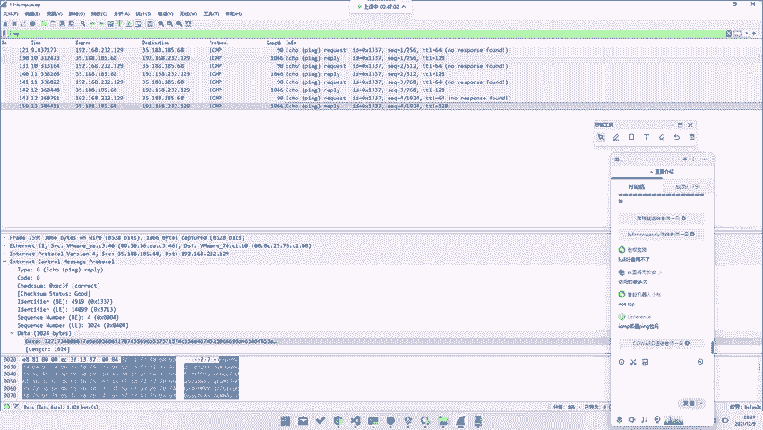
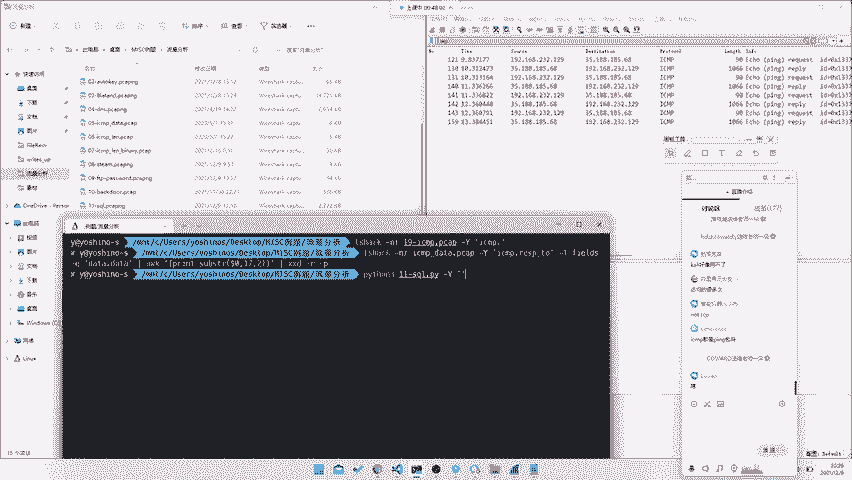
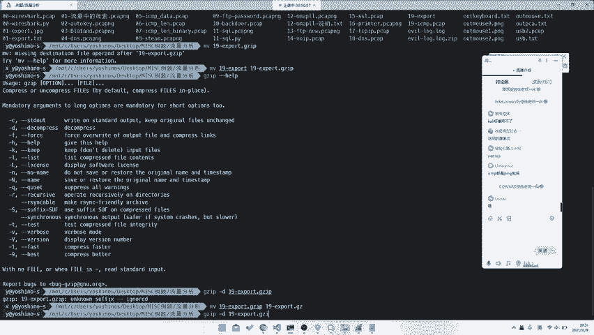
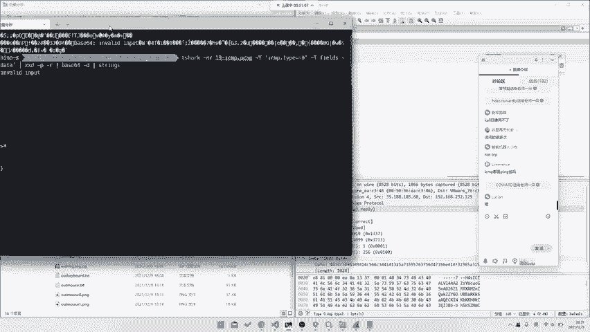
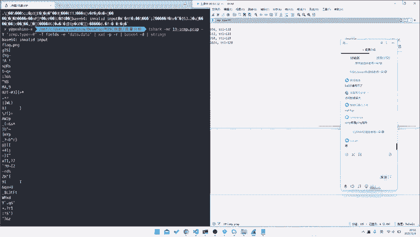
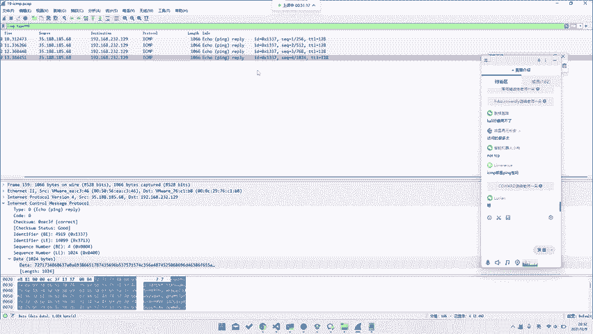
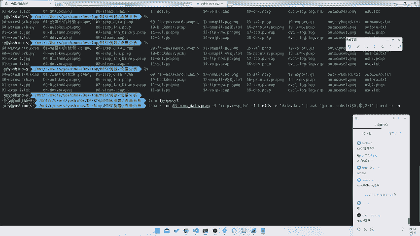
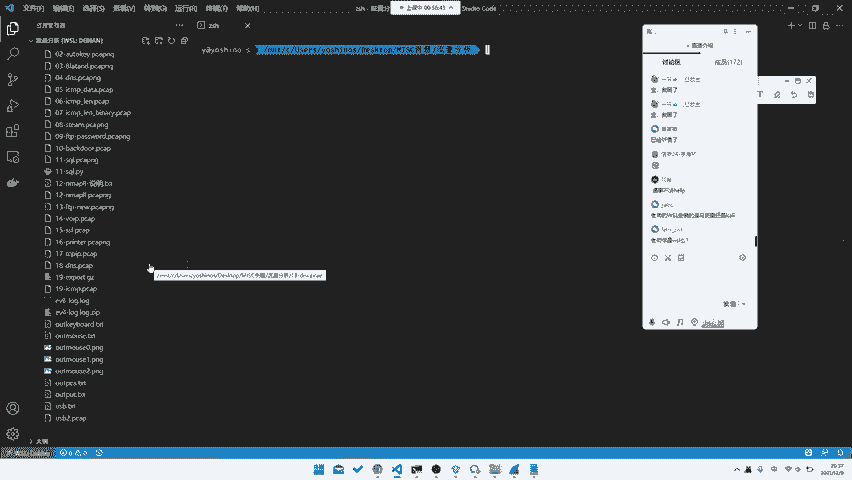
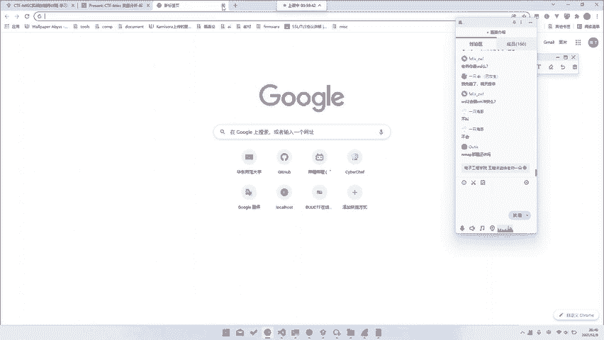
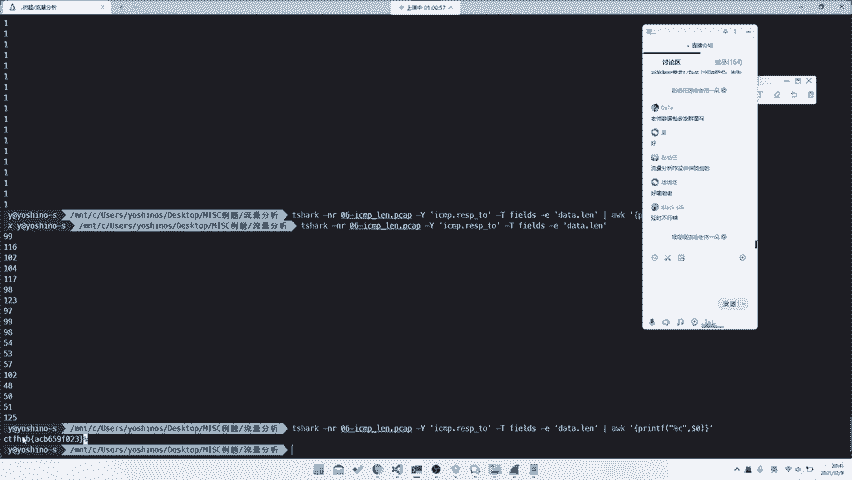

# CTF教程：P23：网络流量篇之FTP和ICMP流量 🔍

## 概述
在本节课中，我们将学习如何分析网络流量包中的FTP和ICMP协议，并从中提取隐藏的Flag信息。我们将通过具体的CTF题目实例，演示如何使用命令行工具和脚本处理这些协议数据。

---

## 协议层次与数据载体

上一节我们介绍了HTTP等基于TCP的应用层协议。本节中我们来看看FTP和ICMP流量。

FTP和ICMP协议与HTTP不同。HTTP是在TCP协议之上运行的。而FTP数据或ICMP协议本身，则承载着纯数据。ICMP协议不只用于Ping包，Ping包只是运行在ICMP协议上的一种应用。



ICMP协议与TCP协议处于同一网络层，它直接运行在IP协议之上。因此，分析ICMP流量时，我们关注的是IP层的数据包。

---



## ICMP流量分析实战

### 题目：从ICMP响应包中提取Base64数据

这道题目提示我们关注ICMP流量。我们首先在Wireshark中过滤ICMP协议。

以下是过滤和查看ICMP包的命令：
```bash
tshark -r 19.pcap -Y "icmp"
```

观察过滤出的ICMP包，我们发现有些包的数据段（Data）全是0，没有价值。但有些包的Data字段包含Base64编码的字符串。

我们的目标就是导出这些包含Base64数据的ICMP响应包（Reply）。ICMP响应包的`type`字段值为0。



以下是导出特定字段的命令：
```bash
tshark -r 19.pcap -Y "icmp.type == 0" -T fields -e data.data
```

此命令会打印出所有ICMP响应包Data字段的十六进制值。我们需要将这些十六进制值转换回字符串。





以下是转换和解码的命令：
```bash
# 将十六进制字符串转换为原始字节并Base64解码
echo -n "4B586B..." | xxd -r -p | base64 -d
```



解码后，我们得到一串数据，指示这是一个`flag.png`文件。我们需要将其导出。

以下是导出数据的命令示例：
```bash
# 将数据导出到文件
tshark -r 19.pcap -Y "icmp.type == 0" -T fields -e data.data | xxd -r -p | base64 -d > 19_export
# 如果数据是gzip压缩的，进行解压
mv 19_export 19_export.gz
gzip -d 19_export.gz
```

通过以上步骤，我们就能从ICMP流量中提取出隐藏的文件。

---

## 另一种ICMP隐写方式



上一节我们学习了从Data字段提取数据。本节中我们来看看ICMP协议其他字段也可能隐藏信息。

另一道ICMP题目思路有所不同。它同样在ICMP响应包中隐藏数据，但数据藏在固定偏移的字节中。

观察数据包，发现每个响应包的Data字段，只有特定位置的两位十六进制数在变化。我们需要提取这些变化的字节。

以下是使用命令行工具直接提取并拼接Flag的命令：
```bash
tshark -r 05.pcap -Y "icmp" -T fields -e data.data | awk '{printf "%c", strtonum("0x" substr($0,17,2))}'
```

命令解释：
1.  `tshark`：导出所有ICMP包的Data字段。
2.  `awk`：处理每一行数据。
    *   `substr($0,17,2)`：截取每行字符串从第17位开始的2个字符（即变化的两位十六进制数）。
    *   `strtonum("0x" ...)`：将十六进制字符串转换为十进制数字。
    *   `printf "%c"`：将十进制数字作为ASCII码输出为字符。

执行后，这些字符拼接起来就是Flag。

---

## 使用Python脚本处理数据

如果你不熟悉复杂的命令行工具，使用Python脚本是更直观的方法。

以下是实现相同功能的Python脚本示例：
```python
import binascii



with open('output.txt', 'r') as f:
    data = f.read().splitlines()

# 假设目标字节在每行固定偏移（例如第16-18个字符）
flag_chars = []
for line in data:
    if line:  # 忽略空行
        # 提取特定位置的十六进制字符串
        hex_str = line[16:18]
        # 转换为十进制，再转为ASCII字符
        flag_chars.append(chr(int(hex_str, 16)))

# 拼接所有字符
flag = ''.join(flag_chars)
print(flag)
```

脚本步骤：
1.  读取包含十六进制数据的文件。
2.  遍历每一行，提取固定位置的两位十六进制数。
3.  将其转换为ASCII字符并收集。
4.  最后拼接所有字符得到Flag。

这种方法逻辑清晰，易于理解和修改。

---

## 扩展：隐藏在长度字段

ICMP协议中，不止Data字段可以隐藏信息。例如，下一道题目将信息隐藏在ICMP包的`length`字段中。



分析思路是类似的：过滤出ICMP请求或响应包，然后提取每个包的`data.len`字段值。这些值本身就是ASCII码，直接转换即可得到Flag。

以下是提取长度字段的命令：
```bash
tshark -r 06.pcap -Y "icmp" -T fields -e data.len | awk '{printf "%c", $1}'
```

---

## 总结
本节课我们一起学习了CTF中网络流量分析的重要部分：FTP和ICMP协议。
1.  **协议理解**：明确了ICMP协议在网络层的位置，及其与TCP协议上应用（如HTTP）的区别。
2.  **数据提取**：掌握了从ICMP协议的`Data`字段中识别和导出Base64等编码数据的方法。
3.  **字段分析**：学会了分析ICMP包中特定偏移的字节变化，以及从`length`等字段提取隐藏信息。
4.  **工具使用**：实践了使用`tshark`、`awk`、`xxd`、`base64`等命令行工具进行高效分析，同时也了解了用Python脚本实现相同功能的灵活方式。



处理这类题目的关键在于：仔细过滤目标协议包，观察数据规律，并灵活运用工具将网络数据转换为可读的Flag信息。