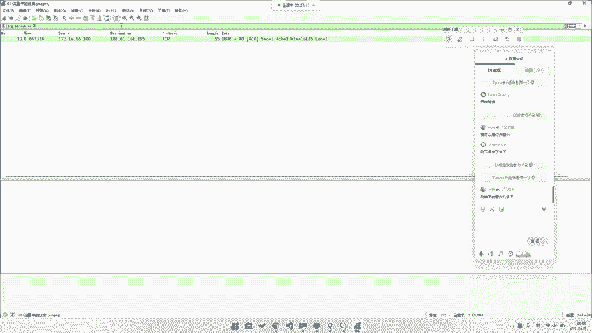
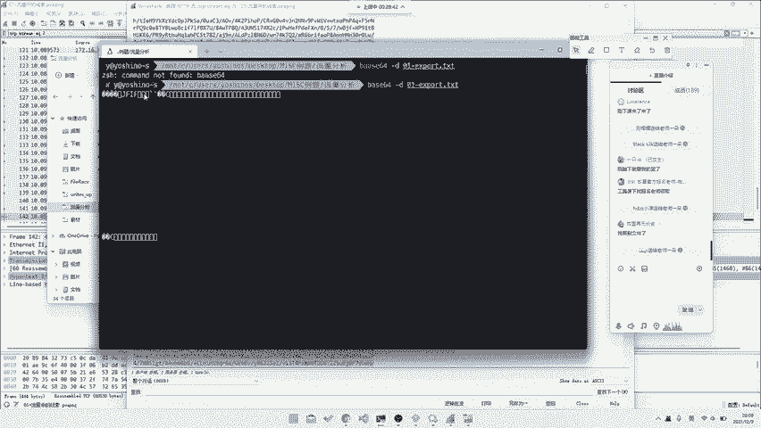
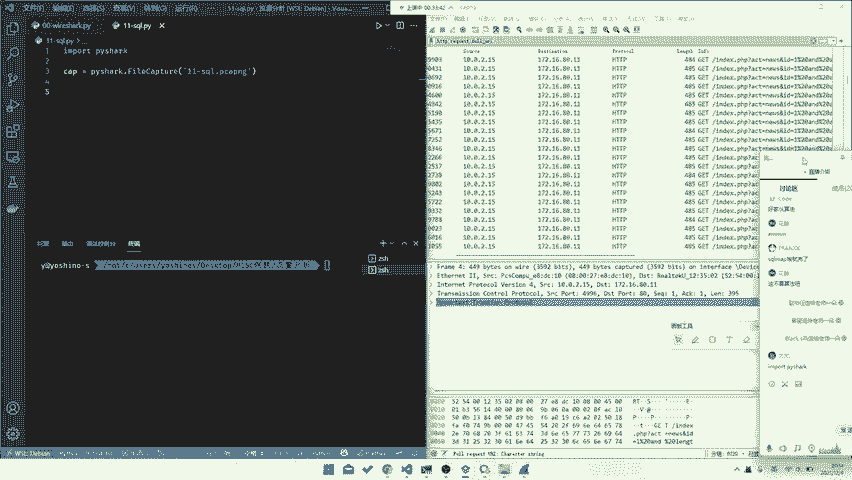
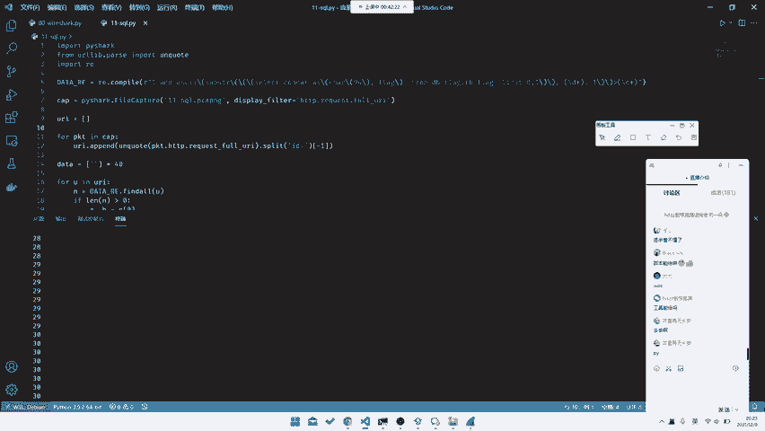
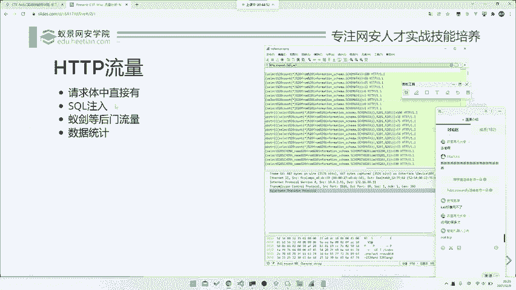

# CTF教程：P24：网络流量篇之HTTP流量

## 概述
在本节课中，我们将学习如何分析CTF中常见的HTTP流量包。我们将通过几个具体的例子，了解如何从HTTP请求中直接提取信息、分析攻击流量（如SQL注入）以及处理后门通信数据。掌握这些技能是解决Web类CTF题目的基础。

---

## 请求题中直接包含的信息



上一节我们介绍了网络流量分析的基础，本节中我们来看看最简单的一种情况：Flag直接隐藏在HTTP请求或响应中。

这类题目通常流量包较小，Flag可能以Base64编码等形式直接放在某个HTTP数据包中。解题的关键在于快速定位到包含可疑编码数据的包。

以下是解题的一般步骤：



1.  使用Wireshark打开流量包文件（`.pcap`或`.pcapng`）。
2.  在过滤器中输入 `http` 来筛选出所有HTTP流量。
3.  逐个检查HTTP请求和响应，寻找异常或编码过的字符串（如Base64编码的特征）。
4.  找到可疑字符串后，将其提取并解码。

例如，在分析一个流量包时，你可能会发现一个HTTP请求的URI或响应体中包含一串Base64编码的数据：
```
GET /analyst.php?data=VEVTVA== HTTP/1.1
```
这串 `VEVTVA==` 解码后为 `TEST`。

**核心操作**：在Wireshark中，你可以右键点击数据包 -> 选择“追踪流” -> “HTTP流”来更清晰地查看整个HTTP会话。对于找到的Base64字符串，可以使用命令行工具快速解码：
```bash
echo "VEVTVA==" | base64 -d
```
或者使用Python代码：
```python
import base64
encoded_data = "VEVTVA=="
decoded_data = base64.b64decode(encoded_data).decode('utf-8')
print(decoded_data)  # 输出: TEST
```
解码后的数据可能就是Flag，或者需要进一步分析（例如，解码后是另一段密文或一个文件）。

---

## 分析攻击流量（以SQL注入为例）

在更复杂的题目中，Flag不会直接出现，而是隐藏在攻击者与服务器交互的流量里。SQL注入流量是典型例子。

面对包含大量数据包的流量文件，我们需要使用Wireshark的过滤功能。首先，通过观察找到攻击特征，例如URL中包含 `id=1' AND 1=1--` 这类 payload。


我们可以使用过滤器 `http.request.uri` 来只显示HTTP请求的URI部分，从而集中分析攻击payload。

以下是分析SQL注入流量的步骤：



1.  **过滤请求**：在Wireshark过滤栏输入 `http.request.uri`，查看所有请求的URL。
2.  **识别模式**：观察URL，找到进行SQL注入测试的部分。例如，可能会看到利用 `substr()` 函数和二分法盲注的payload：
    ```
    /index.php?id=1 and ascii(substr((select flag from flag),1,1))>100
    ```
3.  **提取数据**：这种盲注会逐位猜测Flag的每一个字符。我们需要从大量请求中，提取出每一位字符被最终确认的那个请求（即返回“正确”响应的请求）。
4.  **编写脚本**：手动提取效率低下，通常需要编写Python脚本来自动化处理。

**核心脚本逻辑**：
```python
import pyshark
import urllib.parse
import re

# 1. 读取流量文件，过滤出HTTP请求URI
cap = pyshark.FileCapture('sql_traffic.pcapng', display_filter='http.request.uri')
uris = [pkt.http.request_uri for pkt in cap]

# 2. 对每个URI进行URL解码，并提取关键参数（例如id后面的payload）
data = []
for uri in uris:
    decoded_uri = urllib.parse.unquote(uri)
    # 假设payload在'id='参数之后
    if 'id=' in decoded_uri:
        payload = decoded_uri.split('id=')[1]
        data.append(payload)

# 3. 使用正则表达式从payload中提取字符位置和对应的ASCII值
# 例如，匹配 `substr(...),{位置},1))>{值}`
pattern = re.compile(r'substr\(.*?,(\d+),1\)\)>(\d+)')
flag_chars = [None] * 40  # 假设flag长度不超过40
for payload in data:
    match = pattern.search(payload)
    if match:
        pos, ascii_val = int(match.group(1)), int(match.group(2))
        # 简化逻辑：这里需要根据实际流量判断条件为真(>value)时，字符的准确值。
        # 例如，可能是最后一次请求的ascii_val+1。
        # flag_chars[pos-1] = chr(ascii_val + 1)

# 4. 组合并输出Flag
flag = ''.join([c for c in flag_chars if c is not None])
print(f'Flag: {flag}')
```
通过脚本处理，我们可以从看似杂乱的注入流量中，系统地还原出完整的Flag。

---

## 后门流量与数据统计

另一种常见题型是分析攻击者上传的后门（如“中国菜刀”、“蚁剑”等连接流量）或服务器被入侵后执行的命令流量。

这类流量通常有固定特征。例如，一个常见的后门连接请求，其HTTP请求体中可能包含经过编码的指令。而像 `nmap` 扫描这类命令，会在流量中留下明显的端口探测记录。



以下是如何分析此类流量：

1.  **识别后门流量**：寻找特殊的User-Agent（如`AntSword`）、固定的URI路径或POST请求体中存在 `@eval`、`base64` 等关键词。
2.  **分析命令执行**：对于已知的扫描（如题目提示使用了nmap扫描本地端口），可以在Wireshark中过滤TCP流量，查看与 `127.0.0.1` 交互且带有 `[SYN]`、`[SYN, ACK]` 标志的数据包，开放的端口会对探测包进行回应。
3.  **数据包统计**：Wireshark的“统计” -> “对话”功能可以帮助你快速查看哪些IP地址之间通信最频繁，使用了哪些端口，这对于发现异常连接非常有用。

**一个小练习**：如果题目给出一个nmap扫描流量的包，要求找出目标机器上开放的端口。你可以尝试在Wireshark过滤器中编写规则，只显示目标IP为 `127.0.0.1` 且TCP标志位为 `SYN-ACK` 的数据包，这些包对应的源端口就是开放的端口。
一个可能的过滤器是：
```
tcp.dstport == 127.0.0.1 && tcp.flags.syn == 1 && tcp.flags.ack == 1
```
通过分析这些数据包，就能汇总出开放的端口列表，从而得到Flag。

---

## 总结
本节课我们一起学习了CTF中HTTP流量分析的三种常见场景：
1.  **直接提取**：从HTTP请求/响应中直接找到编码后的Flag。
2.  **攻击分析**：从SQL注入等攻击流量中，通过分析payload模式，编写脚本提取出Flag。
3.  **后门与统计**：识别后门通信特征，或通过分析命令执行流量（如端口扫描）来获取信息。



处理流量分析题目的关键在于细心观察、合理使用过滤工具，并善于编写自动化脚本来处理规律性数据。课后请尝试完成提供的练习，巩固今天所学的内容。