# CTF教程：P25：ctf-web24_网络流量篇之其他网络流量

## 📖 概述
在本节课中，我们将学习CTF网络流量分析中除HTTP、TCP等常见协议之外的其他协议流量。我们将探讨VOIP、USB流量（键盘、鼠标、手柄、打印机等）以及一些新兴或自定义协议流量的分析方法。掌握这些知识，能帮助你应对更广泛的CTF流量分析题目。

---

## 🎤 VOIP协议流量分析
上一节我们介绍了常见的网络协议流量，本节中我们来看看VOIP（Voice over IP）协议。VOIP是一种用于传输实时语音或视频的协议，通常基于RTP（Real-time Transport Protocol）在UDP上传输。

在CTF题目中，可能会遇到一个包含VOIP通话的流量包。解题的关键在于识别并提取其中的语音数据。

以下是处理VOIP流量的典型步骤：
1.  在Wireshark中，使用“Telephony” -> “VoIP Calls”菜单分析流量。
2.  找到具体的通话流，并点击“Play Streams”即可播放语音。
3.  语音内容可能直接包含flag信息，例如：“press one to listen to the flag”。

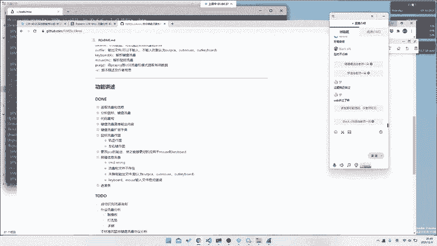

**核心概念**：VOIP流量通常使用**RTP over UDP**进行传输。

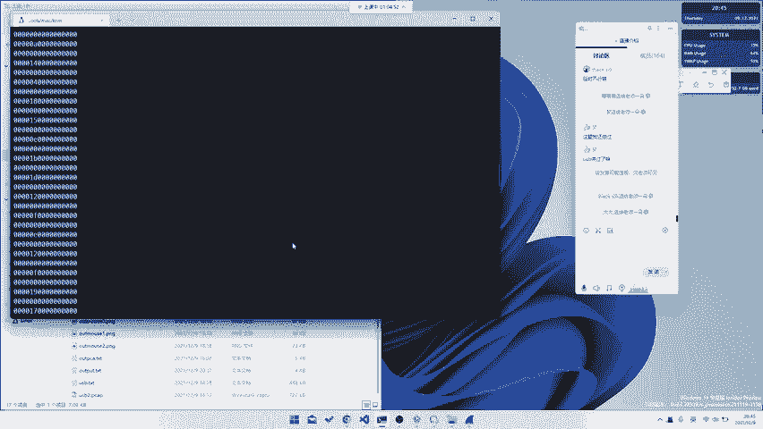

---

## 🔌 USB流量分析基础
网络流量分析不仅限于以太网帧，还包括USB等总线流量。USB流量在CTF中常见于键盘、鼠标等输入设备的记录。

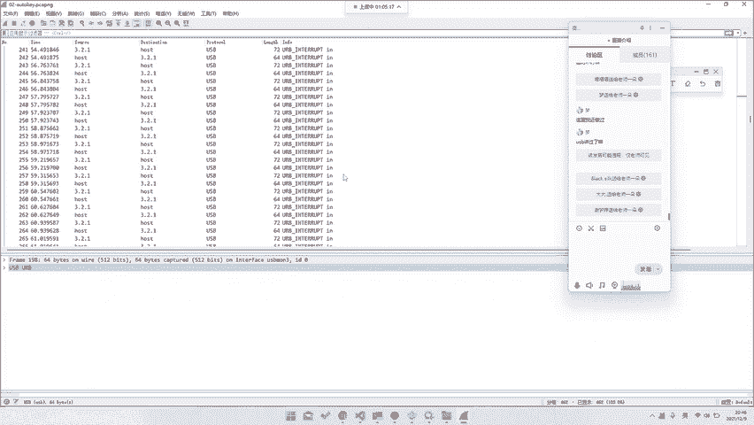

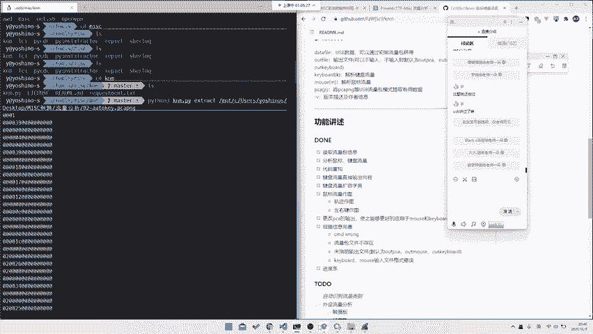

### 键盘流量
USB键盘流量数据包具有固定特征，按键信息通常存放在数据包的特定位置（例如第3个字节）。

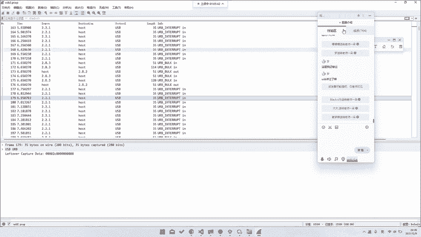

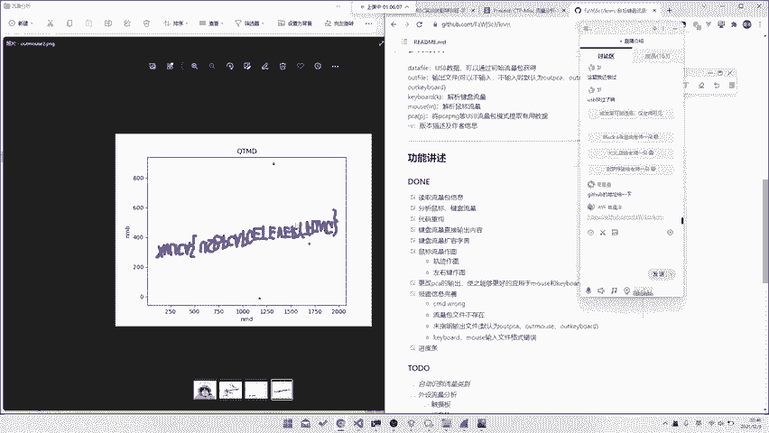

以下是使用Python脚本提取键盘流量的核心思路：
```python
# 假设 data 是抓取到的USB中断传输数据
key_data = data[2] # 提取第三个字节（索引为2）
# 将 key_data 映射为实际按键字符
```
已有现成工具（如`ctf-usb-keyboard-parser`）可以自动化完成此过程。

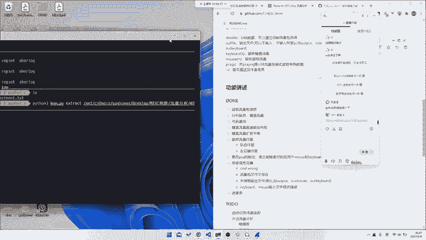

### 鼠标流量
USB鼠标流量记录了鼠标的移动和点击事件。通过解析这些数据，可以还原出鼠标的移动轨迹。

以下是鼠标流量分析的关键点：
1.  鼠标数据包通常包含X轴偏移、Y轴偏移和按键状态。
2.  通过累积偏移量，可以绘制出鼠标移动的坐标图。
3.  已有脚本可以将流量直接转换为轨迹图片。

**核心概念**：USB设备通过**中断传输（Interrupt Transfer）** 上报输入事件，数据格式由设备描述符定义。

---

## 🎮 其他USB设备流量
USB流量并不仅限于键盘和鼠标。近年来CTF题目开始涉及更小众的设备。

### 游戏手柄流量
例如，一道题目可能提供游戏手柄的USB流量。解题者需要：
1.  识别流量来自游戏手柄（可通过设备厂商ID或题目描述判断）。
2.  分析数据包格式，可能需查阅相关协议手册。
3.  有时可通过数据包的时间间隔或特定数值变化规律推断出按键序列。

### 打印机流量
打印机使用自己的语言（如PCL、PostScript）进行通信。一道名为“the printer”的题目可能要求：
1.  识别出流量是打印机通信（通过协议特征或题目提示）。
2.  从数据流中提取打印任务内容，这可能就是flag。

**核心概念**：对于未知USB设备，可通过**USB设备描述符中的厂商ID（Vendor ID）和产品ID（Product ID）** 来查询设备类型。

---

## 🔍 应对未知协议流量的方法
面对全新的、未知协议的流量包（如自定义的后门流量、ADB控制流量`scrcpy`、Switch手柄流量），我们需要一套分析方法。

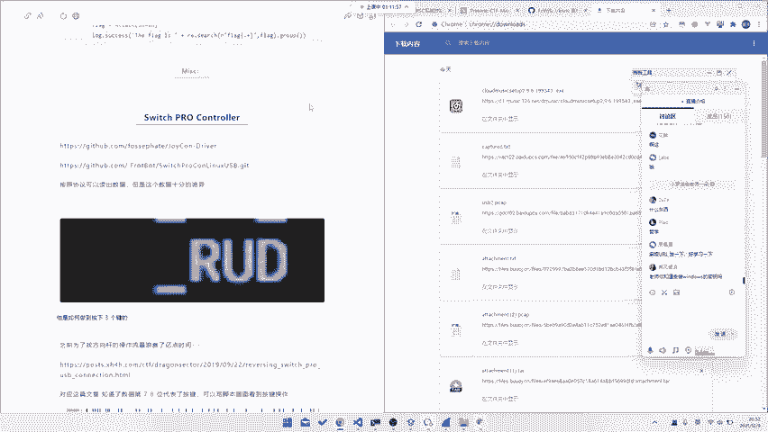

以下是通用的解题思路：
1.  **观察特征**：仔细查看原始数据的规律，如固定的分隔符（逗号）、关键词（`up`, `down`）、数值范围等。
2.  **搜索验证**：将观察到的特征字符串或字节序列放入搜索引擎，可能会找到相关的协议文档或工具。
3.  **协议逆向**：如果找不到资料，需尝试逆向分析数据包结构，推断各字段含义（如长度、类型、数据）。
4.  **工具辅助**：使用Wireshark的“解析为（Decode As...）”功能尝试不同协议解析，或编写自定义解析脚本。

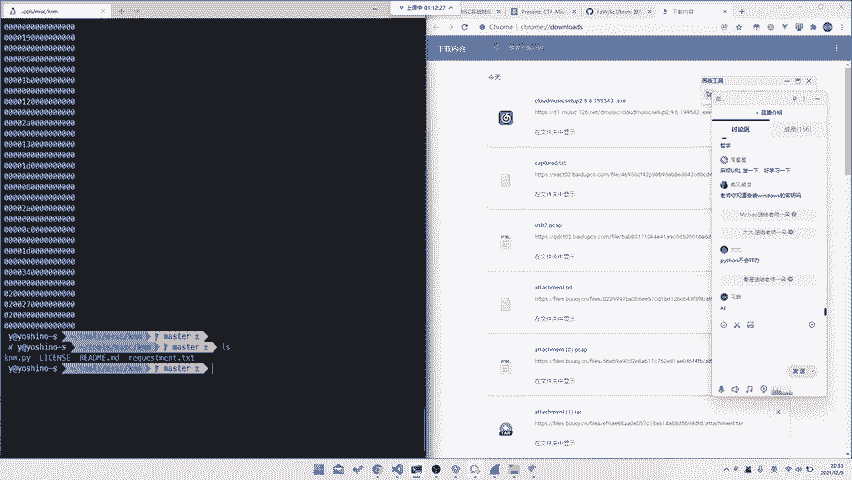

**核心技巧**：在完全未知的情况下，**大胆假设，小心求证**，从最明显的规律入手。

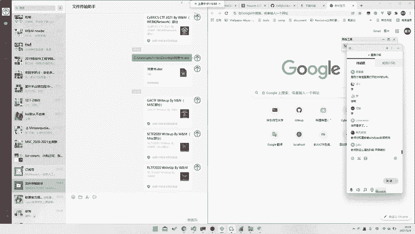

---

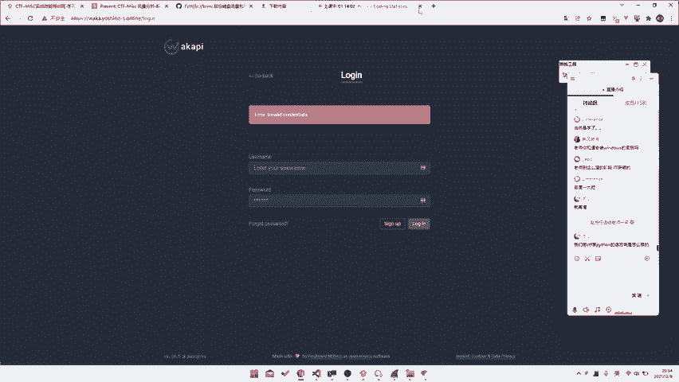

## 💻 关于CTF中的编程
许多流量分析题目需要编写脚本进行处理。对于初学者，不必畏惧编程。

**核心建议**：
*   **语言选择**：Python因其丰富的库（如`scapy`, `pyshark`, `PIL`）而成为首选，但任何你熟悉的语言（如C、Go）都可以。
*   **学习重点**：掌握基础语法和文件操作即可，复杂的库可以随用随学。
*   **实践方法**：多阅读和模仿他人的解题脚本（Write-up），理解其思路，然后自己动手实现。

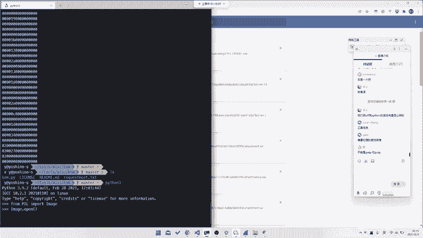

例如，处理图片隐写题的Python代码可能涉及：
```python
from PIL import Image
img = Image.open('challenge.png')
width, height = img.size
# 遍历像素进行处理
for y in range(height):
    for x in range(width):
        r, g, b = img.getpixel((x, y))
        # 分析或修改像素值
```
通过不断练习，处理数据的脚本编写能力会自然提升。

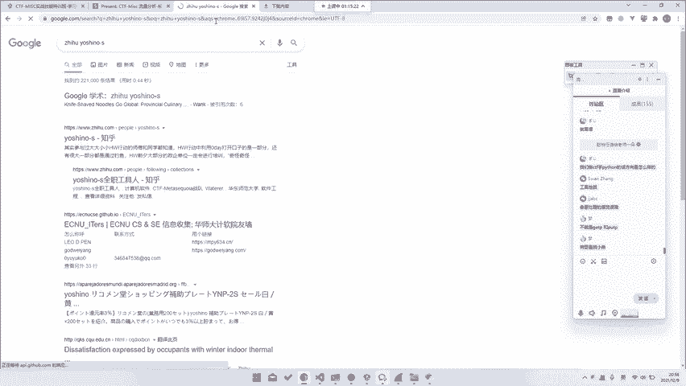

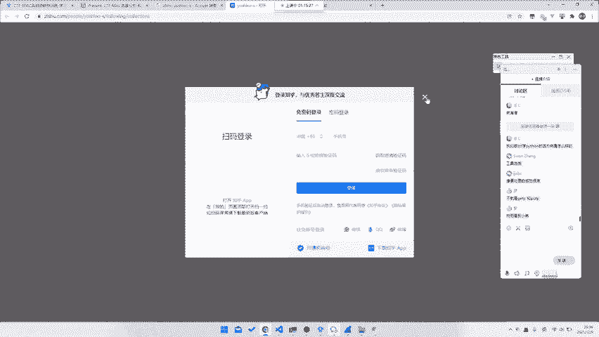

---

## 📝 总结
本节课我们一起学习了CTF中网络流量分析的扩展内容：
1.  我们了解了**VOIP协议**，知道如何从RTP流中提取语音信息。
2.  我们深入探讨了**USB流量**，包括键盘、鼠标流量的解析方法，并接触了手柄、打印机等更小众的设备流量。
3.  我们掌握了面对**未知协议流量**时的基本分析思路：观察、搜索、逆向和工具辅助。
4.  我们讨论了**编程技能**在CTF中的重要性，并给出了实用的学习建议。

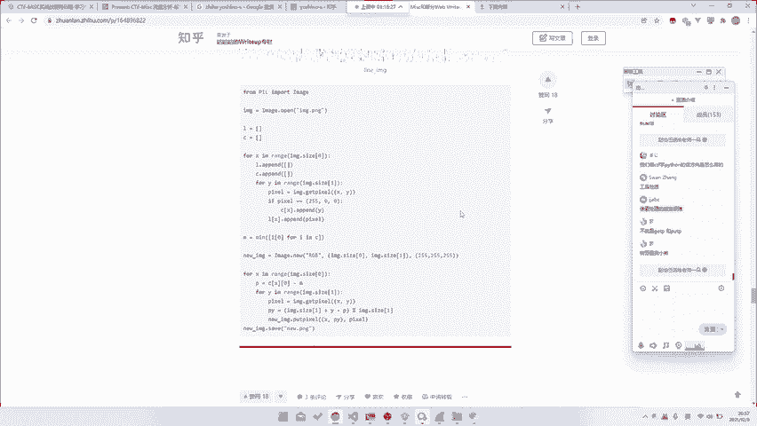

流量分析的世界非常广阔，核心在于保持好奇心，积累协议知识，并熟练运用工具。课后提供的资料包包含了本节课涉及的题目和工具链接，请大家积极练习。