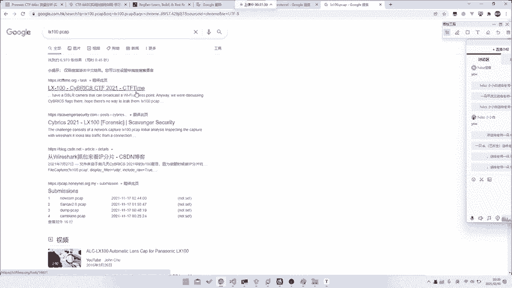
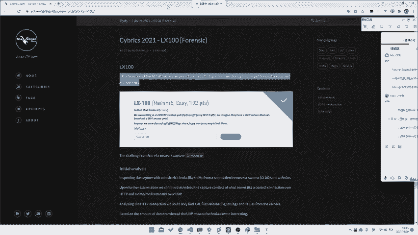
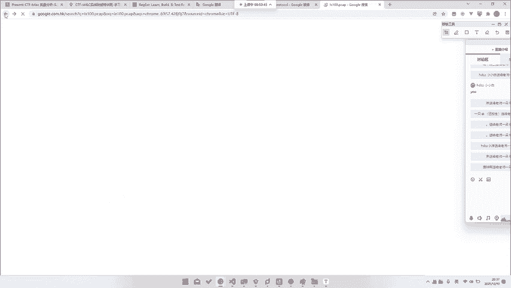
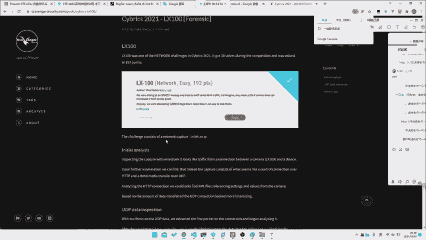
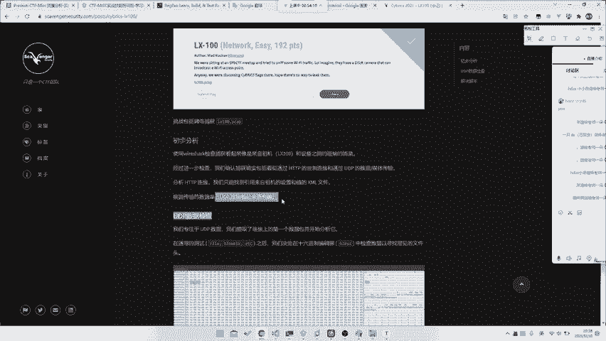
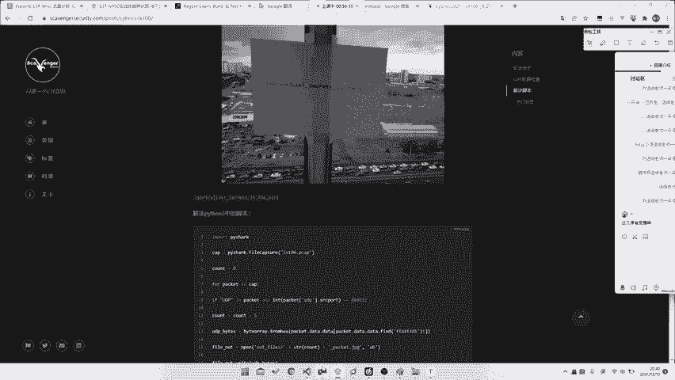
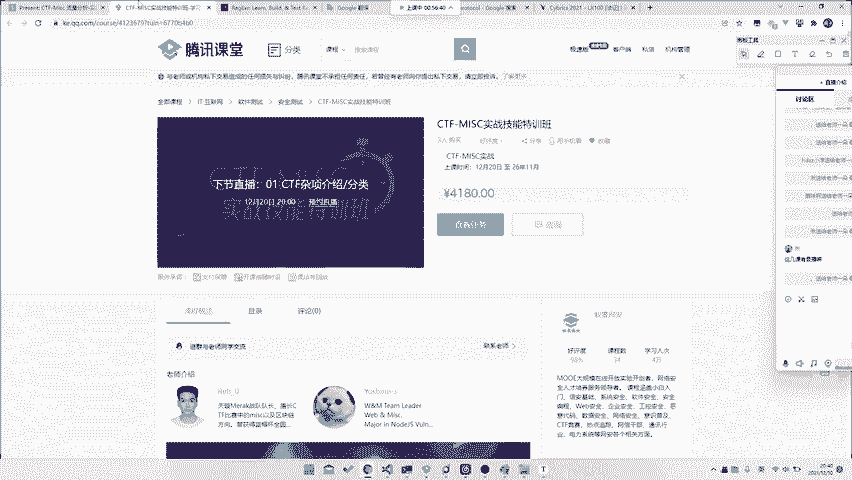
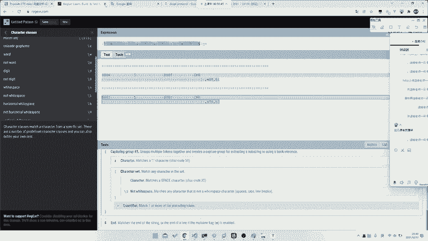
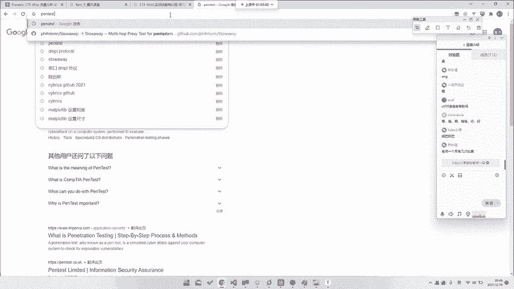

# CTF教程：P26：ctf-web25_一些实战分析 📡





## 概述
在本节课中，我们将通过一个具体的CTF实战案例，学习如何在没有明确协议信息的情况下，仅凭流量分析来解题。我们将重点探讨解题思路、核心技巧以及如何培养解决Misc类题目的关键能力。

---

## 实战案例：未知协议的流量分析

上一节我们介绍了流量分析的基础工具和方法，本节中我们来看看一个具体的实战案例。这个案例来自CYBRESES比赛中的一个题目，名为“C of time”。

题目提供了一个网络流量包文件。我们不知道它使用的是何种协议，甚至不清楚其具体用途。但即便如此，我们也有可能解出这道题。





### 解题思路：无需理解协议，直接提取数据

面对未知协议，一个有效的策略是绕过复杂的协议分析，直接关注数据本身。以下是解题的核心步骤：



1.  **聚焦UDP流量**：首先，我们需要将分析目标锁定在UDP协议上。这是解题的关键第一步。
2.  **导出UDP数据流**：使用Wireshark等工具，将所有UDP数据包的内容导出为一个原始数据文件。
3.  **识别文件头**：我们知道目标可能是一个JPG图片文件。JPG文件的文件头（Magic Number）是固定的：`FF D8 FF`。
4.  **重组与提取**：由于网络传输中数据包可能被分片（IP Fragmentation），我们需要将导出的UDP数据流视为一个整体，从中搜索并提取出以`FF D8 FF`开头的数据块。
5.  **验证结果**：将提取出的数据保存为`.jpg`文件，即可得到隐藏的图片，从而获取flag。

**核心操作可以用以下伪代码描述：**
```python
# 1. 从pcap文件中过滤并导出所有UDP负载数据，保存为 raw_data.bin
# 2. 在二进制数据中搜索JPG文件头
with open('raw_data.bin', 'rb') as f:
    data = f.read()
jpg_start = data.find(b'\xff\xd8\xff') # 查找JPG文件头
if jpg_start != -1:
    # 3. 提取从文件头开始到合理结束位置的数据（此处简化处理）
    jpg_data = data[jpg_start:]
    with open('extracted_flag.jpg', 'wb') as img:
        img.write(jpg_data)
```

这个方法的巧妙之处在于，**你不需要知道这是一个摄像头视频流或任何特定协议**。你只需要知道目标文件类型（如JPG）的特征，并具备从原始数据中提取它的能力。

---



## 从解题中提炼核心能力





通过这道题，我们可以总结出解决CTF中Misc类题目，尤其是流量分析题目的三个核心能力：

1.  **强大的联想与“脑洞”能力**：能够将题目中的线索（如UDP、无连接、可能传输媒体流）与可能的解题方向联系起来。如果思维无法“对上频段”，就很难找到入口。
2.  **高效的信息搜索能力**：仅靠现有知识无法解决所有新问题。当遇到陌生协议（如RTSP、SIP、工控协议）时，能否快速利用搜索引擎（包括使用英文关键词）找到相关文档或类似题解，至关重要。
3.  **快速学习与应用能力**：CTF中可能涉及任何领域的知识。有时你需要快速阅读一篇几十页的RFC协议文档或设备手册，并立即从中找出漏洞或分析数据的方法。在短时间内理解并应用新知识是必备技能。

因此，想要精通Misc，单纯积累知识点是不够的，更需要培养这套“元技能”。

---

## 最佳学习路径：实践与总结

那么，如何有效地提升这些能力呢？最佳策略是**在实战中学习和总结**。

以下是建议的学习方法：

*   **主动做题与复盘**：不要只是为了“刷题量”而做题。
    *   **如果没解出来**：看完Writeup后，要反思差距。是因为不知道某个工具？搜索关键词不对？还是思路完全没往那个方向想？把这个“教训”记下来。
    *   **如果解出来了**：也要去看别人的Writeup。对比别人的解法，你的方法是否更巧妙？你是否偶然用到了一个值得固化的技巧（比如某种过滤语法）？别人的分析逻辑是否更清晰？
*   **参与比赛，挑战新题**：在真正的CTF比赛中，面对全新的、没有现成Writeup的题目，是锻炼独立思考和临场学习能力的绝佳环境。通过对比自己与队友、其他队伍的解法和进度，能快速暴露短板并促进成长。
*   **形成自己的方法论**：在大量练习后，你需要总结出一套适合自己的解题流程和思考模式。例如，看到流量题先看协议统计，再跟踪TCP流，搜索常见关键字等。

“授人以鱼不如授人以渔”。掌握高效的学习和解题方法，比单纯记忆更多的知识点更为重要。

---

## 课程总结与展望

本节课中，我们一起学习了一个典型的“黑盒”流量分析实战案例。我们了解到，有时解题无需深究协议细节，直接进行数据提取即可。更重要的是，我们探讨了解决CTF Misc题目的三大核心能力：联想能力、搜索能力和快速学习能力。

由于课时有限，我们无法在短短几节课内覆盖流量分析的所有协议和技巧（如USB、蓝牙、工控协议等）。这些需要大家在课后通过**持续的实践、搜索和总结**来不断积累。

最后，希望大家能记住：**CTF学习的最终目的，是培养独立解决复杂、未知问题的能力**。这需要你主动思考，建立自己的知识体系和学习策略。祝愿大家在这条路上不断进步。



---
**（以下为原视频结尾的互动答疑环节简述，非教程主体内容）**
接下来的时间可以用于答疑。关于Misc、流量分析、CTF解题策略或任何相关学习路径的问题，都可以提出。