# CTF教程：P27：一次简单的hack 🚀

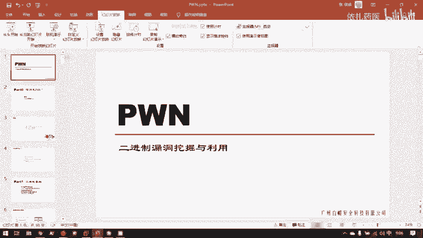

在本节课中，我们将通过一次完整的演示，了解CTF比赛中“Pwn”方向的基本概念和攻击流程。我们将学习什么是二进制漏洞、如何分析一个二进制程序，并最终编写脚本利用漏洞控制远程服务器。

---

## 概述：什么是Pwn？💻

上一节我们介绍了CTF的不同方向，本节中我们来看看“Pwn”这个方向。Pwn这个词来源于黑客俗语，意为成功利用二进制程序中的漏洞并取得控制权。例如，“我Pwn掉了一个服务器”意味着我找到了该服务器上某个二进制服务的漏洞并成功利用了它。

Pwn的核心在于**二进制漏洞的利用与挖掘**。这与之前学习的Web漏洞有本质区别。Web漏洞通常源于PHP等高级语言在应用层设计上的缺陷。而Pwn研究的漏洞对象是**已经编译成机器码的二进制程序**。例如，如果PHP解释器本身存在漏洞，那么攻击这个解释器二进制程序的行为就属于Pwn范畴。

那么，什么是二进制程序呢？所谓二进制程序，其实就是可执行文件。例如：
*   在Linux系统下，可执行文件的格式是**ELF**（等效于Windows下的EXE）。
*   在Windows系统下，例如你下载的IDA Pro工具中的 `ida.exe` 或 `ida64.exe`，双击即可运行，它们也是二进制程序。

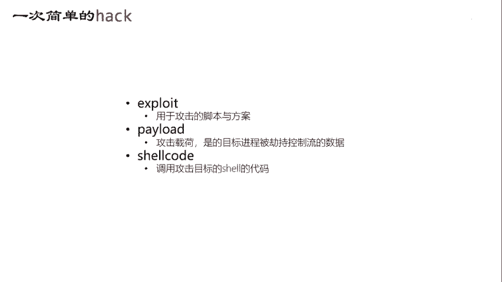

---

## 实战演示：一次完整的Pwn过程 🎯

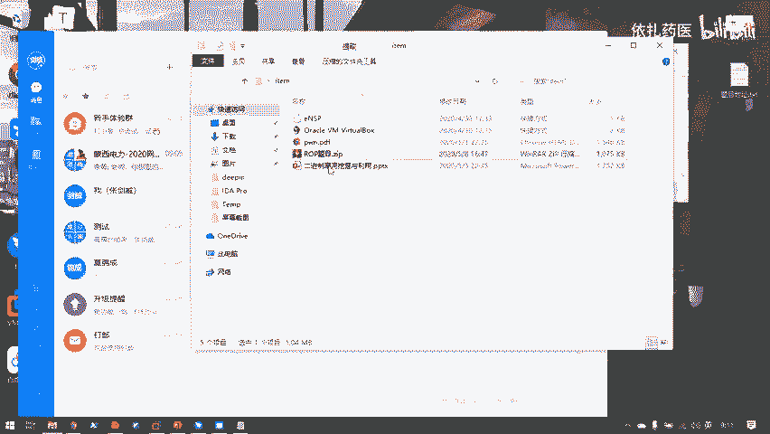

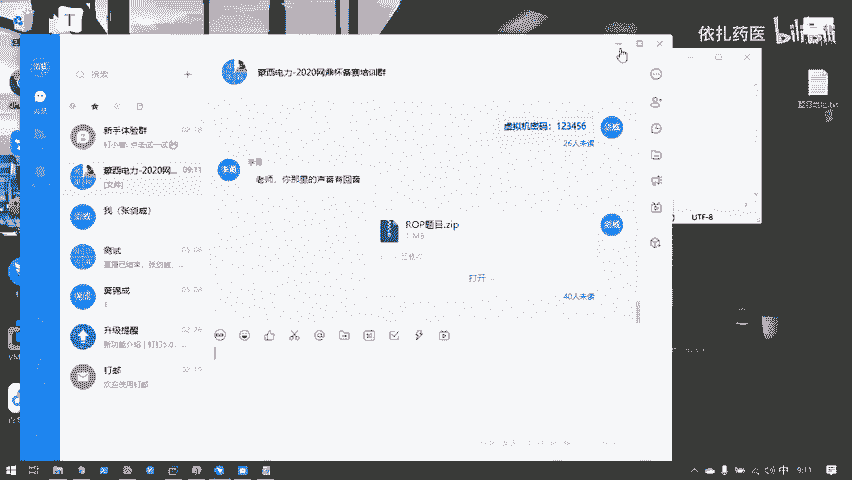

在讲解具体知识前，我们先通过一个CTF题目演示完整的Pwn过程，以便理解我们最终要达成的目标。

### 环境与目标

假设我们在远程服务器（IP: `192.168.1.100`）的10202端口上运行了一个名为 `ret2libc3` 的二进制程序。在CTF比赛中，主办方通常会提供这个二进制文件供我们分析。

### 第一步：分析二进制程序

首先，我们需要全面了解这个二进制程序。我们使用Linux的 `file` 命令查看其基本信息：
```bash
file ret2libc3
```
输出可能显示为：`ret2libc3: ELF 32-bit LSB executable, ...`，这表明它是一个32位的Linux可执行文件。

接着，我们使用强大的反汇编与反编译工具 **IDA Pro** 来分析其内部逻辑。将二进制文件拖入IDA后，工具会将其机器码反汇编成汇编代码。通过安装的F5插件，我们还能进一步将汇编代码还原成**功能等价**的C语言伪代码。

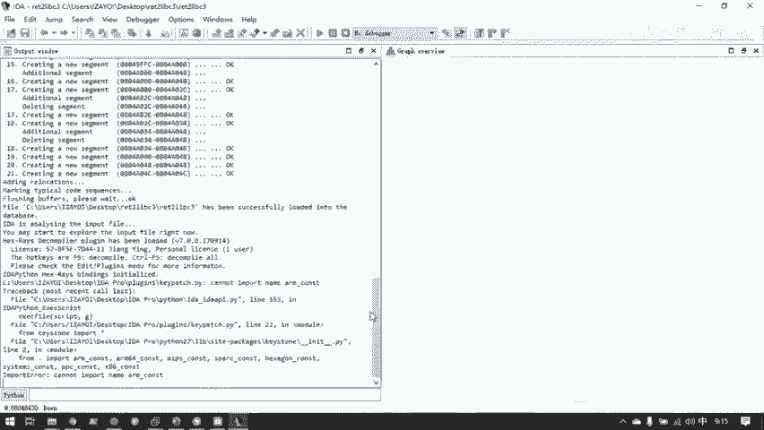

**核心概念**：分析二进制漏洞，**C语言是基础**。我们需要能够理解反编译出的C代码中的函数调用、内存操作等逻辑。

### 第二步：寻找漏洞

在反编译出的C代码中，我们仔细寻找可能存在的漏洞。例如，本题可能包含：
1.  **内存信息泄露**：程序可能意外输出某些内存地址。
2.  **缓冲区溢出**：程序对用户输入的长度检查不严格，导致数据写入超出了预留的内存空间。

这些漏洞的具体原理我们后续会详细讲解。

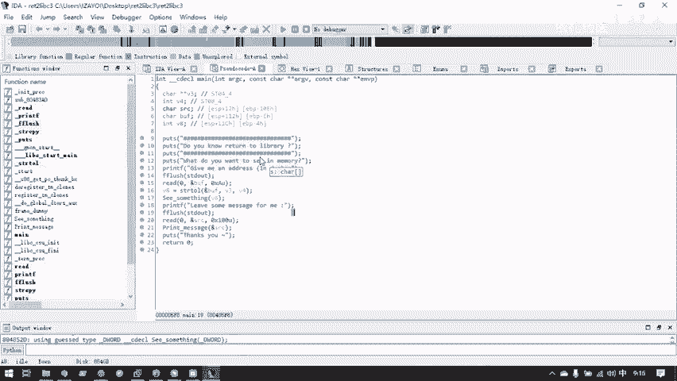

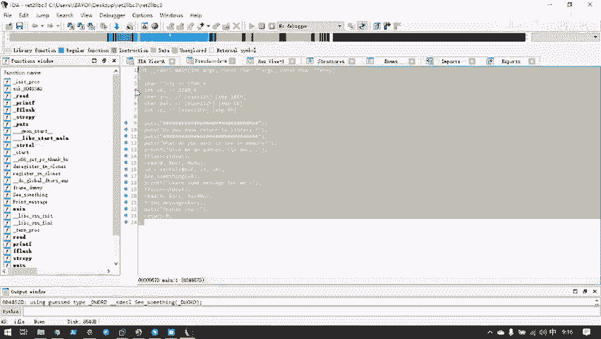

### 第三步：编写漏洞利用脚本（Exploit）

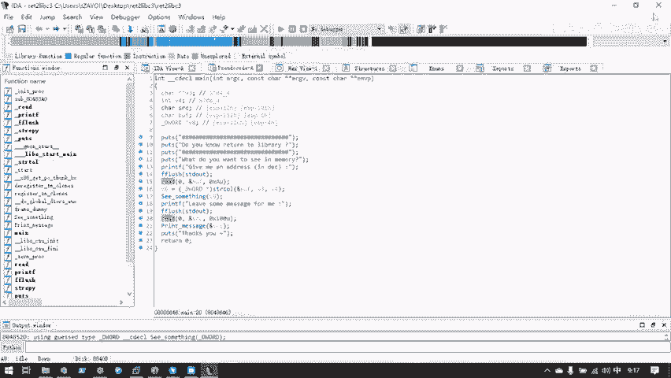

发现漏洞后，我们需要编写攻击脚本（Exploit）来利用它。以下是利用脚本的一个示例框架：

```python
from pwn import * # 导入pwntools模块，它是编写Pwn脚本的利器

# 连接到远程服务器
io = remote('192.168.1.100', 10202)

# 构造恶意的攻击载荷（Payload）
payload = b'A' * 100 + p32(0xdeadbeef) # 示例：填充数据+覆盖返回地址

# 发送Payload
io.sendlineafter(b'something:', payload)

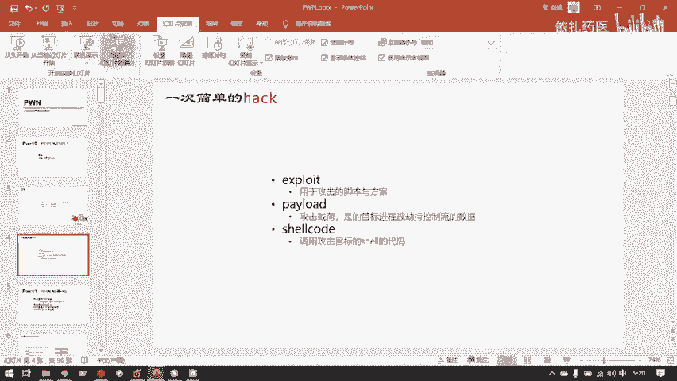

# 如果攻击成功，我们将获得一个Shell（命令行交互接口）
io.interactive()
```

**关键名词解释**：
*   **Exploit**：指用于攻击的脚本或整套方案。
*   **Payload**：指我们精心构造并发送给目标程序的**恶意数据**，旨在劫持程序的控制流。
*   **Shell**：命令行接口。在Linux中，我们通过Shell与操作系统交互。Pwn的最终目标通常是获取目标服务器的一个Shell，从而执行任意命令。

### 第四步：发动攻击并获取Flag

运行我们编写好的Exploit脚本。脚本会自动连接服务器、发送Payload。如果漏洞利用成功，我们会看到 `Switching to interactive mode` 的提示，并得到一个Shell提示符（如 `$` 或 `#`）。

在获得的Shell中，我们可以执行命令查看服务器上的文件。在CTF比赛中，目标通常是读取一个名为 `flag.txt` 的文件：
```bash
cat flag.txt
```
成功输出Flag内容，则本题解答完成。

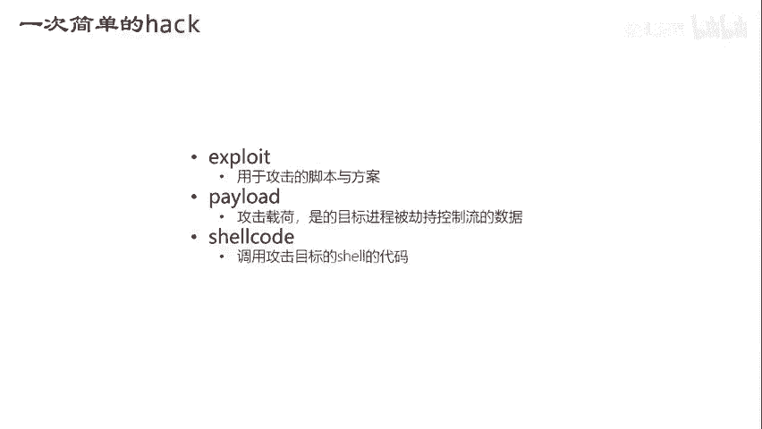

整个攻击过程（运行脚本）非常快速，而主要时间花费在之前的程序分析和漏洞利用脚本编写上。

---

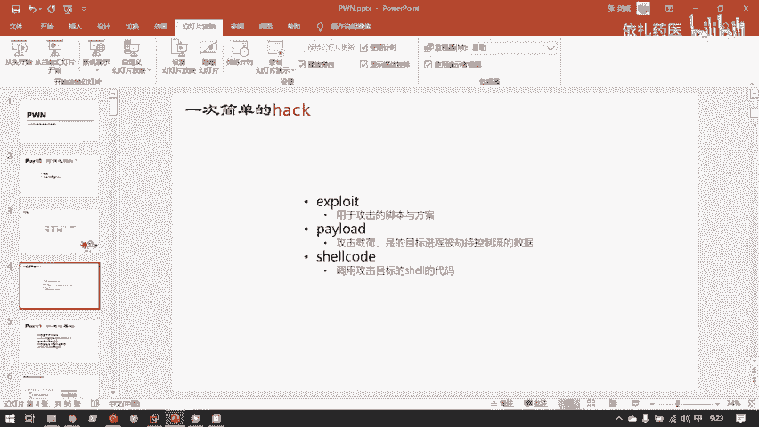

## 基础概念巩固 🔑

以下是刚刚演示过程中涉及的核心概念总结：

1.  **Pwn**：指利用二进制程序中的漏洞，劫持其执行流程，最终获取系统控制权的行为。
2.  **二进制程序**：由源代码编译生成的、直接由CPU执行的机器码文件（如ELF, EXE）。
3.  **反编译**：使用工具（如IDA Pro）将二进制机器码逆向分析，还原出近似源代码逻辑的过程。
4.  **Exploit (攻击脚本)**：自动化利用漏洞的程序或脚本。
5.  **Payload (攻击载荷)**：为利用漏洞而精心构造的输入数据。
6.  **Shell**：为用户提供的操作系统命令行接口。获取Shell是系统被攻陷的标志。

**关于Shell的补充**：在Linux中，常见的Shell有 `bash`, `sh`, `zsh` 等。我们通过终端（Terminal）来运行Shell。在服务器环境中，通常没有图形界面（GUI），管理员都是通过Shell进行管理的。因此，Pwn的最终目标就是获取这样一个命令行控制权。

---

## 总结 📝

本节课中，我们一起学习了CTF中Pwn方向的基本概念。我们了解到Pwn是针对二进制程序的漏洞利用，并通过一次完整的实战演示，直观地看到了从分析程序、发现漏洞、编写Exploit到最终获取Shell的整个流程。我们掌握了 **Exploit**、**Payload**、**Shell** 等关键术语的含义。在接下来的课程中，我们将深入探讨各类二进制漏洞的原理，并学习如何挖掘和利用它们。