# CTF教程：P28：程序的编译与链接 🔧

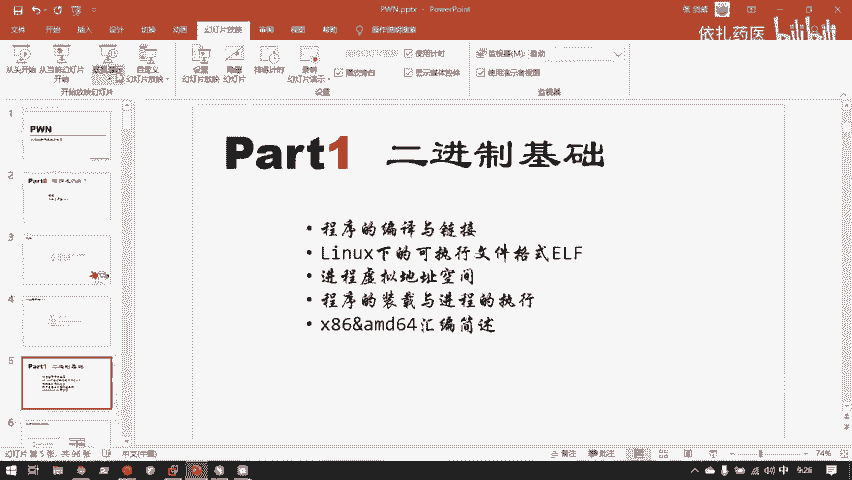

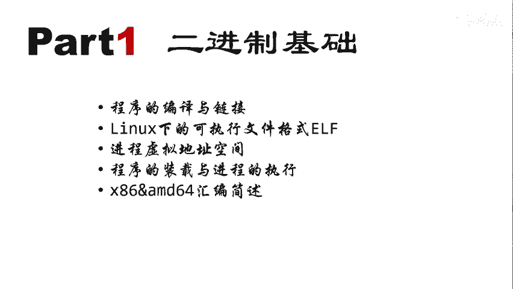

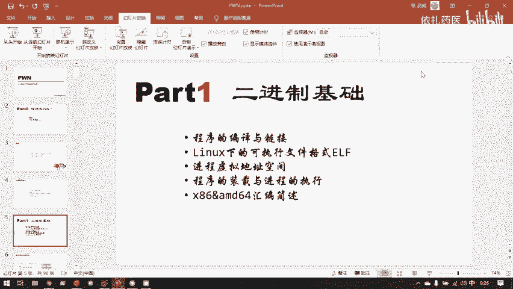

在本节课中，我们将要学习二进制程序的基础知识，特别是程序的编译与链接过程。理解这些底层原理是学习CTF中Pwn方向（二进制漏洞利用）的关键第一步。我们将从C语言源代码出发，一步步了解它如何最终变成计算机可以执行的二进制文件。

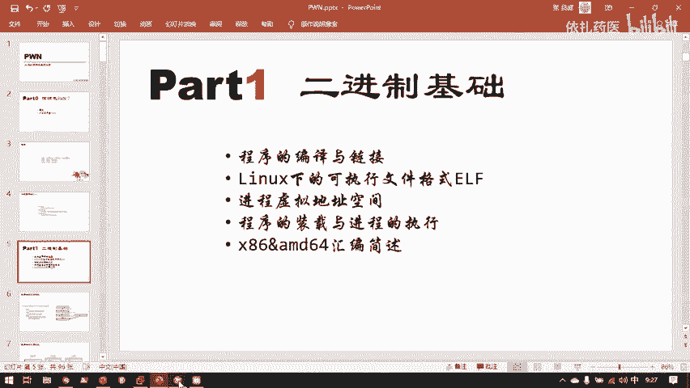

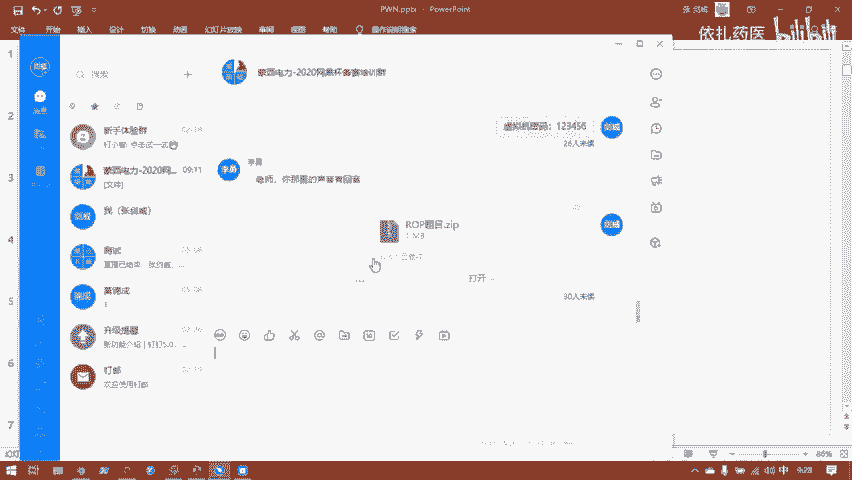

上一节我们介绍了二进制方向的挑战性，本节中我们来看看程序从源代码到可执行文件的“诞生”过程。

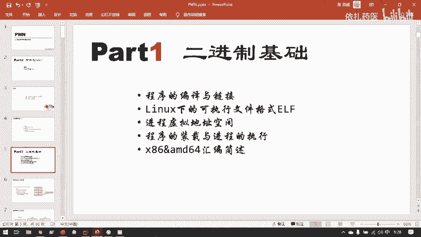

---

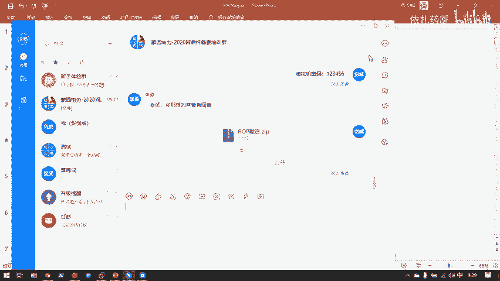

## 二进制方向的基础要求

Pwn方向被认为是CTF中最具挑战性的方向之一，因为它直接与操作系统底层交互。要深入理解并挖掘二进制漏洞，需要扎实的计算机科学基础。

以下是学习二进制安全必备的两项核心基础知识：

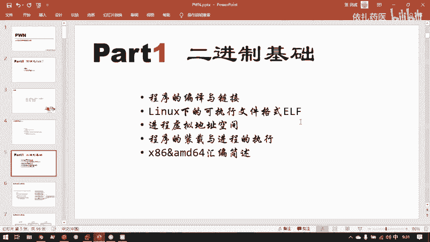

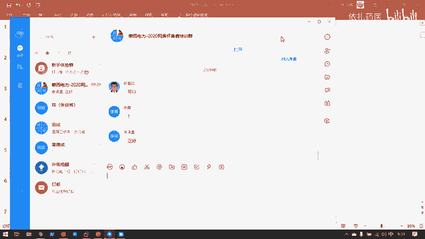

1.  **C语言编程基础**：我们分析漏洞的最终目标，是将汇编指令还原成可理解的C语言逻辑。如果读不懂C语言代码，学习将非常困难。C语言语法相对简洁，有其它编程语言基础的同学可以较快掌握。
2.  **Linux操作系统基础**：CTF中的二进制题目大多运行在Linux环境下。熟悉Linux的命令行操作、文件系统和基本工具是进行分析和调试的前提。

掌握这些基础知识，才能为后续学习函数调用栈、内存布局等复杂概念铺平道路。

---

## 为何聚焦C语言？ 🎯

我们主要研究由C/C++语言编译而成的二进制程序漏洞，原因如下：

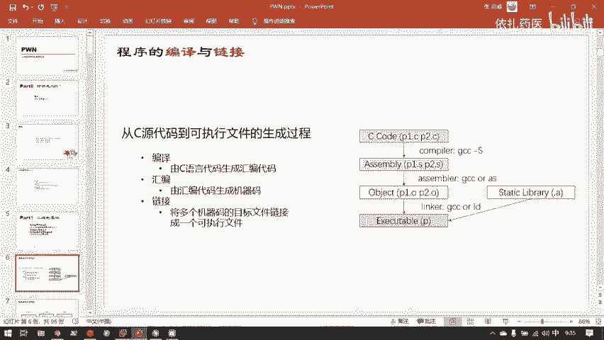

*   **历史与市场**：C语言历史悠久，是许多系统软件和底层应用的开发语言，市场占有量极大。只要这些程序仍在运行，其安全问题就始终存在。
*   **设计特性**：C语言在设计之初并未充分考虑安全性，存在许多历史遗留问题（如缺乏边界检查），这直接导致了大量的安全漏洞。
*   **性能需求**：在对执行效率和实时性要求极高的领域（如金融交易系统），需要C/C++这种没有垃圾回收机制、能够编译成高效机器码的语言。因此，这类语言不会轻易被取代。

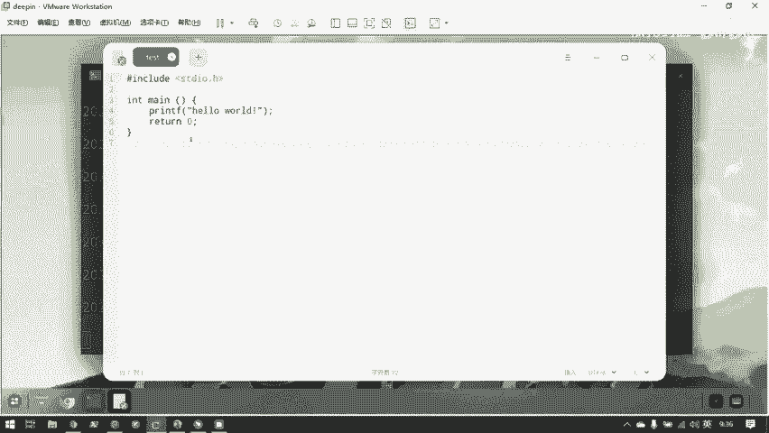

公式 `C源代码 -> 编译器 -> 二进制可执行文件` 描述了我们将要攻击的目标的生成过程。

---

## 从源代码到可执行文件 📁

一个C语言程序最初是以文本文件（`.c`文件）的形式存在的。文件内容是人类可读的字符串。


在Linux系统中，文件类型不是通过后缀名，而是通过文件头信息来识别的。可以使用 `file` 命令查看。

```bash
file test.c
# 输出：C source, ASCII text
```

存储在磁盘上的文件，在计算机底层都是以**0和1**的二进制序列保存的。例如，字符 `A` 在ASCII编码中对应十六进制值 `0x41`，二进制为 `01000001`。

一个程序必须被加载到内存中才能运行。磁盘上的二进制文件是“静止”的，当它被载入内存后，CPU才能读取其中的指令并执行。

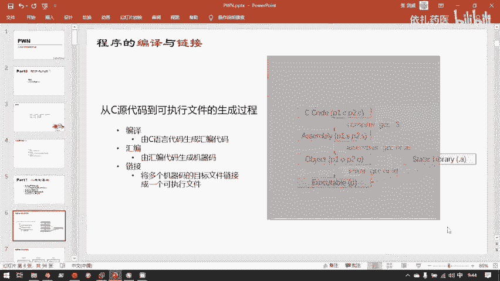

---

## 编译流程详解 ⚙️

对于C这类编译型语言，从源代码到可执行文件需要多个步骤。以下是四个关键阶段：

1.  **预处理**：处理源代码中的宏定义、文件包含等指令。
2.  **编译**：将预处理后的C代码**翻译成汇编代码**（`.s`文件）。
    ```bash
    gcc -S test.c -o test.s
    ```
3.  **汇编**：将汇编代码**翻译成目标文件**（`.o`文件），即机器码，但还不完整。
    ```bash
    gcc -c test.s -o test.o
    ```
4.  **链接**：将目标文件与所需的库文件（如C标准库 `libc`）**合并成最终的可执行文件**（如 `a.out`）。
    ```bash
    gcc test.o -o a.out
    ```

通常，我们可以用一条命令完成所有步骤：
```bash
gcc test.c -o a.out
```

链接是一个关键步骤。它分为两种方式：
*   **静态链接**：将库代码直接复制到最终的可执行文件中。文件体积大，但移植性好。
*   **动态链接**：可执行文件中只记录所需库的名字，在程序运行时才去系统中加载对应的库（如 `libc.so.6`）。文件体积小，是更常见的方式。

攻击静态链接和动态链接的程序，思路会有所不同。

---

## 文件格式与机器码 ⚡

编译生成的可执行文件（如 `a.out`）不再是文本文件。在Linux下，它的格式是 **ELF**。

使用 `file` 命令查看：
```bash
file a.out
# 输出：ELF 64-bit LSB executable, x86-64, ...
```

如果用文本编辑器打开ELF文件，会看到大量“乱码”。这是因为可执行文件中包含大量非ASCII字符范围的机器码。CPU只能识别和执行这些由 **0和1** 组成的机器指令。

汇编指令与机器码几乎是一一对应的。例如，汇编指令 `push ebp` 对应的机器码就是 `0x55`。反汇编的过程很大程度上就是这种映射关系的查表操作。

---

## 总结 🎓

本节课中我们一起学习了程序编译与链接的核心知识：

1.  学习Pwn方向需要坚实的**C语言**和**Linux**基础。
2.  我们主要研究**C/C++** 程序的二进制漏洞，源于其广泛的应用和历史遗留的安全问题。
3.  程序从源代码到可执行文件经历 **预处理、编译、汇编、链接** 四个主要阶段。
4.  **链接** 是将目标文件与库文件结合的关键步骤，分为静态链接和动态链接。
5.  Linux下的可执行文件格式是 **ELF**，其中包含CPU可直接执行的**机器码**。

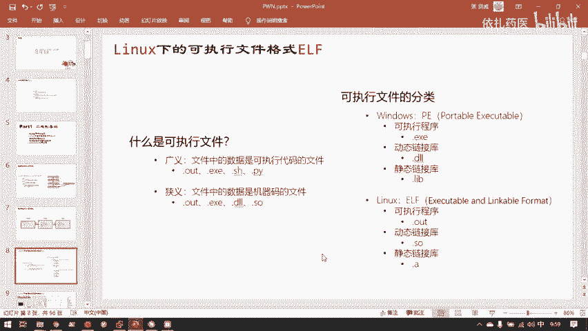

理解这些基础概念，就像掌握了地图，为我们后续深入分析函数调用栈、内存管理和具体的漏洞利用技术奠定了坚实的基础。下一节，我们将开始探索程序运行时最重要的内存结构之一——栈。