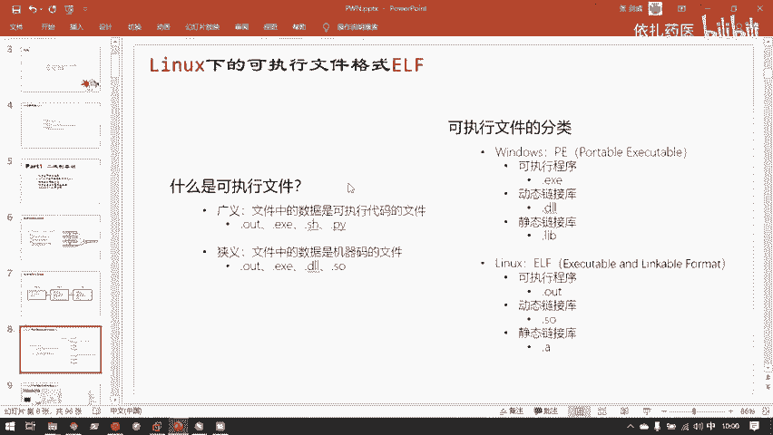
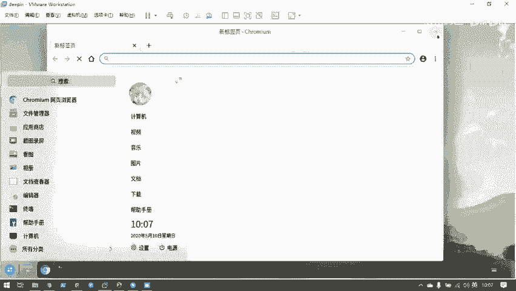
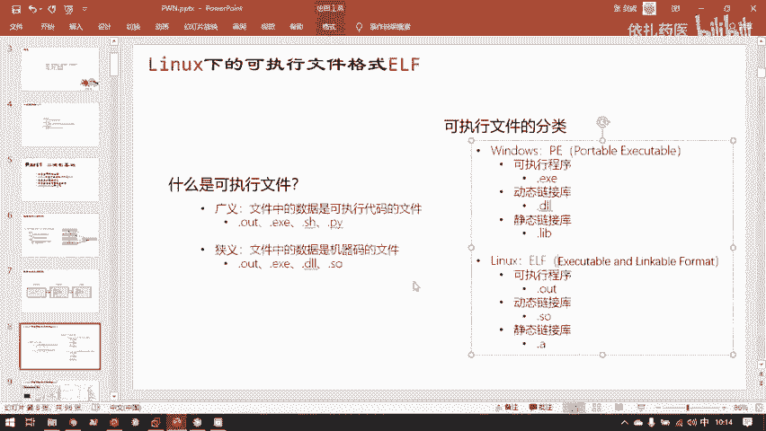
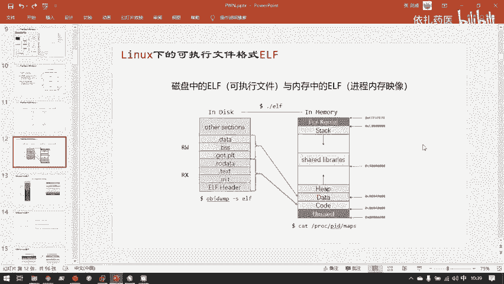

# CTF教程：P29：Linux下的可执行文件格式ELF 🐧




在本节课中，我们将要学习Linux系统下的可执行文件格式——ELF。理解ELF文件的结构是进行二进制安全研究（如Pwn和逆向工程）的基础。我们将从基本概念入手，逐步解析ELF文件的组成、它在磁盘和内存中的不同形态，以及如何查看和分析它。



## 可执行文件概述

上一节我们提到了二进制安全研究的目标。本节中我们来看看二进制安全研究的核心对象之一：可执行文件。

可执行文件是包含可由计算机直接或间接执行的代码的文件。广义的可执行文件包括任何包含可运行代码的文件，例如脚本。狭义的可执行文件特指包含CPU可识别的机器码的二进制文件。

在CTF比赛中，我们主要接触两种可执行文件格式：
*   Windows下的**PE**格式。
*   Linux下的**ELF**格式。

在Pwn方向，题目环境以Linux为主，因此我们主要研究**ELF**格式。

## ELF文件详解



### ELF文件的基本组成

一个ELF文件主要由以下几部分构成：
1.  **ELF Header**：文件头，描述了整个文件的组织结构，是操作系统加载文件的依据。
2.  **Program Header Table**：程序头表（或段表），描述了文件在内存中应如何组织成不同的“段”。
3.  **Section Header Table**：节头表，描述了文件在磁盘上如何组织成不同的“节”。
4.  **代码与数据**：文件的主体，包含实际的机器指令（代码）和程序运行所需的数据。

例如，一个简单的“Hello World”C程序编译后，`printf`函数的实现代码是**代码**，而字符串`"Hello World"`本身是**数据**。

### 磁盘与内存中的视图

ELF文件存储在磁盘上，当它被运行时，操作系统会将其加载到内存中，形成一个“进程映像”。这两个状态下的视图有所不同：

*   **磁盘视图**：以**节**为单位组织。节是链接器视角的划分，例如将代码、只读数据、可写数据分别放在`.text`、`.rodata`、`.data`节。
*   **内存视图**：以**段**为单位组织。段是操作系统加载器视角的划分，它将具有相同权限的节合并成一个段。例如，`.text`节（代码）通常映射为具有“可读、可执行”权限的`CODE`段；`.data`、`.bss`节（数据）合并为具有“可读、可写”权限的`DATA`段。

这种差异是因为操作系统关心的是内存区域的权限管理，而链接器关心的是文件的逻辑组织。

### 进程的虚拟地址空间

当一个ELF程序被加载到内存成为进程后，它只是占据了进程虚拟地址空间的一部分。整个地址空间还包括：
*   **栈**：用于函数调用、局部变量存储。
*   **堆**：用于程序运行时动态申请内存。
*   **共享库映射区**：用于加载动态链接库。

因此，磁盘上的ELF文件本身并不包含程序运行所需的全部内容（如动态分配的堆内存），它只是进程在内存中完整布局的“蓝图”和初始数据来源。

## 实践：查看ELF结构

以下是两个常用的命令，用于查看ELF文件在磁盘和内存中的结构。

### 查看磁盘中的ELF节信息

使用 `objdump` 命令可以查看ELF文件的详细节信息。
```bash
objdump -h simple.elf
```
这个命令会列出ELF文件中的所有节（Section），包括它们的名称、大小、虚拟地址和文件偏移。

### 查看运行中进程的内存段信息

在调试器（如GDB）中，可以使用命令查看进程的内存布局。
```bash
gdb ./simple.elf
(gdb) start
(gdb) info proc mappings
# 或者使用更直观的插件命令（如pwndbg的 `vmmap`）
(gdb) vmmap
```
这个命令会显示进程的虚拟内存空间分布，包括代码段、数据段、堆、栈等区域的地址范围和权限。

## 总结



本节课中我们一起学习了Linux下的可执行文件格式ELF。我们了解了ELF文件的基本组成部分（文件头、程序头表、节头表、代码与数据），区分了它在磁盘（节视图）和内存（段视图）中的不同组织形式，并认识到一个运行中的进程其虚拟地址空间远比磁盘上的ELF文件本身要复杂。掌握这些基础知识，是后续分析程序漏洞、编写利用代码的关键第一步。