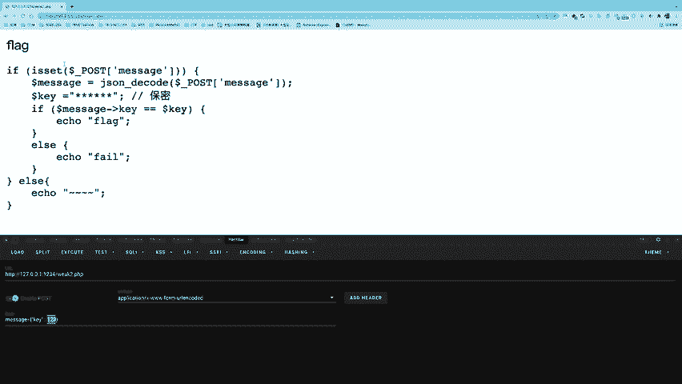
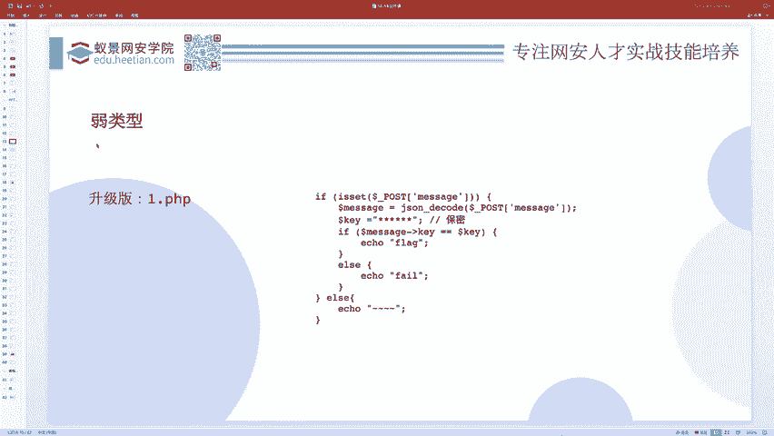
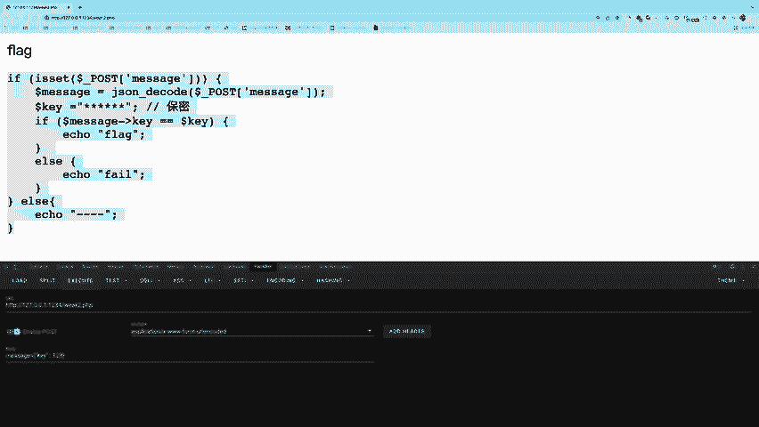

# CTF教程：P2：ctf-web01_弱类型问题 🔓

在本节课中，我们将要学习CTF Web题目中一个常见的安全问题——PHP弱类型比较。我们将从基本概念入手，通过实例理解其原理，并最终学会如何利用它来解题。

## 概述：什么是弱类型问题？

首先，我们需要理解弱类型问题到底是什么。本节课主要以PHP语言作为讲解内容，因为PHP在Web CTF中占有很大比重，并且其语法相对简单，适合新手入门。

在PHP语言中，与Python等语言不同，它在判断两个值是否相等时有两种方式：严格比较（`===`）和松散比较（`==`）。

*   **严格比较 (`===`)**：会同时判断两个值的**类型**和**值**是否完全相同。
*   **松散比较 (`==`)**：是一种不严格的判断，会先尝试进行类型转换，再比较值。

例如，在`if`条件判断中，条件为`true`或`1`都会进入分支，因为在松散比较中，它们被认为是“差不多”的真值。

上一节我们介绍了两种比较方式的区别，本节中我们来看看松散比较的具体行为。

## 松散比较的类型转换规则

当使用`==`进行比较时，如果涉及字符串和数字，PHP会尝试将字符串转换为数值，再进行比较。

字符串转换为数值的规则如下：
1.  从字符串**起始位置**开始读取。
2.  如果第一个字符是数字，则继续读取直到遇到非数字字符为止，读取到的部分作为数值。
3.  如果第一个字符**不是**数字，则转换结果为**0**。

以下是几个转换示例：
*   `“123admin”` -> `123`
*   `“admin”` -> `0`
*   `“1admin”` -> `1`

此外，还有一种特殊情况：如果字符串是**科学计数法**格式（如 `“0e12345”`），它也会被当作数值处理。`0e12345` 表示 0 乘以 10 的 12345 次方，结果仍是 0。

理解了规则后，我们就能解释一些看似奇怪的比较结果：
*   `“admin” == 0` 为真，因为 `“admin”` 转为数字是 0。
*   `“0e123” == “0e456”` 为真，因为两者都被当作科学计数法数字 0。

## PHP字符串取值规则

当一个字符串被当作一个数值来取值时，其结果和类型遵循以下规则：

以下是判断逻辑：
1.  如果字符串中**不包含**点（`.`）、小写`e`或大写`E`，并且其数值在整型范围内，则被当作`int`处理。
2.  其他情况会被当作`float`处理。
3.  转换时，由字符串**开始的部分**决定其值。如果以合法数值开头，则使用该数值；否则值为0。

以下是一些示例及其结果：
*   `1 + “10.5” = 11.5` （`“10.5”` 含点，作 `float` 处理）
*   `“-1.3e3” + 1 = -1299` （含 `e`，作 `float` 处理）
*   `1 + “a” = 1` （`“a”` 转数字为 0）
*   `1 + “2admin” = 3` （`“2admin”` 转数字为 2）

## 实战演练：CTF题目解析


理论需要结合实践。现在，我们来看一道CTF题目，应用刚才所学的知识。

题目给出了以下PHP源代码：
```php
<?php
$flag = “flag{this_is_a_fake_flag}”; // 真实环境中会是真正的flag
$key = $_POST[‘key’]; // 从用户输入获取key，真实值未知

if ($key == “secret_unknown_key”) { // 使用松散比较 ==
    echo $flag;
} else {
    echo “Fail”;
}
?>
```
我们的目标是让程序输出 `$flag`。已知条件是使用 `$_POST` 提交一个名为 `key` 的参数，并且代码使用**松散比较**（`==`）来检查 `$key` 是否等于一个未知的字符串 `“secret_unknown_key”`。

解题思路如下：
1.  由于是比较运算符是 `==`，存在弱类型漏洞。
2.  我们不知道 `“secret_unknown_key”` 的具体值，但知道它是一个**字符串**。
3.  根据规则，如果一个**数字**与一个**非数字开头**的字符串进行 `==` 比较，字符串会被转换为数字 `0`。
4.  因此，我们可以尝试提交 `key=0`。如果目标字符串恰好不是以数字开头，那么 `0 == “secret_unknown_key”` 的结果将为真。

我们使用工具（如 Burp Suite 或 Python 脚本）提交 `key=0`：
```
POST /vulnerable.php HTTP/1.1
...
key=0
```
服务器返回了 `flag{this_is_a_fake_flag}`，解题成功！这说明目标密钥字符串不是以数字开头的。

## 进阶：当密钥以数字开头时怎么办？

如果提交 `key=0` 返回了 `“Fail”`，说明目标密钥字符串可能是以数字开头的（例如 `“123secret”`）。这时我们无法直接猜出具体数字。

以下是解决方案：
我们可以编写一个简单的爆破脚本，遍历所有可能的数字，直到匹配成功。
```python
import requests

url = “http://target.com/vulnerable.php”
for i in range(1000): # 假设数字在0-999之间
    data = {‘key’: str(i)}
    response = requests.post(url, data=data).text
    if “flag{“ in response:
        print(f”Found key: {i}“)
        print(response)
        break
```
这个脚本会从0开始，依次尝试 `key=1`， `key=2`…… 一旦服务器响应中包含 `“flag{“`，就说明找到了正确的数字，脚本会停止并输出结果。这种方法通常能在几秒内完成爆破。

## 松散比较对照表

为了更全面地理解，以下列出了PHP中使用 `==` 进行比较时，一些常见值之间结果为真的情况（非完整列表）：

| 值A | 值B | 比较结果 (`==`) | 原因 |
| :--- | :--- | :--- | :--- |
| `false` | `“”` (空字符串) | 真 | 空字符串在比较时会被转换为 `false` |
| `false` | `0` | 真 | 数字0在比较时会被转换为 `false` |
| `true` | `1` | 真 | 数字1在比较时会被转换为 `true` |
| `“123”` | `123` | 真 | 字符串 `“123”` 被转换为数字 `123` |
| `“0e123”` | `“0e456”` | 真 | 两者都被当作科学计数法数字 `0` |
| `“abc”` | `0` | 真 | 非数字开头字符串被转换为数字 `0` |



利用这个表中揭示的“等价”关系，可以构造特殊的输入来绕过程序中的条件判断。



## 总结



本节课中我们一起学习了PHP弱类型比较漏洞。
1.  我们首先理解了PHP中严格比较（`===`）与松散比较（`==`）的关键区别。
2.  然后深入学习了松散比较中，字符串与数字比较时的类型转换规则。
3.  接着，我们通过一道CTF题目，实战演练了如何利用`非数字开头字符串==0`这一特性来解题。
4.  最后，我们探讨了当密钥以数字开头时的爆破解决方法，并了解了更多松散比较的等价情况。

核心要点在于：**开发者本意是方便编程的松散比较（`==`），如果使用不当，攻击者就可能通过构造特定类型的输入，让本不相等的数据变得“相等”，从而绕过安全验证。** 在CTF解题和实际代码审计中，遇到 `==` 都需要格外警惕。