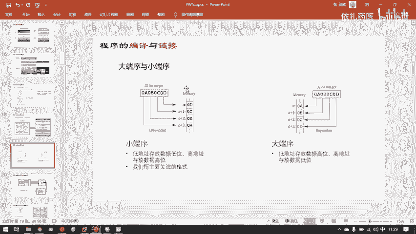
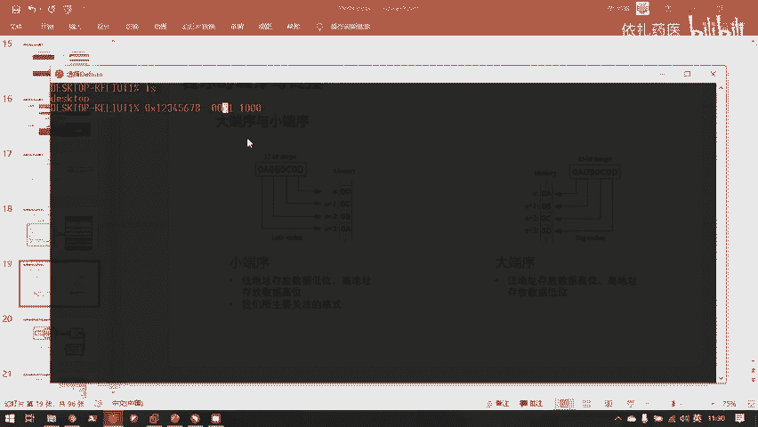
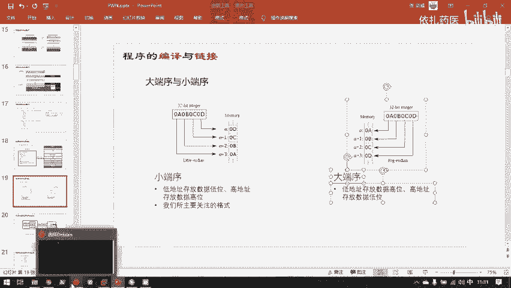
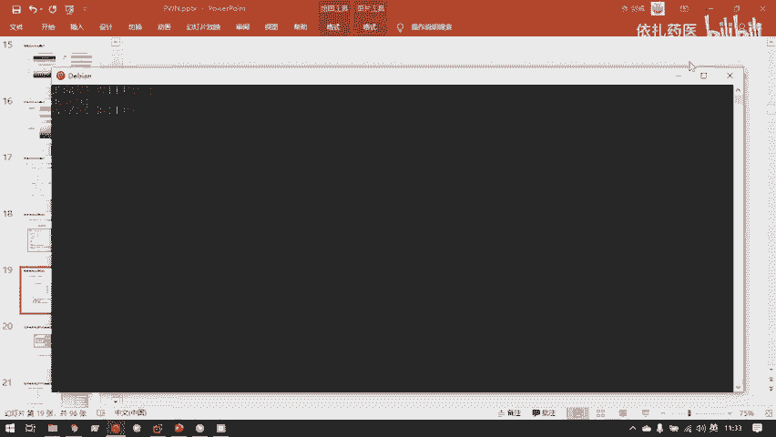
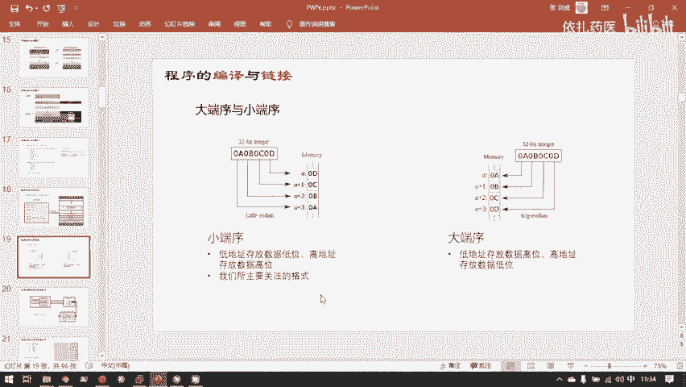
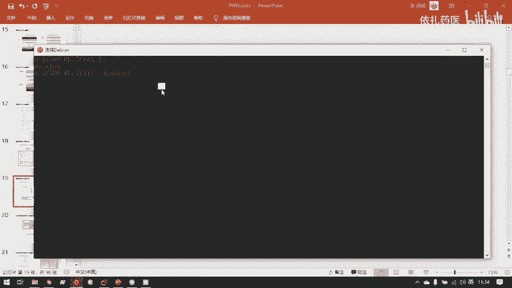
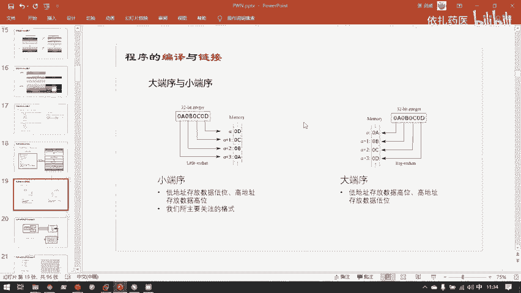

# CTF教程：P30：进程虚拟地址空间 🧠

在本节课中，我们将深入探讨进程虚拟地址空间这一核心概念。理解虚拟内存是学习二进制安全（如Pwn、逆向）的基础，它解释了程序在内存中是如何被组织、管理和保护的。我们将从实模式与保护模式的演变讲起，逐步剖析32位与64位系统下虚拟地址空间的布局、关键区域的功能，以及数据在内存中的存储方式（大端序与小端序）。

## 从实模式到保护模式 🛡️

早期的计算机运行在实模式下。在实模式下，程序直接操作物理内存地址。这意味着程序A和程序B都能读写物理内存条上的任何数据。

这种模式存在严重的安全和稳定性问题。例如，一个编写不当或恶意的程序可以轻易地读写甚至篡改操作系统内核的代码和数据，因为操作系统的地址就存放在物理内存中，且可以被直接访问。这导致计算机极易受到攻击和崩溃。

为了应对实模式的缺陷，现代计算机引入了保护模式。在保护模式下，用户程序无法直接访问物理内存地址。相反，操作系统为每个进程提供了一个虚拟内存空间。程序只能操作这个虚拟地址，而操作系统负责通过内存管理单元（MMU）将虚拟地址转换为实际的物理地址。

这种设计的核心思想是：**操作系统应管理所有硬件资源，用户程序只能通过操作系统提供的接口（如系统调用）来间接访问硬件**。内存也不例外，这极大地提升了系统的安全性和稳定性。

## 虚拟地址空间详解 🗺️

每一个运行中的程序（进程）都拥有一个独立的、完整的虚拟地址空间。对于程序员而言，他们仿佛独占了整个内存空间，无需关心物理内存的实际分配，这些工作都由操作系统完成。

### 32位系统的4GB空间

在32位系统中，虚拟地址空间的大小为 2^32 字节，即 **4GB**。这是因为地址总线宽度为32位，能寻址 2^32 个不同的地址。

一个常见的误解是：如果我运行两个程序，每个都需要4GB空间，那岂不是需要8GB物理内存？实际上并非如此。虚拟地址空间是“虚拟”的，程序并不会立刻占用全部4GB。例如，一个只有17KB的可执行文件，在运行时也会获得完整的4GB虚拟地址空间，但它在物理内存中实际占用的空间可能只有几十KB。操作系统仅在程序真正使用某块内存时，才在物理内存中为其分配空间。

在Linux系统中，这4GB空间通常划分为两部分：
*   **用户空间（3GB）**：存放进程独有的代码、数据、堆、栈等。
*   **内核空间（1GB）**：存放操作系统内核的代码和数据。**所有进程共享同一份内核空间**的映射，物理内存中只需保存一份内核代码。

Windows系统的划分策略不同，通常是用户空间和内核空间各占2GB。

### 64位系统的巨大空间

随着硬件发展，4GB空间逐渐不够用，于是扩展到64位系统。64位系统的虚拟地址空间极其庞大（2^64字节），远超当前硬件需求。因此，现代64位系统（如Linux）通常只使用其中的一部分，例如，为用户空间和内核空间各分配128TB。

由于空间巨大，64位地址空间中存在大量未使用的“空洞”（unused region）。

以下是64位Linux进程虚拟地址空间的一个典型布局图，它展示了不同区域的功能：



我们可以将内存区域分为两大类：
*   **静态存储区**：在程序加载时大小就基本确定，对应ELF文件中的节（Section）。包括代码段（.text）、只读数据段（.rodata）、已初始化数据段（.data）和未初始化数据段（.bss）。
*   **动态存储区**：在程序运行时动态增长和收缩。主要包括：
    *   **堆（Heap）**：用于程序运行时动态申请内存（如`malloc`）。
    *   **栈（Stack）**：用于函数调用，保存局部变量、返回地址等。

## 节（Section）与段（Segment） 📚

上一节我们介绍了虚拟空间的宏观布局，本节中我们来看看ELF文件在磁盘和内存中的两种视图，这有助于理解静态存储区的来源。

*   **节（Section）**：是**链接视图**。编译器、链接器在生成ELF文件时，将代码、数据按照不同功能（如代码、只读数据、符号表）组织成不同的节。这关乎文件如何存储在磁盘上。
*   **段（Segment）**：是**执行视图**。当操作系统将ELF文件加载到内存成为进程时，它会将具有相同访问权限（读、写、执行）的节合并成一个段。这关乎程序如何在内存中执行。

简单来说：**节（Section）用于链接和存储，段（Segment）用于加载和执行**。例如，代码节（.text）和只读数据节（.rodata）权限都是“可读、可执行”，它们会被加载到同一个文本段（Text Segment）中。

## 程序在内存中的具体分布 💾

理解了一个C语言程序的各个部分在虚拟地址空间中具体存放在什么位置，是分析二进制漏洞的关键。我们通过一个示例程序来剖析。

考虑以下C代码：
```c
int global_uninit; // 未初始化的全局变量
char *str = “Hello World”; // 已初始化的全局变量

void func(int x, int y) {
    int local_var;
    // ... 函数体
}

int main() {
    char *buf = malloc(0x100); // 动态分配内存
    // 假设从用户输入读取数据到 buf
    func(1, 2);
    return 0;
}
```

该程序加载到内存后，其分布如下：



以下是各部分的存放位置说明：

*   **文本段（Text Segment）**：
    *   存放可执行代码。`main`函数和`func`函数的机器码存放在此。
    *   也存放**只读数据**，如字符串常量`”Hello World”`。虽然它是数据，但因其不可修改，所以被放入文本段（有时也称为`.rodata`节）。

*   **数据段（Data Segment）**：
    *   存放**已初始化的全局变量和静态变量**。例如指针`str`（它指向字符串常量，但指针变量本身的值是可修改的）。

*   **BSS段（Block Started by Symbol）**：
    *   存放**未初始化的全局变量和静态变量**。例如`global_uninit`。
    *   **关键**：BSS段在ELF磁盘文件中不占用实际空间，仅记录大小。程序加载时，操作系统在内存中为其分配空间并初始化为零。这节省了磁盘空间。

*   **堆（Heap）**：
    *   用于**动态内存分配**。`malloc(0x100)`申请的内存位于堆区。用户输入的数据（如`”A” * 100`）也存储在这里。

*   **栈（Stack）**：
    *   用于**函数调用**。每个函数调用会创建一个栈帧，其中包含：
        *   返回地址
        *   函数的**局部变量**（如`func`中的`local_var`，`main`中的指针`buf`本身）
    *   **注意参数传递**：在32位系统中，函数参数（如`func(1, 2)`中的`x`和`y`）也通过栈传递。而在64位系统中，前几个参数通常通过寄存器（如`rdi`, `rsi`）传递，这提升了性能。

## 字节序：大端序与小端序 🔄

数据在内存中是如何排列的？这引出了字节序的概念。对于一个多字节的数据类型（如int, long），其高位字节和低位字节在内存地址中的存放顺序有两种标准。

*   **大端序（Big-endian）**：**高位字节存放在低地址**，低位字节存放在高地址。符合人类阅读习惯。
*   **小端序（Little-endian）**：**低位字节存放在低地址**，高位字节存放在高地址。这是x86/x86-64架构使用的格式。

我们以32位整数 `0x12345678` 为例，看看它在内存中的布局：




**字节序对安全的影响**：
小端序在漏洞利用中更为常见，也相对容易利用。例如，在利用缓冲区溢出覆盖一个地址或函数指针时，由于数据是从低地址向高地址写入，小端序允许攻击者先覆盖目标的低位字节，这可能更容易构造出有效的攻击载荷。而在大端序下，需要先覆盖高位字节，有时会受到限制（例如字符串遇零终止符`\x00`会提前结束）。


幸运的是，我们遇到的绝大多数CTF题目和现代桌面系统都采用小端序。

字符串的存储不受字节序影响，总是按顺序从低地址到高地址存放每个字符。




## 总结 📝


本节课中我们一起深入学习了进程虚拟地址空间：
1.  **模式演变**：理解了计算机从**实模式**（直接访问物理内存）发展到**保护模式**（通过虚拟内存访问）的必要性，这是系统安全的基石。
2.  **空间布局**：掌握了32位和64位系统下虚拟地址空间的划分，特别是用户空间与内核空间的区别，以及堆、栈、代码段、数据段、BSS段等关键区域的位置和功能。
3.  **视图转换**：了解了ELF文件从磁盘的**节（Section）视图**到内存的**段（Segment）视图**的转换过程。
4.  **数据分布**：通过实例分析了C程序中的全局变量、局部变量、动态内存、代码、常量等具体分布在虚拟地址空间的哪个区域。
5.  **字节序**：学习了**大端序**和**小端序**的概念，以及小端序在x86架构和二进制漏洞利用中的普遍性。







这些知识是分析缓冲区溢出、格式化字符串、堆利用等所有二进制漏洞的必备基础。在后续的学习中，你会反复用到这些概念来理解漏洞成因和构造利用过程。