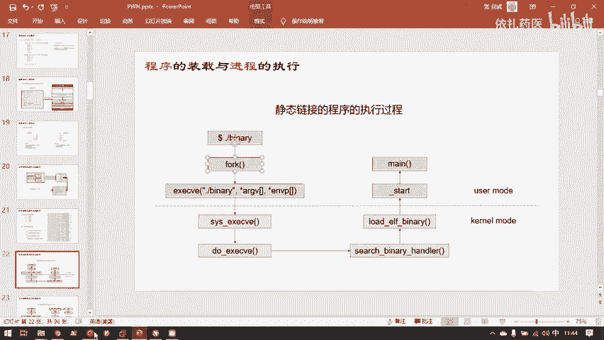
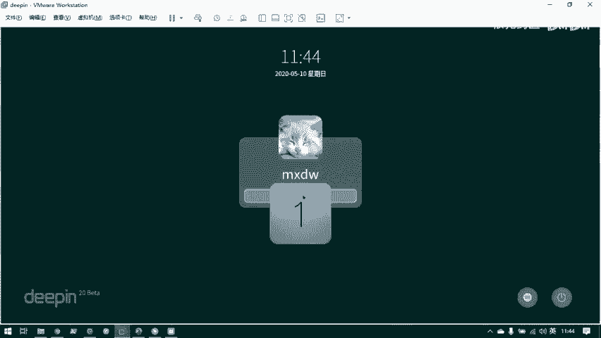
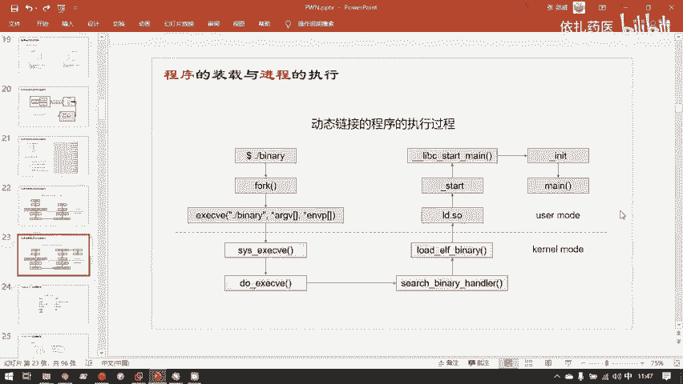

# CTF教程：P31：程序的装载与进程的执行 🚀

在本节课中，我们将学习一个程序是如何从硬盘上的文件，变成在内存中运行起来的进程。我们将了解CPU与内存如何协作，以及操作系统如何管理程序的加载与执行环境。

## 核心组件：CPU与内存 💻

上一节我们介绍了程序在硬盘上的存放格式，本节中我们来看看程序是如何与计算机硬件交互执行的。

计算机的核心功能由**CPU**和**内存**完成。其他如显卡、显示器、键盘、鼠标等都属于外设。CPU和内存通过**地址总线**、**数据总线**和**控制总线**进行通信。

*   **地址总线**：CPU告诉内存要访问哪块地址的内容。
*   **数据总线**：内存将指定地址的内容送回给CPU。
*   **控制总线**：传送控制指令。

内存中保存着实际的代码和数据。CPU内部有一个特殊的寄存器，称为**程序计数器**，它总是指向当前正在执行的指令地址。

*   在x86架构（32位）中，它叫 **`EIP`**。
*   在x64架构（64位）中，它叫 **`RIP`**。

CPU通过不断递增`PC`寄存器的值，并经由三条总线与内存交互，从而一条一条地执行指令，最终完成代码段规定的功能。

## 关键寄存器详解 🧮

目前主流的计算机架构是AMD64（或称x86-64），它向下兼容x86（32位）。我们主要关注以下几个关键寄存器：

*   **`RIP`**：程序计数器，存放当前执行指令的地址。
*   **`RSP`**：栈指针，存放当前函数调用栈的栈顶地址。
*   **通用寄存器**：如`RAX`， `RBX`， `RCX`等，可用于存放任意数据。它们有一些约定俗成的用途，例如编译器通常使用 **`RAX`** 寄存器来保存函数的返回值。

## 程序的入口与执行环境 🚪

在C语言中，`main`函数被视为程序的入口，但这并不完全准确。`main`函数只是**用户自定义代码的入口**。在执行`main`函数之前，程序需要做大量的初始化工作来准备执行环境。

程序分为**静态链接**和**动态链接**两种：

*   **静态链接程序**：将所有需要的库代码都“写死”在自身的可执行文件中，可以独立运行。
*   **动态链接程序**：在编译时只标记需要哪些外部库函数，在**运行时**才去操作系统的文件系统中查找并加载对应的动态链接库（如`libc.so`）。因此，动态链接程序不能独立运行，必须确保其依赖的库文件存在。

## 进程的创建：从文件到内存 🔄

操作系统将运行环境分为**用户模式**和**内核模式**。

*   **用户模式**：运行用户编写的程序，权限较低，不能直接访问硬件。
*   **内核模式**：运行操作系统内核代码，权限高，负责管理所有硬件资源。

一个用户程序要执行，必须向操作系统申请资源（如内存）。这个过程大致如下：

1.  **`fork`**：当前进程（例如`shell`）调用`fork`，复制一份自己的虚拟内存空间。
2.  **`execve`**：在新复制的内存空间中，调用`execve`系统调用，将内存内容替换为目标程序（例如`simple.elf`）的内容。
3.  **环境准备**：操作系统完成加载后，程序从真正的入口点`_start`（一段汇编代码）开始执行。`_start`会调用初始化函数（如`_init`），准备好运行时环境。
4.  **动态链接额外步骤**：对于动态链接程序，在`_start`之后，会通过链接器（如`ld-linux.so`）加载所需的动态库，并执行库的初始化函数（如`libc_start_main`）。
5.  **执行main**：当所有环境准备就绪后，最终才会调用用户编写的`main`函数，开始执行程序功能。

---

本节课中我们一起学习了程序装载与进程执行的核心原理。我们了解了CPU与内存如何通过总线协作，认识了关键的`RIP`、`RSP`、`RAX`等寄存器，并梳理了一个程序从硬盘文件到内存中运行的完整流程，包括静态/动态链接的区别，以及操作系统通过`fork`和`execve`创建进程的步骤。理解这些底层机制是深入学习CTF中Pwn和逆向工程的重要基础。