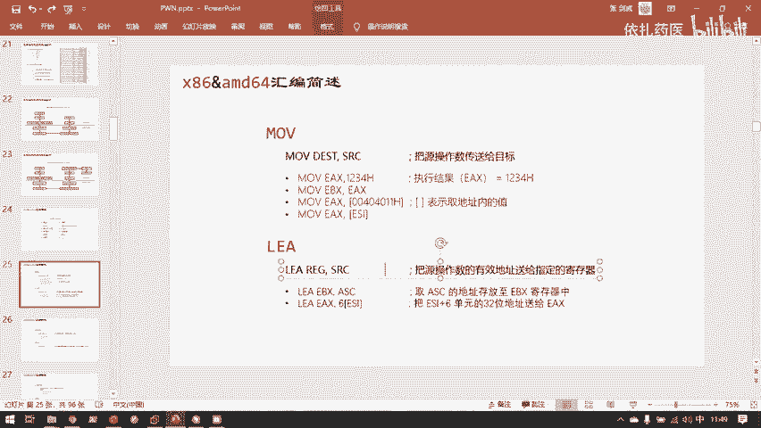
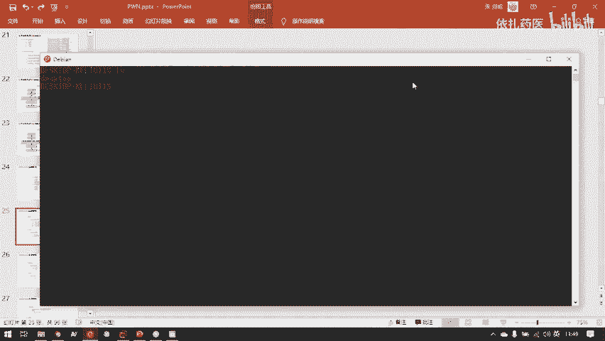
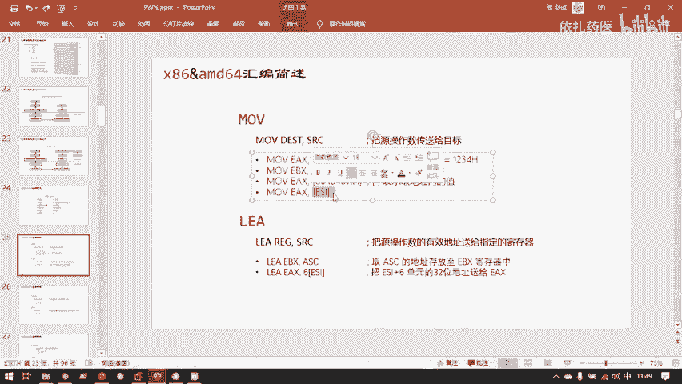
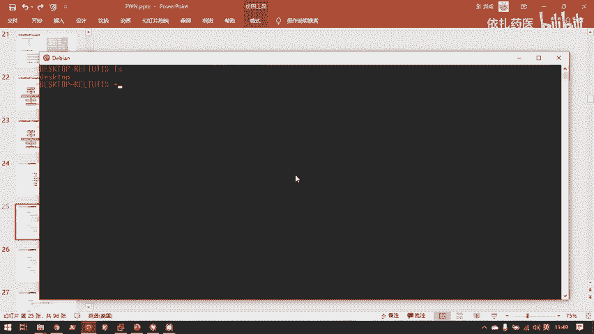
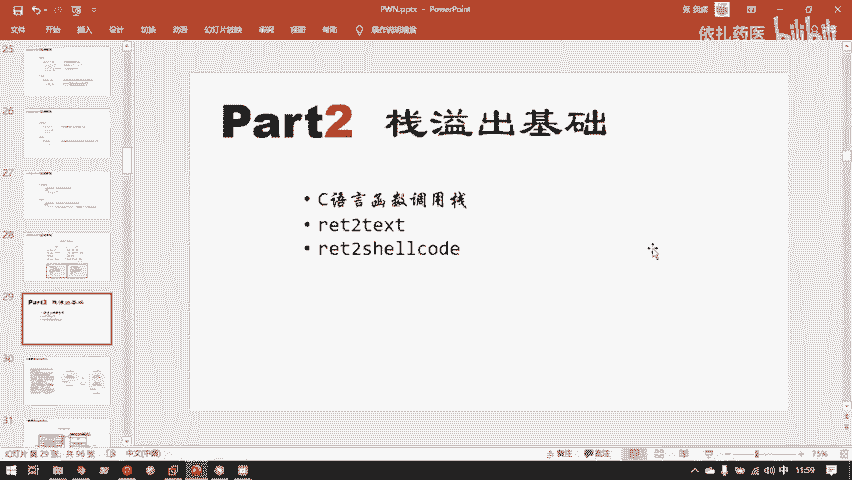

# CTF教程：P32：x86&amd64汇编简述 🖥️

在本节课中，我们将要学习x86与amd64架构下最核心的汇编指令。理解这些指令是分析程序、挖掘漏洞（尤其是Pwn类题目）的基础。我们将重点讲解赋值、栈操作和函数调用相关的指令，并解释其工作原理。

上一节我们介绍了程序内存布局的基本概念，本节中我们来看看CPU如何通过具体的指令来操作内存和寄存器。

## 核心汇编指令解析

### MOV指令：数据传送

`MOV`指令是最常用的指令之一，其功能是进行数据传送，相当于C语言中的赋值操作（`=`）。

例如，C语言代码 `int c = 2;` 在汇编中通常对应一条`MOV`指令，将值`2`传送到目标内存或寄存器。

**公式表示**：
`MOV destination, source`

这里需要理解一个关键符号：**中括号 `[]`**。在汇编中，中括号的含义与C语言中的取地址符`&`或解引用`*`不同。

*   当操作数是 `STR` 时，使用的是`STR`这个符号（或变量）本身的值。
*   当操作数是 `[STR]` 时，意思是：**将`STR`的值作为一个内存地址，并取出该地址中存储的内容**。这类似于C语言中的指针解引用 `*ptr`。

因此，指令 `MOV EAX, [s]` 的含义是：将变量`s`的**地址**所指向的内存中的值，加载到`EAX`寄存器中。

### PUSH与POP指令：栈操作

栈（Stack）是一种“后进先出”（LIFO）的数据结构。在程序执行中，栈主要用于保存函数的局部变量、传递参数和存储返回地址。

以下是栈操作的两个核心指令：

1.  **`PUSH`指令**：将数据压入栈顶。该操作会使栈指针（`ESP`/`RSP`）向低地址方向移动，并将数据存入新的栈顶位置。
2.  **`POP`指令**：从栈顶弹出一个数据。该操作会先读取当前栈顶的数据，然后将栈指针（`ESP`/`RSP`）向高地址方向移动。

**工作原理示例**：
假设当前栈中已有数据，栈顶位于低地址处。
*   执行 `PUSH 0x1234`：栈指针下移（向更低地址），然后将值`0x1234`存入新的栈顶位置。
*   执行 `POP EAX`：将当前栈顶的值（即`0x1234`）读入`EAX`寄存器，然后栈指针上移（向更高地址），该数据从栈中“弹出”。

程序的内存布局中，栈的增长方向（从高地址向低地址）与堆（从低地址向高地址）相反，这种设计是为了更有效地利用两者之间的空闲内存空间。

### LEAVE与RET指令：函数返回

每个函数调用都会在栈上拥有自己的一块区域，称为“栈帧”。函数执行完毕返回时，需要清理自己的栈帧并回到调用者处继续执行。这主要由一对指令完成：

1.  **`LEAVE`指令**：用于销毁当前函数的栈帧。其操作等效于：
    *   `MOV ESP, EBP` （将栈指针指向当前栈帧基址）
    *   `POP EBP` （恢复调用者的栈帧基址）
2.  **`RET`指令**：用于从函数返回。其核心操作是从栈顶弹出返回地址，并跳转到该地址执行。这等效于 `POP EIP`（或 `POP RIP`）。

**关键点**：指令指针寄存器（`EIP`/`RIP`）不能像通用寄存器一样直接用`MOV`或`POP`指令修改，这是CPU的设计约定，以保障程序控制流的完整性。`RET`是合法修改`EIP`/`RIP`的特定指令之一。

## 汇编语法格式：AT&T vs. Intel

在阅读汇编代码时，你可能会遇到两种主要格式：AT&T格式和Intel格式。它们本质相同，只是语法有异，掌握一种即可理解另一种。

它们的主要区别如下：

*   **操作数顺序相反**：
    *   Intel格式：`MOV 目标操作数, 源操作数`
    *   AT&T格式：`MOV 源操作数, 目标操作数`
*   **立即数与寄存器**：
    *   Intel格式：`MOV EAX, 8`
    *   AT&T格式：`MOV $8, %EAX`
*   **内存寻址**：
    *   Intel格式使用中括号`[]`，如 `MOV EAX, [EBX]`
    *   AT&T格式使用小括号`()`，如 `MOV (%EBX), %EAX`

## 总结

本节课中我们一起学习了x86/amd64汇编的基础核心知识。我们详细讲解了`MOV`赋值指令、`PUSH`/`POP`栈操作指令以及`LEAVE`/`RET`函数返回指令的工作原理和用途。我们还区分了AT&T与Intel两种汇编语法格式的主要差异。理解这些指令是后续分析栈溢出等漏洞的必备前提。

下一节，我们将正式进入“栈溢出基础”的学习，利用本节课的知识，深入探讨栈的结构如何被破坏，以及攻击者如何利用这一点控制程序执行流。