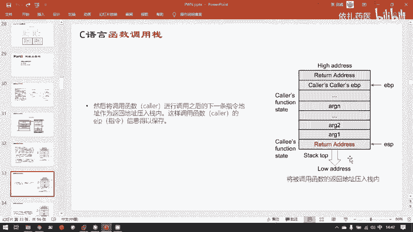
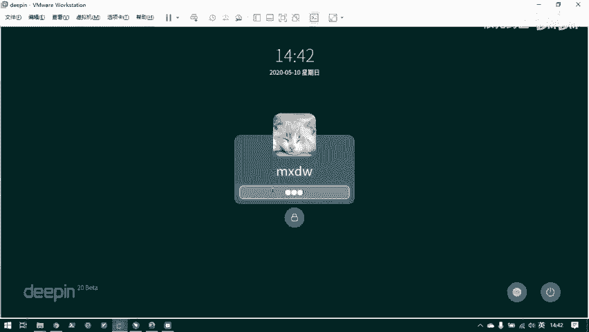
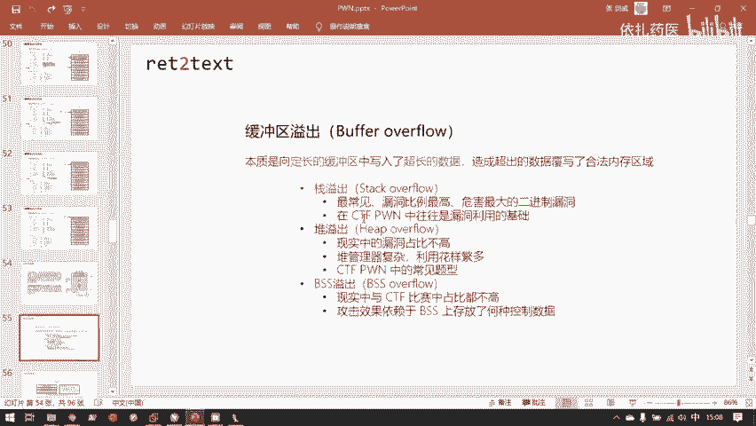

# CTF教程：P33：C语言函数调用栈 🧱

在本节课中，我们将要学习CTF-Pwn领域中最经典、最常见的漏洞——栈溢出所依赖的核心基础：C语言函数调用栈的工作原理。理解栈的运作机制是理解栈溢出漏洞的前提。

## 概述

上午我们讲解了二进制相关的基础知识。下午我们来了解Pwn领域中的第一个最经典也是最常见的漏洞：栈溢出。在讲解栈溢出具体漏洞之前，有大量的基础知识需要补足，尤其是栈本身的工作原理。这个工作原理必须在心里滚瓜烂熟，才能很容易地理解栈溢出是怎样的一个过程。

上午已经简单介绍过函数调用栈。本节中，我们将深入探讨其具体功能和工作原理。

## 栈的位置与增长方向

函数调用栈位于虚拟内存用户空间的最高地址。上午已经给大家看过，可以翻看前面的PPT。

栈的增长方向是从高地址向低地址增长，这与程序虚拟内存空间中的其他区域不同。

## 栈的作用与栈帧

栈的作用是用来保存函数运行时的状态信息，主要包含了函数的参数和局部变量。

上午以画图的形式呈现过栈帧。一个栈帧保存了一个函数的状态信息。父函数每调用一个子函数，就会在函数调用栈中新增一个栈帧。

栈帧的栈底是用EBP（32位）或RBP（64位）寄存器保存的。栈顶是用ESP（32位）或RSP（64位）寄存器保存的。具体使用哪个寄存器取决于操作系统和CPU的位数：32位x86 CPU使用ESP和EBP，64位x86-64 CPU使用RSP和RBP。

## 栈帧的详细结构

以下是栈帧具体结构的详细图示。大家可以看到，这是上午讲过的程序的虚拟内存结构。栈位于用户空间的最高地址。





在EBP与ESP之间，就是一个栈帧。目前可以先关注以下几个比较重要的区域：
*   当前函数的栈帧高地址处紧邻着它的父函数的栈帧。
*   父函数栈帧与当前栈帧紧邻的地方有两个十分重要的控制信息：
    *   **返回地址**：即 `return address`。
    *   **保存的上一栈帧基址**：即 `saved frame pointer`，这是上一个栈帧的栈底的值，也就是上一个栈帧EBP寄存器的值。

上一个栈帧最开始，EBP寄存器指向的是上一个栈帧的栈底。假设是这个位置，ESP自然也大概在这个位置。调用了子函数之后，EBP就指向了新的栈帧的栈底，到了这个位置。当子函数返回后，我们需要恢复上一个栈帧的信息，所以EBP这个栈底指针自然也要被恢复。那么怎么恢复呢？它会在当前栈帧紧邻的上一个字长记录父函数的栈帧基址指针的值，方便之后恢复父函数的栈底指针。

此外，局部变量保存在对应函数的栈帧，即当前函数栈帧的局部变量区。栈溢出发生的位置也正是在这里，因为局部变量是受用户控制的。如果写入的数据超长，就会覆盖到其他的控制信息。

还有一个重点是参数。整个图示是32位架构下的函数栈帧结构。在32位传参时，子函数所用到的参数实际上是保存在父函数栈帧的末尾。子函数所用的参数并不是保存在自己的栈帧里，而是保存在父函数栈帧的末尾。这里的 `argument` 是子函数的参数，也就是子函数要用到的形参，即上午讲到的这里的 `x` 和 `y`。

父函数栈帧的最末尾一个字长保存了父函数自己的栈底的值，所以这里指向了父函数的栈底。那么父函数的父函数，也同样的有这样一个指回去的过程。

## 函数调用栈的工作过程

上一节我们介绍了栈帧的结构，本节中我们来看看函数调用栈具体的工作过程。函数状态主要涉及三个寄存器：`ESP`、`EBP` 和 `EIP`。目前我们以x86为例，因为x86的函数调用栈工作原理比x86-64简单一点，所以先从简单的入手。这里都是以 `E` 开头的32位宽度的寄存器。

`ESP` 和 `EBP` 刚才已经说过了，分别是栈顶和栈底。`EIP` 是当前函数执行的指令。

在调用下一个函数的时候，父函数（即 `caller` 函数）在调用子函数（即 `callee` 函数）时，会先把子函数所需要的参数倒序压入栈中。可以看到右边这个图，在压栈的时候，子函数的第一个参数是压在栈顶的，而子函数的最后一个参数反而是压在比较深的栈里面的地方。所以它是倒序加入。这点也要注意，这些细节直接和我们的漏洞应用相关。

在所有参数压入完毕之后，就会压入父函数的返回地址。

我们从这里开始，写一个函数来说明一下。

```c
int sum(int a, int b) {
    return a + b;
}
int main() {
    int result = sum(1, 2);
    return 0;
}
```

此时 `main` 函数和 `sum` 函数的关系是：`main` 函数调用了 `sum` 函数。那么 `main` 函数就是 `sum` 函数的父函数，`sum` 函数就是 `main` 函数的子函数。

在 `main` 函数调用 `sum` 函数的时候，看这张图。上面这张图蓝色的所有部分都是 `main` 函数的栈帧。在调用 `sum` 函数时，它会先把 `sum` 的参数压栈，即把 `1` 和 `2` 依次压入它当前自己的栈帧中，这一点要注意。然后，它会压入 `return address`，也就是返回地址。对于我们此时写的这个程序，返回地址就是 `return 0` 这条指令的地址。它会在执行完 `sum` 函数之后，通过压入的这个返回地址的值，回到 `sum` 函数的下一条指令，也就是 `return` 的地方。

压入了返回地址后，还要干什么呢？在 `sum` 函数调用完毕之后，`sum` 函数的栈帧就没有用了，因为 `sum` 函数已经完成任务，那么就要恢复 `main` 函数的栈帧。恢复 `main` 函数的栈帧时，需要知道 `main` 函数栈帧的相关信息。所以在 `sum` 函数最初调用的时候，不能把 `main` 函数的栈帧信息丢弃。必须在调用 `sum` 函数之前就把 `main` 函数的栈底指针压进去，就是这里 `push` 了一个 `caller's EBP`。对于我们此时写的代码，就是 `main` 函数的 `EBP`。

现在先讲一遍，大家可能第一遍无法把这整个过程记下来，没有关系。因为对于栈函数调用栈的工作原理，要在大脑中形成一个很熟练的动画，可能需要时间。等一下会在下方以动画的形式实际展示。

压入了主调函数（即父函数）的 `EBP` 之后，就可以抬高 `ESP`（实际上是 `ESP` 减小，因为栈是从高地址往低地址增长，它是反的）。现在 `ESP` 减小一定的值，减小多少值呢？这由编译器决定。编译器在把你的C语言代码编译成二进制程序时，已经认出了你有多少局部变量需要多少空间，就会把 `ESP` 需要留多少空间写死在程序里。这也是为什么动态申请内存一般不用栈。在这种情况下，栈空间的大小在编译时就会确定。但并不是说栈就不能动态申请内存了，比如有 `alloca` 这个函数，它的确是可以从栈中动态获取内存的。但我们一般不这样做，因为栈其实是一个非常小的区域。堆的基本单位是GB，而栈在x86下Linux默认的大小是8兆，仅仅8兆比起4GB的空间实在小得可怜。但是堆的话，你可以从中申请一两个G的空间，那是没有问题。

在局部变量压入了被调函数（即子函数）的栈帧之后，那么子函数的栈帧就已经形成完毕，就可以通过这些局部变量完成它所实现的一些功能。此时，`EBP` 指向的是子函数的栈底，`ESP` 指向的是子函数的栈顶。此时，栈这个结构顶部的栈帧，就是这个区域，也就是子函数的栈帧。所以说栈这一个内存区域，它的栈顶永远是当前正在执行的指令所属的函数对应的栈帧。

在子函数执行完毕之后，程序就该返回了。返回的第一步就是先把子函数刚刚在这个位置开辟的用来存放局部变量的空间释放掉。但是这里的释放并不需要把这一块空间（`local variables` 这块空间）清零。只需要把 `ESP` 增大它原来减小的值，把 `ESP` 重新推到 `EBP` 这里，就相当于这部分空间就不再使用了。这个其实和Windows或各种操作系统删除文件是类似的思想。要丢弃某一块数据不用，并不需要把这块数据抹除，只需要把它标记成不是我所使用的范围就可以了。比如在Windows删除一个8GB大小的文件，你可以发现一瞬间就能删除完毕。但是如果删除800个1KB的文件，你会发现反而删了很久很久。为什么呢？因为它删除这个8GB大小的文件，并不用把这8GB全部擦除掉，只用在它的文件系统里面的某个控制这个文件的结构里给这个文件标记一下，说此处的8GB空间是可以被后来的数据复写的，那么这个文件就相当于被删除了。它并不需要把这8GB全部抹除。这也是磁盘数据恢复的一个原理。我把一个文件删除了，并且在回收站清空了，但是只要我没有往删除那个文件最开始所占用的磁盘地址写入新的数据，那么这个文件在磁盘上只是被标记了，它占有的空间可以被新来的数据复写掉。如果没有新来的数据复写它，就可以用一些特殊的数据恢复工具把这个已经删掉的文件找回来，因为它那块空间的数据还原封不动地在磁盘上。这里也是一样的思想，我们并不需要去清除这块 `local variable` 的值，只需要把 `ESP` 拉高，让它的范围不包括在它所占用的内存区域内就行。因为栈的哪一块内存区域属于栈，总是由 `ESP` 和 `EBP` 这两个指针唯一确定的，它们中间就是当前栈顶的栈帧。

在 `sum` 函数执行完之后，首先 `ESP` 会抬高自己，避开这块局部变量所用到的空间，来到 `EBP` 上。然后，再把 `EBP` 这里保存的（这是内存中保存的主调函数的 `EBP`，也就是 `main` 函数的 `EBP` 的值）弹出到 `EBP` 寄存器。`EBP` 寄存器的值就从它本来保存的指向这个地址的值，经过弹出之后，变成了这个地址里保存的值。所以 `EBP` 就回到了原来 `main` 函数的栈底的位置。`EBP` 就弹回去了。然后 `ESP` 就因为刚刚 `pop` 了，所以 `ESP` 就自动减去一个字长。

这里说一下字长的定义，说简单点，就是32位机字长就是32比特，64位机字长就是64比特。`pop` 和 `push` 操作数据的单位都是一个字长。如果是64位的系统，那么 `pop` 一下，就是弹出8字节（64比特）的数据。如果是32位的系统，`pop` 一下，就是弹出4字节（32比特）的数据。`pop` 和 `push` 的操作单位都是一个字长，这里要注意。

那么刚刚已经 `pop` 了一次，那次 `pop` 是给 `EBP` 赋了值。接下来 `ESP` 就自动加一个字长，来到了最开始保存的 `return address` 这个地方。然后，会通过 `return` 指令将 `return address` 弹出保存到 `EIP` 这个指令寄存器（程序计数器）里。因为 `return address` 最开始就是 `return 0` 的地址，所以程序就会在执行完 `sum` 之后，回到父函数的下一行代码处，就是 `return 0`，然后接着执行。这就是父函数调用子函数，然后子函数执行完毕，再回到父函数的过程。

## 动画演示与实例分析

刚刚是用这些图展示了一次，接下来用一幅更形象的方式来展现一下。这里直接用C语言代码写成了一个 `caller` 和 `callee`，也就是主调函数和被调函数。

C源代码之前的PPT展示过了，它编译成对应的汇编代码。假设它就编译成这个样子。这里之前提过，x86是用栈来传递参数的。目前研究的就是x86的工作原理。AMD64会将前六个参数用寄存器传，第七个以后的参数才会像x86一样用栈来传递。我们先研究这种比较简单的情况，即x86用栈来传递参数。

现在得到了这样一段汇编代码，对应的机器码被载入到了进程中，然后开始执行。过程如下：首先这是主调函数，这是被调函数。可以看到此时主调函数在这一行调用了被调函数。

以下是关键点：
*   一个遵循C语言函数调用规范的函数，它的开头一般都是 `push EBP` 开头。为什么要 `push EBP` 已经解释过了，需要保存它父函数的栈底状态。
*   它结束会是 `leave; ret`。`leave` 就是恢复它父函数的栈底，`ret` 就是返回到父函数的下条指令。

现在用一个程序来实验一下。在实验之前，用IDA打开一个程序反编译之前，需要先看一下这个程序的相关信息。这是一个32位的ELF文件。所以在用IDA打开一个二进制程序之前，需要先了解它是32位还是64位。32位的IDA和64位的IDA分别是用来处理这两种不同的架构。既然这个程序是32位，那就打开IDA32。

程序加载进来，可以看到有大量的函数，但我们关心的是 `main`。可以按F5反编译一下。可以看到 `main` 函数调用了一个 `recv` 函数。这就是一个父函数和子函数的关系。并且这个 `recv` 是我们自定义的函数。可以查看一下 `recv` 函数的汇编代码。可以看到这里编译器因为一些编译选项的原因，在 `push` 和 `mov` 之前做了一些其他操作。但是不管怎么样，一个函数在进入一个新的函数之前，一定会有这两行代码（`push ebp; mov ebp, esp`），离开的时候一定会有这两行代码（`leave; ret`）。这里用的不是 `leave`，也是因为编译器自己的编译选项。

找一个比较常规的例子来看最常规的情况。这就是最常规的情况：函数进入的时候有 `push ebp; mov ebp, esp`，离开的时候是 `leave; ret`。这是最标准的子函数的调用。

大家先记住这四行汇编代码，然后具体看一下这四行汇编代码是怎么工作的。

首先，主调函数进入了自己，它会先把调用自己的函数的 `EBP` 先压进去。右边这个视图就是栈的视图，可以仔细观察右边是怎样的运作。

下一条指令 `mov esp, ebp`，也就是把 `ESP` 抬高到和 `EBP` 相同的位置。为什么呢？因为 `ESP` 和 `EBP` 此时已经到了新的栈帧的位置，所以立马把 `ESP` 移过来。并且下条指令就开始为新的栈帧开辟局部变量的空间。这里是 `sub esp, 10h`，就是 `ESP` 减 `0x10`。为什么是减？已经解释过两遍了，因为栈是反向增长。它是减 `0x10` 来开辟 `0x10`（16字节）的空间。

它的下一行代码就开始调用子函数了，也就是被调函数，即这里的 `callee`。因为这是x86，所以会在栈中来保存被调函数要用到的参数。它会先把被调函数所用到的三个参数 `1`、`2`、`3` 反向压入栈顶。为什么是反向？再回头看看最开始，这里是第一个参数是 `1`，第二个参数 `2`，第三个参数是 `3`。但看这里 `1`、`2`、`3` 的顺序：`3` 最先压入，`2` 第二个压入，`1` 反而是最后压入的。这是反向压入参数。这个细节要记住，因为之后的利用都会严格遵循这些规则。

然后，下条指令就去调用被调函数了。可以看到 `call` 这条指令。仔细观察 `call` 这条指令，`call` 不等于跳转 `jmp`。`jmp` 是一个跳转指令，比如说 `jmp` 从 `0x11E` 这个地址直接跳到 `0x29`，那么它就是直接把 `EIP` 移到 `0x29` 这里。但是 `call` 不一样，仔细观察这里调入了 `call` 之后，栈里会有什么变化。调入了 `call`，它不仅将 `EIP` 移到了它的目标代码的位置，它还将栈中自动地把它的下一条指令地址保存了下来。此时，这个 `return address` 其实就是地址为 `0x23` 的地方。`call` 这条指令自带保存返回地址这个操作。

`call` 之后，就进入了被调函数。被调函数的第一行也是跟刚刚一样，首先一个 `push`，先把主调函数（也就是它的父函数）的栈帧给保存下来。仔细观察右边这个地方的 `EBP` 和 `ESP` 的变化。`push` 之后，此时父函数的 `EBP` 就重新增加到栈顶了。然后下一条就进行了 `mov ebp, esp`，就是把 `ESP` 的值赋给 `EBP`，然后让 `EBP` 抬高到新的栈帧的栈底。

接着就开始做实际的操作。这一块此时加粗的代码全都是在对它的三个参数（传进来的三个参数 `1`、`2`、`3`）做算术运算。运算完毕之后，最后的运算结果是保存在 `EAX` 寄存器里。这也是上午说到的 `AX` 寄存器默认情况下约定俗成是用来保存函数的返回值。

在完成了自己的计算之后，就要回到主调函数。主调函数就会执行返回流程。这里是 `pop ebp`。为什么不是 `leave`？`leave` 其实比这一条 `pop ebp` 多了一个把 `ESP` 移到 `EBP` 的位置（即 `mov esp, ebp`）。这里只有 `pop ebp` 是因为子函数并没有任何的局部变量，所以 `EBP` 此时在调用它的返回的时候，已经在 `ESP` 相同的位置了，它已经指到这里了。所以这里直接 `pop ebp` 就行。

`pop` 指令总是把当前 `ESP` 指向的位置对应的一个字长的数据弹入到目标位置。所以 `pop ebp` 就会把 `ESP` 此时指向的（就是父函数的 `EBP` 保存在内存中的这一个字长）弹出。所以 `pop ebp` 之后，`ESP` 向上抬一个字长，并且把原来 `ESP` 指向的这个位置的值弹入 `EBP` 寄存器中。所以 `EBP` 寄存器就变成了这里保存的父函数原来的 `EBP` 的值，`EBP` 就拉上面去了。然后 `ESP` 就自动地加上了一个字长，就是抬高一个字节。所以栈就自动的缩小一字长。

然后 `ret`。`ret` 这个指令相当于 `pop eip`，就是在 `ESP` 抬高一个字长，并且把它原来指向的那个字长的值弹入到 `EIP` 寄存器。所以可以看到，执行 `ret` 之后 `ESP` 抬高一位，并且 `EIP` 回到了主调函数的下一行指令处，就是这里 `0x23`。

那么主调函数此时它的任务也完成了。所以就是清空它的局部变量以及被调函数所用到的相关参数。也是使用 `add` 这条指令来清空数据。然后这一块就都变成了 `used`。

最后再将它的返回值保存到 `EAX` 里。可以看到最后的操作数也是 `EAX`，`EAX` 保存了 `caller` 函数最后的返回值。然后这里因为返回的时候，在执行 `leave` 指令时 `ESP` 并不在 `EBP` 这里，所以它需要执行 `leave`。`leave; ret` 就是 `mov esp, ebp; pop ebp`，就是比必须要多了一个把 `ESP` 移到 `EBP` 的位置。因为此时它不在它的位置，所以这里用的是 `leave`。然而刚刚那个它已经在 `EBP` 的位置，所以用的是 `pop ebp`。所以这里是 `leave`。然后 `ESP` 到了 `EBP` 的位置。然后 `ret` 就在和刚刚一样的过程，只不过此时是从父函数返回到父函数的父函数，也就是爷爷函数。

这就是整个函数调用栈的工作流程。这个过程刚刚是带着大家看了一遍，但是就是如果需要会做题的话，这个过程要非常熟练。这个已经强调很多遍了。大家可以反复的在课下，就是这次讲完之后，然后对着把这个过程多看几遍。然后哪里不懂就回到这里，然后划一下。

## 总结



本节课中我们一起学习了C语言函数调用栈的核心工作原理。我们从栈的位置与增长方向讲起，详细剖析了栈帧的结构，包括返回地址、保存的基址、局部变量和参数区。然后，我们逐步分析了函数调用（`call`）、执行和返回（`leave`/`ret`）的完整过程，并通过图示和汇编代码实例加深了理解。掌握这些基础知识是理解后续栈溢出漏洞及其利用技术的必经之路。请务必熟悉栈帧的布局和函数调用的每一个步骤。