# CTF教程：P37：动态链接过程 🧩

在本节课中，我们将要学习程序从源代码到可执行文件再到内存中运行的完整过程中，**动态链接**这一关键环节是如何工作的。我们将详细对比静态链接与动态链接的区别，并通过图解和调试实践，深入理解动态链接库（如 `libc.so`）中的函数地址是如何在程序运行时被解析和调用的。

## 概述：从源代码到进程映像

一个C语言源代码（`test.c`）最终变成一个可以输出字符串的进程，中间经历了多个步骤。对于用户而言，使用一行简单的 `gcc test.c -o test` 命令似乎一步到位。但实际上，GCC编译器在背后完成了所有复杂的中间编译和链接步骤。

从 `test.c` 文件到最终的进程映像，最抽象的过程可以分为五步。其中，**动态链接**的代码是在**装载**这一步才对用户可见的，而**静态链接**则是在**链接**阶段完成的。

## 链接与装载：静态与动态的核心区别

上一节我们概述了程序生成的过程，本节中我们来看看链接和装载具体负责什么工作。

*   **链接**：将多个目标文件（`.o`文件）链接成一个可执行文件。它负责处理目标文件中对外部代码的引用（无论是其他源文件中的代码，还是链接库中已编译的二进制代码）。链接器会生成重定位表，或者直接将代码拷贝到最终的可执行文件中。
    *   **静态链接**的“拷贝代码”这一步，就是在链接阶段完成的。外部库的代码被直接复制到最终的可执行文件中。
*   **装载**：将可执行文件加载到内存中，准备运行。
    *   **动态链接**则延迟到程序装载进入内存后。当程序需要调用某个动态库中的函数时，才会去获取该函数的代码地址，并在内存中执行。整个动态链接库（如 `libc.so`）在程序启动时就被完整地载入内存，但程序在最初并不知道库中各个函数的具体内存地址。

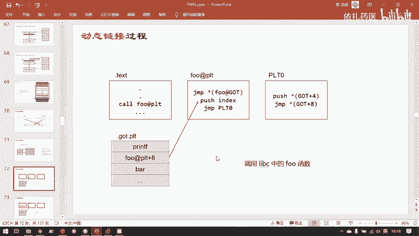

## 动态链接的挑战：地址未知


即使动态链接库已经载入内存，程序也无法在装载时就确定所需函数的准确地址。这主要有两个原因：
1.  **地址空间布局随机化（ASLR）**：这是一种安全技术，它会随机化包括动态链接库在内的一些内存段的加载地址。
2.  **系统差异**：即使关闭ASLR，不同的电脑平台、操作系统版本等环境因素也会导致动态库的加载地址不固定。

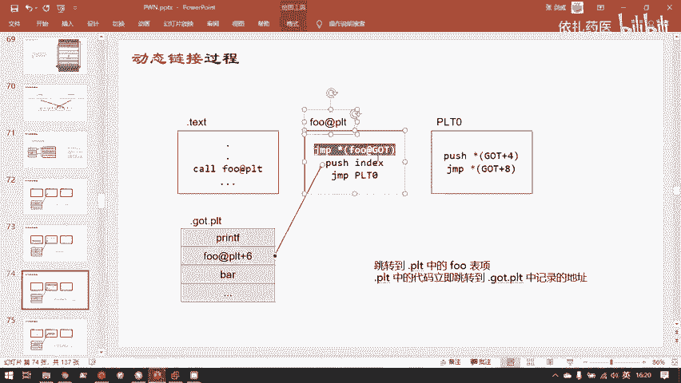


因此，程序需要一种机制，在**运行时**动态地找到所需函数的地址。

## 动态链接的核心结构

为了理解动态链接如何解决地址问题，我们首先需要认识程序内部用于支持动态链接的几个关键结构。请注意，这些结构只存在于动态链接的程序中。

以下是动态链接程序内部的一些核心节区（Section）及其作用：

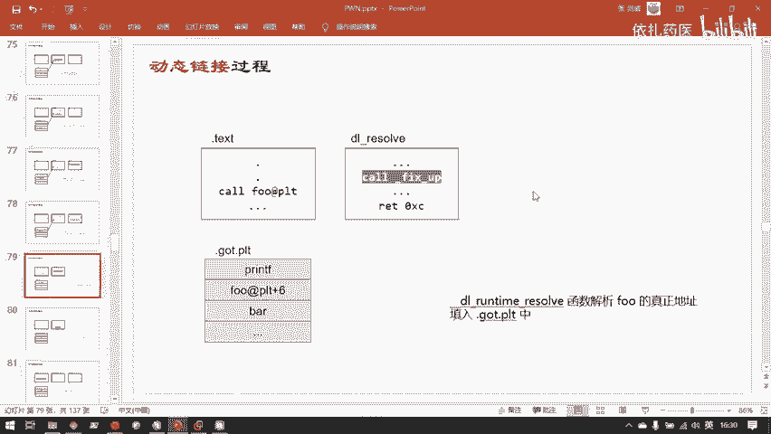


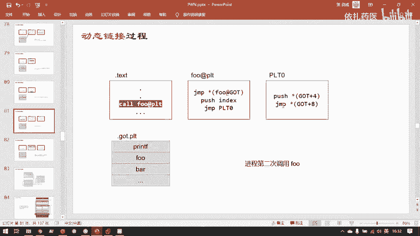

*   **`.dynamic` 节**：这是一个重要的节，它包含了动态链接器所需的所有信息，例如其他表（如符号表、重定位表）的位置以及如何组织它们。它相当于动态链接的“目录”。
*   **`link_map` 结构**：这个结构保存了已加载的动态链接库的链表。一个程序通常会加载多个动态库（如基本的 `libc.so`、图形库等），`link_map` 记录了它们的信息。
*   **`_dl_runtime_resolve` 函数**：这是一个在动态链接器中实现的函数。它的核心作用是**解析**程序第一次调用的动态库函数的真实内存地址。解析完成后，它会将地址写入 `.got.plt` 节中。它是连接 `.plt` 和 `.got.plt` 的桥梁。
*   **`.got` 与 `.got.plt` 节**：
    *   `.got`（全局偏移表，Global Offset Table）：保存全局变量的地址。
    *   `.got.plt`：这是 `.got` 中专门用于保存**函数地址**的部分。它是实现动态链接的关键数据结构。
*   **`.plt` 节**（过程链接表，Procedure Linkage Table）：这是代码段中的一部分，包含了一小段一小段的**桩代码**（stub code）。每个被程序调用的动态库函数，在 `.plt` 节中都有一个对应的条目。

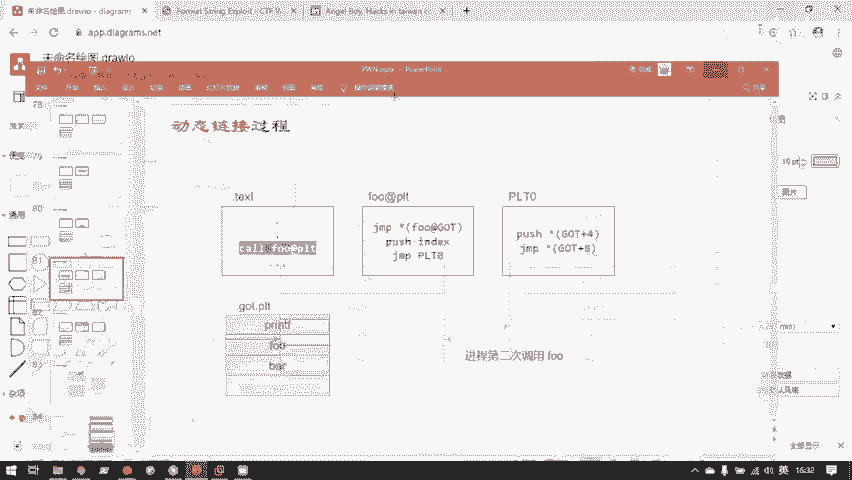

## 动态链接的详细流程（以调用 `foo` 函数为例）

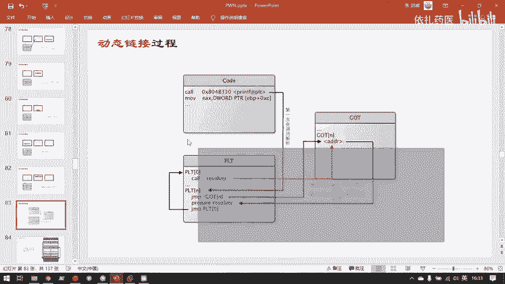

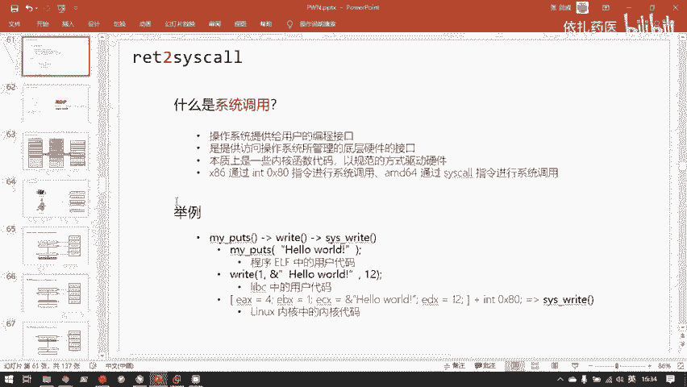

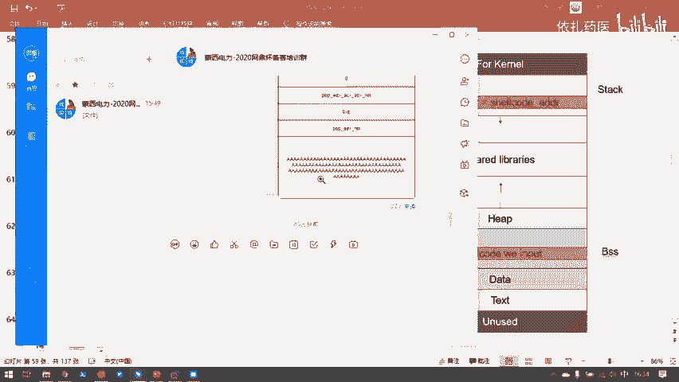

现在，我们结合 `.plt` 和 `.got.plt`，来看一个动态库函数（假设为 `foo`）被调用时的完整流程。为了便于理解，我们假设 `libc.so` 中有一个名为 `foo` 的函数。

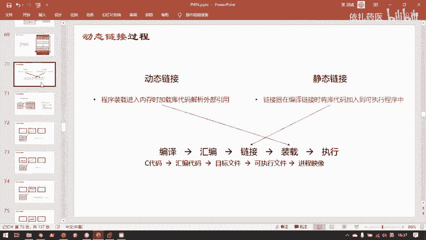

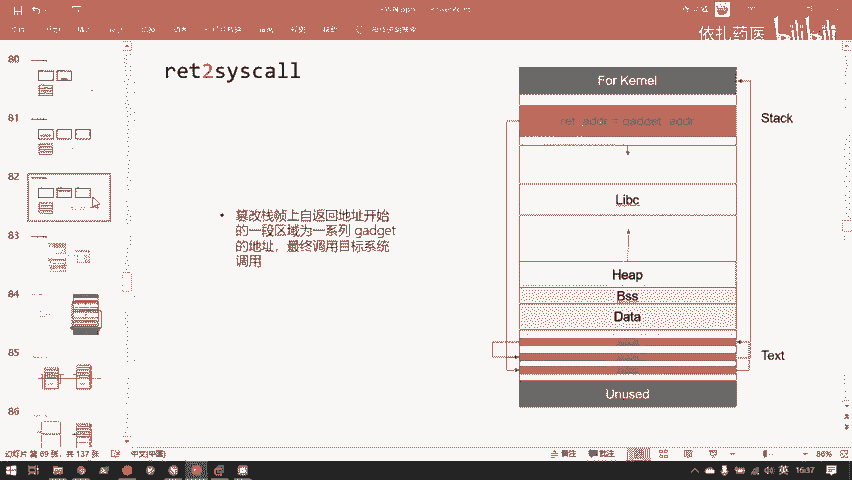

### 首次调用 `foo` 函数

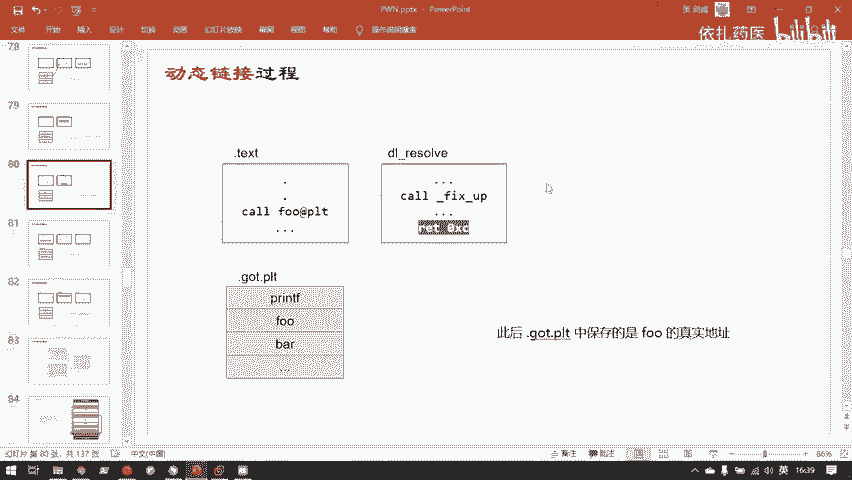

当程序代码中执行 `call foo` 时，因为不知道 `foo` 的真实地址，这条指令实际上会跳转到 `foo` 函数在 `.plt` 节中的对应条目（`foo@plt`）。

以下是首次调用发生的步骤：

1.  **跳转到 PLT**：`call foo` 指令使程序跳转到 `foo@plt`。
2.  **PLT 第一条指令**：`foo@plt` 的第一条指令是 `jmp [foo@got.plt]`。意思是：“直接跳转到 GOT 表中记录的 `foo` 的地址去执行”。
3.  **GOT 表的初始状态**：由于是第一次调用，`foo@got.plt` 这个位置还没有被填入 `foo` 的真实地址。此时，它里面存储的值指向 `foo@plt` 中的**第二条指令**。
4.  **跳回 PLT**：因此，上一步的 `jmp` 指令实际上又跳回了 `foo@plt` 中。
5.  **准备解析参数**：`foo@plt` 接下来的指令会压栈两个参数：
    *   `push index`：压入一个索引值（例如，如果 `foo` 是程序调用的第3个动态库函数，这个 `index` 就是 3）。这个索引告诉解析函数要解析的是哪个函数。
    *   `push [GOT+4]`：压入一个标识，告诉解析函数去哪个动态链接库中寻找目标函数（因为程序可能链接了多个库）。
6.  **调用解析函数**：最后，`foo@plt` 执行 `jmp [GOT+8]`。这个位置存储着 `_dl_runtime_resolve` 函数的地址。程序跳转过去，开始执行这个解析函数。
7.  **解析并填充 GOT**：`_dl_runtime_resolve` 函数根据传入的参数，在内存中找到 `foo` 函数的真实地址，然后将这个地址写回 `foo@got.plt` 这个位置。
8.  **跳转到真实函数**：解析完成后，程序最终跳转到 `libc.so` 代码段中的 `foo` 函数并开始执行。


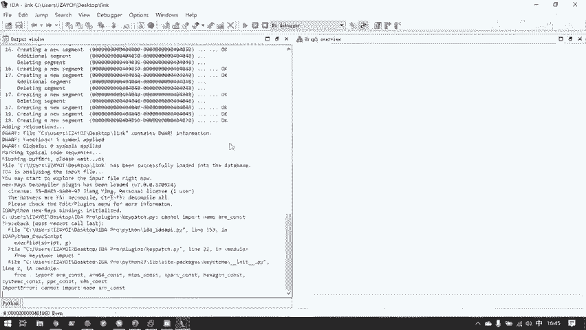

### 第二次及后续调用 `foo` 函数

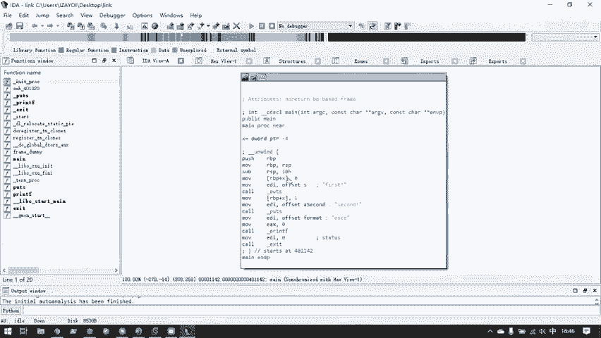

第一次调用完成后，`foo@got.plt` 中已经存储了正确的函数地址。因此，第二次调用 `foo` 时，流程大大简化：

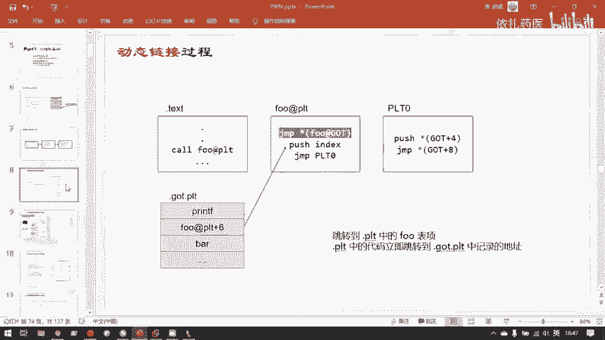

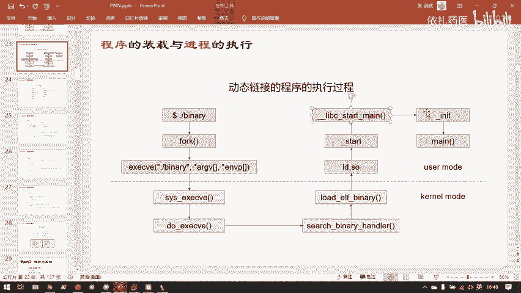

1.  **跳转到 PLT**：`call foo` 跳转到 `foo@plt`。
2.  **PLT 第一条指令**：`foo@plt` 的第一条指令 `jmp [foo@got.plt]` 现在会直接跳转到 `foo@got.plt` 中存储的地址。
3.  **直达目标**：由于 `foo@got.plt` 中已经是 `foo` 的真实地址，所以程序直接跳转到 `libc.so` 中的 `foo` 函数执行。


**核心区别**：第二次调用省去了参数压栈和调用 `_dl_runtime_resolve` 进行解析的步骤，速度更快。这就是所谓的“延迟绑定”（Lazy Binding）——地址在第一次使用时才被绑定。

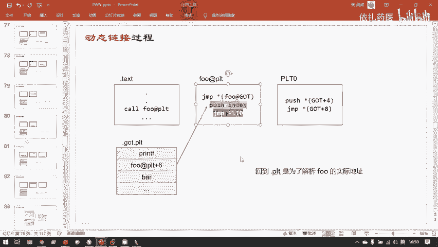

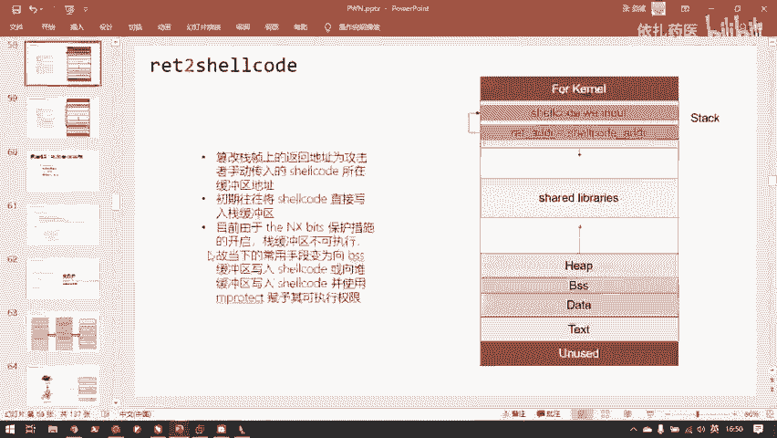

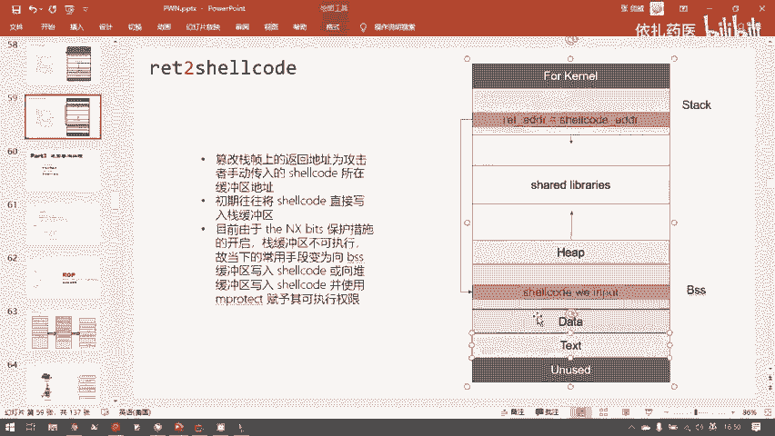

## 实践观察：使用 GDB 验证动态链接流程

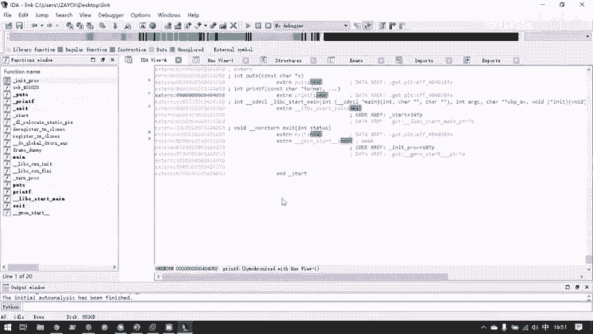

理论需要实践验证。让我们写一个简单的程序，并使用 GDB 调试器来观察 `.plt` 和 `.got.plt` 的变化。

### 示例程序
```c
#include <stdio.h>
#include <stdlib.h>

int main() {
    puts("First call"); // 第一次调用 puts
    puts("Second call"); // 第二次调用 puts
    printf("Hello %s\n", "World"); // 调用 printf
    exit(0); // 调用 exit
}
```
使用命令编译：`gcc test.c -o test -no-pie -g`

### 调试过程与观察

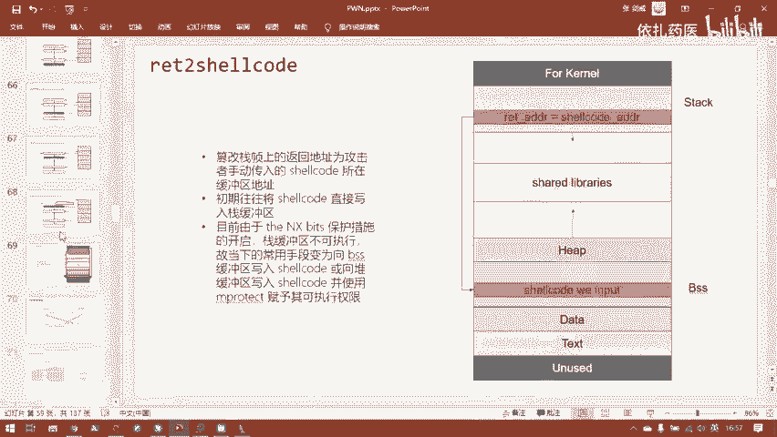

1.  **启动调试**：`gdb ./test`
2.  **查看初始状态**：在 `main` 函数入口处打断点并运行后，查看 `.got.plt`。
    *   命令：`x/20gx <地址>` （查看内存）
    *   **观察结果**：此时，`puts`、`printf`、`exit` 在 `.got.plt` 中的条目都指向其各自在 `.plt` 节中的地址（即 `push index` 指令的地址）。这对应了**首次调用前**的状态。
3.  **执行第一次 `puts`**：单步执行（`ni`）越过第一次 `puts` 调用。
4.  **查看变化**：再次查看 `.got.plt`。
    *   **观察结果**：`puts@got.plt` 中的值已经改变，指向了一个很高的地址（属于 `libc.so` 的内存区域）。而 `printf@got.plt` 和 `exit@got.plt` 的值仍指向 `.plt`。这验证了“延迟绑定”。
5.  **继续执行**：继续执行程序，调用 `printf` 和 `exit`。你会观察到，每当一个函数被第一次调用后，它在 `.got.plt` 中的条目就会被更新为真实地址。

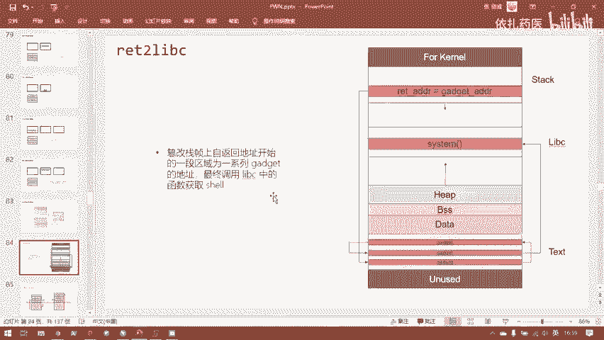

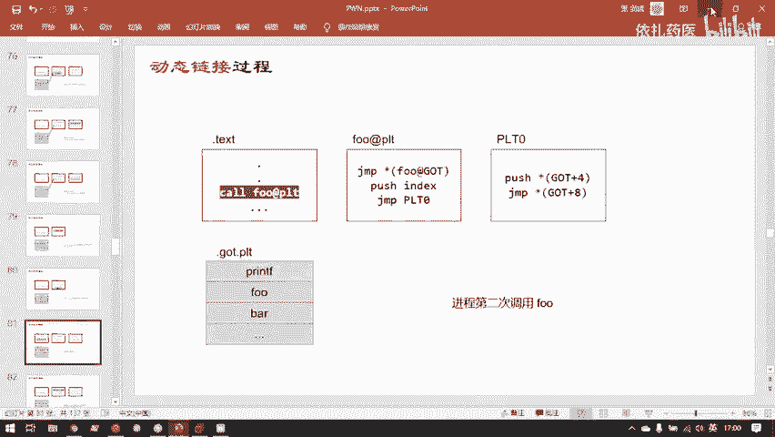

通过这个调试过程，你可以直观地看到动态链接“首次解析，后续直跳”的工作机制。

## 总结

本节课中我们一起学习了程序动态链接的完整过程。


我们首先对比了**静态链接**与**动态链接**在发生阶段和实现方式上的根本区别。然后，我们深入探讨了动态链接程序内部的关键结构，包括 **`.dynamic`**、**`.plt`**（过程链接表）和 **`.got.plt`**（全局偏移表-函数部分）。

核心内容是通过详细的流程图和步骤分解，理解了动态库函数地址解析的“延迟绑定”机制：
*   **首次调用**：经历 `代码 -> .plt -> .got.plt（未绑定）-> 回 .plt -> 压参数 -> 调用 _dl_runtime_resolve 解析 -> 写入 .got.plt -> 执行真实函数` 的复杂过程。
*   **后续调用**：简化为 `代码 -> .plt -> .got.plt（已绑定）-> 执行真实函数` 的高效路径。


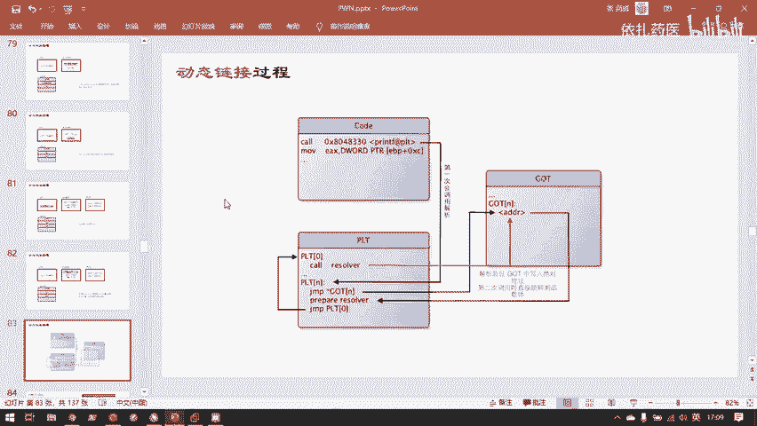

最后，我们通过 GDB 调试实战，观察了 `.got.plt` 内容从指向 `.plt` 到指向 `libc` 真实地址的变化过程，从而验证了整个理论。


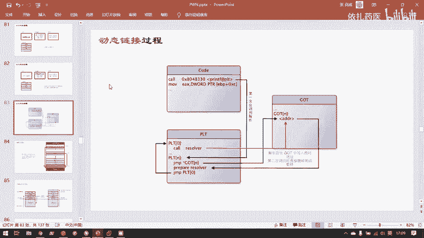

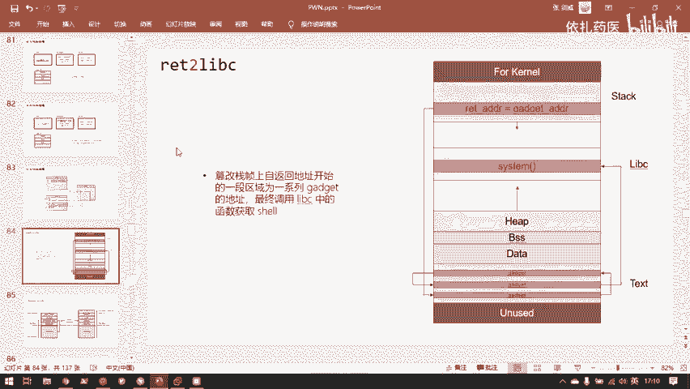

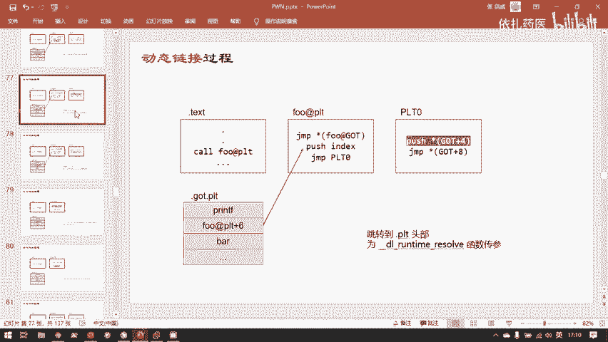

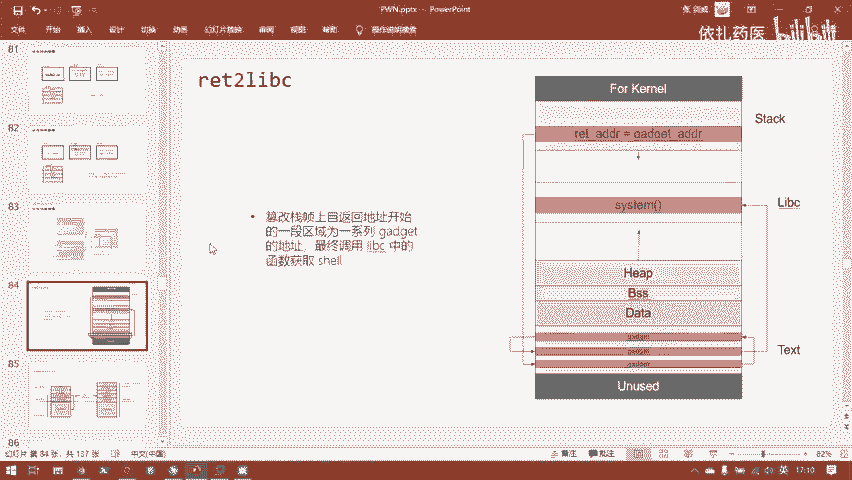

理解动态链接的机制，是学习后续高级漏洞利用技术（如 `ret2libc`）的重要基础。请务必熟练掌握本节内容。