# CTF教程：P38：ret2libc攻击详解 🧠

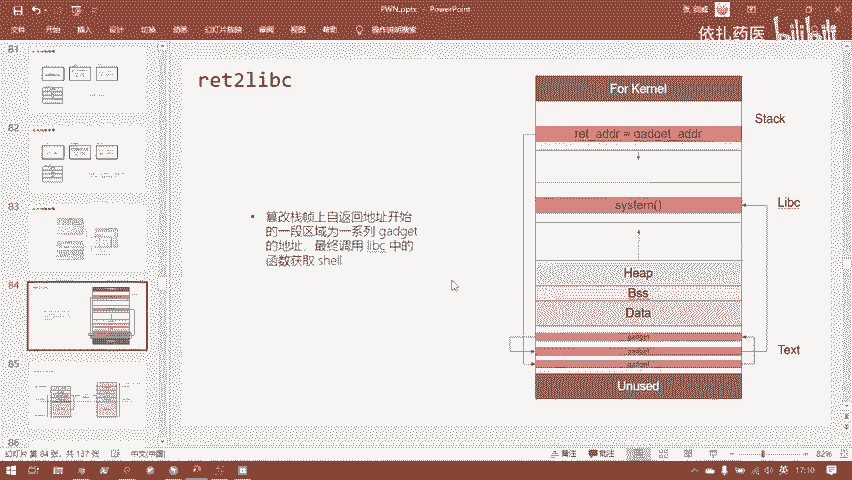

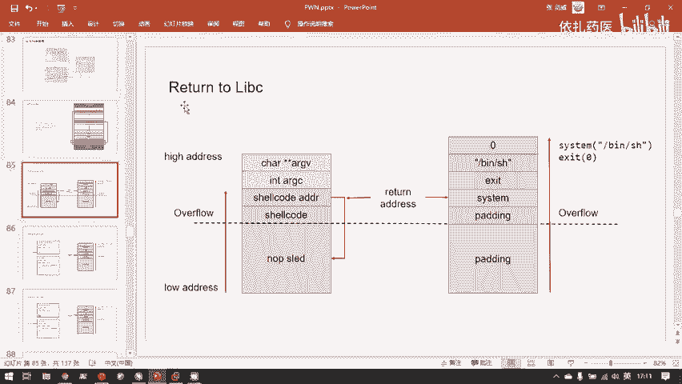

在本节课中，我们将学习一种名为“ret2libc”的攻击技术。这种技术是ROP（面向返回的编程）攻击的一种高级形式，它不直接执行shellcode，而是通过利用程序本身或其动态链接库（libc）中的现有函数（如`system`）来获取系统控制权。

---

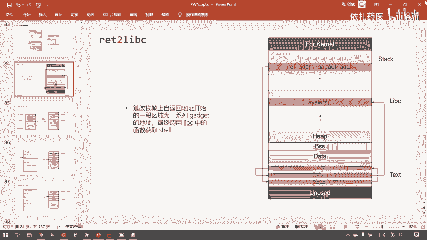

## 攻击背景与挑战

上一节我们介绍了基础的ROP攻击。本节中我们来看看当程序采用动态链接时，攻击者面临的挑战。

分析目标程序时，我们发现它与之前的题目存在一个关键区别：这是一个**动态链接**的程序。这意味着程序本身的代码段（.text）中不包含大量库函数代码，导致可用的ROP gadget数量急剧减少。使用传统的ROP方法构造完整的系统调用链变得非常困难。

此外，程序中没有可直接利用的“后门函数”。虽然存在一个名为`secure`的函数，但它内部通过随机数验证，即使成功劫持控制流，也无法直接获得shell。

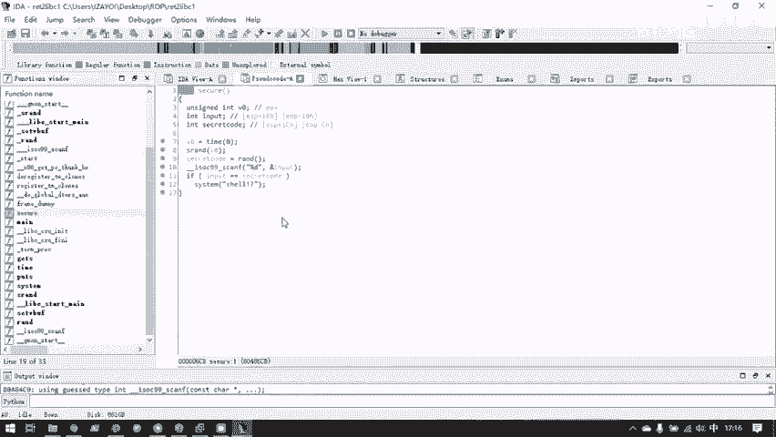

然而，`secure`函数并非毫无价值。它内部调用了`system`函数。在动态链接的程序中，一个函数只有在被调用过，其地址才会被填入程序的**过程链接表（PLT）**和**全局偏移表（GOT）**。因此，`secure`函数的存在，使得`system`函数的PLT表项（`system@plt`）出现在程序中，这为我们提供了攻击的跳板。

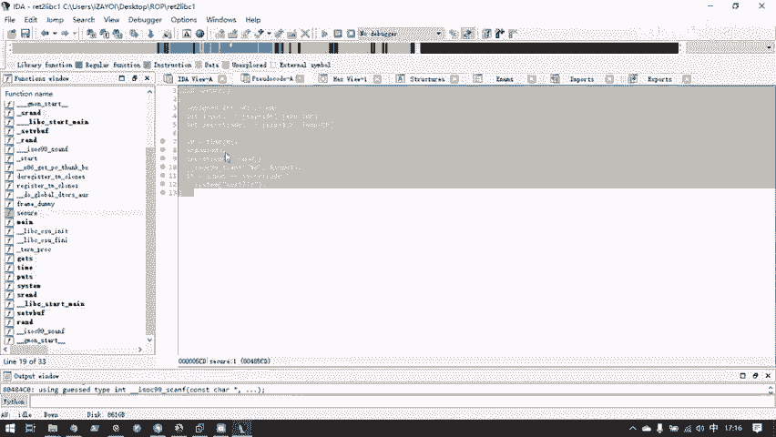

---

## ret2libc核心攻击思路 💡

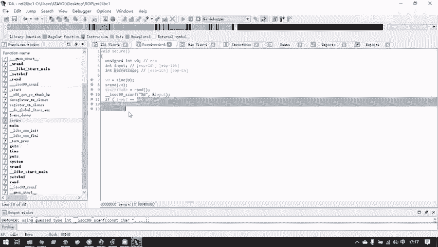

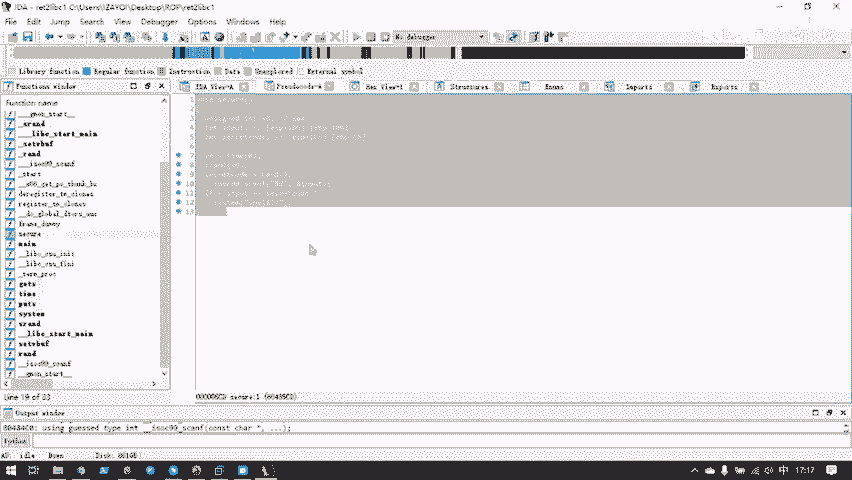

ret2libc攻击的核心在于：**将程序控制流劫持到libc库中的某个函数（如`system`），并为其传递正确的参数**。

对于32位程序，函数调用时参数通过栈传递。攻击者需要在栈上精心布局，模拟一次正常的函数调用。具体布局如下：

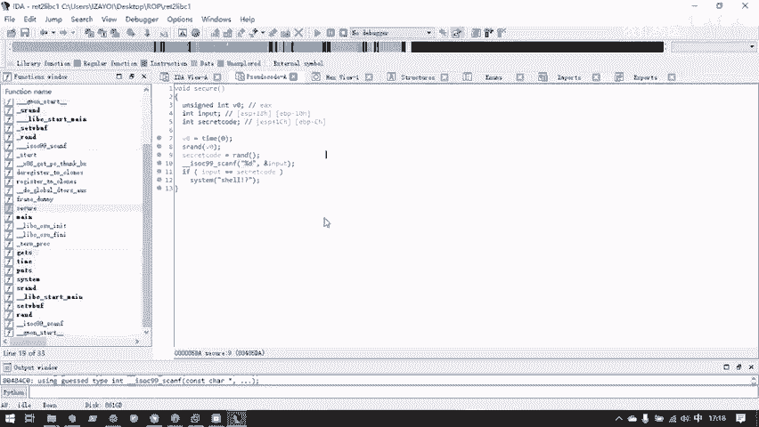

1.  **覆盖返回地址**：将函数的返回地址覆盖为目标函数（如`system`）的地址。
2.  **布置返回后地址**：在目标函数地址之后，需要放置该函数执行完毕后的返回地址。为了简化，可以将其设置为一个无害函数的地址（如`exit`）或任意值。
3.  **布置函数参数**：按照调用约定，在“返回后地址”之后，放置目标函数所需的参数。

对于执行`system("/bin/sh")`的攻击，栈布局应构造为：
```
[溢出填充] + [system@plt地址] + [返回地址（如exit@plt）] + [参数"/bin/sh"的地址]
```

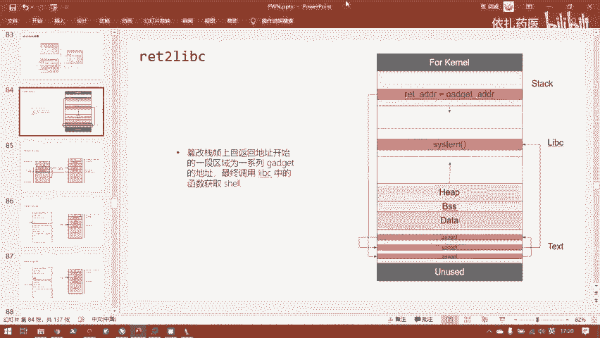

**关键点**：传递给`system`的参数是字符串`"/bin/sh"`在内存中的**地址**，而非字符串内容本身。这个字符串通常可以在程序的只读数据段（.rodata）或libc库本身中找到。

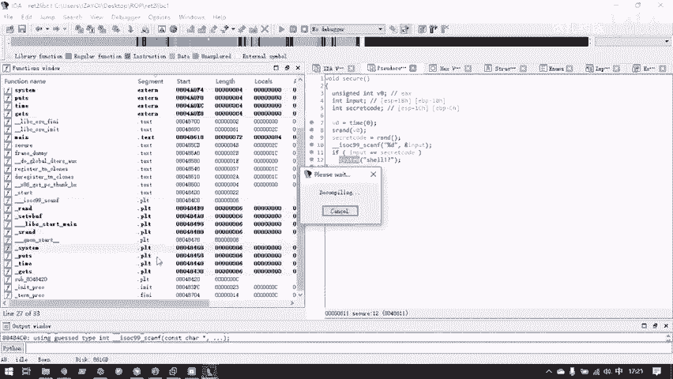

---

## 实战题目初步分析 🔍

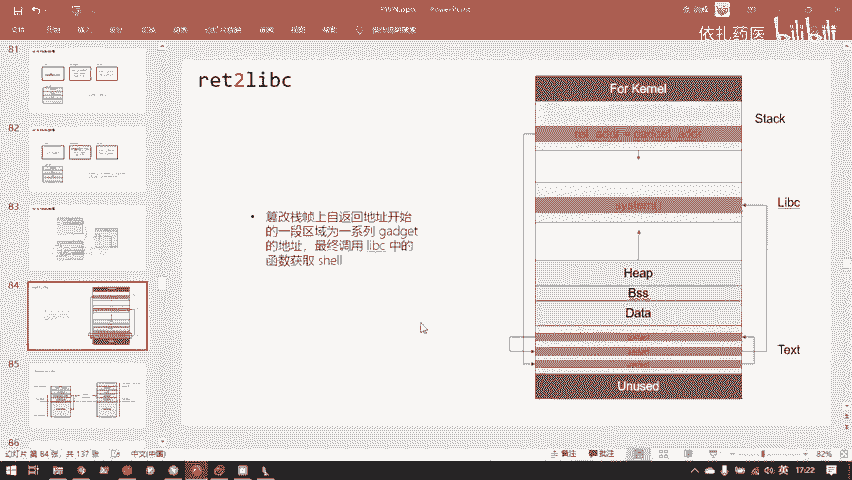

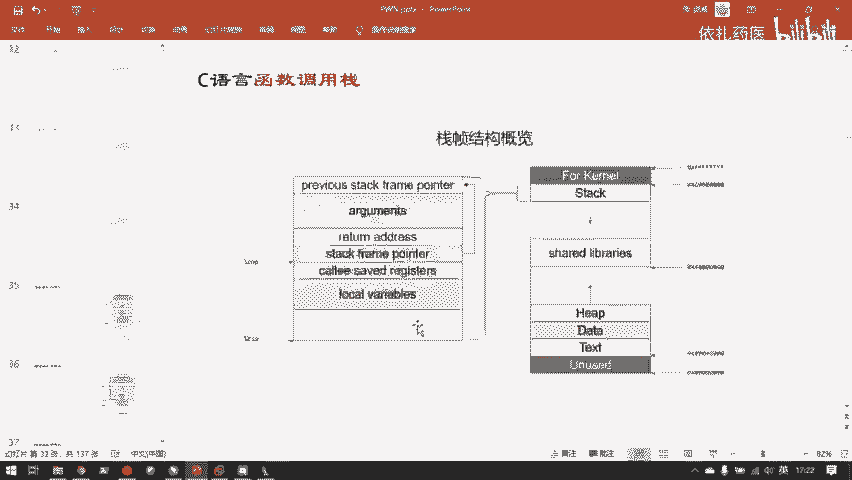

以下是针对目标程序`ret2libc1`的初步分析步骤：

1.  **检查安全措施**：程序为32位，开启了NX（不可执行栈），未开启PIE（地址空间布局随机化）。这意味着我们可以可靠地使用代码段的地址。
2.  **寻找漏洞**：主函数中存在一个明显的栈溢出漏洞，使用不安全的`gets`函数向固定大小的缓冲区读入数据。
3.  **寻找可利用代码**：使用工具（如`ROPgadget`）搜索可用的gadget，发现数量极少，无法构造传统ROP链。
4.  **寻找函数与字符串**：
    *   在PLT表中找到了`system`的入口（得益于`secure`函数的调用）。
    *   在程序的只读数据段（.rodata）中找到了字符串`"/bin/sh"`的存储地址。

有了`system`函数的地址和参数`"/bin/sh"`的地址，我们就可以构造出上述的payload结构，完成攻击。

---

## 总结与预告 📚

本节课我们一起学习了ret2libc攻击的基本原理。当程序动态链接、gadget不足时，我们可以转而利用libc中的强大函数（如`system`）。攻击的关键在于理解函数调用约定，并在栈上正确布局函数地址、返回地址和参数地址。

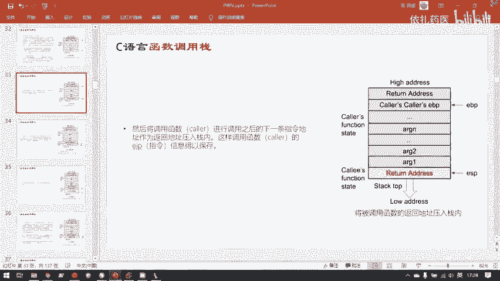

下一节中，我们将深入这道`ret2libc1`题目，一步步演示如何计算偏移、查找地址，并编写出最终的利用代码，在实践中巩固这一重要技术。