# CTF教程：P39：CTF简单介绍和攻防流程 🚩

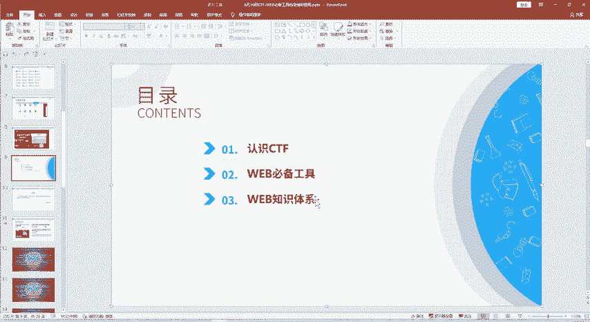

在本节课中，我们将要学习CTF竞赛的基础知识，包括其定义、起源、主要竞赛模式以及内容分类。通过本课，您将对CTF世界有一个清晰的初步认识。

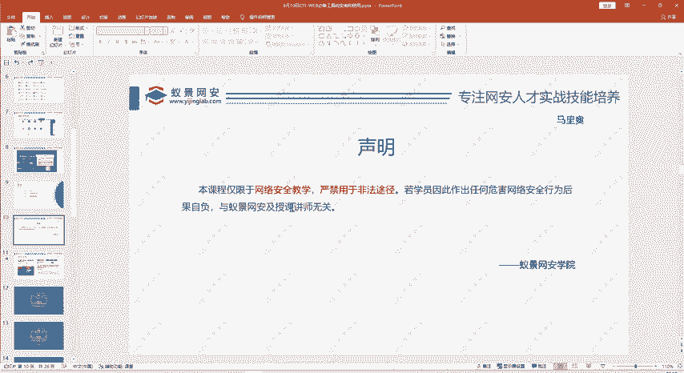

## 第一部分：CTF是什么？

CTF是“Capture The Flag”（夺旗赛）的缩写。它起源于一种游戏，每个队伍的任务是守护自己的旗帜，同时设法夺取对方的旗帜。在网络安全领域，CTF竞赛则是通过技术手段而非体力来“夺旗”。

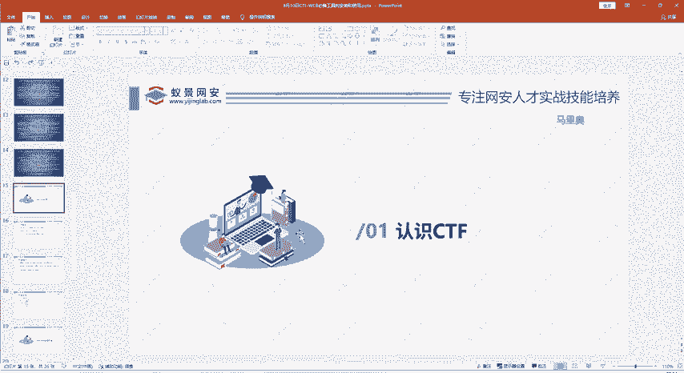

CTF竞赛起源于1996年的DEFCON全球黑客大会。当时，一群对计算机技术感兴趣的年轻人在论坛交流后，决定举办线下聚会来切磋技术。这种形式因其能有效提升和检验技术水平而保留下来，并发展成为如今全球最具影响力的CTF赛事之一。

经过20多年的发展，CTF因其知识性、趣味性和严谨性而越来越受欢迎。目前国内外各类CTF赛事繁多，为学习者提供了广阔的实践舞台。

## 第二部分：CTF竞赛模式

CTF竞赛主要有三种模式，参赛形式可以是个人或团队，具体取决于赛事主办方的规定。

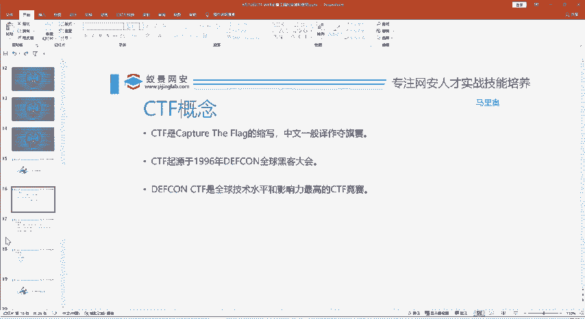

以下是三种主要的竞赛模式：

1.  **解题模式 (Jeopardy)**
    参赛者需要解决一系列独立的安全挑战题目。每道题都隐藏着一个被称为 **`flag`** 的字符串。找到并提交正确的 **`flag`** 即可得分。这种模式常见于线上比赛。

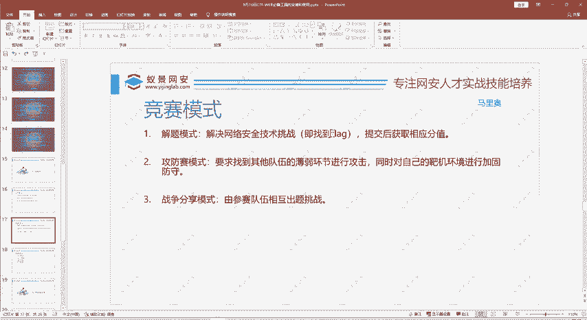

2.  **攻防模式 (Attack-Defense)**
    这是一种动态对抗模式。每个队伍维护自己的服务器（需要防守），同时攻击其他队伍的服务器。成功攻击对方服务器并获取 **`flag`** 可以得分，而成功防御住对方的攻击、保护自己的 **`flag`** 不被窃取也能得分。这种模式多见于线下比赛。

3.  **混合模式 (Mix)**
    这是一种较新颖的模式，通常结合了解题和攻防元素，有时还会引入参赛队伍相互出题的环节，综合考察解题、出题和攻防能力。

## 第三部分：CTF竞赛内容分类

CTF竞赛题目通常涵盖六大方向，参赛者可以根据兴趣和特长选择深入研究的领域。

以下是六大主要方向：

*   **Web（网络攻防）**：涉及网站和Web应用的安全漏洞，如SQL注入、跨站脚本（XSS）、文件上传/包含漏洞、反序列化等。这是我们本系列课程的重点。
*   **Reverse（逆向工程）**：分析已编译的二进制程序（如EXE文件），理解其运行逻辑、算法，甚至还原出部分源代码。
*   **Pwn（二进制漏洞利用）**：挖掘并利用二进制程序中的内存漏洞，如栈溢出、堆溢出等，以获取系统控制权。
*   **Crypto（密码学）**：涉及古典密码和现代密码的加解密、密码协议分析等。
*   **Mobile（移动安全）**：专注于Android或iOS移动平台的应用安全与逆向分析。
*   **Misc（杂项）**：包含其他未归类的题目，如隐写术、数据分析、编程挑战等。

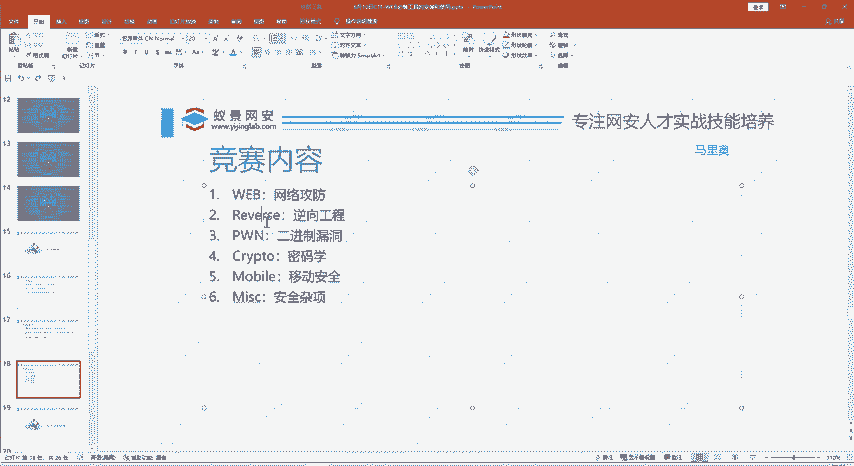

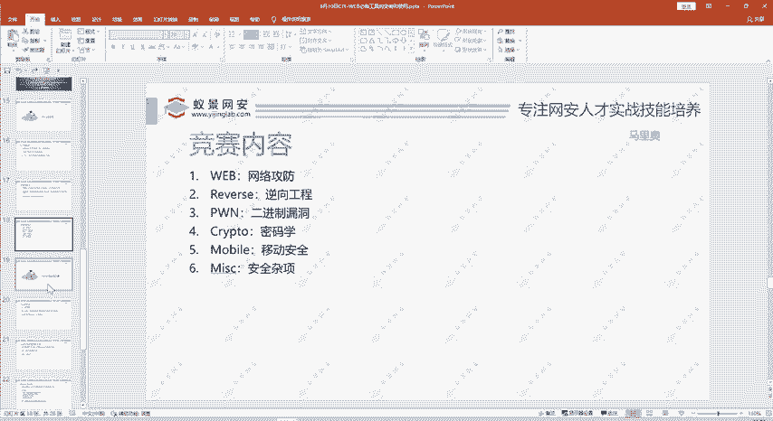

学习CTF需要广度与深度结合：对所有方向有基本了解，并选择1-2个方向进行深入钻研。在团队赛中，成员间互补的专业能力是取胜的关键。

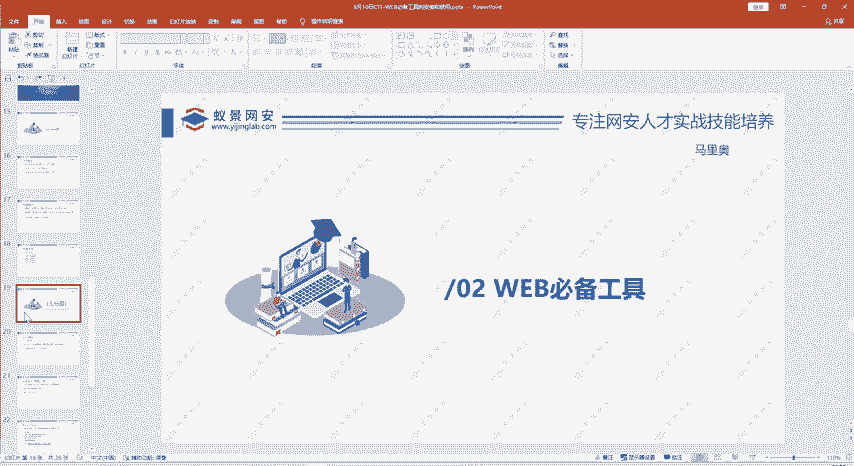

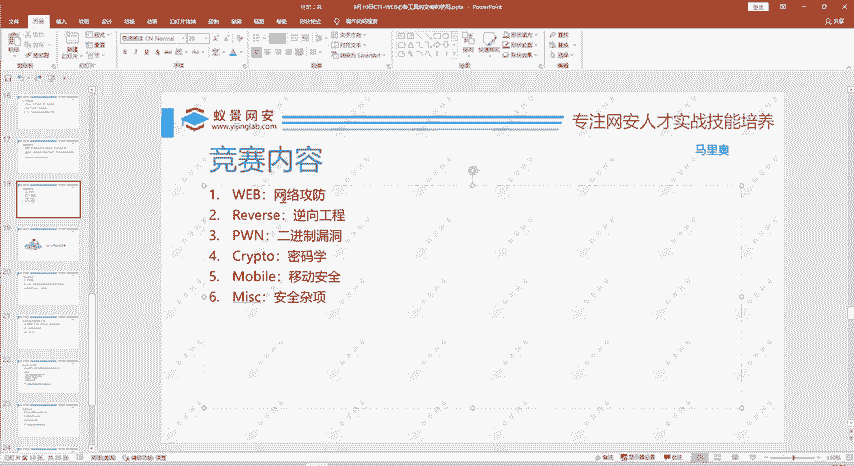

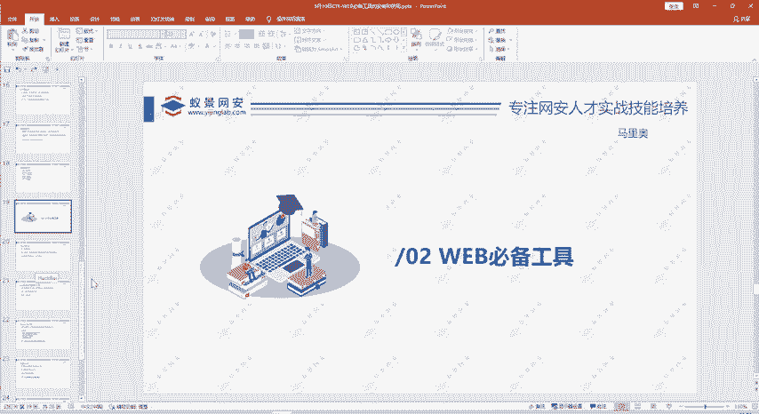

---

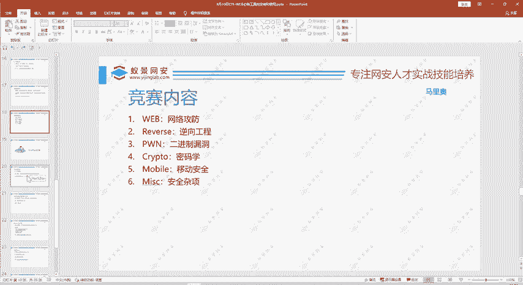

本节课中我们一起学习了CTF竞赛的基本概念、三种主流竞赛模式以及六大题目方向。理解这些基础知识是您进入CTF世界的第一步。在接下来的课程中，我们将专注于Web安全方向，开始学习必备的工具和知识体系。