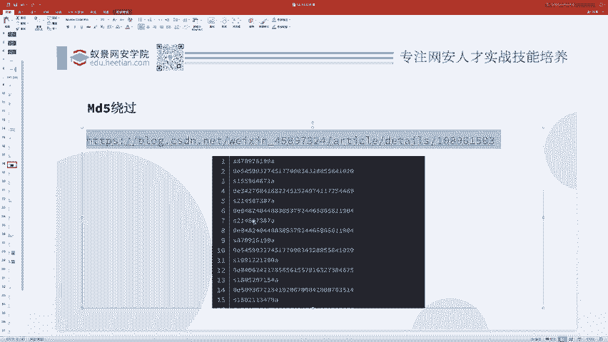
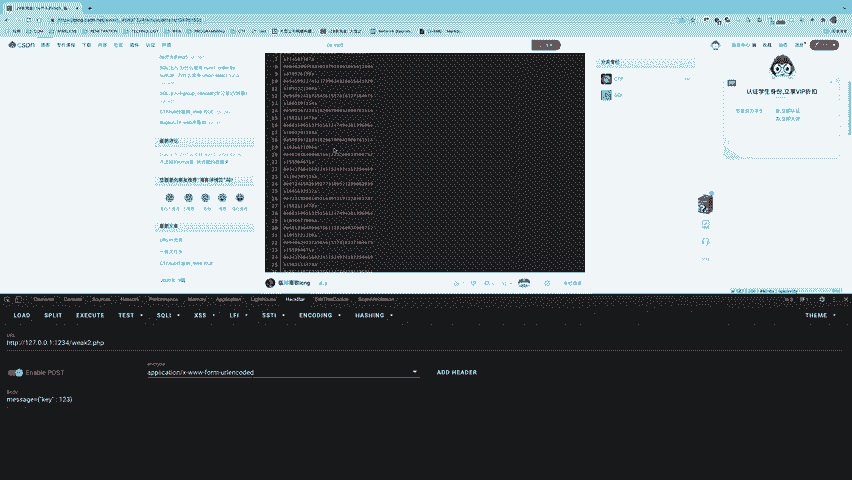
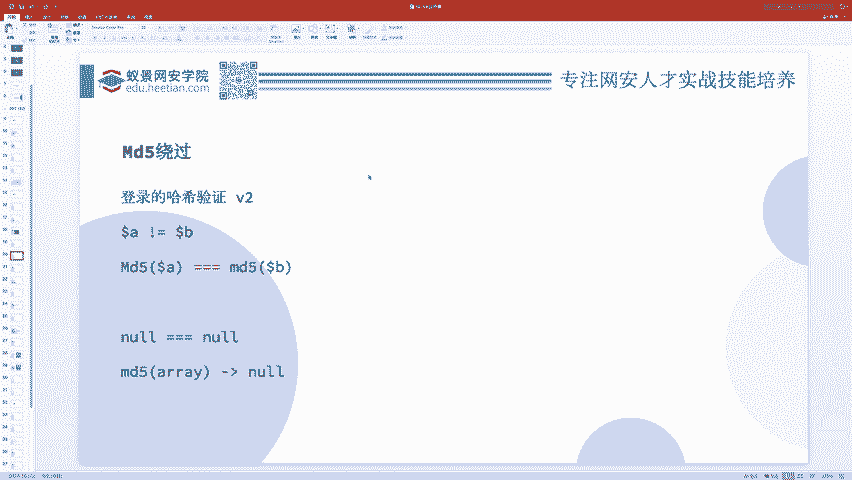
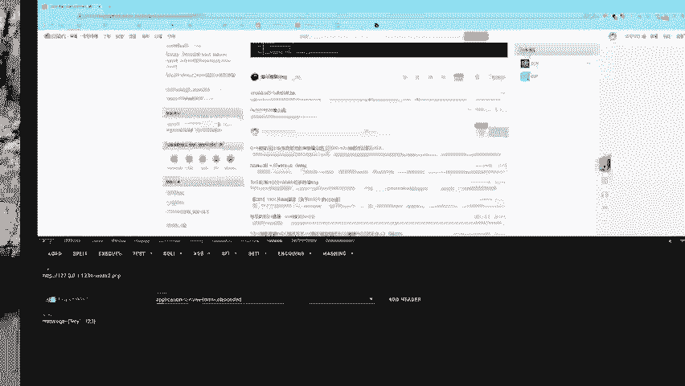
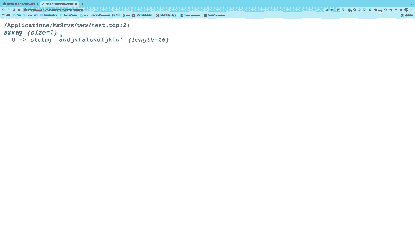
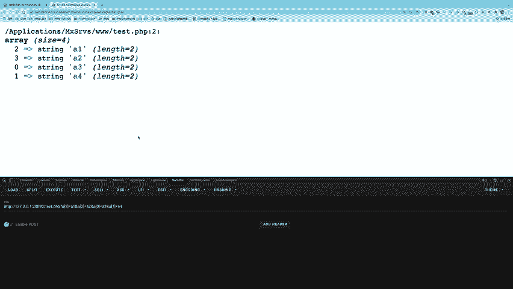
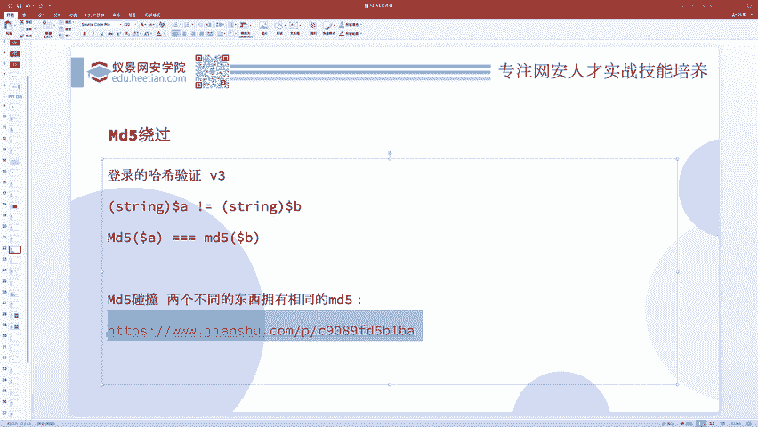
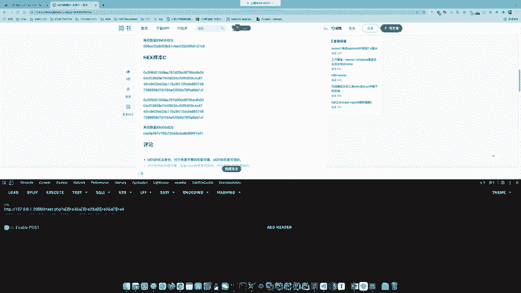
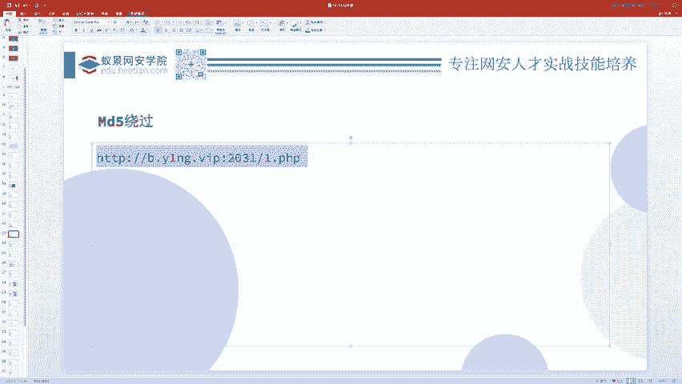
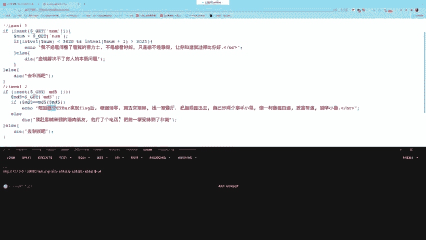

# CTF教程：P3：ctf-web02_哈希（MD5）绕过问题 🔑

在本节课中，我们将学习CTF Web题目中一个常见的考点：哈希（MD5）绕过问题。我们将从弱类型的概念出发，逐步深入，学习三种不同的绕过方法，并通过实例理解其应用场景。

## 概述

哈希绕过问题本质上是弱类型问题的一个应用与延伸。理解了弱类型，哈希绕过问题就迎刃而解。我们将以MD5为例，探讨当题目要求两个不同的输入具有相同的MD5值时，如何利用不同技巧进行绕过。

## 第一层：弱相等绕过

上一节我们介绍了弱类型的概念，本节中我们来看看它在MD5绕过中的第一个应用场景。

题目通常要求用户提交两个变量 `$a` 和 `$b`，它们不能相等，但它们的MD5值需要满足弱相等（`==`）。这意味着我们需要找到两个不同的字符串，它们的MD5值在弱比较下被视为相等。

**核心思路**：利用弱类型比较中，以 `0e` 开头的纯数字字符串会被当作科学计数法处理，并被视为零的特性。



以下是解决此问题的关键步骤：



1.  寻找两个不同的字符串，它们的MD5值都以 `0e` 开头，后面跟随纯数字。
2.  在弱比较（`==`）中，`0exxx` 会被当作 `0 * 10^xxx` 计算，结果为零。因此，两个这样的MD5值在弱比较下相等。



例如，字符串 `“240610708”` 和 `“QNKCDZO”` 就是这样的例子：
*   `md5(“240610708”)` = `0e462097431906509019562988736854`
*   `md5(“QNKCDZO”)` = `0e830400451993494058024219903391`



在PHP弱比较中，`0e462... == 0e830...` 会被判定为 `True`，因为两者都被计算为零。

## 第二层：强相等绕过（数组法）

现在，我们将问题升级。如果题目要求MD5值必须严格相等（`===`），而不仅仅是弱相等，我们该如何应对？

这时，我们可以利用PHP中 `md5()` 函数处理数组时的特性。当 `md5()` 函数的参数是一个数组时，函数会返回 `NULL`，并产生一个警告（Warning）。

**核心思路**：让 `$a` 和 `$b` 都是数组，这样 `md5($a)` 和 `md5($b)` 都返回 `NULL`。在强比较（`===`）中，两个 `NULL` 值是相等的。



以下是具体操作方法：

1.  通过URL参数传递数组。例如，将参数 `a` 设置为数组：`?a[]=1`。
2.  如果需要传递多个数组元素，可以这样写：`?a[]=1&a[]=2`。这会生成一个键为0和1的数组。
3.  也可以指定键名：`?a[x]=1&a[y]=2`。

**一个有趣的扩展案例**：有时题目会检查数组的特定下标（如 `$a[0]` 和 `$a[1]`），但实际执行命令时拼接的是数组的前两个元素。我们可以通过调整传参顺序来绕过检查。例如，传递 `?a[2]=payload&a[3]=payload&a[0]=normal&a[1]=normal`，这样被检查的是 `normal`，而被拼接执行的是 `payload`。

## 第三层：强相等绕过（哈希碰撞法）

最后，我们来看最严格的情况：题目要求 `$a` 和 `$b` 必须是字符串，并且它们的MD5值必须强相等（`===`）。此时，数组绕过法失效。

**核心思路**：寻找真正的MD5碰撞，即两个完全不同的内容（字符串、文件等）具有完全相同的MD5哈希值。MD5算法已被证明存在碰撞漏洞，我们可以利用已知的碰撞对。

以下是解决此问题的方法：



1.  使用现成的MD5碰撞实例。例如，存在两个不同的二进制文件或十六进制字符串，它们的MD5值完全相同。
2.  在题目中直接提交这两个碰撞的原值。



## 实战例题分析



让我们分析一个综合性的例题，其代码如下：



```php
$md5 = $_GET[‘md5’];
if ($md5 == md5($md5)) {
    // 通过验证
}
```

题目要求：传递一个参数 `md5`，使得它自身与它的MD5值满足弱相等。

**解题关键**：不要被变量名 `$md5` 迷惑，它只是一个普通的字符串变量。我们需要找到一个字符串，其MD5值也是一个以 `0e` 开头的纯数字字符串。

例如，字符串 `“0e215962017”` 的MD5值是 `0e291242476940776845150308577824`。在弱比较中，`“0e215962017” == “0e291242476940776845150308577824”` 成立。

## 总结

本节课中我们一起学习了CTF Web中哈希（MD5）绕过的三种主要方法：



1.  **弱相等绕过**：利用 `0e` 科学计数法在弱比较中的特性。
2.  **强相等绕过（数组法）**：利用 `md5(array)` 返回 `NULL` 的特性。
3.  **强相等绕过（碰撞法）**：利用MD5算法的碰撞漏洞，使用已知的碰撞对。

理解这些方法的核心在于掌握PHP的弱类型特性以及相关函数的处理机制。在解题时，务必仔细分析代码逻辑，避免被题目表面的描述引入歧途。