# CTF教程：P40：WEB攻防常用工具 🛠️

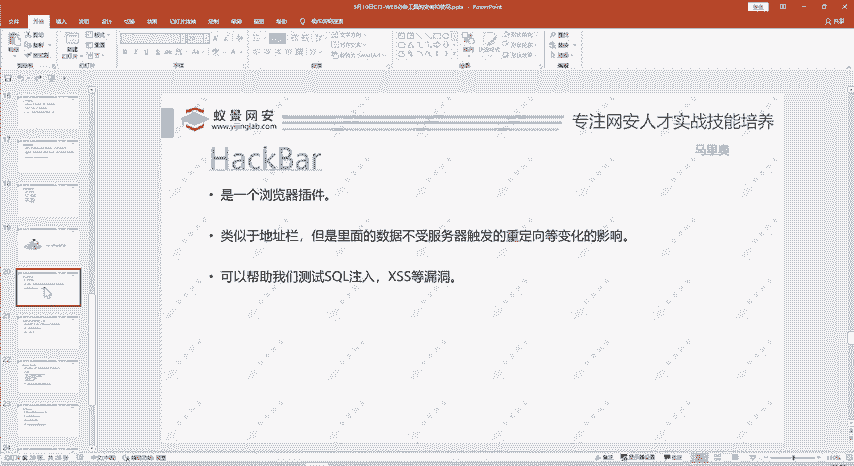

在本节课中，我们将要学习WEB安全攻防中几个核心且常用的工具。这些工具能极大提升我们进行漏洞测试、分析和利用的效率。我们将依次介绍HackBar浏览器插件、WebShell管理工具、Burp Suite以及SQLMap，并了解它们的基本功能和使用方法。

## HackBar插件：浏览器中的瑞士军刀 🔧

上一节我们概述了本课内容，本节中我们来看看第一个工具——HackBar。HackBar是一个浏览器插件。

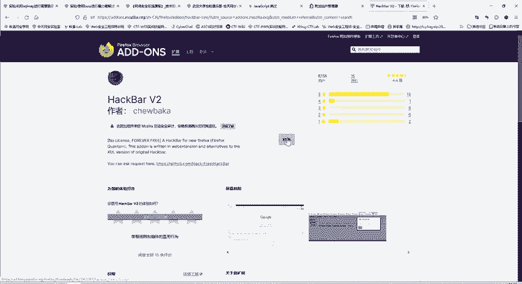

例如，我们访问一个本地搭建的靶场。在页面中点击右键选择“检查”，即可看到HackBar工具。它可以将当前URL直接导入，并在其中进行操作。

在常规的Web请求中，使用GET方法传递参数是在URL问号后添加参数名和参数值。但传递POST数据则不太方便。使用HackBar工具，可以直接点击“Post data”选项，并在其中输入要以POST方式传递的内容。

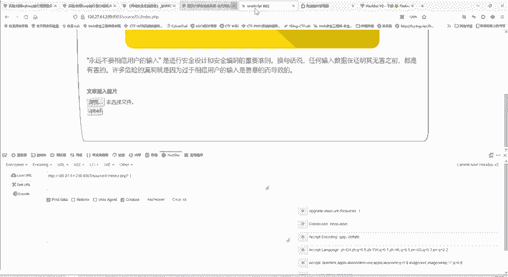

这个工具功能非常全面。以下是其主要功能模块：
*   **加解密**：可以进行MD5哈希、SHA1哈希等计算。
*   **编码解码**：支持Base64编码解码、URL编码解码等方式。
*   **Payload集合**：提供SQL注入、XSS等漏洞测试常用的语句和命令。

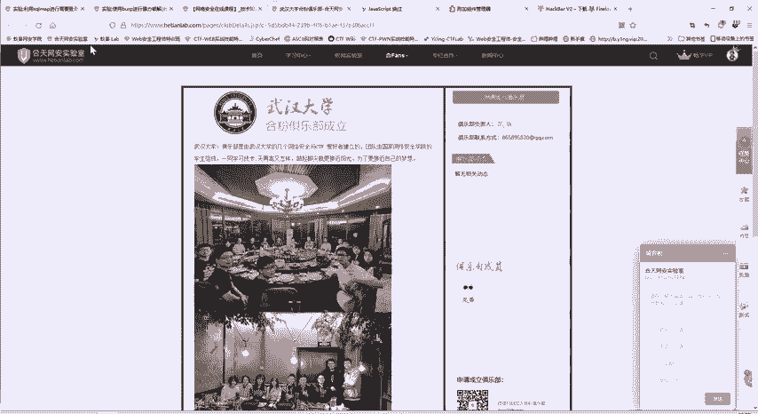

该工具功能强大且全面，使用起来也非常简单，它直接集成在浏览器开发者工具中。

那么如何安装它呢？如果右键检查后发现没有HackBar插件，则需要手动安装。安装方法是在浏览器的扩展管理页面进行搜索。

具体步骤如下：
1.  打开浏览器的扩展管理页面（例如，在Firefox中称为“扩展和主题”）。
2.  在搜索框中搜索“HackBar”。
3.  在搜索结果中选择一个版本进行安装（例如，HackBar V2是一个常用且免费的版本）。
4.  点击“添加”按钮即可完成安装。

安装完成后，在任何网页点击右键检查，都能在开发者工具中找到HackBar选项。此时，你就可以使用其全部功能，例如添加或修改Cookie等信息。

对于Chrome浏览器，方法类似，在其扩展商店搜索即可，但可能需要科学上网。如果在360等浏览器的自带商店中搜索不到，也可以通过加载已下载的插件文件（CRX格式）进行安装，具体方法可以咨询课程助教。

HackBar的一个优点是，其输入的数据不受服务器重定向变化的影响。这意味着在插件界面内修改参数并发送请求后，浏览器地址栏的URL不会立即改变，方便进行连续测试。

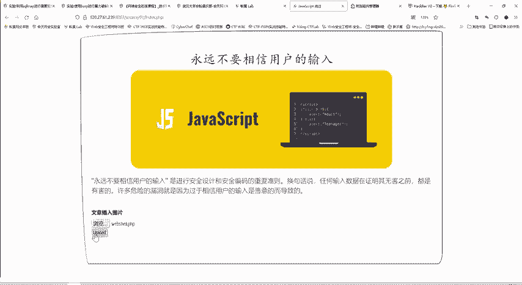

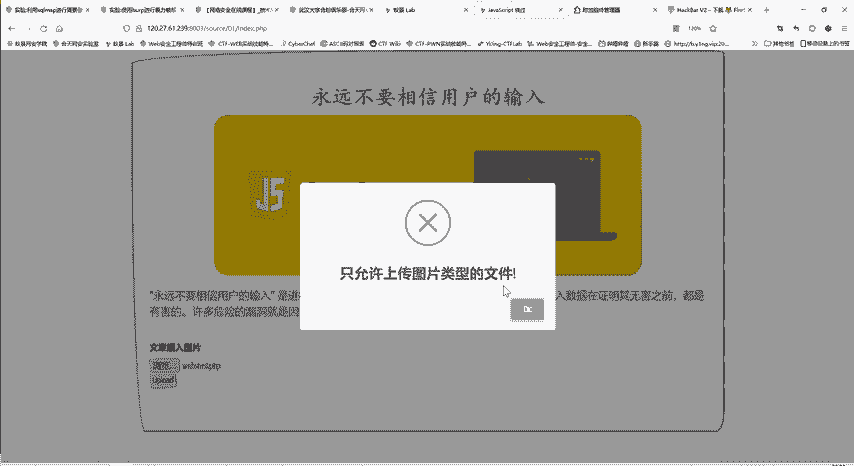

这一点在做SQL注入题目时作用非常明显。在地址栏测试`id=1`或`id=2`时，URL会频繁变化且页面会刷新。而在HackBar中输入测试Payload，发送请求后页面内容会更新，但URL保持不变，操作更加简便高效。

无论是需要用POST方法传递数据，还是需要进行快速的编码解码、加密哈希计算，或是测试SQL注入、XSS漏洞，HackBar都是一个极其便捷的集成化工具。

## WebShell管理工具：连接一句话木马 🐚

上一节我们介绍了HackBar，本节中我们来看看WebShell管理工具。大家可能都听说过“一句话木马”。将木马上传到服务器后，如何连接并进行管理呢？这就需要用到WebShell管理工具。

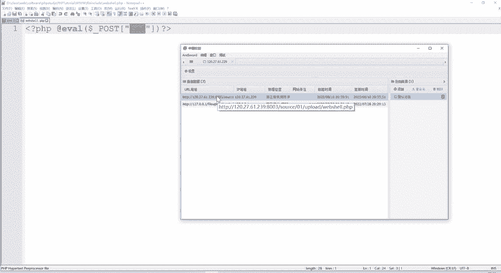

一句话木马是一段非常简短的恶意代码。例如，在PHP中，一个典型的一句话木马代码如下：
```php
<?php @eval($_POST[‘pass’]); ?>
```
这段代码上传到服务器后，攻击者就可以通过它来控制服务器。连接和控制这个木马，主要依靠WebShell管理工具。

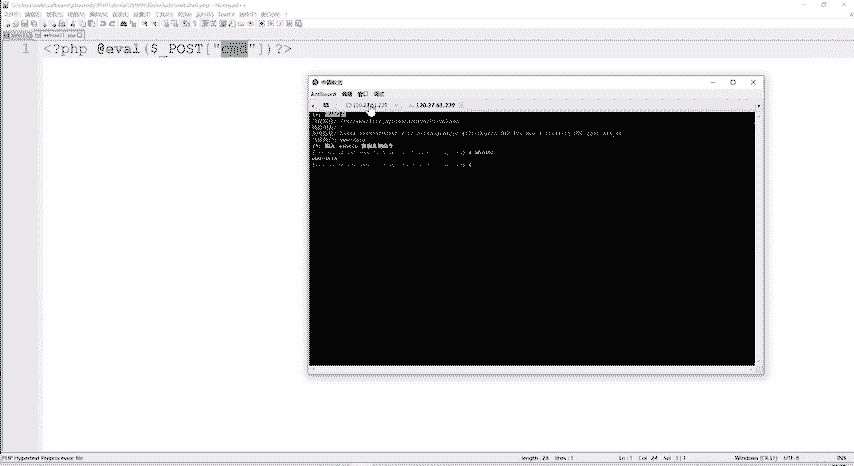

目前主流的工具有三种：蚁剑、冰蝎和哥斯拉。早期的中国菜刀已逐渐淘汰，且许多下载版本带有后门，因此不做推荐。掌握多种工具是为了应对不同环境，例如在某些不允许连接互联网的内部比赛中，某种工具可能被封锁，就需要使用备选方案。

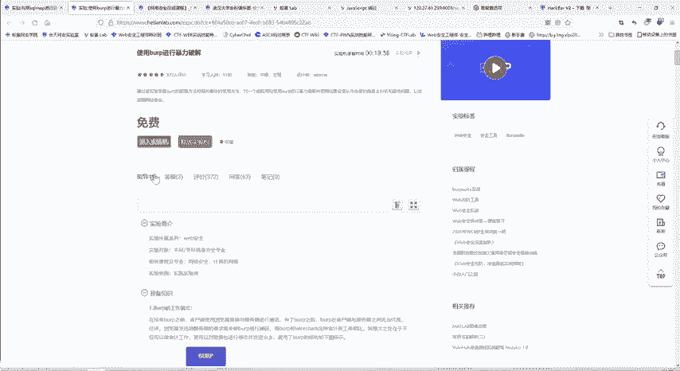

下面以蚁剑为例，简要介绍其使用方法。蚁剑的安装包分为两部分：`loader`（加载器）和源代码。

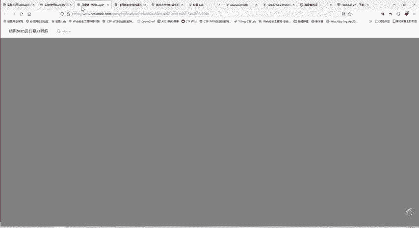

以下是安装步骤：
1.  将两个文件解压缩。
2.  进入`loader`文件夹，运行其中的可执行文件（如`AntSword.exe`）。
3.  首次运行会进行初始化，需要设置工作目录，将其指向解压后的源代码目录即可。

这些工具的安装包和资料都可以向课程助教领取。


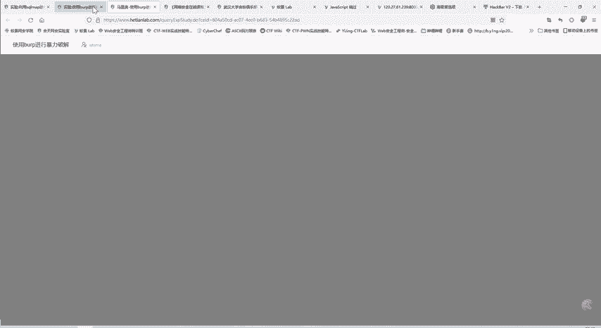

那么如何使用呢？我们以一个文件上传漏洞靶场为例。假设我们已经绕过限制，成功上传了一个包含一句话木马的文件`webshell.php`。

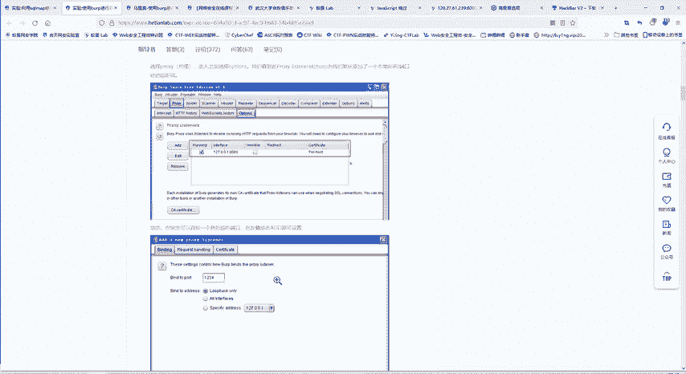

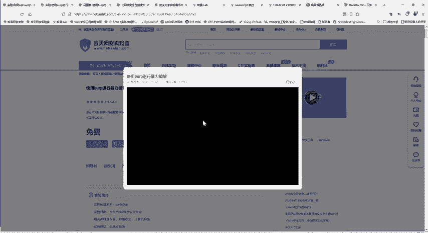

此时，在蚁剑中连接该木马的步骤如下：
1.  在蚁剑空白处右键，选择“添加数据”。
2.  将上传文件的URL地址粘贴过来。
3.  设置“连接密码”，这个密码必须与一句话木马代码中`$_POST[‘pass’]`的`pass`参数名保持一致。
4.  点击“测试连接”，显示成功后即可添加。

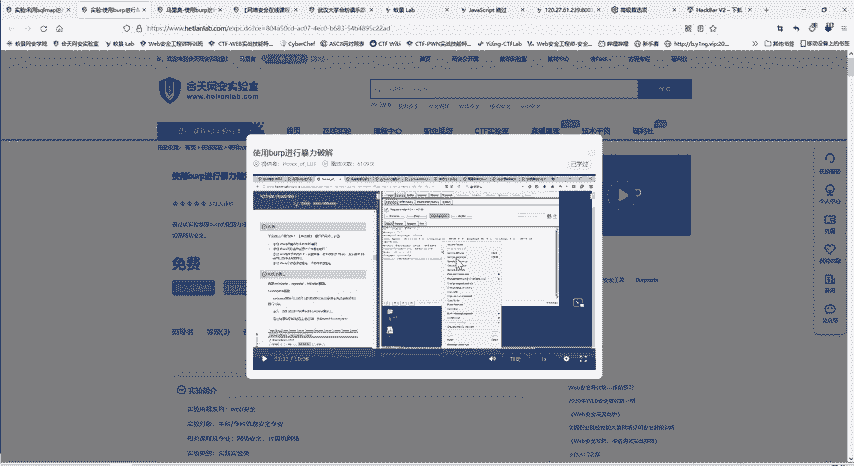

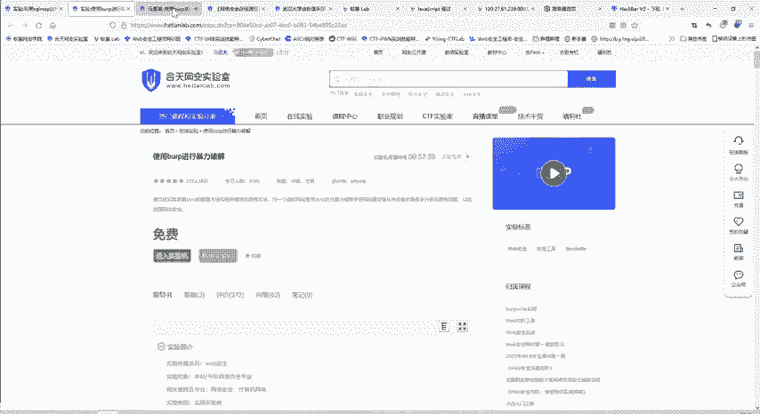

双击添加成功的这条数据，我们就进入了服务器的文件管理系统。可以浏览目录、查看文件内容。例如，找到并打开`flag.php`文件，就能获取CTF比赛的Flag。

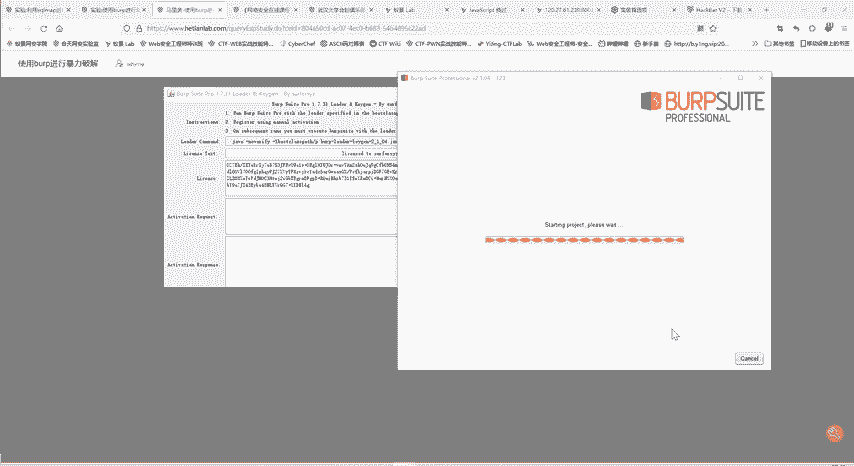

它的功能远不止文件管理。右键点击，可以打开“虚拟终端”，像在本地一样执行系统命令。因此，短短的一句话木马，配合强大的管理工具，就能实现对服务器的全面控制。

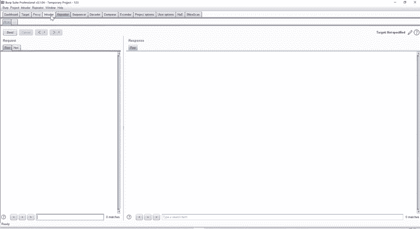

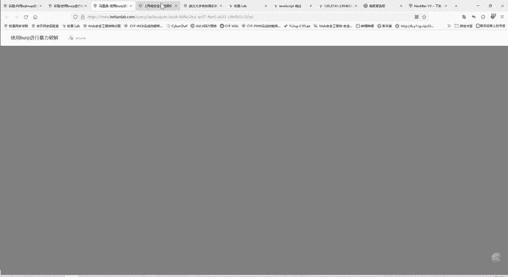

蚁剑、冰蝎和哥斯拉的使用方法类似，由于课程时间有限，不逐一展开。这些工具是渗透测试后期获取服务器权限的关键。

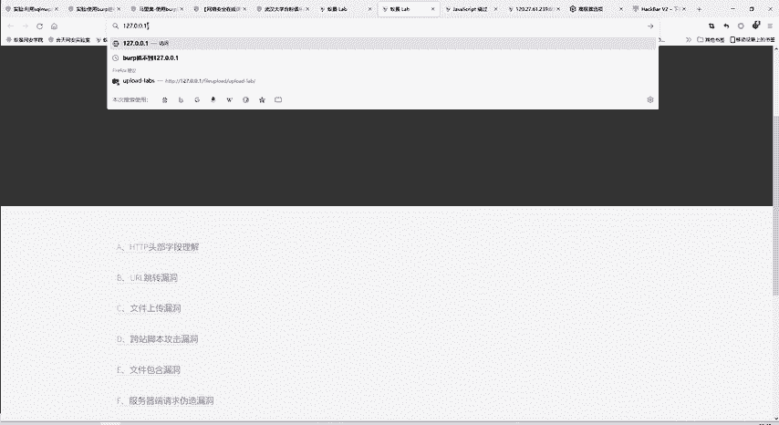

## Burp Suite：Web安全测试的标杆 🎯

上一节我们了解了WebShell管理工具，本节中我们来看看Web安全领域最常用、必不可少的工具——Burp Suite。Burp Suite是一个用Java编写的、用于测试Web应用程序安全性的图形化工具。

它的主要功能包括：
*   **拦截、查看和修改**HTTP/HTTPS请求与响应。
*   **自动化扫描**Web应用程序的安全漏洞。
*   **自动化攻击**特定漏洞点。
*   **编码解码**和散列计算。

Burp Suite的工作原理是作为浏览器和服务器之间的代理。原本浏览器直接与服务器通信，现在所有流量都经过Burp Suite转发。在这个过程中，Burp Suite就能进行拦截、修改和分析。

下面我们通过一个暴力破解的简单例子来演示其基本使用。我们以DVWA靶场的登录页面为例。

操作流程如下：
1.  在浏览器中配置代理，指向Burp Suite（默认为127.0.0.1:8080）。
2.  在Burp Suite中开启代理拦截功能。
3.  在浏览器中输入用户名`admin`和任意错误密码进行登录尝试。
4.  这个登录请求会被Burp Suite拦截。
5.  在Burp Suite的拦截界面，右键点击该请求，选择“Send to Intruder”（发送到入侵者模块）。
6.  在Intruder模块的“Positions”标签页，清除所有自动标记，然后只选中密码（`password`）的值，点击“Add”将其设为攻击载荷位置。
7.  切换到“Payloads”标签页，载入一个密码字典文件，或者手动添加常见的密码（如`password`, `123456`等）。
8.  点击“Start attack”开始攻击。Burp Suite会自动使用字典中的密码替换原请求中的密码，并发送大量请求。
9.  在攻击结果中，通过观察响应长度或状态码的不同，找出正确的密码（通常响应长度会与其他请求显著不同）。

Burp Suite的功能非常强大，除了Intruder（用于暴力破解、模糊测试），还有Repeater（用于手动重放和修改请求）、Scanner（自动漏洞扫描）等核心模块，我们将在后续的实战题目中进一步讲解。

## SQLMap：自动化SQL注入神器 🗃️

上一节我们介绍了Burp Suite，本节我们来看最后一款专注于SQL注入的神器——SQLMap。SQL注入是通过拼接SQL命令，执行恶意查询的攻击方式。手工构造复杂的注入语句容易出错，而SQLMap可以自动化这个过程。

SQLMap是一款用Python编写的自动化SQL注入工具。它可以帮助我们：
*   检测目标是否存在SQL注入漏洞。
*   识别后端数据库的类型。
*   获取数据库名称、表名、列名以及表中的数据。

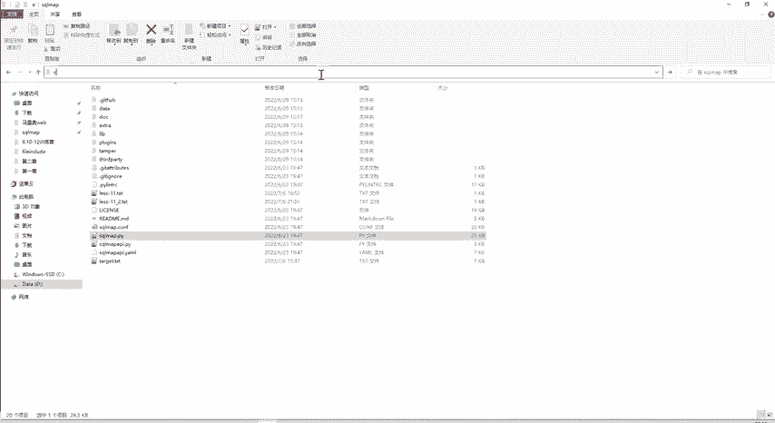

如何使用SQLMap呢？它主要通过命令行操作。首次使用一个工具时，一个通用方法是查看其帮助信息。

基本的使用命令格式如下：
```
python sqlmap.py -u “<目标URL>” [选项]
```

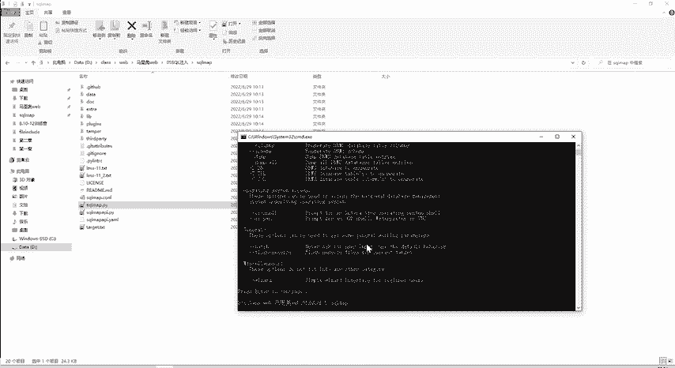

例如，要检测一个URL是否存在注入漏洞，并获取当前数据库名，可以使用：
```
python sqlmap.py -u “http://target.com/page.php?id=1” --current-db
```

如果目标页面需要登录，则需要使用Cookie。可以先使用Burp Suite抓取登录后的请求，复制Cookie值，然后通过`--cookie`参数传递给SQLMap：
```
python sqlmap.py -u “http://target.com/page.php?id=1” --cookie=“PHPSESSID=abc123…” --current-db
```

此外，还有一些常用参数：
*   `--dbs`：枚举所有数据库。
*   `-D <数据库名> --tables`：枚举指定数据库中的所有表。
*   `-D <数据库名> -T <表名> --columns`：枚举指定表中的所有列。
*   `-D <数据库名> -T <表名> -C <列名1,列名2> --dump`：导出指定列的数据。

只要目标存在SQL注入漏洞，利用SQLMap就能高效地获取大量数据库信息。核天网安实验室也提供了详细的SQLMap实验教程，大家可以按照实验步骤进行实操练习。

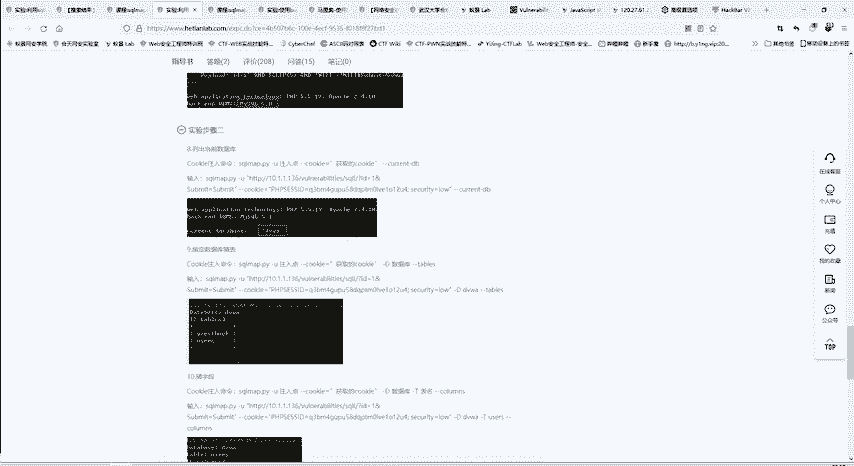

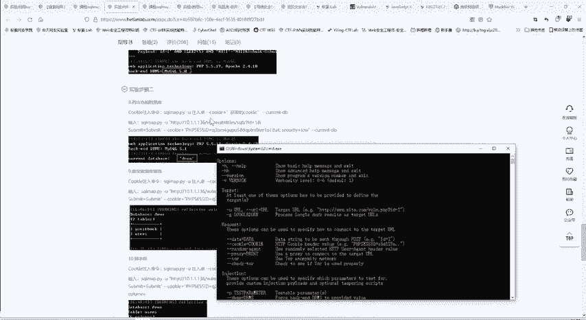

---

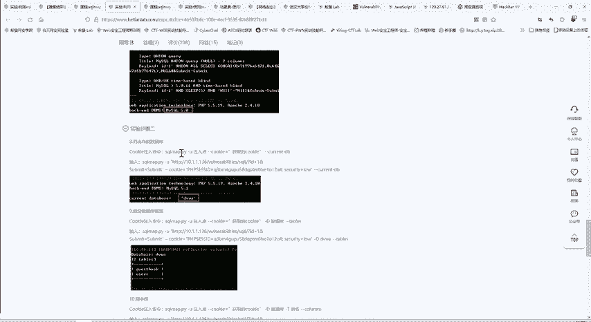

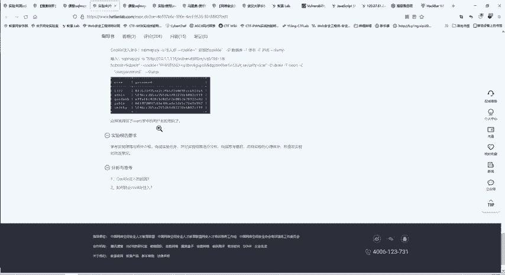

本节课中我们一起学习了四款WEB攻防核心工具：**HackBar**作为浏览器插件，方便进行请求修改和编码解码；**蚁剑/冰蝎/哥斯拉**用于连接和管理WebShell；**Burp Suite**作为代理，是拦截、扫描和攻击Web应用的综合性平台；**SQLMap**则专门用于自动化探测和利用SQL注入漏洞。熟练掌握这些工具，是成为一名合格WEB安全研究人员的基础。请大家务必动手实践，并在遇到问题时及时向助教反馈。