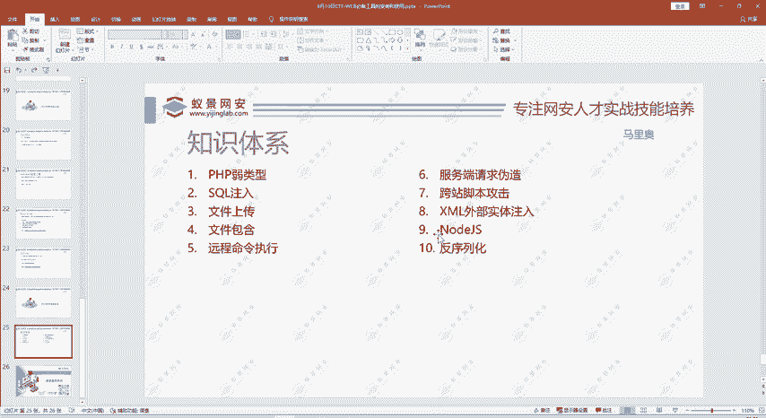
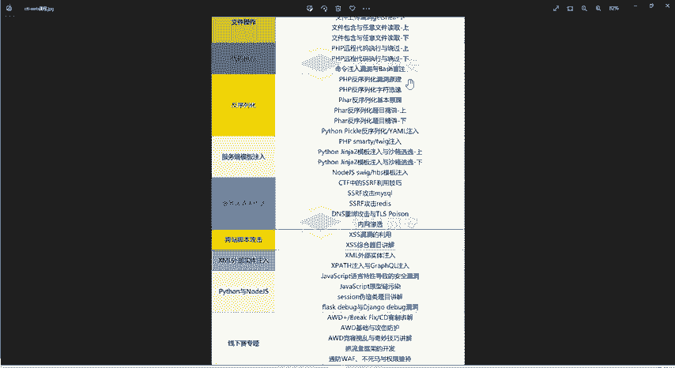
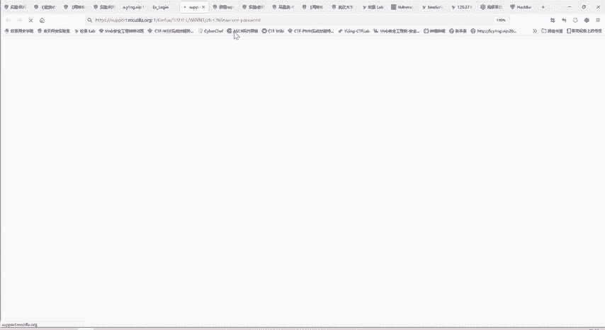
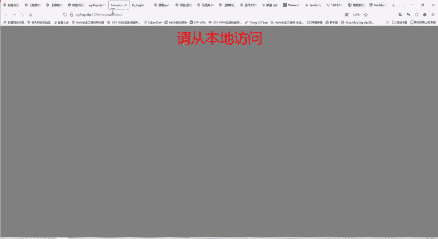
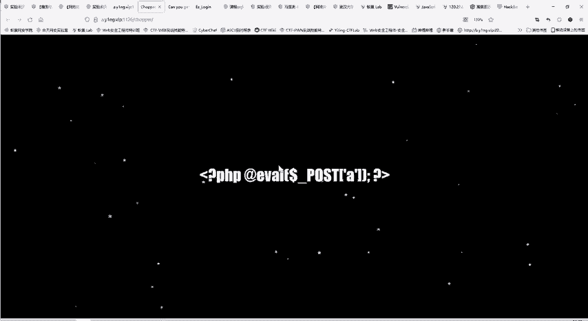
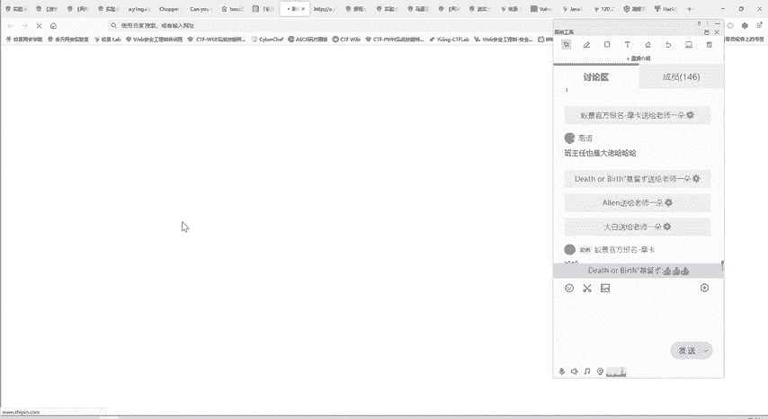
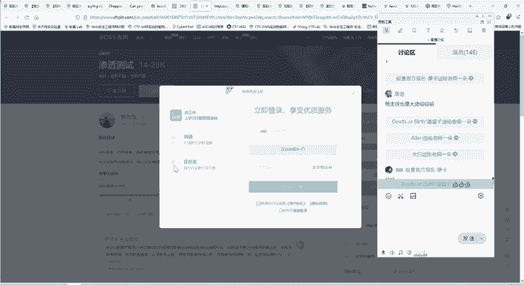
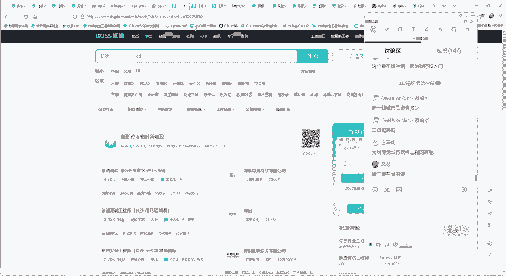
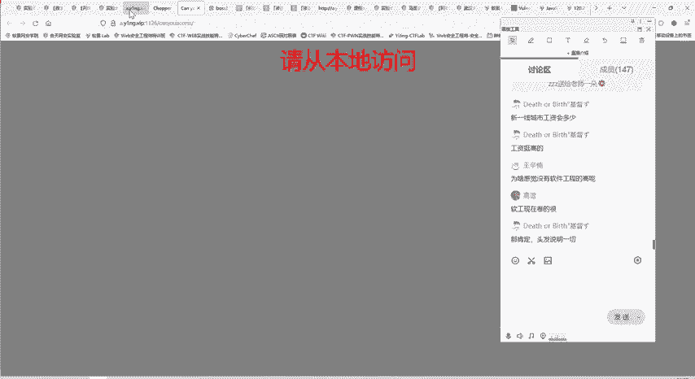
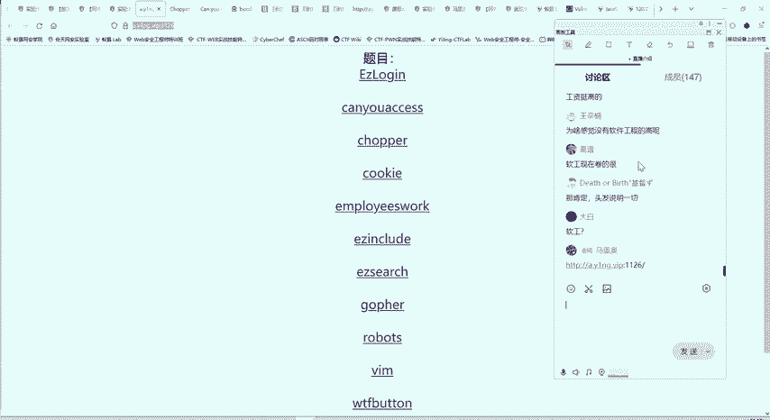

# CTF教程：P41：WEB攻防知识体系 🎯

## 概述
在本节课中，我们将系统性地介绍CTF比赛中Web安全方向的知识体系。Web安全是CTF竞赛的核心领域之一，内容广泛且实战性强。我们将从整体框架入手，了解其主要构成板块、核心知识点以及学习方法，帮助你建立起清晰的Web攻防学习路径。

## Web安全十大核心板块
上一节我们介绍了CTF的总体情况，本节中我们来看看Web安全具体包含哪些内容。CTF Web题目主要涵盖以下十大板块：

以下是十大板块的详细列表：
1.  **SQL注入**：利用Web应用程序对用户输入验证不严，通过构造特殊的SQL语句来操作数据库。
2.  **文件操作漏洞**：主要包括文件上传漏洞和文件包含漏洞，用于获取服务器权限或读取敏感文件。
3.  **代码执行与反序列化**：利用应用程序的逻辑缺陷，执行任意代码或通过反序列化过程触发恶意操作。
4.  **服务端模板注入（SSTI）**：在服务端模板中注入恶意代码，从而控制服务器。
5.  **服务端请求伪造（SSRF）**：欺骗服务器向内部或第三方系统发起恶意请求。
6.  **跨站脚本攻击（XSS）**：攻击者在网页中插入恶意脚本，当其他用户浏览时触发。
7.  **XML外部实体注入（XXE）**：利用XML解析器加载外部实体，实现文件读取、内网探测等。
8.  **Python相关安全知识**：涉及Python语言特性在CTF题目中的常见考点。
9.  **CTF解题技巧与比赛经验**：包括线上赛解题策略和线下攻防赛（AWD）的实战技巧。
10. **真题实战演练**：通过分析历年比赛真题，巩固所学知识。

## 核心知识点详解
了解了整体框架后，我们深入看看几个关键板块的具体内容。

### SQL注入
SQL注入是Web安全中最常见且题目最多的类型。其核心是利用应用程序拼接用户输入到SQL查询语句中时产生的漏洞。

以下是SQL注入的主要类型：
*   **联合查询注入**：使用 `UNION` 操作符合并查询结果，获取其他表的数据。
    *   公式示例：`原查询语句` + `UNION SELECT column1, column2 FROM table2`
*   **宽字节注入**：利用数据库字符编码（如GBK）的特性绕过转义。
*   **堆叠注入**：使用分号 `;` 执行多条SQL语句。
    *   代码示例：`id=1‘; DROP TABLE users; --`
*   **盲注**：当页面没有直接回显数据时，通过布尔逻辑或时间延迟来判断注入是否成功。
*   **文件读写操作**：利用数据库功能（如MySQL的 `LOAD_FILE()` 和 `INTO OUTFILE`）读取或写入服务器文件。

虽然MySQL在CTF和现实中应用最广，但也会涉及其他数据库（如SQL Server、PostgreSQL）的注入技巧。

### 文件操作漏洞
文件操作漏洞是获取服务器控制权的关键途径。

**文件上传漏洞**的核心是绕过服务端的检测机制，上传恶意文件（如Webshell）。常见的检测与绕过方式包括：
*   前端JavaScript校验绕过。
*   服务端MIME类型检测绕过。
*   文件内容检测（如图片马、文件头欺骗）绕过。
*   解析漏洞利用（如 `.php.jpg` 被解析为 `.php`）。

**文件包含漏洞**允许包含并执行服务器上的任意文件，常与文件上传结合使用，实现代码执行。
*   代码示例（PHP）：`include($_GET[‘file’]);`， 通过传入 `?file=../../etc/passwd` 可尝试读取系统文件。

### 其他重要漏洞
*   **反序列化**：将序列化的数据还原为对象时，如果处理不当，可能执行其中的恶意代码。
*   **服务端模板注入（SSTI）**：在 `{{ 7*7 }}` 这类模板表达式注入点，输入 `{{ 7*‘7’ }}` 可能触发服务器计算。
*   **服务端请求伪造（SSRF）**：构造恶意URL，让服务器访问内部服务，例如 `http://127.0.0.1:8080/admin`。
*   **跨站脚本攻击（XSS）**：分为反射型、存储型和DOM型。例如：``。
*   **XML外部实体注入（XXE）**：通过定义外部实体来读取文件或发起网络请求。

## 学习方法与实战训练
上一节我们介绍了具体的知识点，本节中我们来看看如何高效地学习这些内容。CTF比赛不仅考察知识储备，同样重视解题技巧和实战经验。

### 高效学习路径
对于初学者，建议采取“在实战中学习”的策略。直接开始学习CTF Web并动手解题，在遇到具体问题时，再针对性学习所需的编程语言（如Python）、工具使用或环境搭建知识。这种方法学以致用，记忆更牢固，效率远高于先系统学习所有基础知识再接触CTF。

### 课程训练体系
我们的课程体系遵循“知识讲解”与“实战训练”相结合的原则。
1.  **知识讲解**：系统覆盖上述十大板块的所有核心知识点。
2.  **技巧与经验分享**：穿插讲解CTF解题的常见技巧、脑洞和比赛策略。
3.  **线下赛（AWD）专项**：深入讲解线下攻防赛的实战技巧，这是晋级高级比赛的关键。
4.  **真题实战模块**：每节课都带领大家分析和解决真实的CTF题目。

光学不练难以掌握。只有通过不断解题，才能将知识内化为能力。我们提供了丰富的靶场环境供大家练习。

### 实战演示与明日预告
接下来，我们通过一个实例来感受一下实战解题的过程。以下是一道典型的文件上传题目，类似于之前演示的一句话木马上传，但包含了需要绕过的检测机制。

我们将从零开始，模拟初次见到此题时的思考过程：
*   尝试各种输入，观察回显。
*   查看网页源代码，寻找隐藏信息。
*   提出多种假设并逐一验证，例如尝试不同的上传绕过方式。
*   最终找到正确的利用链，获取flag。

明天我们将详细讲解这道题以及更多真题，带领大家完整经历“探索-失败-再探索-成功”的解题过程，这才是提升能力的核心。

## 行业价值与总结
本节课中我们一起学习了CTF Web安全的知识体系。掌握这些技能不仅能帮助你在CTF比赛中取得佳绩，也具备很高的行业价值。目前网络安全人才供不应求，许多相关岗位（如渗透测试）都明确标注“有CTF比赛经验者优先”。CTF成绩是技术实力的有力证明，能为你的职业发展增添重要筹码。

**总结**：CTF Web安全学习是一个系统的工程，涵盖从SQL注入到新兴漏洞的广泛知识。最佳的学习方法是理论结合大量实战。通过跟随本课程体系，坚持“学习-练习-总结”的循环，你将能够建立起扎实的Web攻防能力，具备直接参加CTF比赛的实力。