# CTF教程：P42：弱口令爆破 🔑

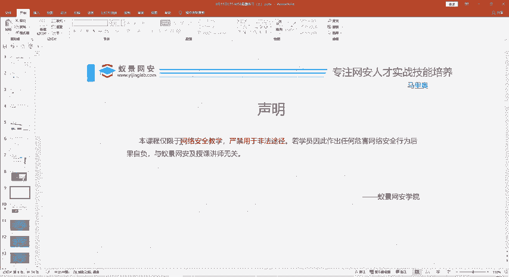

在本节课中，我们将学习如何利用弱口令爆破技术解决一道典型的CTF Web题目。我们将从分析题目信息开始，逐步讲解如何发现线索、使用工具进行解码和爆破，最终获取Flag。

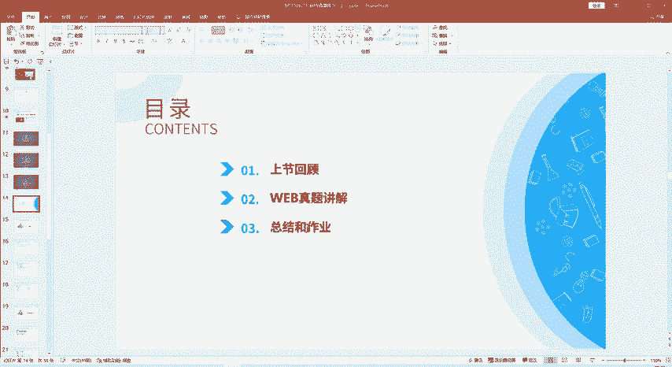

## 课程概述

本节课的主要内容分为三部分。第一部分是简单回顾昨天的课程内容。第二部分是讲解六道Web真题的解题方法。第三部分是课程总结与作业布置。

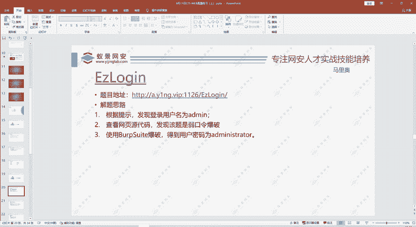

## 回顾与引入

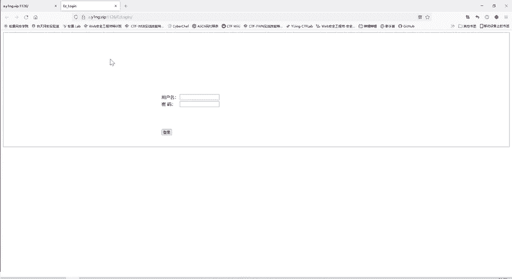

上一节我们介绍了CTF的基本概念和一些基础工具。本节中，我们来看看如何将这些知识应用到实际的Web题目中。

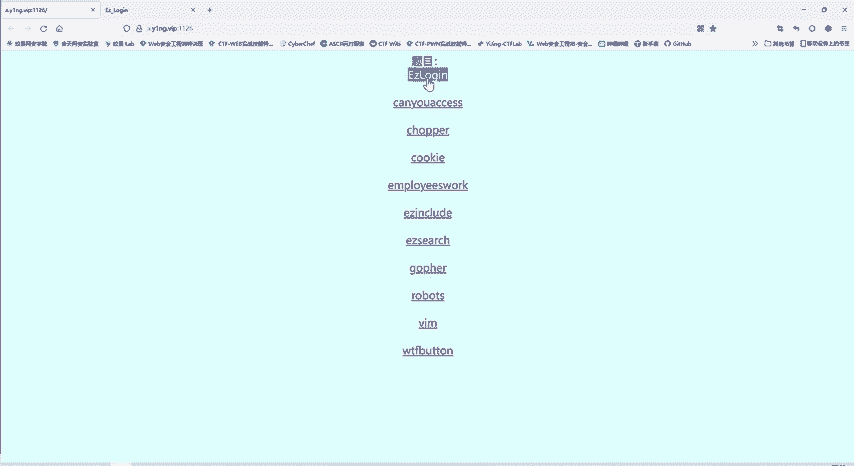

今天的课程将带大家完成六道大学CTF社团招新级别的Web真题。这些题目难度适中，但涵盖了多个重要知识点，兼具趣味性和教学意义。

## 真题解析：第一题

我们首先分析第一道题目：“Easy Log In”。

在CTF比赛中，题目的每一个信息都可能是有用的。这道题的标题“Easy Log In”本身就是一个提示，表明我们需要进行登录操作。

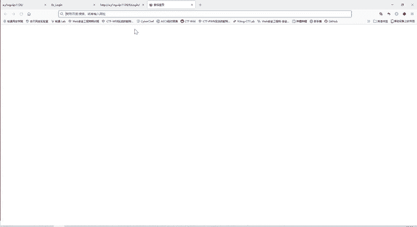

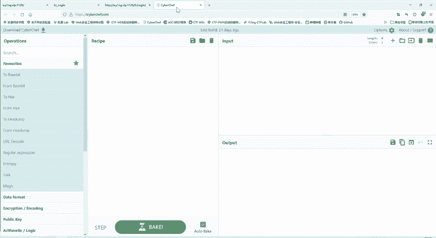

### 第一步：寻找用户名

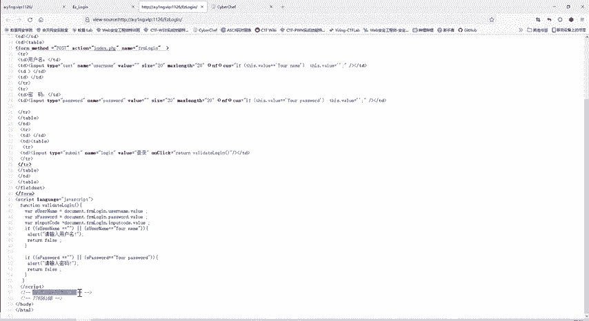

题目页面显示了一个登录框。我们尝试使用常见的用户名进行登录。

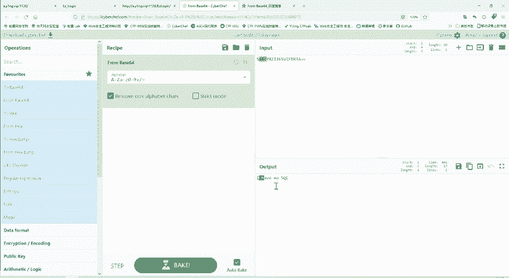

*   尝试使用标题“Easy Log In”作为用户名，但提示错误。
*   尝试使用“admin”作为用户名，系统返回“wrong password”。这证实了用户名是“admin”，但密码未知。

### 第二步：分析页面源码

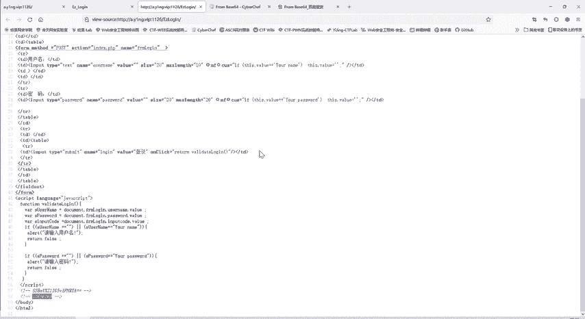

当直接信息不足时，查看网页源代码是重要的侦查手段。

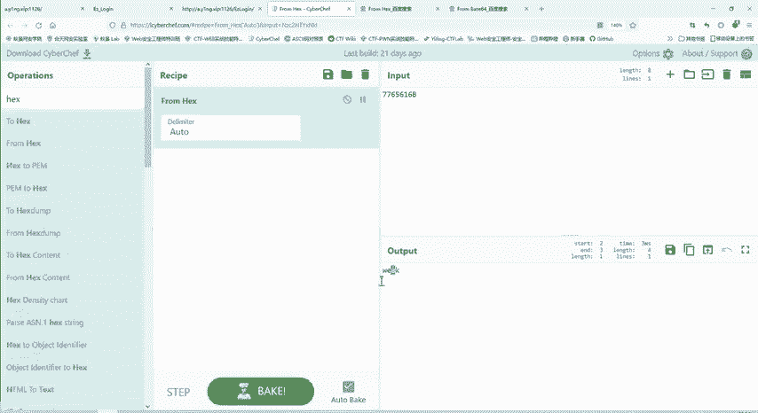

我们在页面源码中发现了两段特殊编码的字符串。

以下是分析过程：
1.  第一段字符串以“==”结尾，这是Base64编码的典型特征。使用解码工具（如CyberChef）对其进行Base64解码，得到提示“I have no sql”，表明此题与SQL注入无关。
2.  第二段字符串“7765616B”由数字和A-F字母组成，符合十六进制（Hex）编码的特征。使用工具对其进行Hex解码，得到单词“weak”。

### 第三步：理解“weak”提示

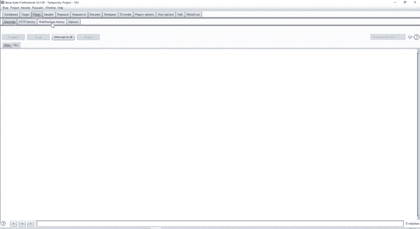

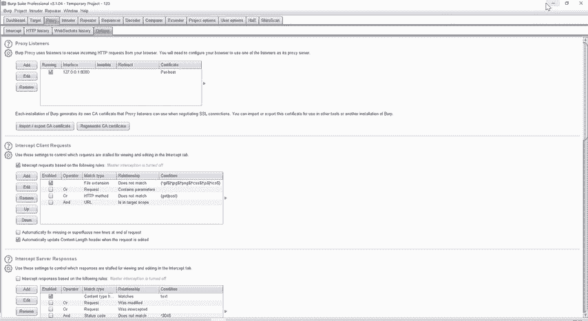

“weak”提示我们，密码可能是一个弱口令。弱口令数量众多，无法手动尝试，因此需要使用自动化工具进行爆破。

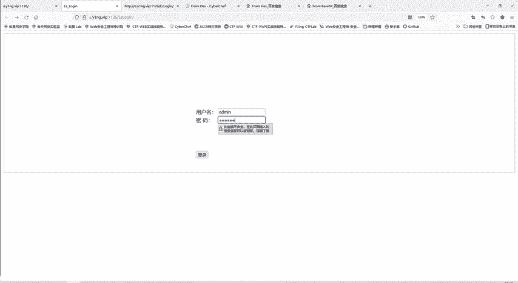

### 第四步：使用Burp Suite进行爆破

以下是使用Burp Suite进行密码爆破的步骤：

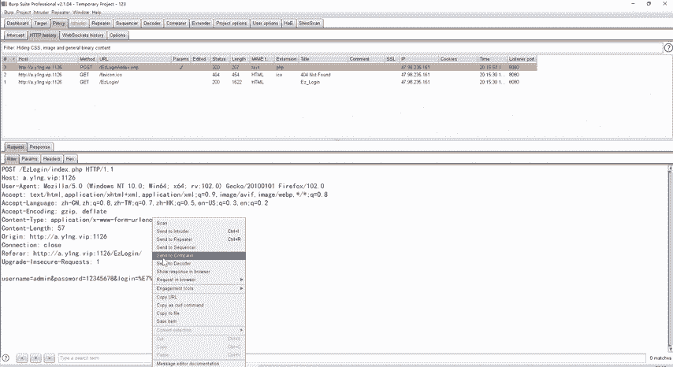

1.  **配置代理**：打开Burp Suite，确保代理监听（例如本地的8080端口）已开启，并配置浏览器使用该代理。
2.  **拦截请求**：在登录页面，输入用户名“admin”和一个任意密码（如123456），提交登录。这个HTTP请求会被Burp Suite拦截。
3.  **发送到Intruder模块**：在Burp Suite的Proxy历史记录中，找到刚才的POST请求，右键点击并选择“Send to Intruder”。
4.  **设置攻击位置**：在Intruder模块的“Positions”标签页，清除所有自动标记的位置。然后只选中密码参数（如`password=123456`）的值部分，点击“Add §”将其标记为爆破点。
5.  **加载攻击字典**：切换到“Payloads”标签页。选择“Payload set”为1，在“Payload Options”中加载一个常见的弱口令字典（例如“Top 100”密码列表）。
6.  **开始攻击**：点击“Start attack”按钮开始爆破。
7.  **分析结果**：攻击完成后，观察响应包的长度（Length）。通常，正确密码对应的响应长度会与其他错误密码不同。在本例中，密码“administrator”的响应长度与其他条目显著不同，因此被判定为正确密码。

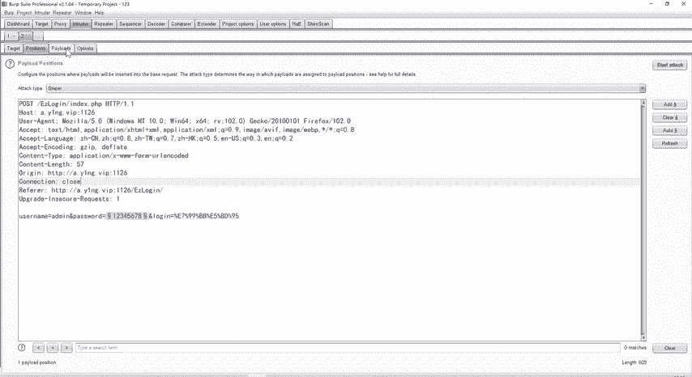

### 第五步：获取Flag

将爆破得到的密码“administrator”填入登录表单，与用户名“admin”一起提交。成功登录后，页面显示出本题的Flag。

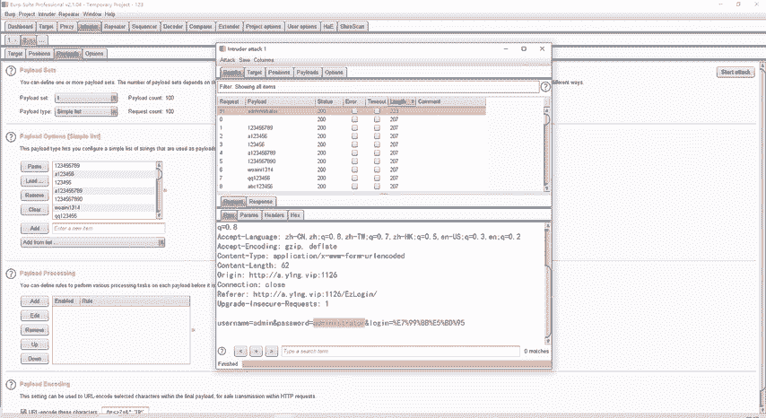

## 解题思路总结

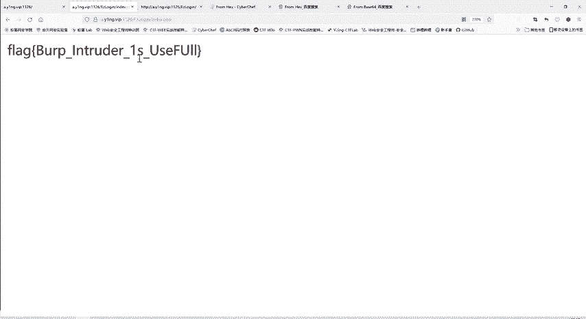

本节课中我们一起学习了第一道真题的完整解题流程：
1.  **信息收集**：从标题、页面响应、源代码中寻找线索。
2.  **编码分析**：识别并解码（Base64, Hex）隐藏在源码中的提示信息。
3.  **思路确定**：根据提示“weak”判断此题属于弱口令爆破类型。
4.  **工具爆破**：使用Burp Suite工具，通过拦截请求、设置爆破点、加载字典、分析响应差异来找到正确密码。
5.  **获取凭证**：使用得到的用户名和密码完成登录，最终获得Flag。

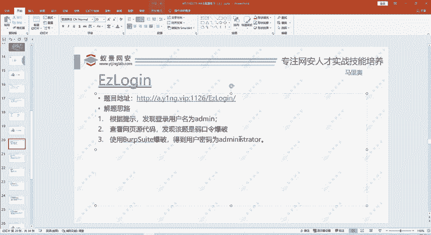

这道题目综合考察了信息搜集、编码知识和对爆破工具的基本使用能力，是CTF Web入门的一道经典练习题。