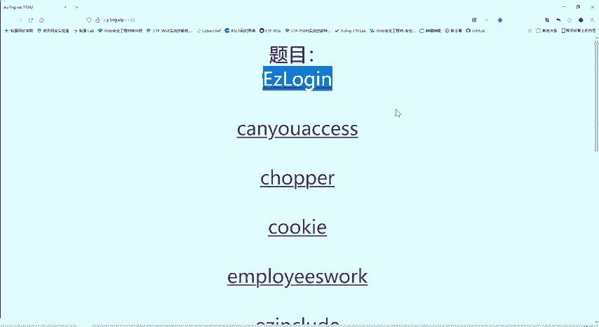
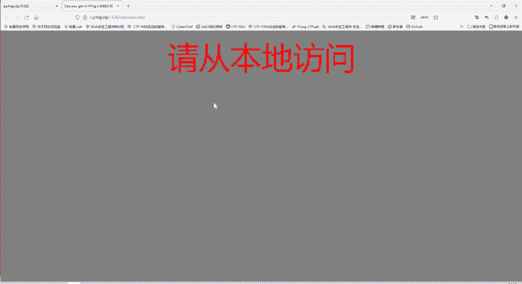
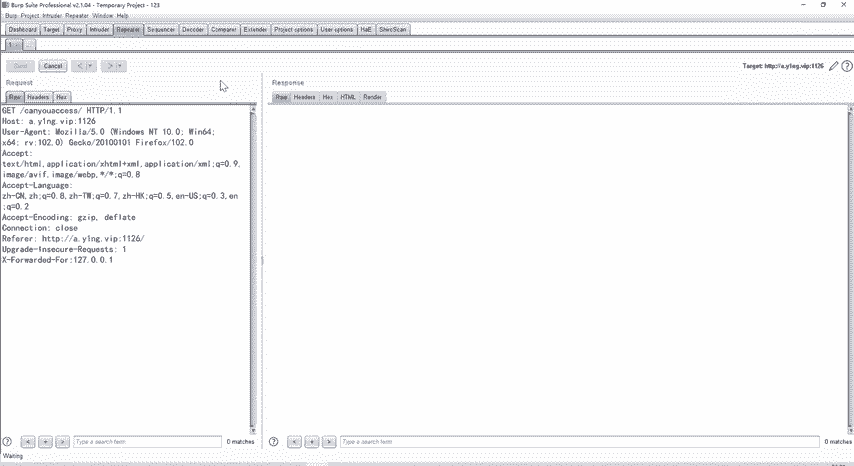
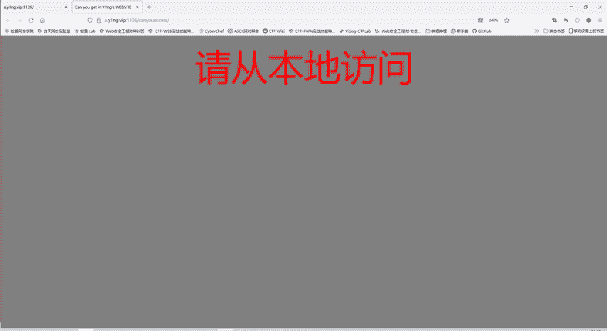

# CTF教程：P43：指定参数访问 🔧

## 概述
在本节课中，我们将学习如何通过修改HTTP请求头中的特定参数来满足服务器的访问要求，从而获取CTF Web挑战中的Flag。我们将使用Burp Suite工具来拦截、修改和重放请求。



---

## 分析题目要求
上一节我们介绍了工具的基本使用，本节中我们来看看第二道题目。题目要求我们从本地访问服务器。




服务器提示“请从本地访问”。作为CTF参赛者，我们需要模拟从本地发起的请求。

## 使用Burp Suite拦截请求
我们使用Burp Suite的代理功能拦截浏览器发送的请求。


在代理模块中可以看到捕获的请求。我们不使用爆破模块，而是将其发送到Repeater（重放）模块。在Repeater模块中点击发送，相当于手动发起了一次网络请求。

## 尝试修改请求头
服务器要求从本地访问。这通常通过修改HTTP请求头中表示客户端来源的字段来实现。

一个常见的字段是 `X-Forwarded-For`。我们尝试将其值设置为本地IP地址 `127.0.0.1`。



以下是修改请求头的代码示例：
```http
GET /target_page HTTP/1.1
Host: example.com
X-Forwarded-For: 127.0.0.1
...
```




发送修改后的请求，服务器响应提示“你以为我不知道X-Forwarded-For”，说明这个字段被服务器识别并过滤了。

## 尝试其他表示来源的字段
既然 `X-Forwarded-For` 被过滤，我们需要尝试其他具有相同功能的HTTP头字段。

以下是可用于表示客户端来源的部分字段列表：
*   `Client-IP`
*   `X-Real-IP`
*   `X-Forwarded-Host`
*   `X-Originating-IP`
*   `X-Remote-IP`
*   `X-Remote-Addr`

我们不必逐个尝试，可以将这些字段全部添加到请求头中再次发送。


添加后，服务器不再返回关于 `X-Forwarded-For` 的错误，说明我们的修改生效了。此时服务器提出了新要求：“从谷歌访问”。

## 满足“从谷歌访问”的要求
“从哪个网站跳转而来”这个信息通常由 `Referer` 字段指定。当前请求的 `Referer` 值是题目页面本身。

我们需要将 `Referer` 字段的值修改为谷歌的网址。
```http
Referer: https://www.google.com
```

修改并发送请求后，“从谷歌访问”的要求被满足，服务器又提出了第三个要求：“使用ABC浏览器”。

## 满足“使用指定浏览器”的要求
浏览器类型信息由 `User-Agent` 字段指定。当前的值是火狐浏览器。

我们需要按照题目要求，将 `User-Agent` 的值修改为 `ABC Browser`。
```http
User-Agent: ABC Browser
```

## 获取Flag
当请求同时满足了“从本地访问”、“从谷歌访问”和“使用ABC浏览器”这三个条件后，服务器返回了正确的响应，Flag成功出现。


获取Flag后即可在比赛中提交得分。

---


## 总结
本节课中我们一起学习了如何通过Burp Suite的Repeater模块修改HTTP请求头。我们实践了通过添加或修改 `X-Forwarded-For` 类字段、`Referer` 字段和 `User-Agent` 字段，来满足服务器对请求来源、跳转路径和客户端类型的校验，最终成功获取CTF挑战的Flag。关键在于理解不同HTTP头字段的含义并灵活运用。