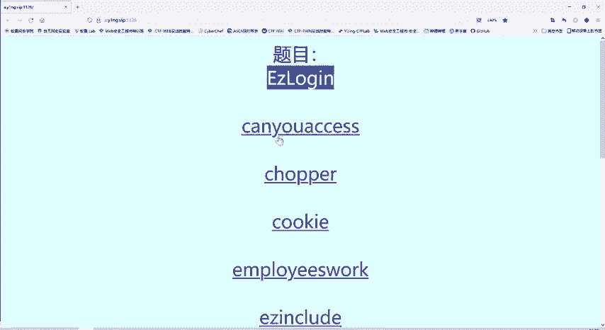
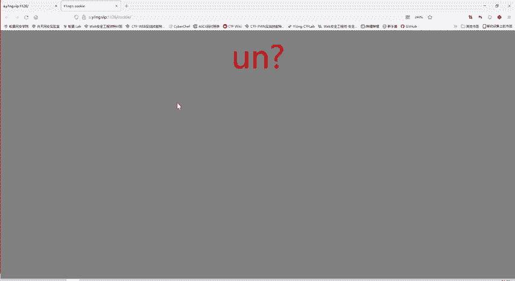
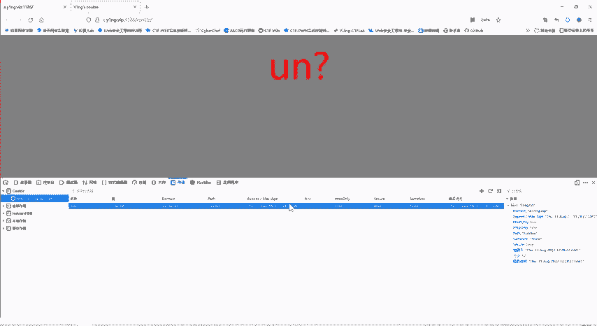
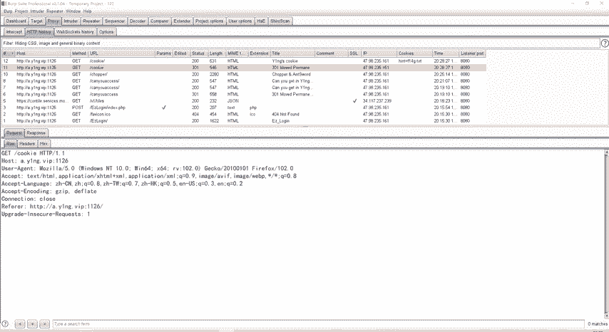
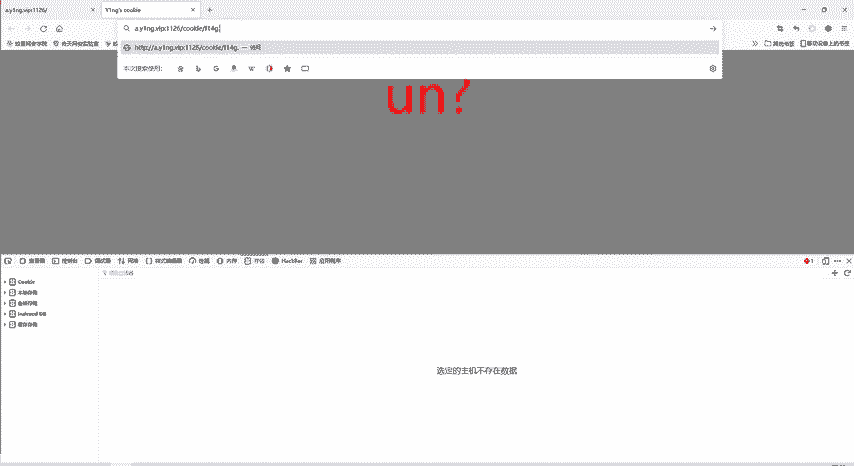
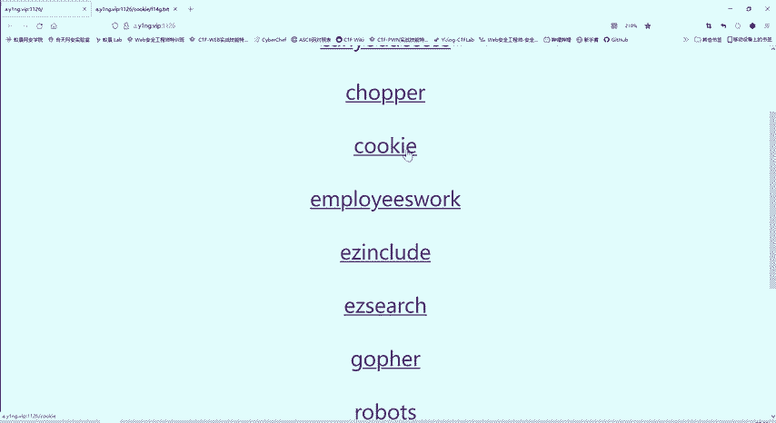

# CTF教程：P45：Cookie - 白帽子讲安全

在本节课中，我们将学习CTF Web题目中一个常见且基础的知识点：**Cookie**。我们将了解什么是Cookie，如何查看它，以及如何利用Cookie信息来获取Flag。



---

## 什么是Cookie？



Cookie是网站为了辨别用户身份、进行会话跟踪而存储在用户本地终端上的数据。在CTF Web题目中，Flag或关键线索有时会直接存放在Cookie里。

上一节我们介绍了基础的Web题目类型，本节中我们来看看如何通过检查Cookie来解题。

## 如何查看Cookie？



有多种方法可以查看当前网站的Cookie信息。

以下是两种常用的查看方法：



1.  **使用浏览器开发者工具**
    *   在网页上点击鼠标右键。
    *   选择“检查”或“审查元素”。
    *   在开发者工具中，找到“应用程序”或“存储”选项卡。
    *   在侧边栏中选择“Cookie”，即可查看当前站点的所有Cookie及其值。

2.  **使用抓包工具（如Burp Suite）**
    *   启动Burp Suite并设置浏览器代理。
    *   访问目标网站，Burp Suite会捕获所有HTTP请求和响应。
    *   在 **Proxy -> HTTP history** 中，查看服务器返回的HTTP响应头，其中 `Set-Cookie` 字段会设置Cookie。
    *   同样，在后续的请求中，`Cookie` 请求头会携带这些信息。

## 实战解题：Cookie题目

现在，我们应用所学知识来解决一道具体的CTF题目。题目名称直接提示了考点：**Cookie**。

1.  **发现线索**：通过上述任一方法查看题目网站的Cookie。我们发现了一个名为 `flag` 的Cookie，其值为 `F14G.txt`。
    *   这个值 `F14G` 看起来像是 `FLAG` 的变形，`txt` 后缀则提示这可能是一个文件名。



2.  **分析线索**：既然Cookie提示了一个文件 `F14G.txt`，而题目考点是Cookie，那么很可能访问这个文件就能获得Flag。

3.  **获取Flag**：在浏览器中直接访问 `http://题目网址/F14G.txt`。成功访问后，我们便获得了本题的Flag。

**核心操作总结**：解题的关键在于识别出Cookie值 `F14G.txt` 是一个可访问的资源路径，并直接请求它。
```bash
# 假设题目域名为 target.com
# 通过查看Cookie得到线索：flag=F14G.txt
# 则尝试访问：
# http://target.com/F14G.txt
```

---



## 总结

本节课中我们一起学习了CTF中关于Cookie的基础知识。我们掌握了两种查看Cookie的方法，并通过一道实战题目，理解了如何从Cookie中提取线索（如文件名、路径等），并利用该线索直接访问资源以获取Flag。这是一个非常基础且常见的Web题型，掌握它能为解决更复杂的题目打下基础。