# CTF教程：P46：双写绕过 🔐

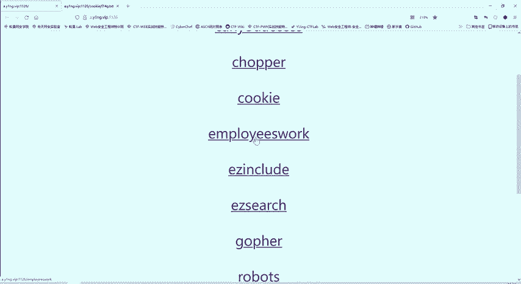

在本节课中，我们将学习一种在CTF Web题目中常见的绕过技巧——双写绕过。我们将通过分析一个具体的题目，理解其背后的逻辑，并掌握如何利用双写来满足看似矛盾的条件，从而获取Flag。

## 题目分析与思路

上一节我们介绍了如何查看网页源代码寻找线索。本节中我们来看看一个具体的CTF Web题目。

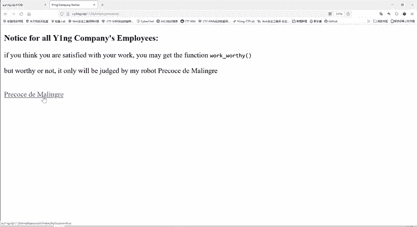

题目页面本身内容不多。查看网页源代码后，发现其中包含一个指向 `flag.php` 的链接。直接访问 `flag.php` 无法获得任何内容，说明此路不通。

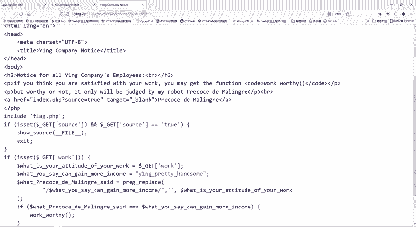

源代码中还有一个链接，点击后可以显示后端PHP代码。这段代码是解题的关键。

```php
if ($_GET['source'] == 't') {
    exit();
}
$attitude = $_GET['work'];
$g = "YNGpretty handsome";
if (preg_replace("/$g/", "", $attitude) === $g) {
    include("flag.php");
}
```

代码逻辑如下：
1.  通过GET方法传递一个名为 `work` 的参数，其值被赋值给变量 `$attitude`。
2.  定义了一个字符串 `$g`，其值为 `"YNGpretty handsome"`。
3.  使用 `preg_replace` 函数，在 `$attitude` 中查找 `$g` 并替换为空字符串。
4.  **关键判断**：替换后的结果必须**严格等于** `$g` 本身。

这看起来是一个矛盾：如果 `$attitude` 包含 `$g`，它会被替换掉，结果不可能再等于 `$g`。如果不包含 `$g`，替换后更不可能等于 `$g`。这就需要我们寻找一种特殊的构造方法。

## 核心概念：双写绕过

为了解决上述矛盾，我们需要引入**双写绕过**的技巧。

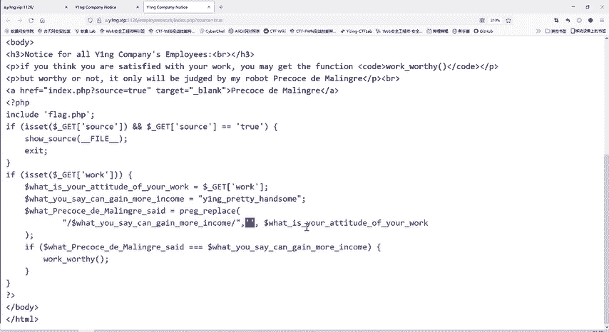

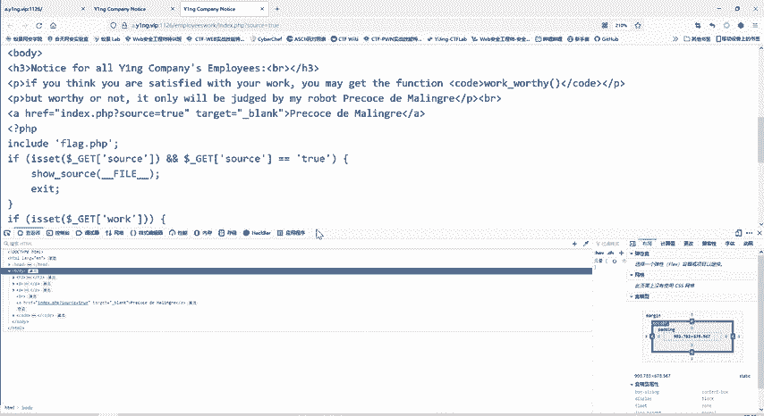

`preg_replace` 函数的作用是搜索并替换。其基本语法可以理解为：
`preg_replace(要查找的模式, 替换成的字符串, 被搜索的字符串)`

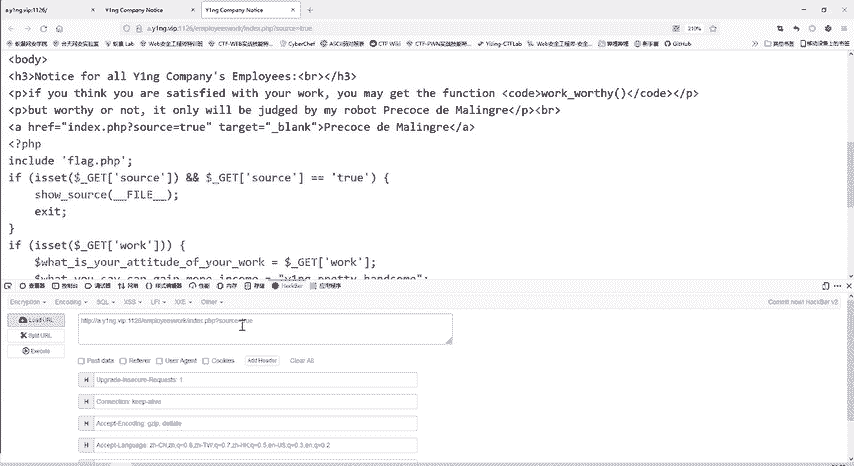

在本题中，它会在我们传入的 `$attitude` 字符串里，寻找 `"YNGpretty handsome"` 并将其删除（替换为空）。

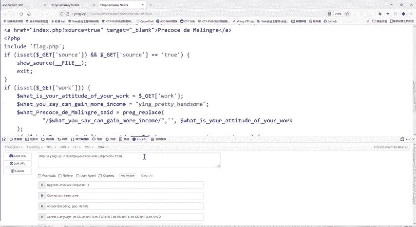

双写绕过的核心思想是：**在我们传入的字符串中，让需要被过滤的关键字出现两次，并且这两次出现的位置经过一次替换删除后，能恰好剩下一个完整的关键字。**

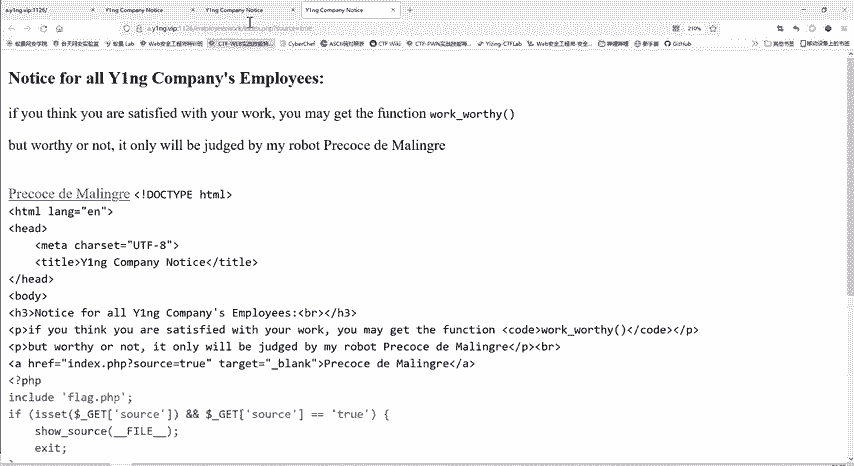

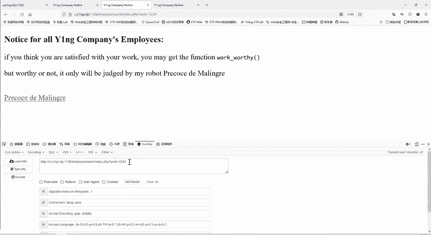

具体构造如下：
我们希望最终替换后剩下的字符串是 `$g`，即 `"YNGpretty handsome"`。
那么，我们可以传入这样一个字符串：`"YNGYNGpretty handsomepretty handsome"`。
`preg_replace` 函数会找到其中的 `"YNGpretty handsome"` 并将其删除。
删除后，剩下的字符串正好是 `"YNGpretty handsome"`。

以下是构造过程的分解：
1.  原始输入（`$attitude`）: `YNGYNGpretty handsomepretty handsome`
2.  `preg_replace` 查找并删除第一个 `YNGpretty handsome`。
3.  剩余字符串: `YNGpretty handsome`
4.  判断 `剩余字符串 === $g` 成立。

这样，我们就通过了判断，触发了 `include("flag.php")`。

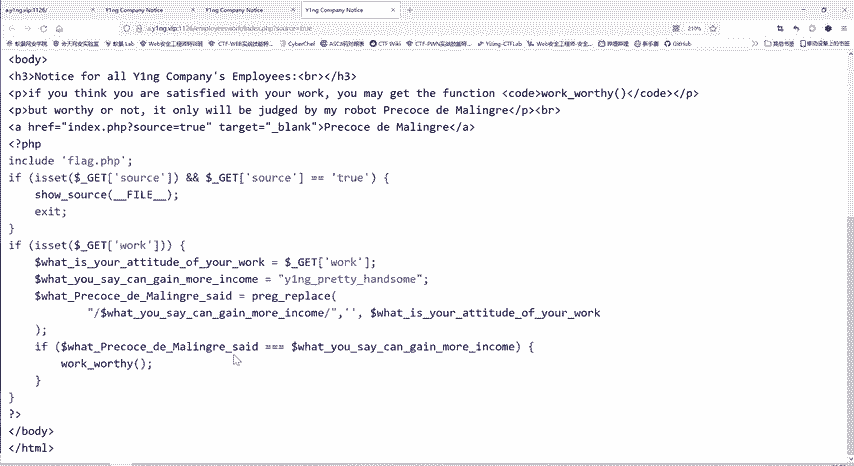

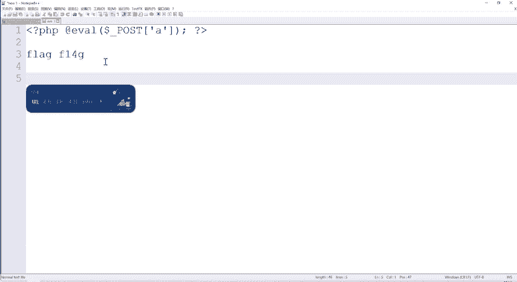

## 解题步骤实践

以下是利用双写绕过技巧获取Flag的具体操作步骤。

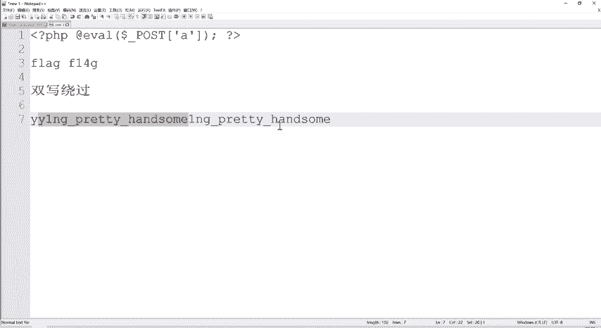

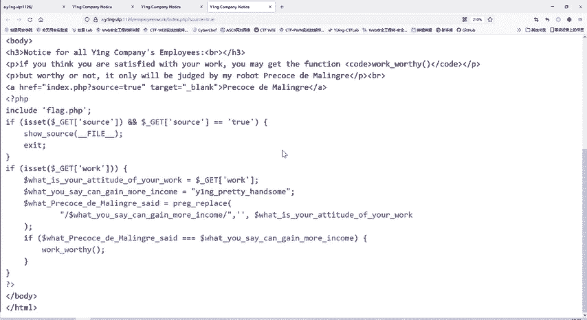

我们将使用HackBar工具（或浏览器地址栏直接构造）来发送Payload。

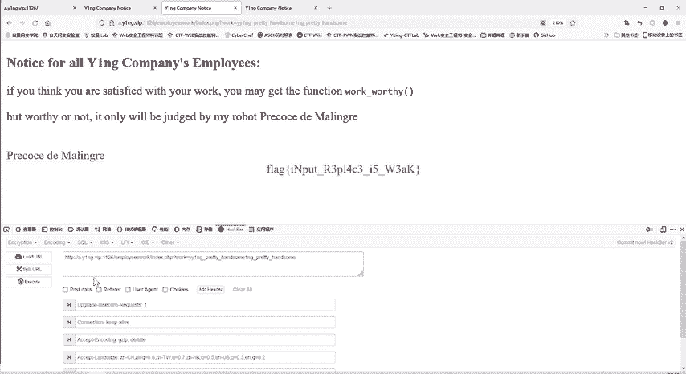

1.  **构造Payload**：
    我们需要让 `work` 参数的值为双写后的字符串。
    即：`work=YNGYNGpretty handsomepretty handsome`

2.  **发送请求**：
    在URL后附加参数 `?work=YNGYNGpretty handsomepretty handsome` 并访问。

3.  **获取Flag**：
    请求发送后，服务器端代码执行替换和判断，条件成立，包含并执行了 `flag.php` 文件，Flag便会显示在页面上。

## 总结与要点

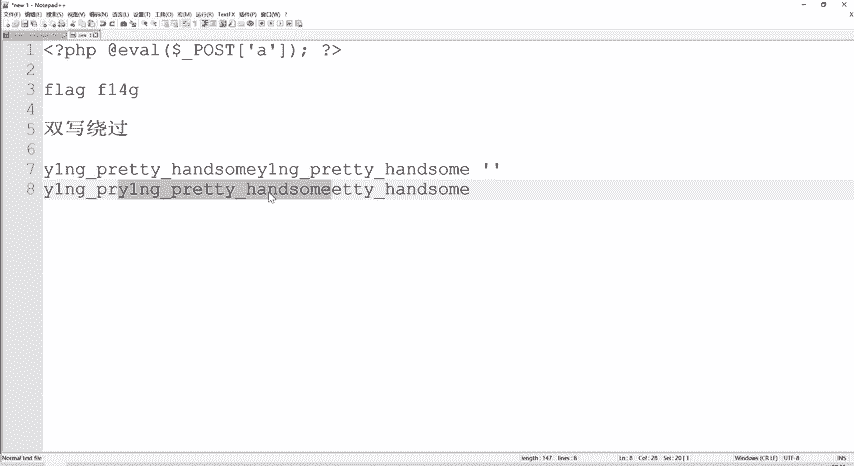

本节课中我们一起学习了CTF Web题目中的**双写绕过**技巧。

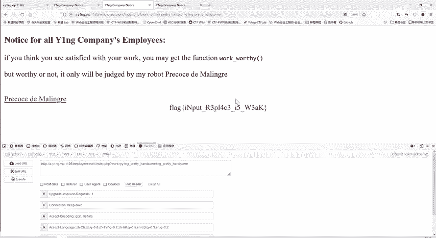

我们通过一个实例，分析了后端代码的逻辑矛盾：需要将一个字符串中的特定子串删除，但删除后的结果又必须等于该子串本身。为了解决这个问题，我们采用了双写的方法，在传入参数时构造一个字符串，使得目标子串在其中出现两次。经过一次替换删除后，恰好能留下一个完整的目标子串，从而满足判断条件。

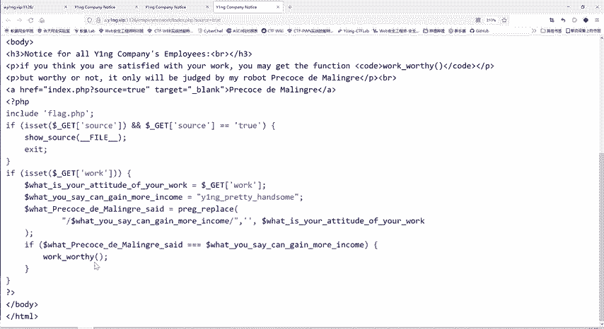

**核心要点回顾**：
*   **双写绕过**适用于一次性的查找替换过滤。
*   其本质是**利用过滤规则本身来构造有效载荷**。
*   构造时需确保过滤一次后，剩余的字符串正好是所需的目标。
*   这是一个基础但非常重要的绕过思路，在SQL注入、XSS等场景的过滤绕过中也有类似应用。

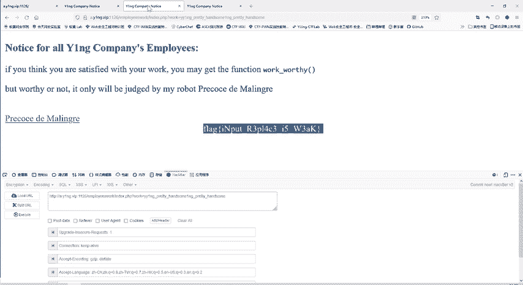

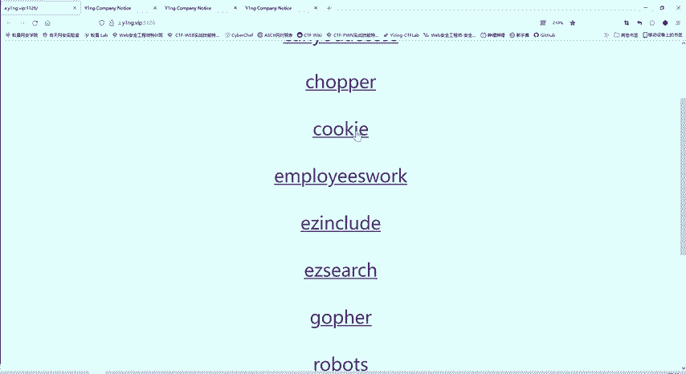

理解并掌握这个原理，将帮助你解决许多类似的CTF挑战。