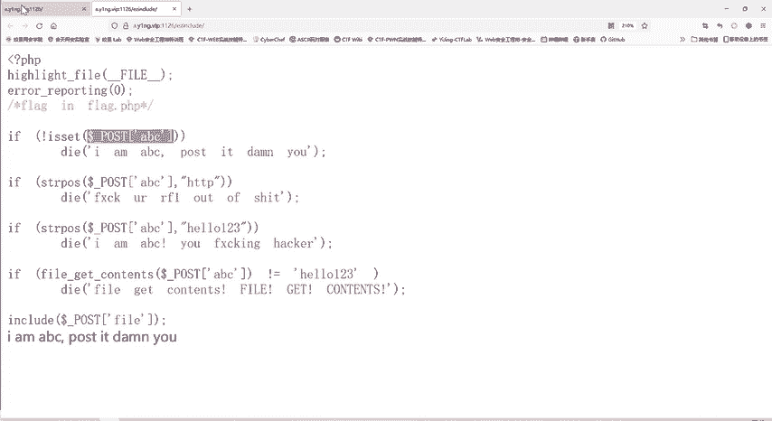
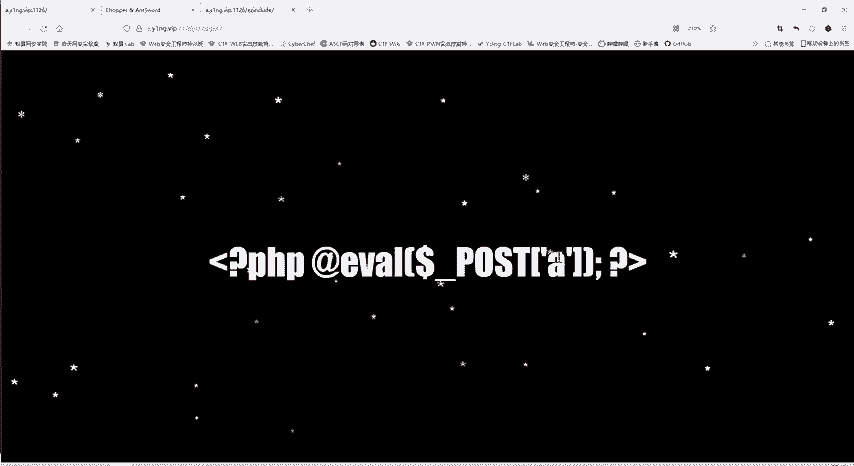

# CTF教程：P47：多重验证和data协议、filter协议 🛡️

在本节课中，我们将学习一道涉及多重验证的CTF题目。题目要求我们通过四层验证，最终读取服务器上的 `flag.php` 文件。我们将重点学习如何利用 `data` 协议绕过内容检查，以及如何使用 `filter` 协议读取PHP文件的源代码。

## 题目分析与目标 🎯

打开题目后，我们注意到一个提示：“flag就在flag.php当中”。因此，我们的最终目标是查看 `flag.php` 文件的内容。

题目代码使用了 `$_POST[‘abc’]` 方法接收参数。这与我们之前学习的“一句话木马”传递参数的方式类似，都是通过POST方法传递一个变量。

## 第一关：参数检查 🔍

代码首先检查是否存在名为 `abc` 的POST参数。如果不存在，则输出提示信息。

由于我们尚未传递任何参数，因此需要利用浏览器的HackBar插件来发送POST请求。与GET请求（`?参数名=参数值`）不同，POST参数需要在“Post data”区域进行设置。

我们尝试传递 `abc=123456`。发送请求后，页面不再输出第一关的提示信息，说明我们成功通过了第一层验证。

## 第二关：字符串过滤 🚫

通过第一关后，代码会检查我们传递的 `abc` 参数值中是否包含字符串 `http`。如果包含，则验证失败。

因此，我们传递的参数字符串中不能出现 `http`。

## 第三关：另一字符串过滤 🚫

紧接着，代码进行类似的检查，要求参数字符串中不能包含 `hello123`。

所以，我们传递的 `abc` 值必须同时避开 `http` 和 `hello123` 这两个字符串。

## 第四关：文件内容验证 📄

这是最关键的一关。代码将 `abc` 参数的值作为一个文件名，尝试用 `file_get_contents()` 函数读取其内容。如果文件内容不等于 `hello123`，则验证失败。

这意味着我们需要找到一个服务器上内容恰好为 `hello123` 的文件。但我们通常不知道服务器上有哪些文件。

**解决方法**：利用 `data` 协议。`file_get_contents()` 不仅可以读取文件，还可以读取数据流。`data` 协议允许我们直接内嵌数据。

我们可以构造这样的数据流：`data://text/plain;base64,aGVsbG8xMjM=`。其中，`aGVsbG8xMjM=` 是 `hello123` 的Base64编码形式。

这样做的妙处在于：
1.  传递给 `file_get_contents()` 的内容是 `hello123`，满足了第四关的验证条件。
2.  我们传递的参数字符串本身是Base64编码后的值，不包含明文 `hello123`，从而绕过了第三关的检查。
3.  该字符串也不包含 `http`，同样绕过了第二关的检查。

我们可以使用HackBar插件的编码功能，轻松将 `hello123` 进行Base64编码。

## 最终步骤：读取flag 🏁

通过所有四层验证后，代码会包含（include）一个文件。我们需要让这个文件是 `flag.php`。

但是，直接包含 `flag.php` 会导致其中的PHP代码被执行，而不是显示源代码。为了看到源代码，我们需要使用PHP的 `filter` 协议。

`filter` 协议可以将文件内容进行转换后再输出。常用的方法是将其转换为Base64编码：
`php://filter/convert.base64-encode/resource=flag.php`

服务器会返回 `flag.php` 文件的Base64编码结果。我们只需将其解码，即可得到原始的PHP源代码，从而找到flag。

## 总结 📝

本节课我们一起学习了一道CTF题目，它设置了四重验证：
1.  检查POST参数 `abc` 是否存在。
2.  检查参数值中是否包含 `http`。
3.  检查参数值中是否包含 `hello123`。
4.  将参数值作为文件名，检查文件内容是否为 `hello123`。

我们通过以下步骤成功解题：
*   使用HackBar发送POST请求。
*   利用 `data` 协议构造一个内容为 `hello123` 但形式为Base64编码的数据流，一次性绕过第二、三、四关的验证。
*   在最终的文件包含处，使用 `php://filter` 协议将 `flag.php` 以Base64编码形式读出，解码后获得flag。

本节课的核心是理解 `data` 协议和 `filter` 协议在文件包含与内容读取中的巧妙应用。