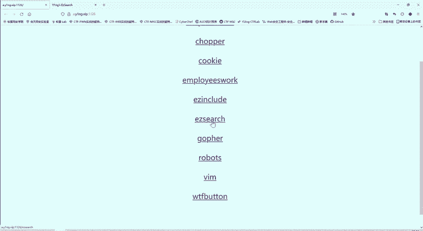
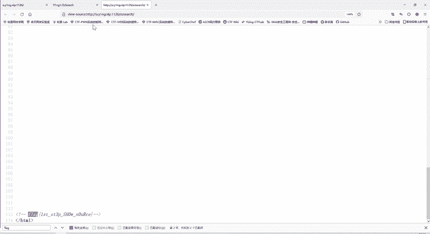

# CTF教程：P48：网页源代码搜索 🔍

在本节课中，我们将学习CTF Web题目中一个非常基础但至关重要的技巧：查看和分析网页源代码。通过一个简单的案例，你将学会如何发现隐藏在源代码中的关键信息。


上一节我们介绍了文件包含漏洞，本节中我们来看看如何通过查看网页源代码来寻找Flag。

---

## 题目解析

题目地址与昨日相同。题目名称为“EZ search”，提示我们“where is flag”，即寻找Flag的位置。



打开题目页面，乍看之下没有任何明显的Flag信息。URL中的“search”提示这可能与搜索功能相关，但页面上没有可交互的搜索框。

## 解题步骤

当我们无法在页面上直接找到信息时，查看网页源代码是首要步骤。

以下是查看源代码的通用方法：
1.  在网页任意位置点击鼠标右键。
2.  在弹出的菜单中选择“查看网页源代码”或类似选项。
3.  浏览器会打开一个新标签页，显示当前页面的HTML代码。

在本题的源代码中，初始可见区域同样没有Flag。但请注意浏览器右侧的滚动条，它提示下方还有更多内容。

向下滚动源代码页面，可以找到类似以下格式的内容：
```html
<!-- flag{this_is_a_sample_flag} -->
```
这段代码是HTML注释，其内容不会在浏览器中渲染显示，只存在于源代码中。因此，Flag被隐藏在了注释里。

## 高效搜索技巧

面对内容冗长的源代码，手动寻找特定字符串（如“flag”）效率低下且容易遗漏。

这里介绍一个高效的方法：
1.  在打开的源代码页面中，按下键盘快捷键 `Ctrl + F` (Windows/Linux) 或 `Cmd + F` (Mac)。
2.  页面会出现一个搜索框。
3.  在搜索框中输入关键词，例如 **`flag`**。
4.  浏览器会高亮显示所有匹配项，并可以通过“上一个”、“下一个”按钮快速导航。

在本题中，使用此方法可以迅速定位到包含Flag的注释行，从而轻松获得答案。

## 核心要点总结

本节课我们一起学习了CTF Web题目中的一个基础技巧：
1.  **查看源代码是基本操作**：任何无法在页面上直接看到的信息，都应优先检查网页源代码。
2.  **注意HTML注释**：`<!-- 注释内容 -->` 是常见的隐藏信息位置。
3.  **善用搜索功能**：使用 `Ctrl + F` 在源代码中快速搜索关键词（如`flag`, `key`, `password`等）能极大提高解题效率。
4.  **经验积累**：CTF解题很大程度上依赖于对常见套路和隐藏方式的经验积累，多做练习是提升的关键。



这个案例虽然简单，但它清晰地展示了源代码分析在CTF中的重要性。请务必动手练习，巩固这一基础技能。