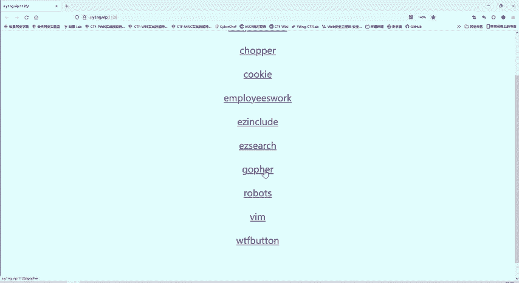
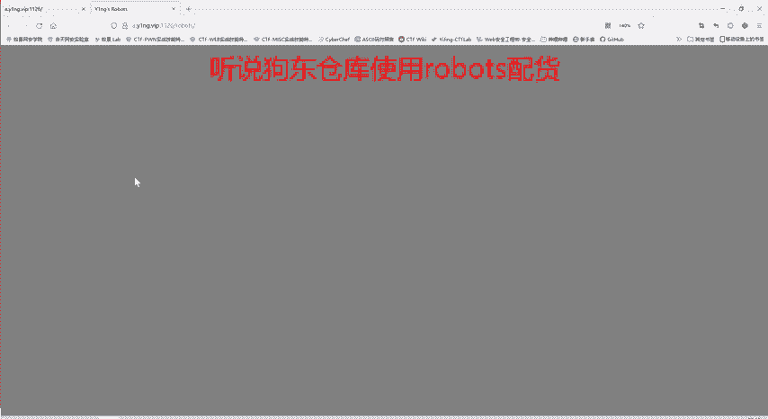
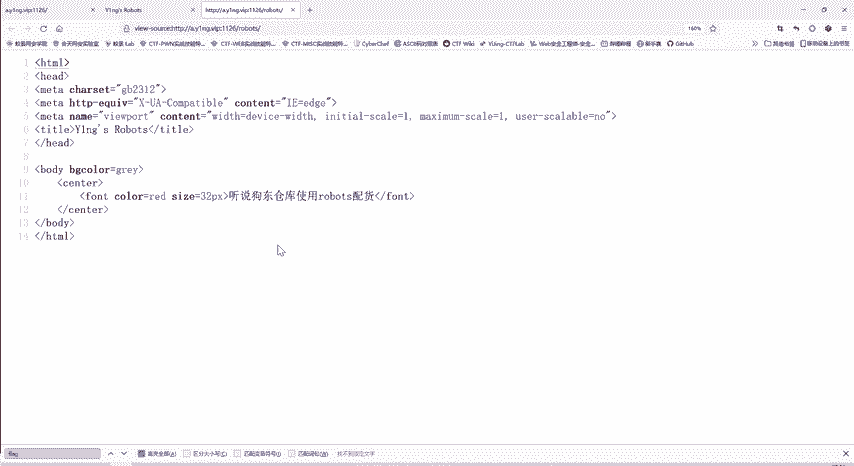
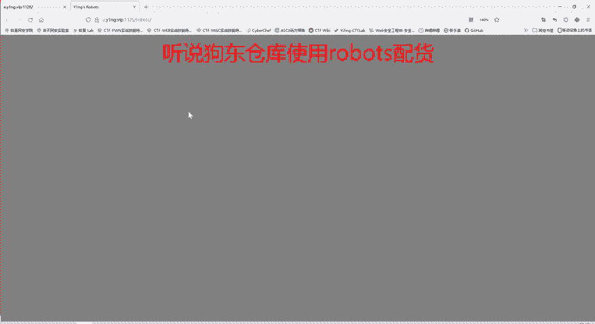
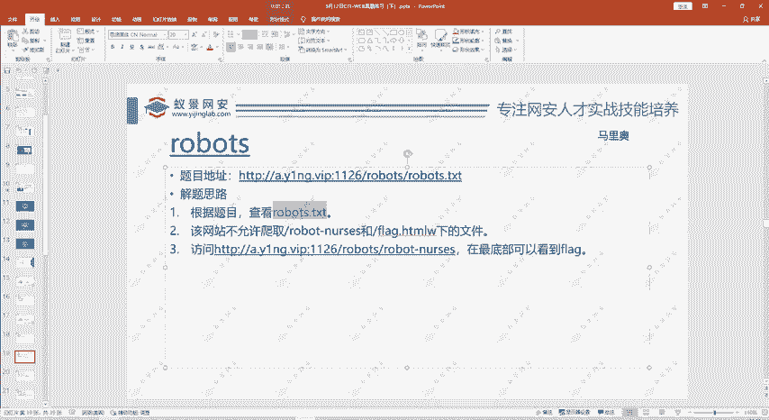
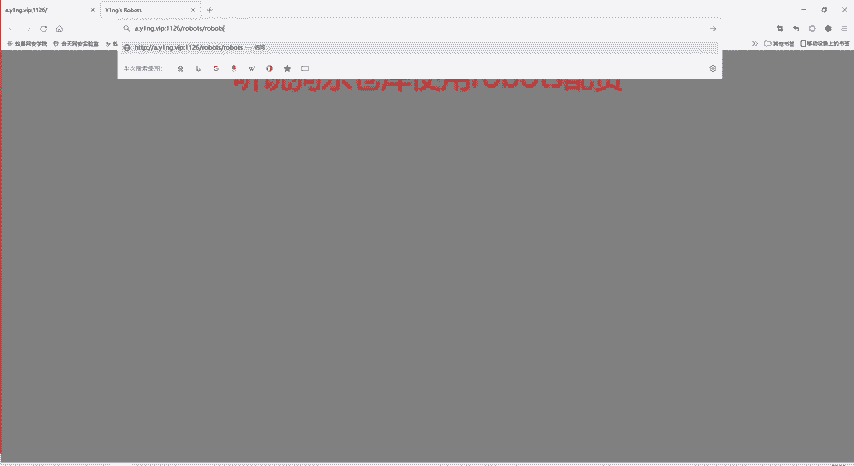
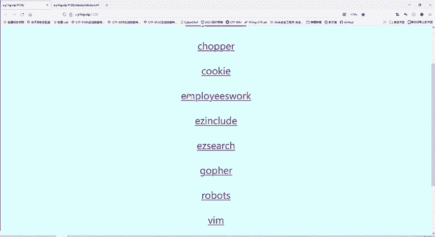
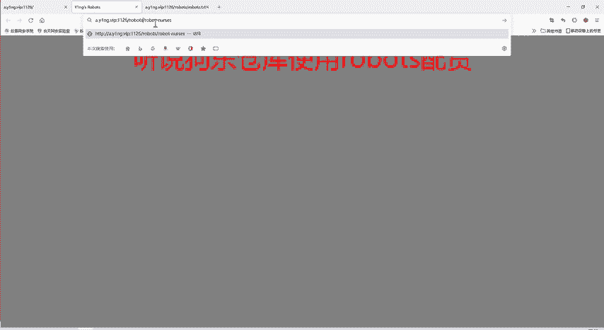
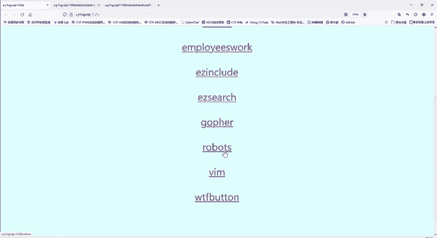

# CTF教程：P49：robots协议 🕷️

在本节课中，我们将要学习CTF Web类题目中一个常见的知识点——`robots`协议。我们将通过一道具体的题目，理解该协议的作用、格式以及如何利用它来发现隐藏的敏感信息或Flag。



---



## 协议简介

上一节我们介绍了HTTP协议中的一些基础概念，本节中我们来看看`robots`协议。`robots`协议，也称为爬虫协议或机器人协议，是网站所有者用来告知网络爬虫（如搜索引擎的蜘蛛程序）哪些目录或文件可以被抓取，哪些不可以的规范。





它通过在网站根目录下放置一个名为 `robots.txt` 的文本文件来实现。该协议本质上是一个“君子协议”，它依靠爬虫的自觉遵守，而非强制性的技术限制。

## 题目分析

我们来看今天的第二道题目。题目提示信息提到“狗东仓库使用robots配货”，并且标题中也反复出现“robots”。然而，直接访问网页或查看其源代码，均未发现明显的Flag信息。



以下是初步检查的步骤：
1.  访问题目给出的网页。
2.  查看网页源代码。
3.  在源代码中搜索“flag”等关键词。



经过搜索，确认页面中不存在“flag”字段。这表明Flag可能被隐藏在了其他路径下。

## 解题步骤

这道题的核心是考察对`robots`协议的理解。既然题目反复提及`robots`，我们应尝试访问网站根目录下的 `robots.txt` 文件。

访问路径通常为：`http://题目域名/robots.txt`

以下是访问后可能看到的内容示例：
```
User-agent: *
Disallow: /secret_file.html
Disallow: /hidden_folder/
```
这段代码的含义是：
*   `User-agent: *`： 该规则适用于所有爬虫（`*` 是通配符）。
*   `Disallow: /secret_file.html`： 禁止爬取 `/secret_file.html` 这个文件。
*   `Disallow: /hidden_folder/`： 禁止爬取 `/hidden_folder/` 这个目录下的所有内容。

根据协议，网站管理者声明了这些路径不允许被爬取，这往往意味着这些路径下可能存放着敏感或不想被公开访问的信息，在CTF题目中，就很可能藏着Flag。



因此，解题思路是：访问 `robots.txt` 文件中 `Disallow` 规则所指定的路径。



## 获取Flag

在本题中，我们访问 `robots.txt` 后，发现了被禁止访问的路径。直接通过浏览器访问该路径，页面可能看似空白或内容异常。

此时，需要查看该页面的源代码。因为开发者有时会将关键信息（如Flag）以HTML注释的形式隐藏在源代码中。

在本题的页面源代码底部，我们找到了隐藏的Flag。Flag的键名可能不是标准的“flag”，而是与题目相关的其他词汇，例如“YNG_robot”，需要进行搜索来定位。

## 核心概念与总结

本节课中我们一起学习了`robots`协议及其在CTF中的应用。

**核心概念**：
*   **协议文件**：`robots.txt`，位于网站根目录。
*   **核心指令**：
    *   `User-agent`: 指定规则适用的爬虫（`*` 表示所有）。
    *   `Disallow`: 指定不允许爬取的路径。
*   **解题思路**：当题目提示或涉及爬虫、协议时，尝试访问 `/robots.txt`，并检查其中 `Disallow` 的路径，往往能发现隐藏的入口或Flag。



**总结**：`robots`协议是网站与爬虫之间的沟通规则。在CTF Web题目中，它常作为信息泄露的突破口。理解并检查 `robots.txt` 文件，是解决此类题目的关键第一步。