# CTF教程：P4：ctf-web03_变量覆盖问题 🔄

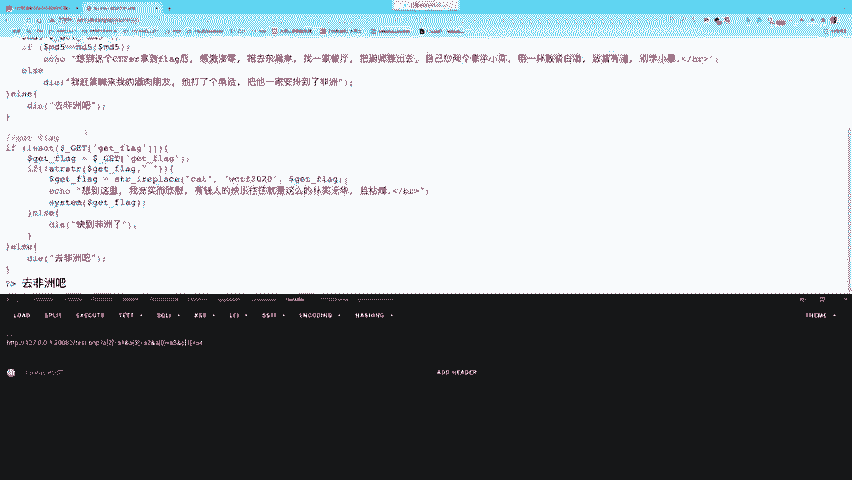

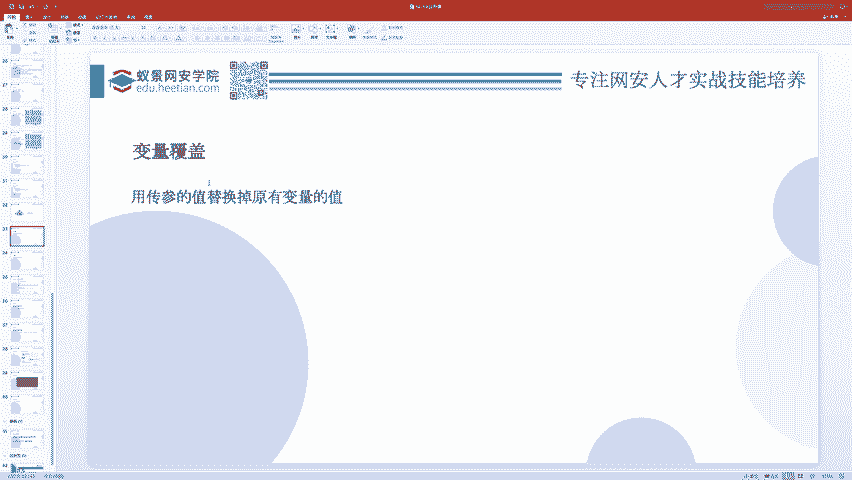

在本节课中，我们将要学习CTF Web安全中的一个重要概念：变量覆盖问题。我们将了解什么是变量覆盖，它如何发生，以及如何利用它来发现和利用安全漏洞。

## 什么是变量覆盖？🤔

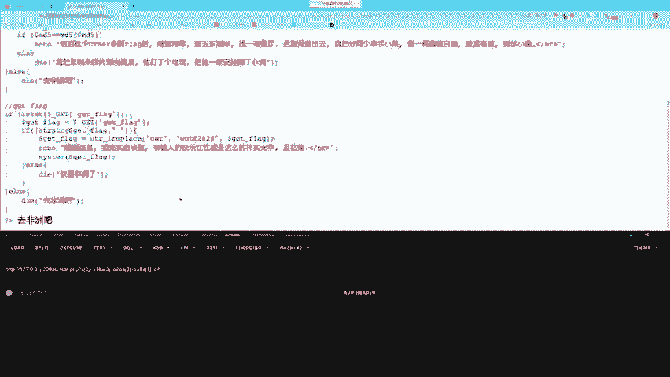

变量覆盖是指通过某种方式改变一个已存在变量的值，或者创建一个新的变量。在PHP中，变量可以被定义和赋值。例如，我们定义一个变量 `$A` 并赋值为 `ABC`。

```php
$A = "ABC";
```

如果我们随后将 `$A` 的值覆盖为 `DEF`，那么 `$A` 的值就变成了 `DEF`，与最初的 `ABC` 再无关系。

```php
$A = "DEF"; // 变量 $A 被覆盖
```

变量覆盖本身并不危险。危险之处在于，如果后续的代码逻辑依赖于被覆盖的变量，并且执行了危险操作，就可能引发安全问题。

## 导致变量覆盖的关键函数 🔧

在PHP中，有几个函数容易引发变量覆盖问题。其中最重要的是 `extract()` 和 `parse_str()` 函数。

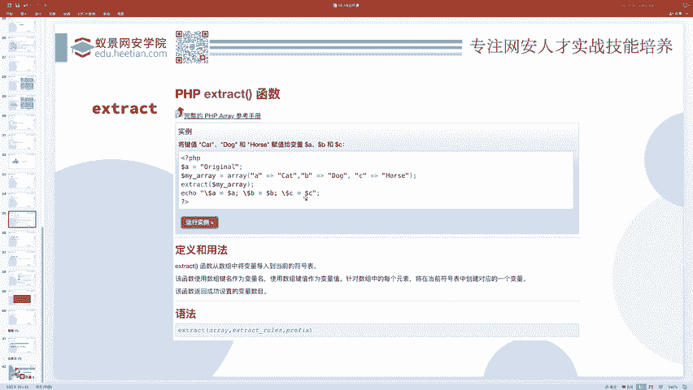

### 1. extract() 函数

`extract()` 函数的作用是将一个数组转换为变量。数组的“键”（key）会成为变量名，数组的“值”（value）会成为该变量的值。

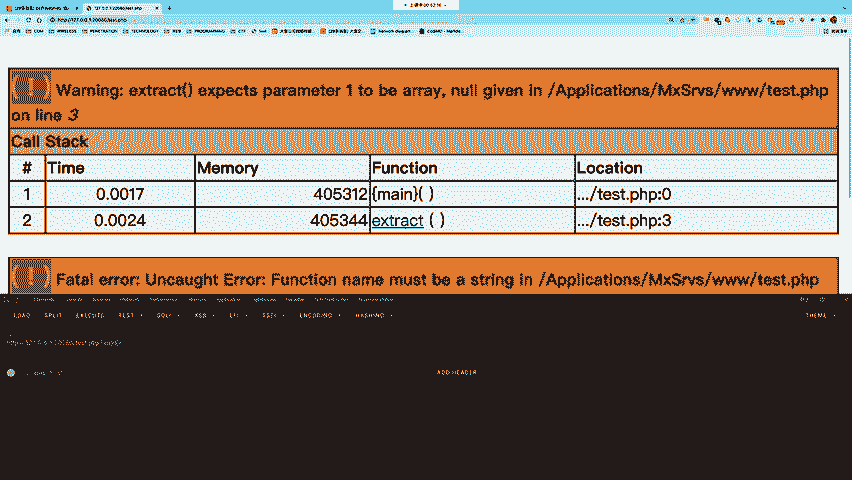

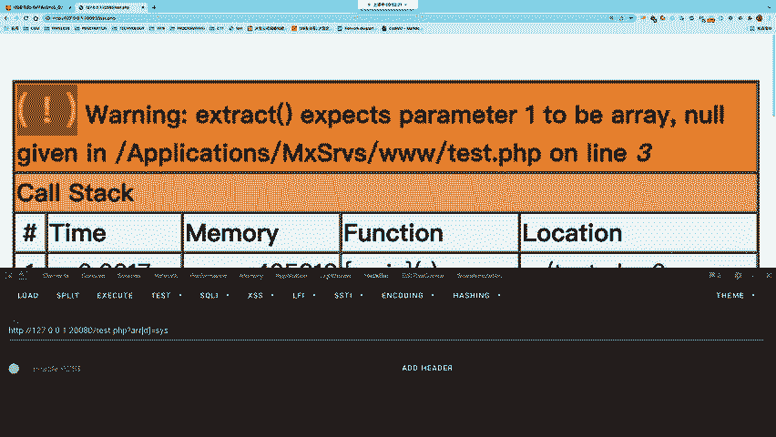

**公式/代码描述：**
```php
extract(array $array);
```

例如，执行以下代码：
```php
$A = "original";
$my_array = array("A" => "cat", "B" => "dog", "C" => "horse");
extract($my_array);
echo $A; // 输出：cat
echo $B; // 输出：dog
echo $C; // 输出：horse
```
在这个例子中，`extract()` 函数创建了变量 `$B` 和 `$C`，并覆盖了已存在的变量 `$A` 的值。

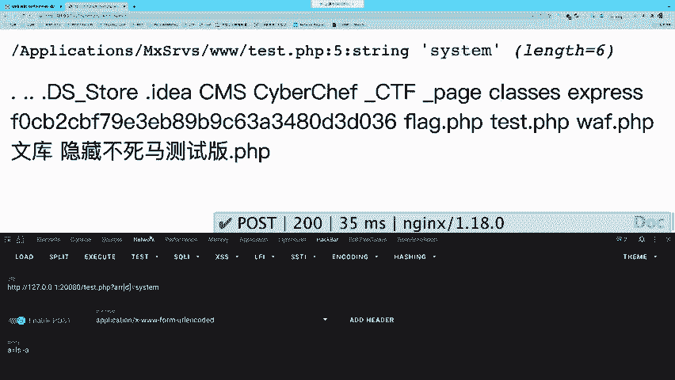

**安全问题：**
如果 `extract()` 处理的数组来自用户可控的输入（如 `$_GET` 或 `$_POST`），攻击者就可以精心构造数据来覆盖程序内部重要的变量。

上一节我们介绍了 `extract()` 函数的基本原理，本节中我们来看看一个具体的危险示例。

考虑以下代码：
```php
$arr = $_GET['arr']; // 用户可控输入
extract($arr);
$D($A); // 动态函数调用
```
攻击者可以传入 `?arr[D]=system&arr[A]=ls`。经过 `extract()` 后，`$D` 变成了 `system`，`$A` 变成了 `ls`。代码 `$D($A)` 就等价于 `system("ls")`，从而执行了系统命令。

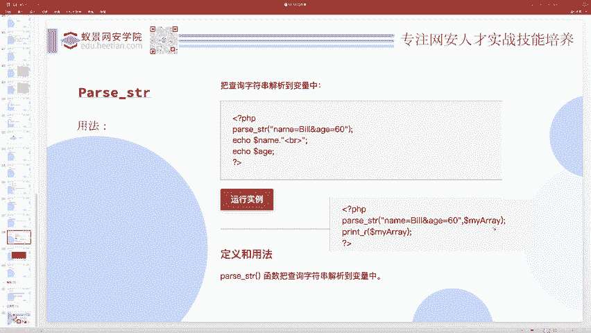

### 2. parse_str() 函数

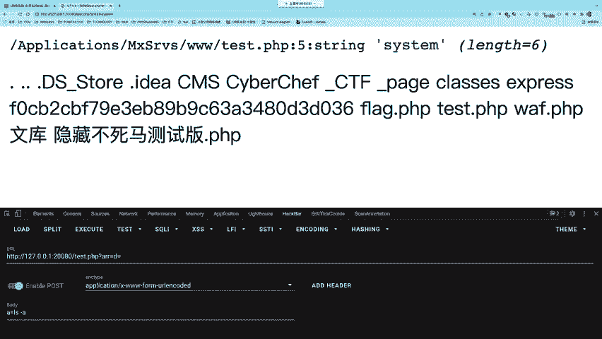

`parse_str()` 函数用于将查询字符串（类似URL参数）解析到变量中。

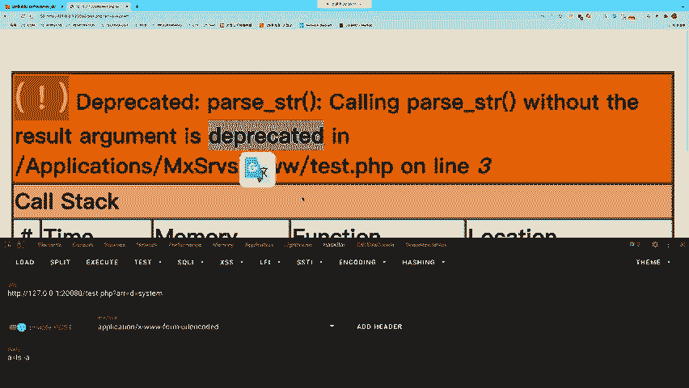

**公式/代码描述：**
```php
parse_str(string $string, array &$result);
```

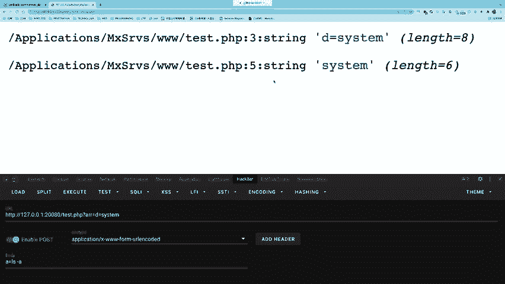

例如：
```php
parse_str("name=Bob&age=60", $output);
echo $output['name']; // 输出：Bob
echo $output['age']; // 输出：60
```
如果不提供第二个数组参数，它会直接创建变量：
```php
parse_str("name=Bob&age=60");
echo $name; // 输出：Bob
echo $age; // 输出：60
```

**安全问题：**
与 `extract()` 类似，如果 `parse_str()` 处理的字符串来自用户输入，攻击者就可以覆盖已有变量或创建新变量。

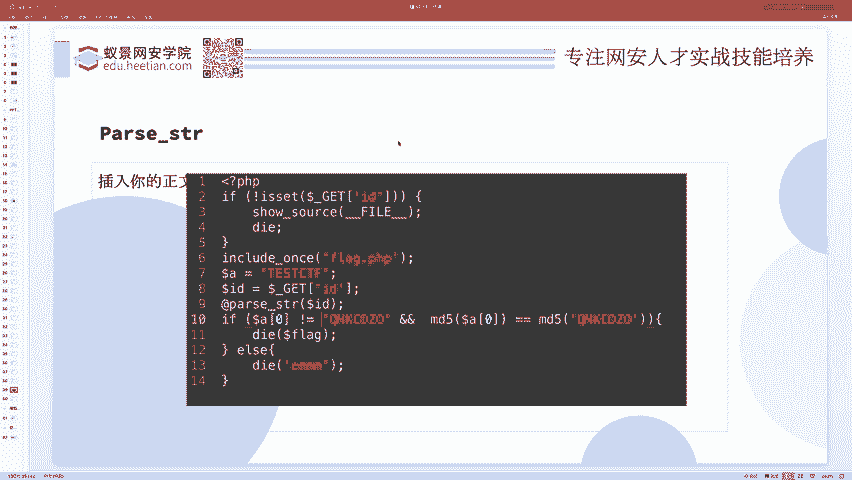

以下是一个利用 `parse_str()` 的示例：
```php
$arr = $_GET['arr'];
parse_str($arr);
$D($A); // 动态函数调用
```
攻击者传入 `?arr=D=system&A=ls`，即可达到与上一个 `extract()` 例子相同的攻击效果。

## 综合案例分析 🧩

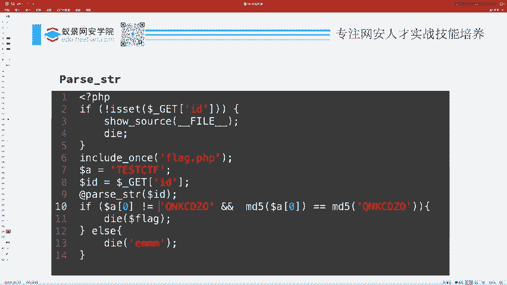

现在，我们将前面学到的知识应用到一个稍微综合的CTF题目中，以加深理解。

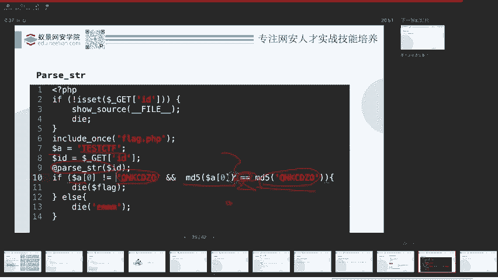

假设有以下PHP代码：
```php
$A = "TCTF";
parse_str($_GET['id']);
if ($A[0] != 'QNKCDZO' && md5($A[0]) == md5('QNKCDZO')) {
    echo "flag{you_got_it}";
}
```

**题目分析：**
这段代码的逻辑是：
1.  初始设置 `$A = "TCTF"`。
2.  通过 `parse_str($_GET['id'])` 解析用户传入的 `id` 参数，这可能导致变量覆盖。
3.  进行条件判断：`$A[0]`（即 `$A` 数组的第一个元素或字符串的第一个字符）不能等于字符串 `'QNKCDZO'`，但它们的MD5哈希值必须相等（使用弱比较 `==`）。

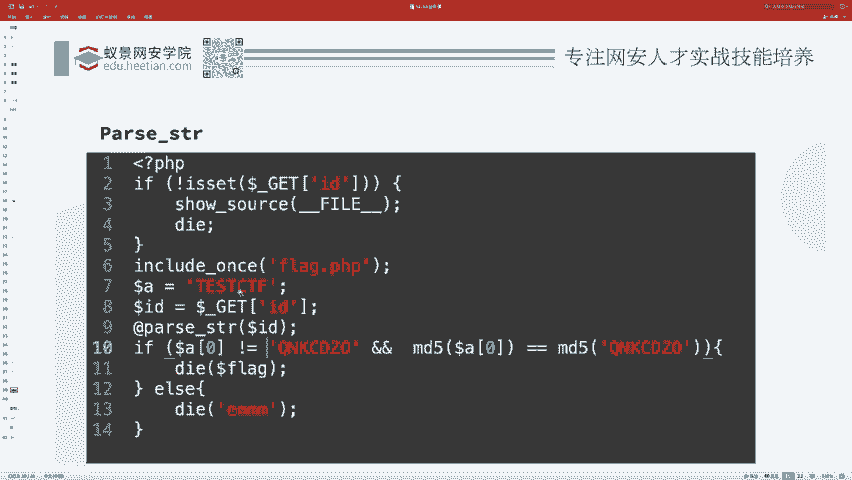

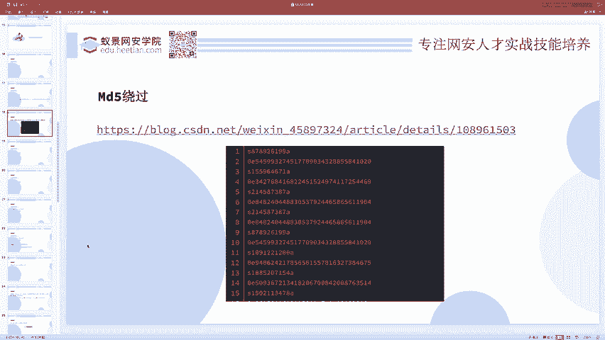

**解题思路：**
1.  **利用变量覆盖**：我们需要通过 `parse_str()` 将 `$A` 覆盖成一个数组，因为代码中使用了 `$A[0]` 的语法。我们可以构造 `id` 参数为 `A[]=payload`。这样 `parse_str()` 后，`$A` 就变成了一个数组，其第一个元素 `$A[0]` 是我们设置的 `payload`。
2.  **利用MD5弱类型比较**：我们已知 `md5('QNKCDZO')` 的结果是 `0e830400451993494058024219903391`，这是一个以 `0e` 开头的科学计数法字符串。在PHP弱比较（`==`）中，它会被视为数字 `0`。因此，我们需要找到一个字符串，其MD5值也是以 `0e` 开头的纯数字形式，例如 `s1091221200a`（其MD5为 `0e940624217896561166816700384135`）。
3.  **构造最终Payload**：结合以上两点，我们构造的GET请求应为：
    ```
    ?id=A[]=s1091221200a
    ```
    解析后，`$A` 是数组 `['s1091221200a']`，`$A[0]` 是 `s1091221200a`。
    *   条件1：`$A[0] != 'QNKCDZO'` 成立。
    *   条件2：`md5($A[0]) == md5('QNKCDZO')` 成立，因为两者MD5的弱比较结果都是 `0`。
    因此，程序会输出flag。

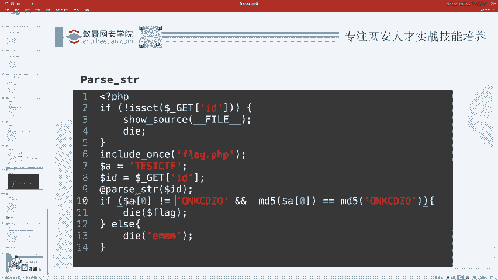

## 总结 📝

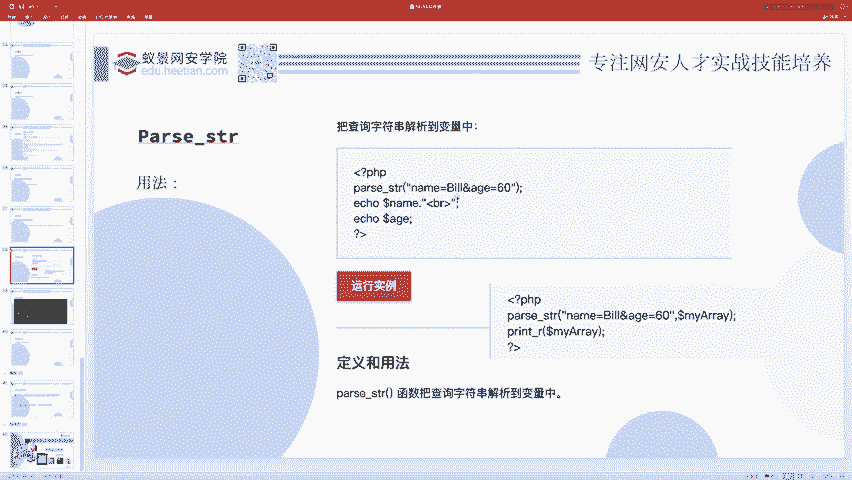

本节课中我们一起学习了CTF Web安全中的变量覆盖问题。

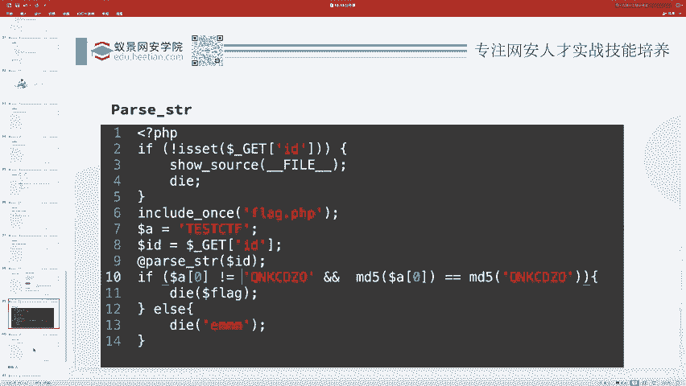

*   **核心概念**：变量覆盖是指改变已有变量的值或创建新变量，其危险性在于后续代码可能依赖这些被篡改的变量执行危险操作。
*   **关键函数**：我们重点研究了 `extract()` 和 `parse_str()` 这两个容易引发变量覆盖的PHP函数。
*   **利用方式**：当这些函数处理用户可控的输入时，攻击者可以构造恶意数据来覆盖关键变量，常与动态函数调用、代码执行等漏洞结合产生危害。
*   **综合实践**：我们分析了一道结合变量覆盖和MD5弱类型比较的CTF题目，演示了如何一步步构造利用链来解决问题。

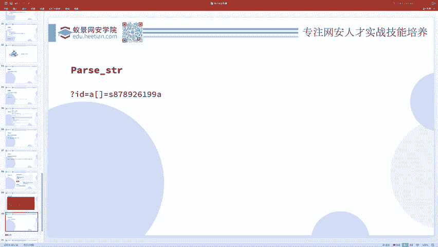

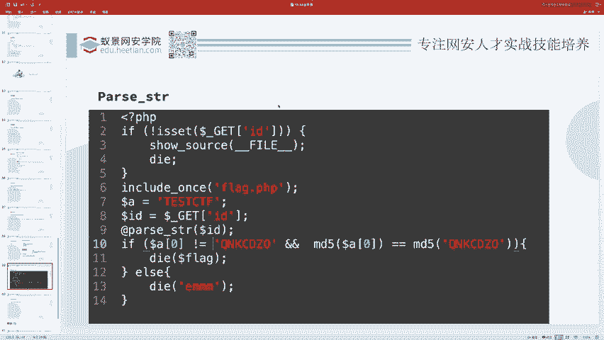

理解变量覆盖的原理，能帮助你更敏锐地发现代码中的潜在风险，是Web安全审计中一项重要的基础技能。