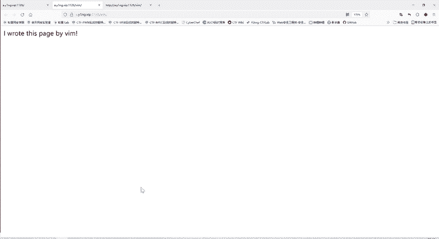
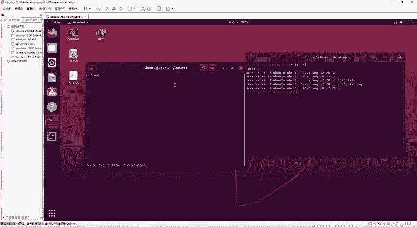
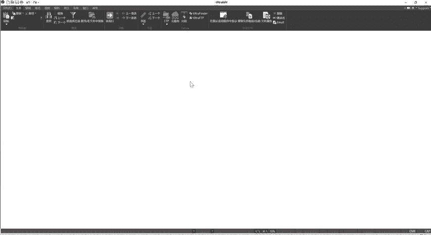
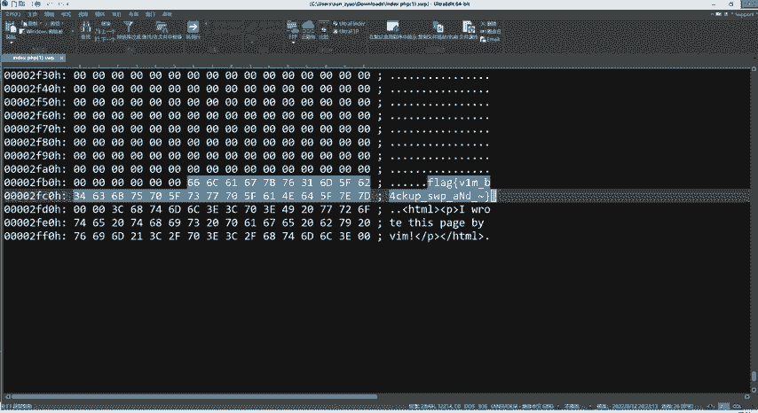
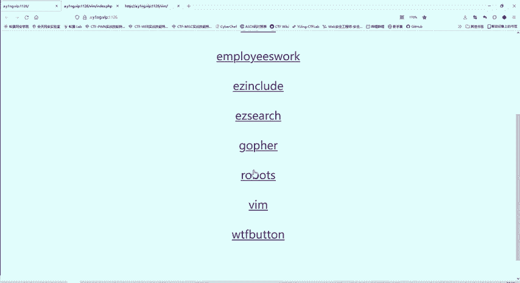

# CTF教程：P50：VIM隐藏flag

在本节课中，我们将要学习一个与VIM编辑器相关的CTF Web挑战。这个挑战的核心是理解VIM编辑器在异常退出时会自动生成一个特殊的备份文件，而flag就隐藏在这个文件中。

## 挑战背景

题目提示“I wrote this page by VIM”，表明当前网页是使用VIM编辑器编写的。直接查看网页源代码，无法找到任何flag信息。这提示我们需要从VIM编辑器的特性入手。

## VIM编辑器特性解析

上一节我们介绍了挑战的背景，本节中我们来看看VIM编辑器的关键特性。

VIM（或VI）是Linux系统中常用的文本编辑器。当使用VIM编辑一个文件时，它会自动创建一个隐藏的备份文件，用于在异常情况下恢复数据。

这个备份文件的命名规则是：**`.原文件名.swp`**。

例如，编辑 `note.txt` 文件时，VIM会创建 `.note.txt.swp` 这个隐藏文件。正常退出（使用 `:wq` 命令）时，此文件会被自动删除。但如果VIM异常退出（如直接关闭终端或系统崩溃），这个 `.swp` 文件就会被保留下来。

## 解题思路

理解了VIM的特性后，解题思路就变得清晰了。我们需要找到题目网页对应的源文件，并尝试访问其可能存在的 `.swp` 备份文件。

1.  **确定源文件名**：通常，Web服务器有默认的索引文件，例如 `index.php` 或 `index.html`。通过访问 `index.php`，确认其内容与题目页面一致。
2.  **构造备份文件路径**：根据VIM备份文件的命名规则，尝试访问 `.index.php.swp`。
3.  **下载并分析文件**：如果该文件存在，服务器通常会将其作为普通文件提供下载。下载后，用文本编辑器打开，即可在其中寻找flag。

以下是具体操作步骤：

*   **步骤一**：访问 `index.php`，确认其为题目源文件。
*   **步骤二**：直接访问 `/.index.php.swp`。
*   **步骤三**：浏览器会下载该 `.swp` 文件。使用文本编辑器（如VS Code、Notepad++）打开此文件。
*   **步骤四**：在文件内容中搜索 `flag` 或 `CTF` 等关键词，即可找到隐藏的flag。

## 工具辅助

在实际解题中，可以使用浏览器插件（如Wappalyzer）快速分析网站的技术栈，例如判断其使用的是PHP、Java还是其他语言，这有助于我们更准确地猜测默认的源文件名。

## 总结

本节课中我们一起学习了如何利用VIM编辑器的特性解决CTF挑战。核心要点是记住VIM在异常退出时会生成 **`.原文件名.swp`** 备份文件。在CTF Web题目中，如果提示与VIM相关，尝试寻找并下载此类备份文件，往往是找到flag的关键。