# CTF教程：P51：wtfbutton

## 概述
在本节课中，我们将学习如何解决一道名为“wtfbutton”的CTF Web题目。这道题的核心是理解网页元素的禁用状态，并学会通过修改网页元素或直接提交POST请求来获取flag。

---

## 题目分析 🧐

题目要求点击一个按钮来获取flag。然而，尝试点击页面上的按钮时，发现按钮没有反应，无法点击。

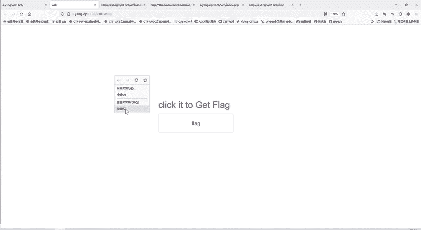

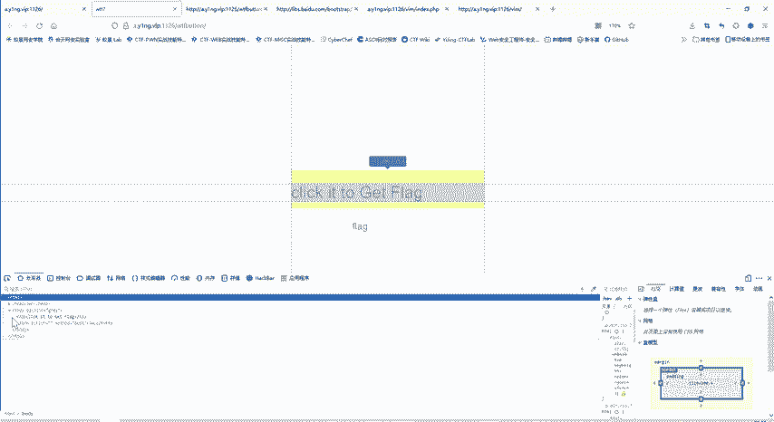

首先，我们查看网页源代码，搜索关键词“flag”。搜索结果有两项：一项是提示“点击它获取flag”，另一项是一个`<input>`标签，其`value`属性值为“flag”。但flag的具体内容仍未出现。

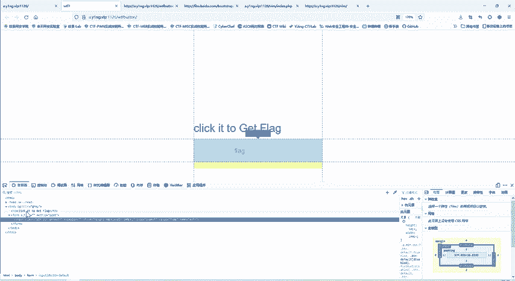

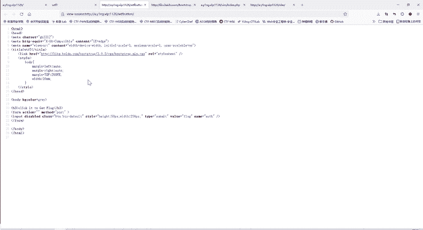

接着，我们检查源代码中是否存在指向其他页面的链接。发现一个链接，但访问该链接并在其内容中搜索“flag”后，找到的内容不符合flag的标准格式。因此，flag不在此链接中。

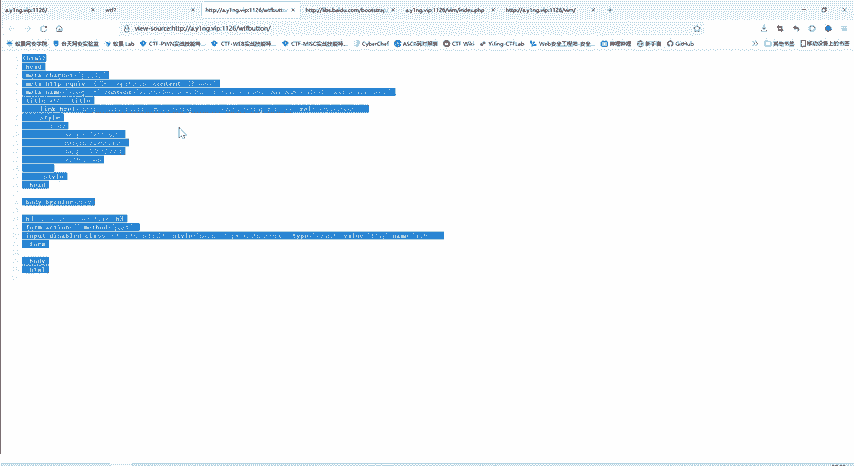

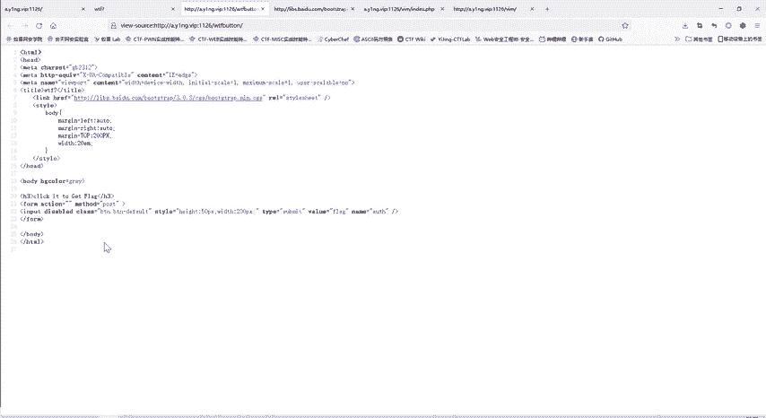

我们回到题目页面的源代码，重点关注`<body>`部分。其中包含一个表单（`<form>`），其提交方法（`method`）被设置为`POST`。表单内有一个提交按钮（`<input type="submit" value="flag" name="ws">`），但该按钮被设置为`disabled`（禁用）状态。这就是按钮无法点击的原因。

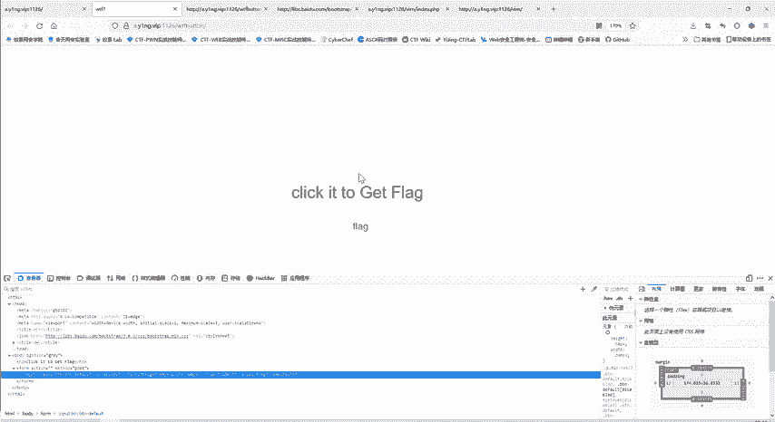

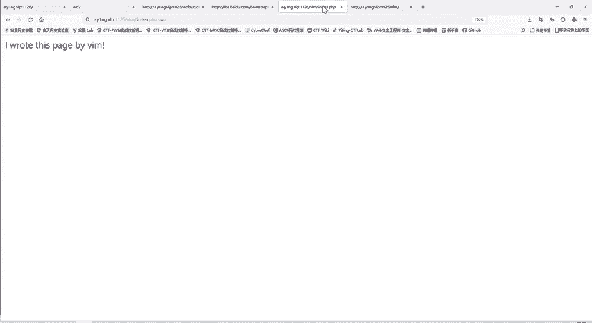

## 解决方案 💡

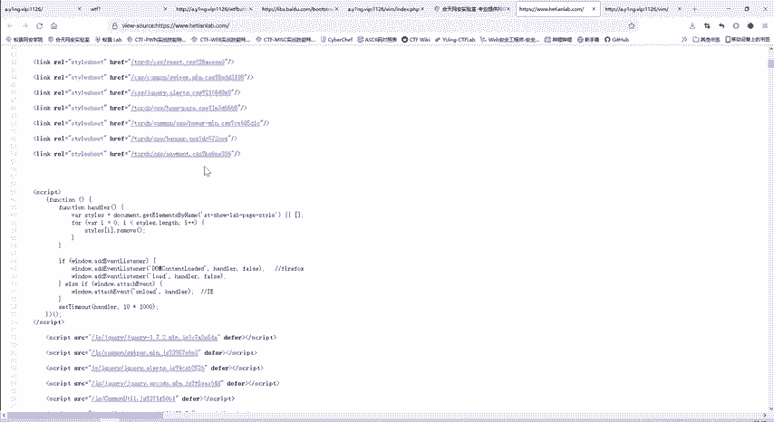

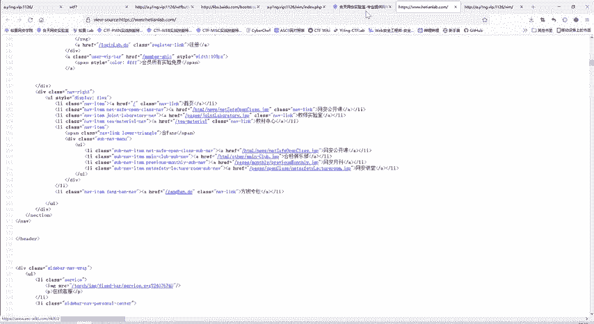

### 方法一：修改网页元素
既然按钮因`disabled`属性而失效，我们可以通过浏览器的开发者工具来修改这个属性。

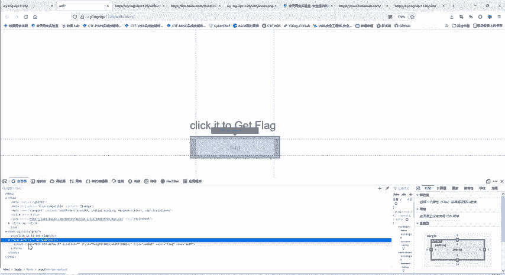

以下是操作步骤：
1.  在页面上点击鼠标右键，选择“检查”或“审查元素”。
2.  在打开的开发者工具中，切换到“元素”或“查看器”标签页。
3.  使用元素选择工具（通常是一个箭头图标）点击页面上的禁用按钮，代码视图会自动定位到对应的`<input>`元素。
4.  在代码中找到`disabled`属性，并将其删除。
5.  此时，页面上的按钮变为可点击状态。点击该按钮，即可提交表单并显示flag。

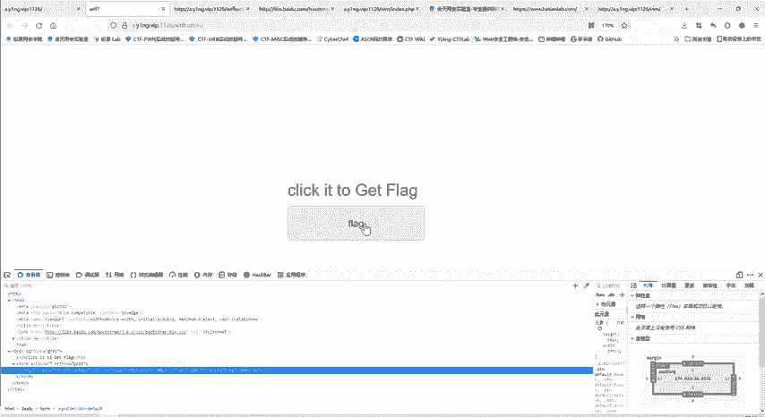

### 方法二：直接提交POST请求
除了修改前端元素，我们也可以直接模拟表单的提交行为，向服务器发送一个POST请求。


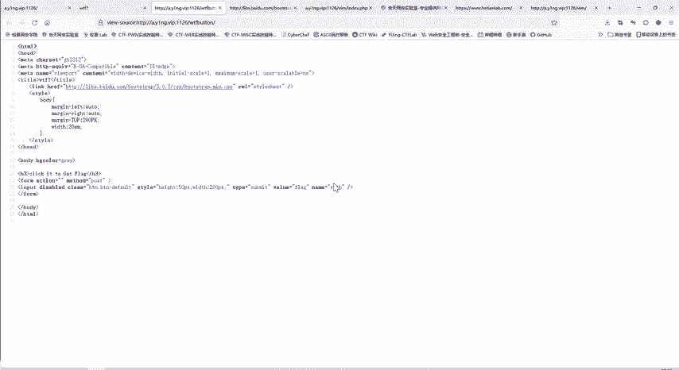

我们可以使用浏览器插件（如HackBar）来构造并发送请求。以下是操作步骤：
1.  确保已安装类似HackBar的浏览器扩展。
2.  打开题目页面，激活HackBar插件。
3.  在URL栏中填入题目的地址。
4.  将请求方法设置为`POST`。
5.  在POST数据栏中，填入表单要求的数据：`ws=flag`。
6.  点击“执行”按钮发送请求，响应中便会包含flag信息。

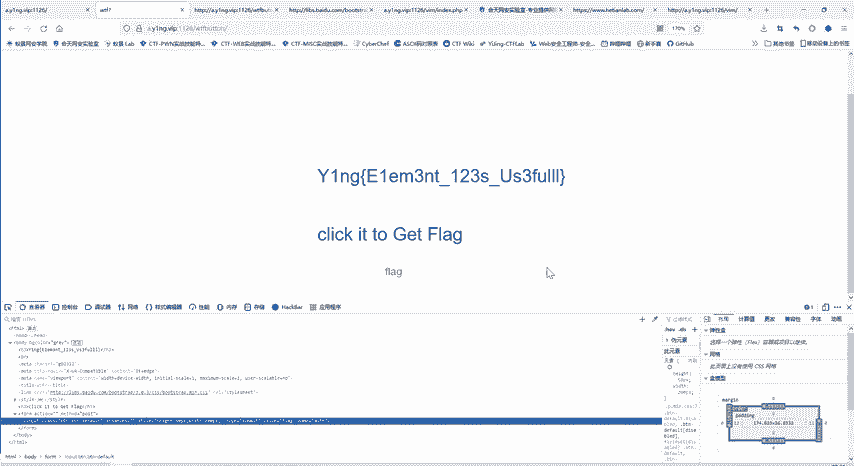

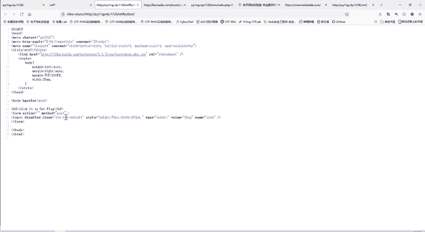

这两种方法本质相同，都是向服务器提交了`name`为`ws`、`value`为`flag`的POST数据。

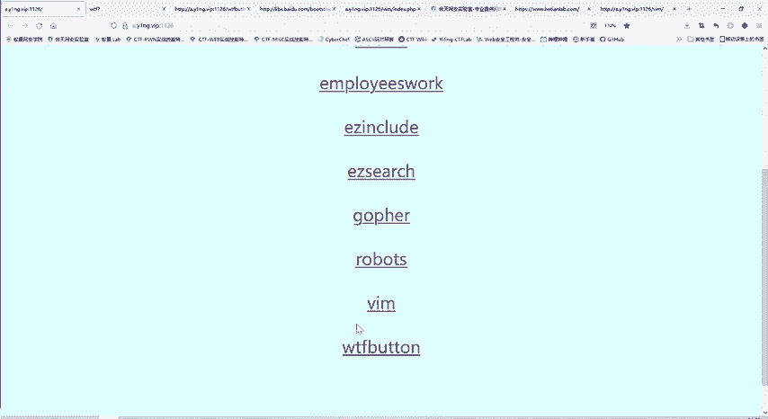

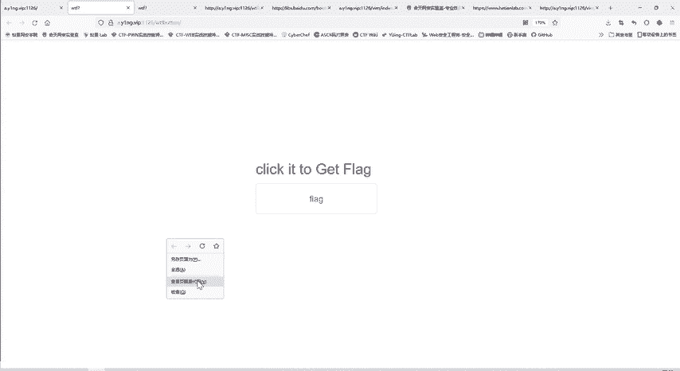

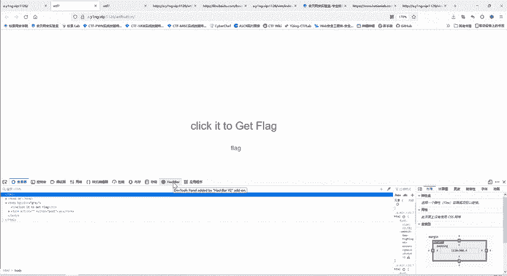

## 核心概念总结 📚
本节课我们主要接触了两个关键概念：

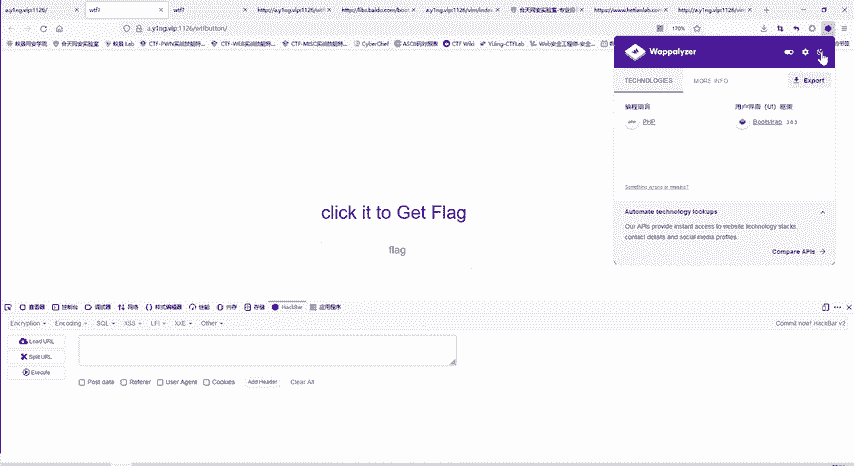

1.  **HTML表单与提交**：表单通过`<form>`标签定义，其`method`属性决定提交方式（GET或POST）。表单内的`<input>`元素用于收集用户输入。
    *   **代码示例**：
        ```html
        <form method="POST" action="#">
          <input type="submit" name="ws" value="flag">
        </form>
        ```

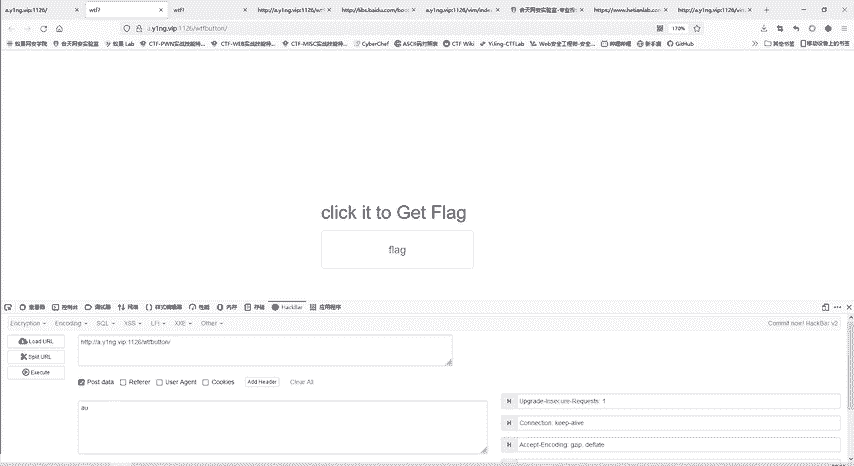

2.  **前端验证绕过**：题目通过`disabled`属性进行前端验证，阻止用户点击。这种验证仅在浏览器端生效，可以通过修改DOM（文档对象模型）或直接发送网络请求来绕过。
    *   **核心操作**：删除`<input>`标签中的`disabled`属性。

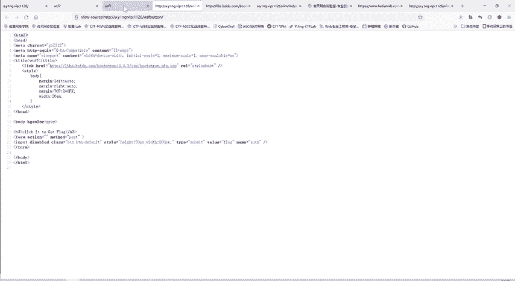

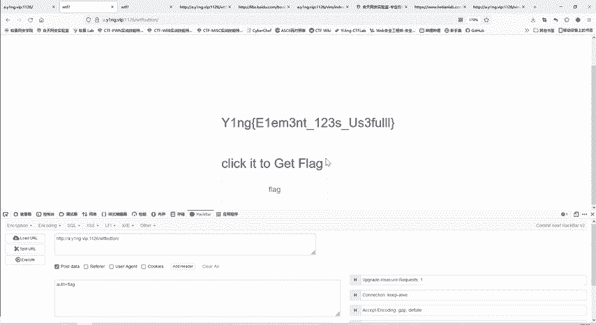

## 总结
在本节课中，我们一起学习了如何解决“wtfbutton”这道CTF题目。我们首先分析了按钮失效的原因——`disabled`属性，然后掌握了两种解决方案：使用开发者工具修改网页元素属性，以及使用工具直接发送构造好的POST请求。这道题提醒我们，前端进行的安全控制（前端验证）往往很容易被绕过，不能作为唯一的安全依赖。