# CTF教程：P5：ctf-web04_命令执行漏洞 🛡️

在本节课中，我们将学习命令执行漏洞。这是一种常见的Web安全漏洞，攻击者可以利用它让Web应用程序执行非预期的操作系统命令。我们将从漏洞的原理、产生条件、危害以及利用方式等方面进行详细讲解。

## 命令执行漏洞原理

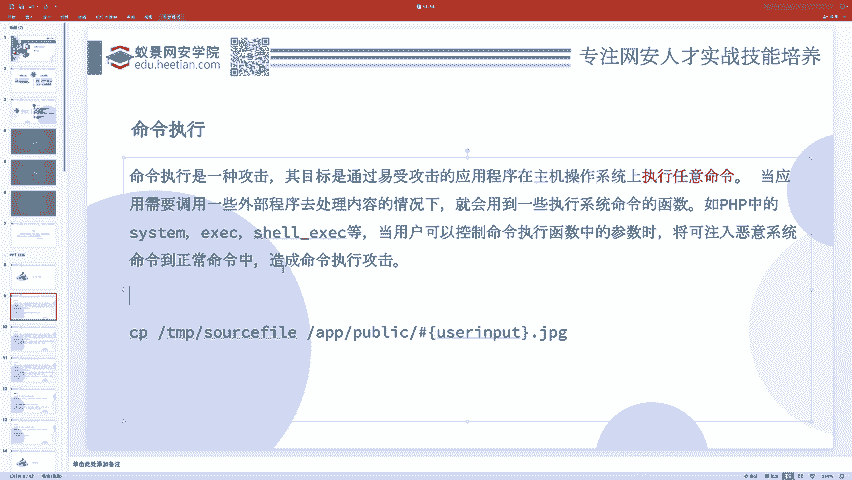

上一节我们介绍了Web安全的基本概念，本节中我们来看看命令执行漏洞。

命令执行是一种攻击，其目标是通过存在漏洞的应用程序，在主机操作系统上执行任意命令。漏洞的本质在于应用程序能够执行操作系统的命令。

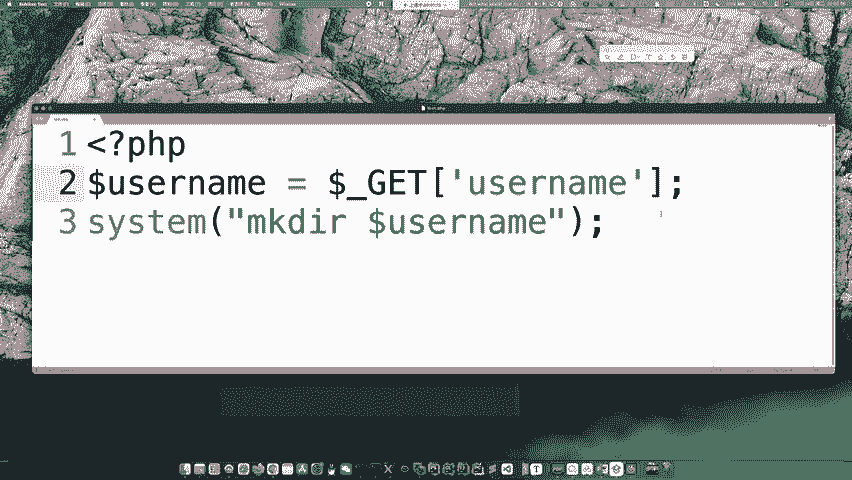

## 漏洞产生条件

命令执行漏洞的发生需要满足特定条件。

以下是漏洞产生的两个核心条件：
1.  应用程序中存在可以执行系统命令的函数。
2.  该函数执行的命令内容（或部分内容）可由用户输入控制。

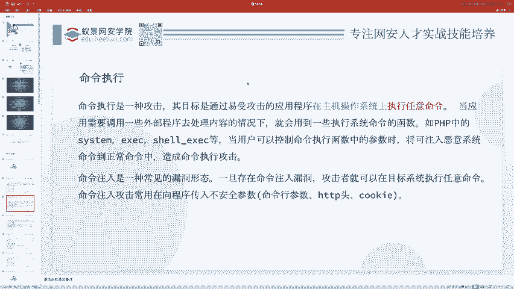

如果执行的命令是固定的、不可变的，则不存在漏洞。只有当命令的一部分（例如参数）来自用户输入，并且没有经过严格的安全检查时，攻击者才能注入恶意命令。

## 漏洞示例与危害

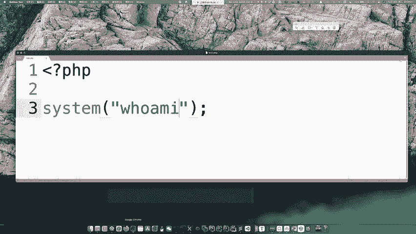

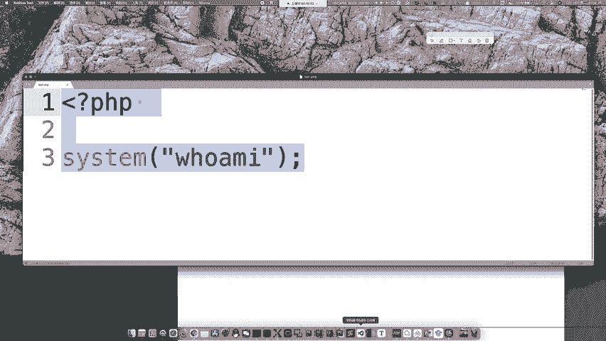

为了理解漏洞如何发生，我们来看一个例子。

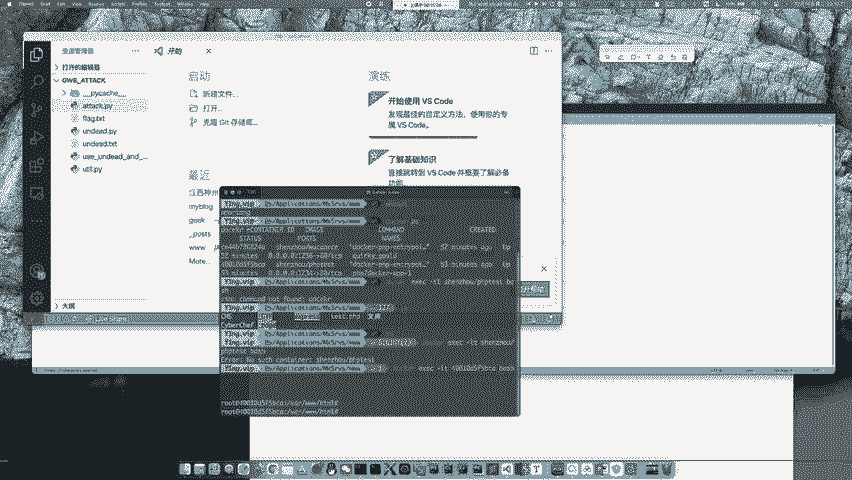

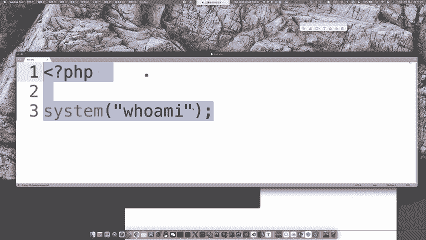

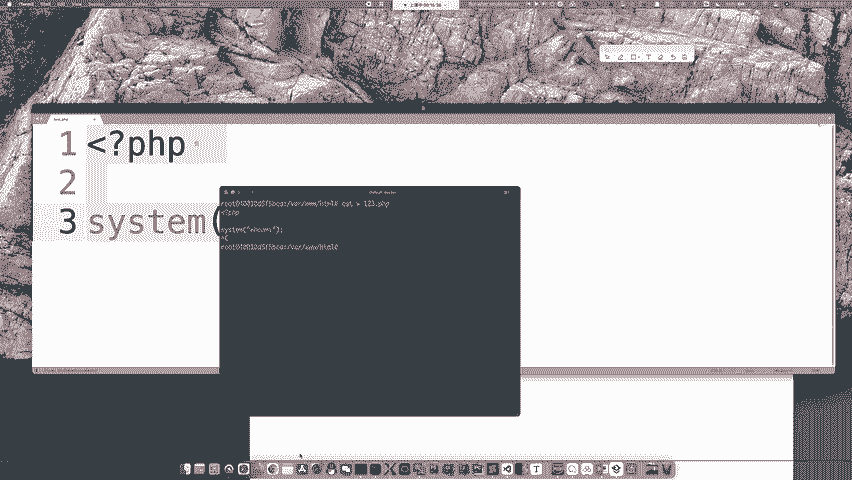

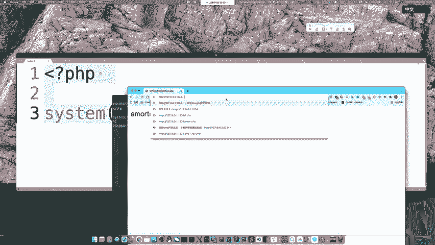

假设一段PHP代码如下：
```php
$username = $_GET['username'];
system("mkdir " . $username);
```
这段代码意图是根据用户输入的用户名创建一个目录。正常输入`abc`，则执行命令`mkdir abc`。

然而，如果攻击者输入`abc; cat /flag`，拼接后的命令变为`mkdir abc; cat /flag`。在Linux中，分号`;`用于分隔同一行中的多个命令。因此，系统不仅会创建目录`abc`，还会执行`cat /flag`命令，从而泄露敏感文件内容。


关于漏洞的危害，需要理解执行命令的权限问题。Web应用程序通常以`www-data`等低权限用户身份运行，而非`root`用户。因此，通过命令注入能执行的操作受该用户权限限制。

以下是低权限下仍可进行的危险操作：
*   **读取文件**：查看应用程序源码、配置文件或系统文件（如`/etc/passwd`）。
*   **在可写目录写入文件**：写入Webshell，获取服务器控制权。
*   **反弹Shell**：建立反向连接，进行后续渗透。

## 命令执行相关函数

在PHP中，以下函数可以执行系统命令，当它们的参数用户可控时，就可能存在命令注入漏洞。

以下是常见的命令执行函数：
*   `system()`
*   `exec()`
*   `shell_exec()`
*   `passthru()`
*   `popen()`
*   **反引号 ``**：这是`shell_exec()`的别名。

## 漏洞利用实战

现在，我们通过一个简单的靶场环境来演示如何利用命令注入漏洞。

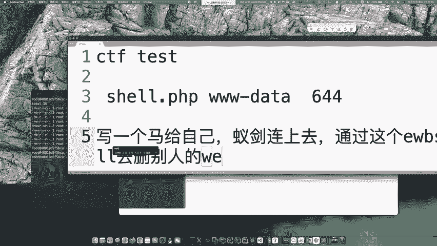

假设存在一个用于测试网络连通性的PHP页面，代码如下：
```php
<?php
if (isset($_GET['ip'])) {
    $ip = $_GET['ip'];
    system("ping -c 4 " . $ip);
} else {
    highlight_file(__FILE__);
}
?>
```
程序接收`ip`参数，并拼接成`ping -c 4 {用户输入}`命令执行。


正常请求`?ip=127.0.0.1`，会执行`ping -c 4 127.0.0.1`。

由于参数`ip`未经任何过滤，攻击者可以注入其他命令。例如，输入`127.0.0.1; ls -la`。

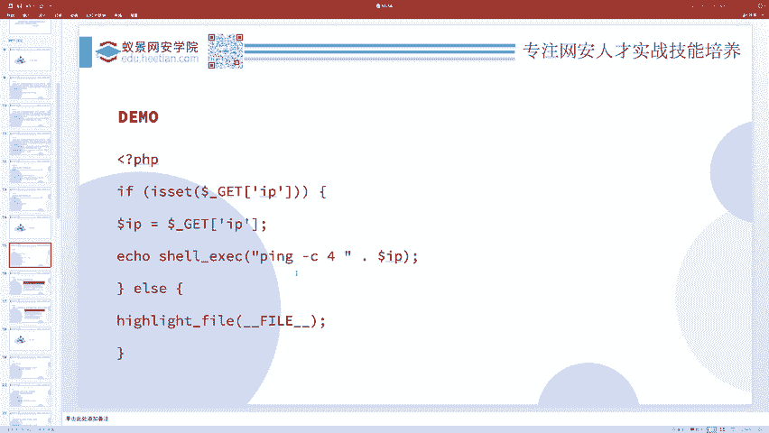

最终执行的命令为`ping -c 4 127.0.0.1; ls -la`。系统会先执行`ping`命令，然后执行`ls -la`命令列出当前目录下的所有文件，从而实现命令注入。

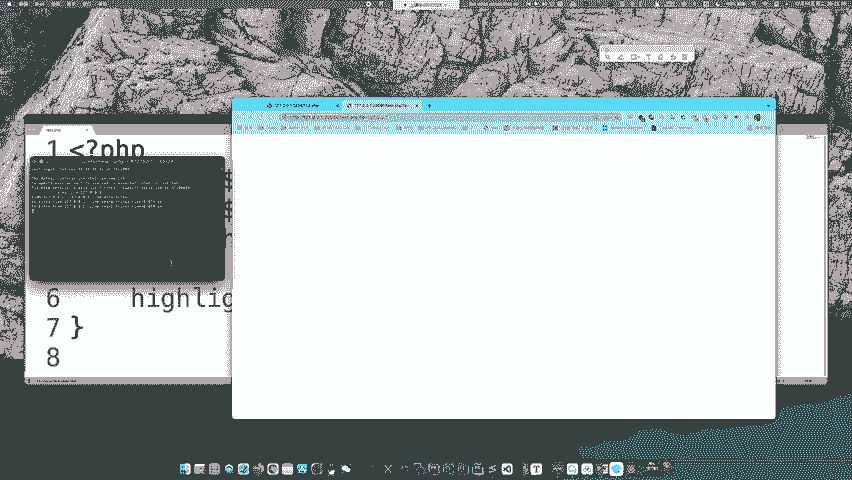

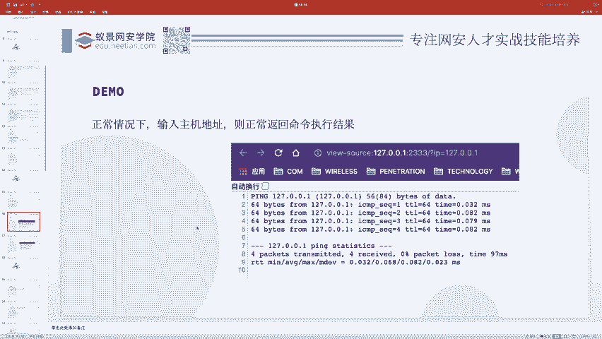

## 课程总结

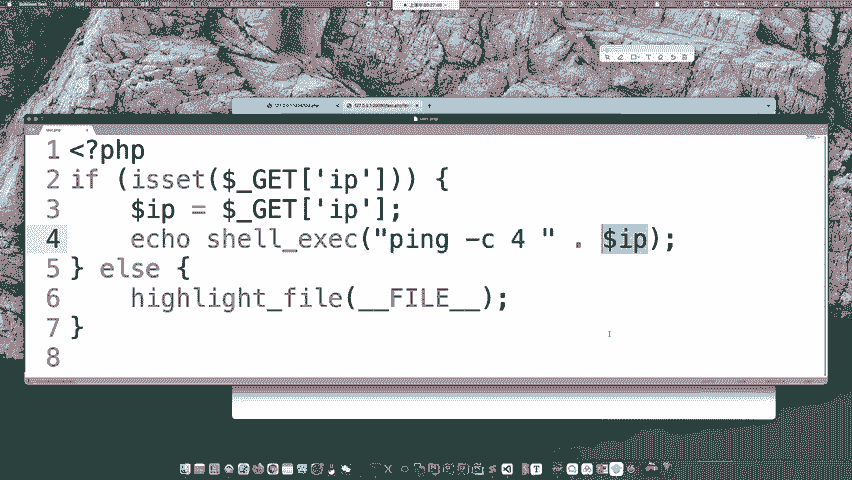

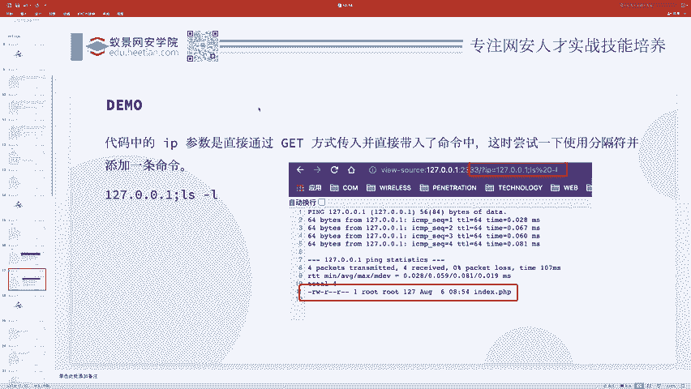

本节课中我们一起学习了命令执行漏洞。我们了解了该漏洞的原理是应用程序执行了用户可控的系统命令。漏洞的产生需要两个条件：存在执行命令的函数且命令内容用户可控。我们通过代码示例分析了漏洞的利用方式，并认识了PHP中常见的危险函数。最后，我们在实战环境中演示了如何通过注入分号`;`来拼接并执行额外的系统命令。理解这些基础知识是识别和防范此类漏洞的关键。