# CTF教程：P62：CSRF漏洞原理、利用与防御 🛡️

在本节课中，我们将要学习CTF中一个常见且重要的Web漏洞——跨站请求伪造。我们将从基本概念入手，通过实例理解其原理，学习如何寻找和利用此类漏洞，并了解常见的防御方法。

## CSRF漏洞简介 🎯

上一节我们介绍了Web安全的基础，本节中我们来看看什么是CSRF。

跨站请求伪造是一种挟持用户在当前已登录的Web应用程序上执行非本意操作的攻击方法。其英文全称为Cross-Site Request Forgery，常与XSS（跨站脚本攻击）进行区分。

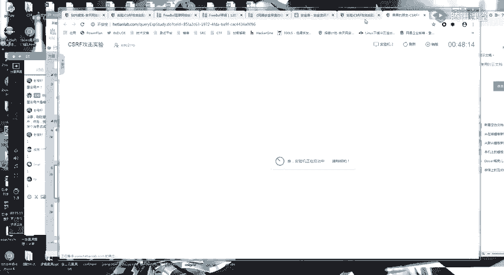

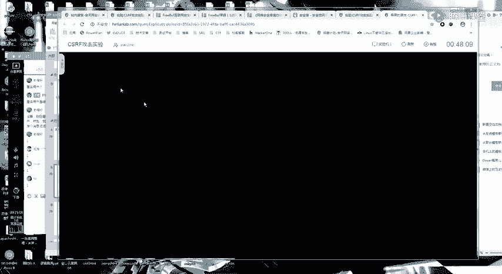

CSRF攻击能够成功，主要基于以下几个关键点：
*   用户的浏览器会保存网站的登录状态（例如通过Cookie）。
*   攻击者可以诱导用户访问一个恶意构造的页面。
*   该恶意页面会向目标网站发起请求，而浏览器会自动携带用户的身份凭证。

## CSRF攻击原理与模型 🔄

理解了基本概念后，我们通过一个模型来深入理解CSRF的攻击流程。

CSRF的攻击模型通常涉及三个角色：用户、受信任的网站A（存在漏洞）和恶意网站B。
1.  用户登录网站A，浏览器保存了A的会话Cookie。
2.  用户在不登出A的情况下，访问了攻击者控制的恶意网站B。
3.  网站B的页面中隐藏了一个指向网站A某个功能（如修改密码、转账）的请求。
4.  用户的浏览器在访问B时，会自动向网站A发送这个请求，并携带A的Cookie。
5.  网站A服务器接收到请求后，验证Cookie有效，便执行了该操作，而用户对此毫不知情。

## CSRF漏洞的利用方式 ⚔️

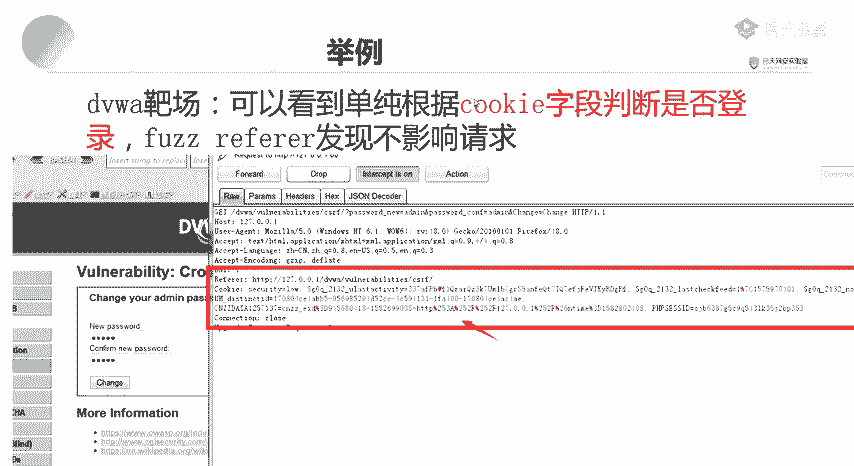

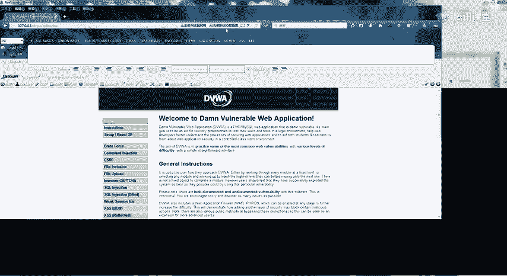

了解了攻击原理，本节中我们来看看攻击者具体如何构造利用代码。CSRF攻击的核心是伪造一个HTTP请求。根据请求方法的不同，利用方式主要分为GET型和POST型。

### GET型CSRF利用

当目标功能使用GET请求时（参数附在URL中），利用最为简单。攻击者只需构造一个包含目标URL的标签，当用户访问恶意页面时，该请求会自动触发。

以下是利用``标签发起GET请求的示例代码：
```html

```

### POST型CSRF利用

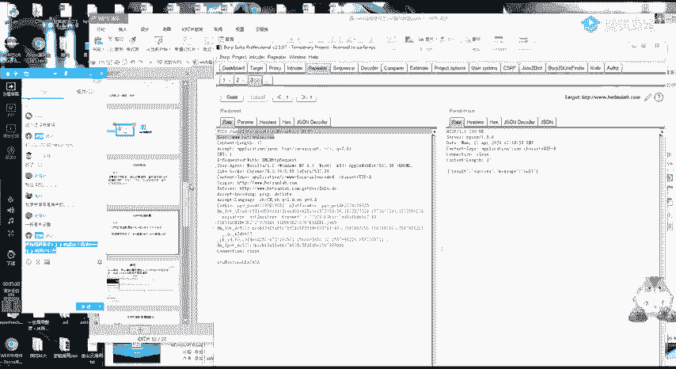

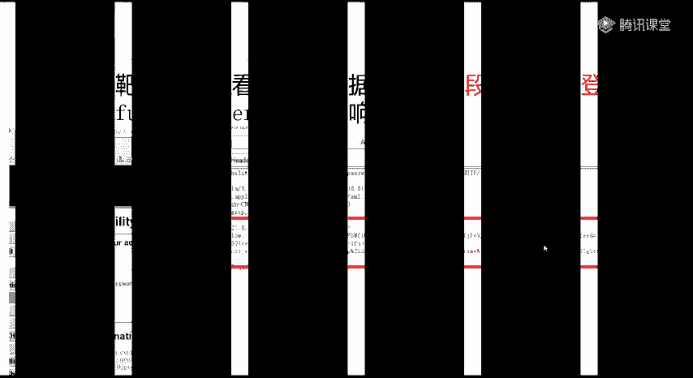

当目标功能使用POST请求时，需要构造一个表单并自动提交。

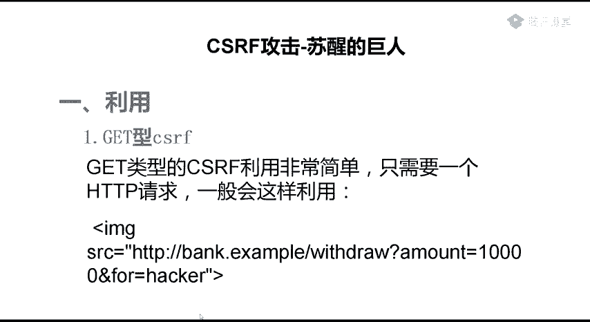

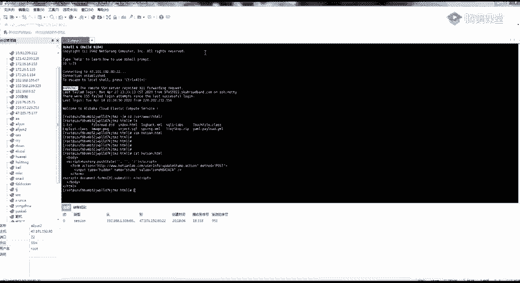

以下是自动提交POST请求的表单示例代码：
```html
<form action="http://vulnerable-site.com/transfer" method="POST" id="csrf_form">
    <input type="hidden" name="amount" value="1000">
    <input type="hidden" name="to_account" value="attacker_account">
</form>
<script> document.getElementById('csrf_form').submit(); </script>
```

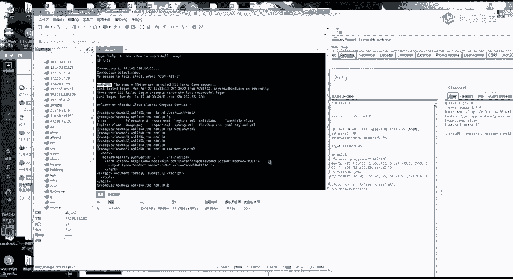


在实际渗透测试中，可以利用Burp Suite等工具自动生成CSRF利用代码（PoC），大大简化了操作流程。

## 如何寻找CSRF漏洞 🔍

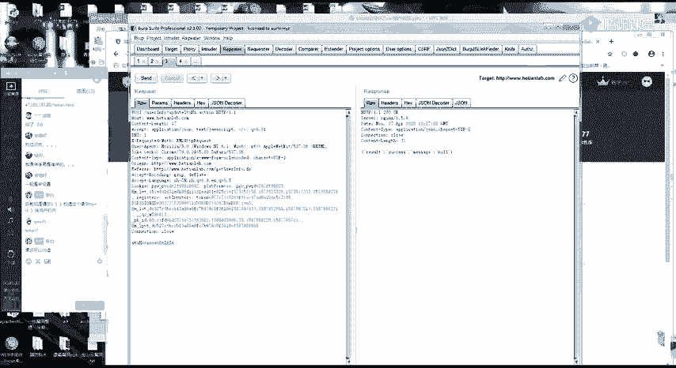

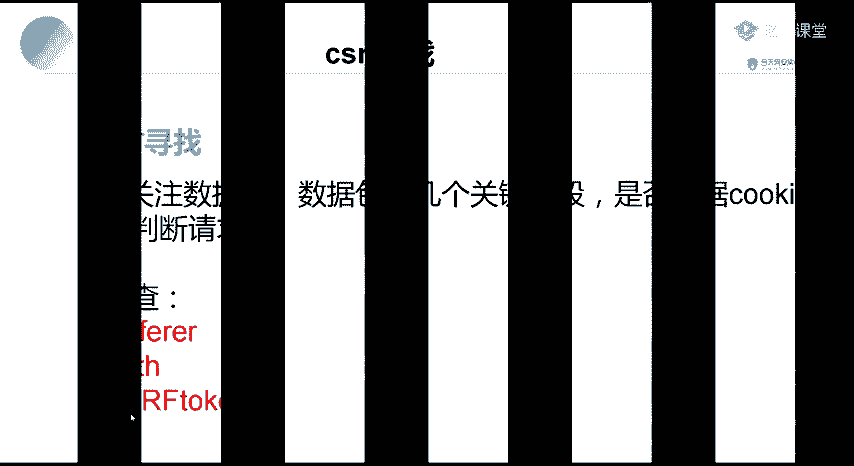

学会了利用方法，接下来我们探讨如何在目标网站中寻找这类漏洞。寻找CSRF漏洞的本质是分析关键操作的HTTP请求包，判断其是否可以被伪造。

以下是分析请求包时需要重点关注和测试的要点：
*   **检查身份验证依赖**：确认请求是否仅依赖Cookie进行身份验证。尝试删除Cookie以外的所有参数，看请求是否依然成功。
*   **检查不可预测参数**：寻找如`token`、`nonce`、`csrf_token`等随机生成的参数。如果请求必须包含此类参数且攻击者无法预测，则通常能防御CSRF。
*   **检查Referer头**：有些网站会验证HTTP请求头中的`Referer`字段，以确保请求来源于本站。尝试修改或删除此字段进行测试。
*   **测试请求可重复性**：使用抓包工具（如Burp Suite）捕获请求后，尝试删除疑似防护参数（如token），重放请求，观察操作是否依然被执行。

一个简单的判断公式是：**可伪造的请求参数 + 仅Cookie的身份验证 = 潜在的CSRF漏洞**。

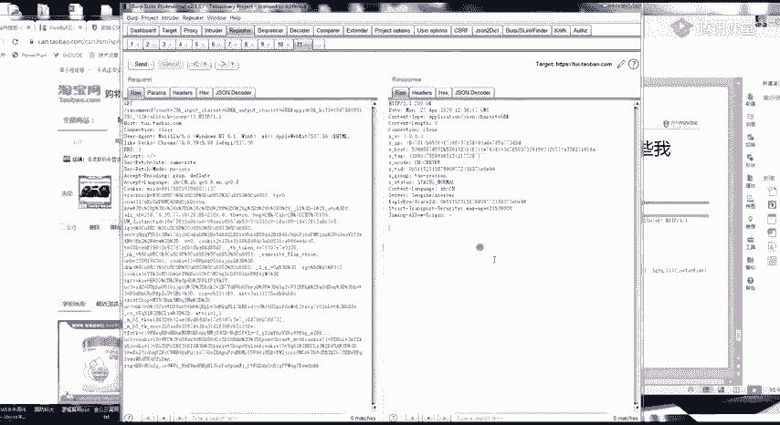

## CSRF漏洞的防御策略 🛡️


在攻击者视角之外，了解防御机制同样重要。本节我们来看看开发者如何防止CSRF攻击。

有效的CSRF防御策略通常围绕一个核心：**确保请求是来自用户的自愿操作，而非第三方伪造**。
*   **使用Anti-CSRF Token**：为每个用户会话生成一个随机、不可预测的Token，并将其嵌入表单或请求头中。服务器在处理请求时验证此Token。
*   **验证Referer头**：检查HTTP请求的Referer头，确保请求来源于合法的本站页面。但需注意Referer头可能被禁用或伪造。
*   **使用自定义请求头**：通过JavaScript添加自定义HTTP头（如`X-Requested-With`），因为跨域请求通常无法发送自定义头（需注意CORS配置）。
*   **关键操作使用二次验证**：对于修改密码、转账等敏感操作，要求用户再次输入密码或进行短信/邮箱验证。

## 总结与课后任务 📚

本节课中我们一起学习了CSRF漏洞。我们从其定义和攻击模型出发，理解了攻击者如何利用用户已登录的状态发起伪造请求。我们学习了针对GET和POST请求的不同利用方式，并掌握了通过分析HTTP请求包来寻找此类漏洞的关键技巧。最后，我们也从防御者角度了解了如何通过Token、Referer验证等手段来缓解CSRF风险。

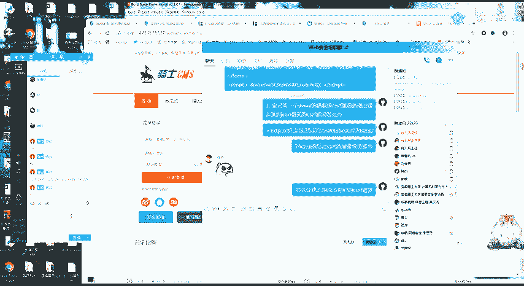

为了巩固学习，请完成以下课后任务：
1.  **动手实验**：在提供的实验环境或DVWA靶场中，完成一次完整的CSRF攻击实验，从漏洞发现到PoC构造。
2.  **案例分析**：分析一个JSON格式请求的CSRF漏洞（如果存在），思考与普通表单请求的利用方式有何不同。
3.  **综合挑战**：研究指定CMS后台的CSRF漏洞，并设计一份详细的“社会工程学”方案，阐述你将如何诱导目标（例如管理员）点击你的恶意链接。请将思路写在文档中。