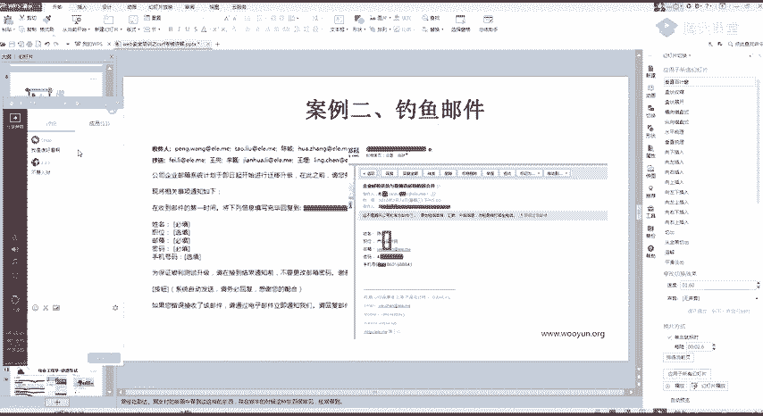
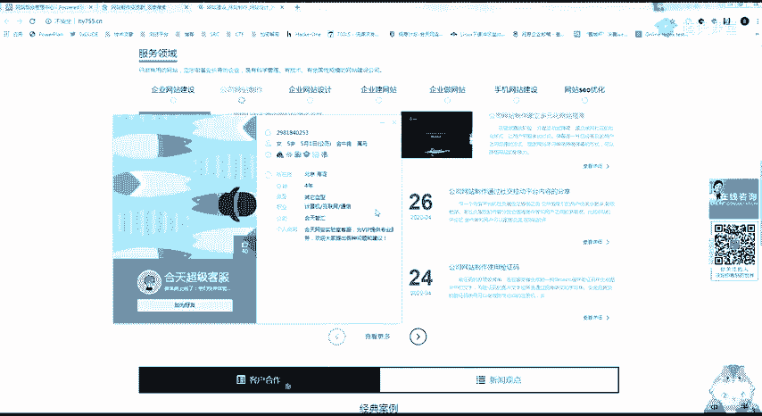
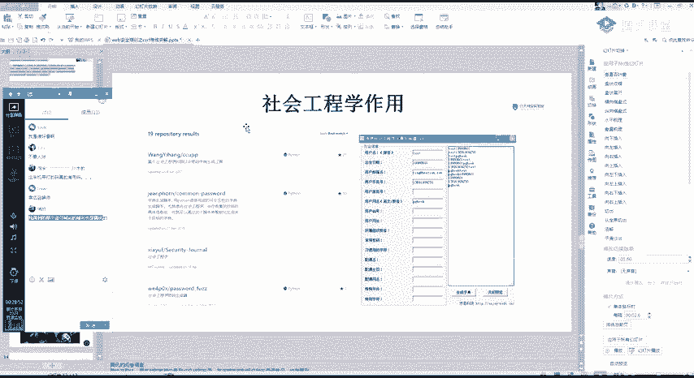
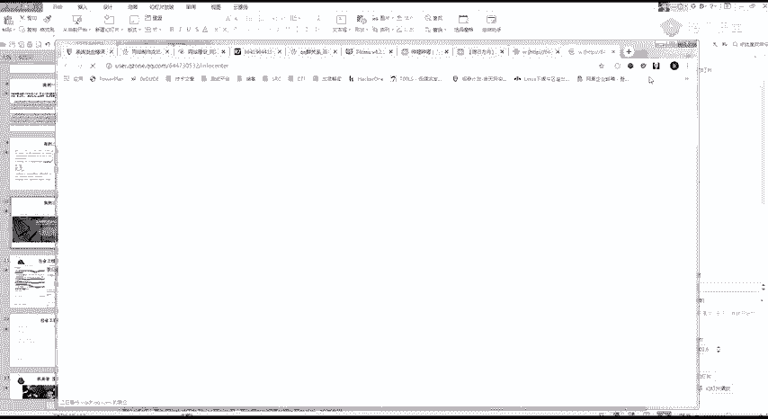

# CTF教程：P64：CSRF漏洞扩大影响

## 概述
在本节课中，我们将学习CSRF（跨站请求伪造）漏洞的扩大影响方法，并初步了解社会工程学在渗透测试中的应用。课程将分为两部分：首先介绍社会工程学的基本概念和案例，然后深入探讨如何将CSRF漏洞与其他漏洞结合，以扩大攻击效果并提升漏洞价值。

## 社会工程学简介
上一节我们介绍了CSRF漏洞的基础利用。本节中，我们来看看如何结合社会工程学来提升攻击的成功率。社会工程学是一种通过人际交流影响他人心理，使其执行特定操作或泄露机密信息的技术。在安全领域，它常被视为一种通过欺骗手段收集信息或入侵系统的行为。

### 社会工程学案例
以下是几个常见的社会工程学攻击案例：

1.  **信息诈骗**：攻击者通过非法手段获取大量个人信息（如从招生平台窃取数据），然后利用这些详细信息伪装成可信方实施诈骗。这提醒我们提升自身安全意识，并认识到在特定渗透测试场景中，社会工程学可能非常有效。
2.  **钓鱼邮件**：攻击者伪装成可信实体（如公司IT部门）发送邮件，诱导受害者点击链接或执行操作。邮件正文常包含精心构造的CSRF攻击代码。钓鱼邮件是目前渗透测试中非常有效的攻击方式。
3.  **钓鱼页面**：攻击者在可信域名（如腾讯问卷）上创建虚假页面，诱导用户输入敏感信息。相比伪造域名，这种方式更具迷惑性。



### 社会工程学在渗透测试中的作用
社会工程学在渗透测试中的一个主要作用是信息收集。攻击者可以利用公开信息或与目标交互来获取更多资料。


例如，攻击者可能通过以下思路获取网站后台权限：
*   与目标网站的客服交流，以测试或解决问题为名，诱导对方开放测试站点或接收文件，从而利用文件上传等漏洞。
*   通过“网站制作交流群”等渠道收集客服QQ号，再利用社工库查询这些QQ号的历史密码或关联信息。
*   使用自动化工具生成针对性密码字典。例如，根据已知的用户名、生日、邮箱等信息生成可能的密码组合。

**代码示例：社工字典生成思路**
```python
# 简化的字典生成逻辑示例（非完整代码）
import itertools
base_info = ['username', '1990', 'company']
common_suffix = ['!', '@123', '123456']
wordlist = []
for r in range(1, len(base_info)+1):
    for combo in itertools.permutations(base_info, r):
        for suffix in common_suffix:
            wordlist.append(''.join(combo) + suffix)
print(wordlist[:10])  # 输出部分生成的密码
```




> **重要提示**：学习社会工程学是为了提升防御意识，理解攻击手法。务必遵守法律法规，切勿用于非法活动。《网络安全法》应常记心中。

## CSRF漏洞的扩大影响
在掌握了社会工程学的基本概念后，我们回到CSRF漏洞本身，探讨如何扩大其影响。挖掘CSRF漏洞时，需注意以下两点：
1.  通常，一个站点若存在CSRF漏洞，往往全局存在，修复时也是全局修复。
2.  应优先寻找敏感操作点进行利用。




### 寻找高价值操作点
以下是两类高价值操作点：

*   **操作类CSRF**：应寻找删除账号、更换绑定手机号等敏感功能点。
*   **读取类CSRF**：应寻找能导致账号接管的个人资料、地址等敏感信息读取点。

### 组合漏洞利用
CSRF漏洞可以与其他漏洞组合，实现更严重的攻击效果，例如GetShell（获取服务器控制权）。

**案例一：后台GetShell**
以某CMS为例，攻击者在通过CSRF添加后台管理员账户后，可进一步利用后台已知的命令执行漏洞。
攻击链如下：
1.  CSRF添加后台管理员。
2.  登录后台。
3.  执行系统命令写入Webshell。

**代码示例：命令执行Payload**
```bash
# 假设后台存在命令执行点，可执行如下命令写入一句话木马
echo '<?php @eval($_POST["cmd"]);?>' > shell.php
```

**案例二：XSS与CSRF组合拳**
XSS（跨站脚本）漏洞常与CSRF结合。攻击者可以先利用XSS在受害者浏览器中执行脚本，该脚本再自动发起CSRF请求，完成敏感操作或进一步利用其他漏洞。

**思路总结**：发现CSRF或XSS等漏洞时，不应急于提交。应思考如何将其与其他漏洞串联，进行深度利用。这不仅能提升技术水平，在漏洞奖励计划中也能获得更高回报。

### 漏洞价值提升实例
在实际漏洞挖掘中，组合利用能显著提升漏洞评级和奖励：
*   单独的XSS或CSRF漏洞可能被评为中危，奖励较低。
*   但XSS与CSRF组合形成的自动化攻击链，可能被评级为高危，奖励大幅提升。

## 课程总结
本节课我们一起学习了以下内容：
1.  **社会工程学基础**：了解了其定义、常见案例（诈骗、钓鱼邮件/页面）以及在渗透测试中用于信息收集的作用。
2.  **CSRF漏洞扩大影响**：学习了寻找高价值操作点的重要性，以及通过将CSRF与后台命令执行、XSS等漏洞组合，实现更深层次攻击（如GetShell）的思路和方法。



核心要点在于建立“深度利用”的思维：发现一个漏洞时，应将其作为跳板，探索扩大攻击影响的可能路径，从而更全面地评估风险并提升自身技术能力。