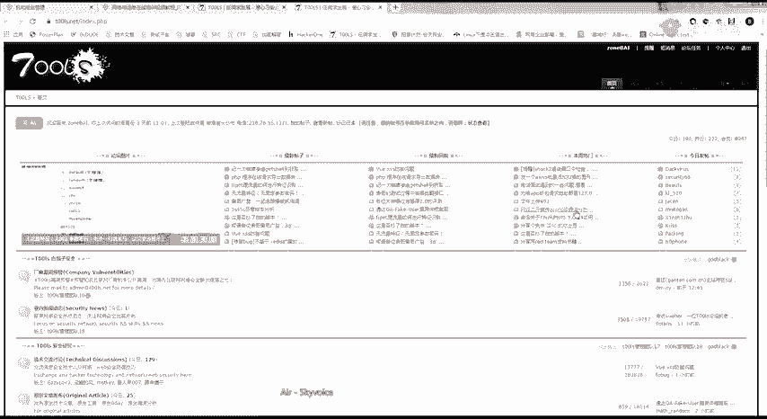
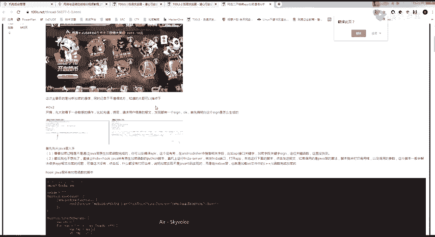
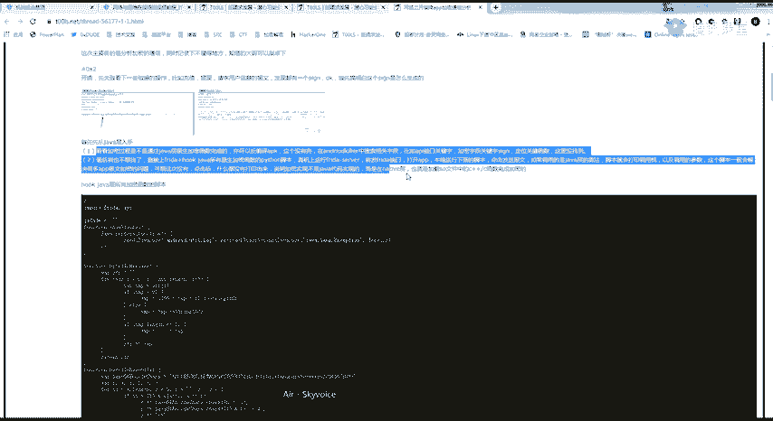
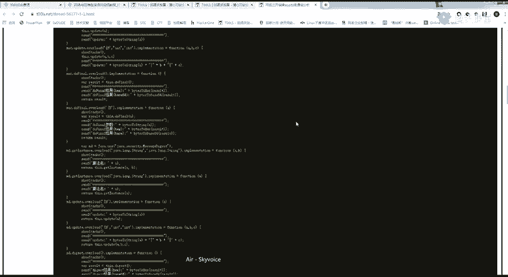
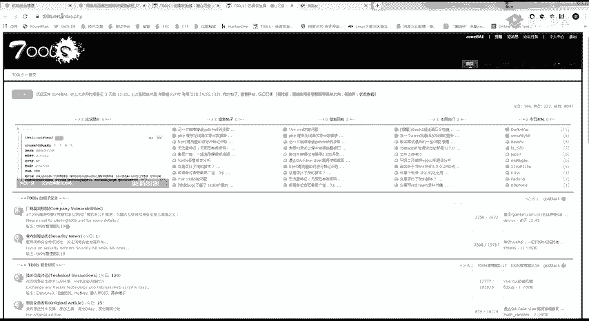
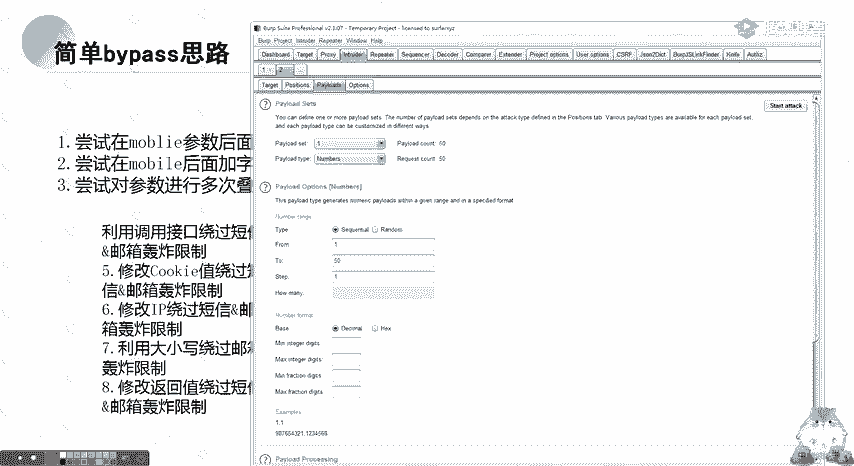
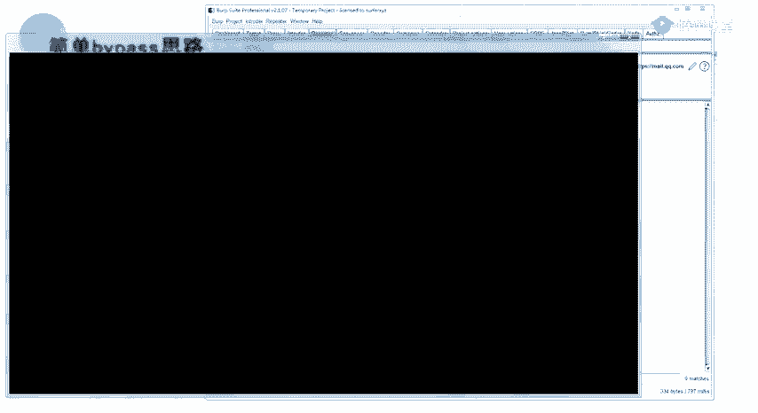
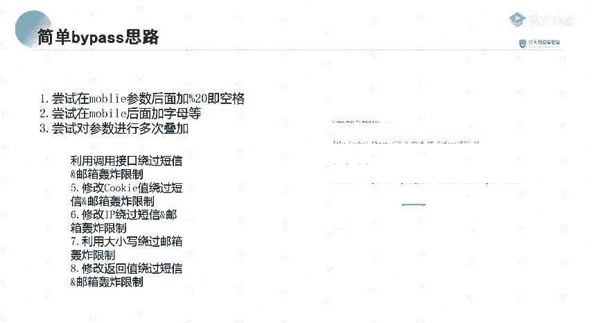

# CTF教程：P65：逻辑漏洞简介 🧠

在本节课中，我们将要学习逻辑漏洞的基础知识，包括其定义、常见类型以及挖掘思路。逻辑漏洞是CTF比赛和SRC漏洞挖掘中非常重要的一部分，它源于程序设计的逻辑缺陷，而非传统的代码安全漏洞。

## 什么是逻辑漏洞？

上一节我们介绍了课程概述，本节中我们来看看逻辑漏洞的核心概念。

逻辑漏洞是由于程序员在编写程序时，其逻辑思维存在不足而产生的。它与传统漏洞（如SQL注入、XSS）不同，攻击者**通过合法、正常的业务流程来达到非法的目的**。

一个典型的例子是**四位数验证码爆破**。验证码功能本身是正常的，但程序没有考虑到四位验证码可以被暴力破解的可能性。这种因设计考虑不周而产生的问题，就是逻辑漏洞。

逻辑漏洞的产生原因通常包括：
*   程序员逻辑不严密。
*   业务流程过于复杂。

一个重要的经验是：**网站的功能点越多，其存在逻辑漏洞的可能性就越大**。例如，大型电商平台（如淘宝、京东）的业务逻辑极其复杂，曾是逻辑漏洞的高发区。

## 如何挖掘逻辑漏洞？

了解了逻辑漏洞的定义后，我们来看看挖掘这类漏洞的关键。

挖掘逻辑漏洞的核心在于**熟练使用Burp Suite等代理工具分析数据包**，并建立**系统的测试思路**。很多时候，漏洞并非显而易见，需要测试者大胆尝试和思考。

以下是一些挖掘逻辑漏洞的经验思路：
*   **参数探测**：尝试修改请求包中的所有参数，观察响应变化。
*   **参数添加**：即使前端未提供的参数，也可能被后端处理。例如，在一个返回JSON格式用户信息的接口中，尝试添加或修改JSON中的字段（如`phone`、`email`），可能会绕过限制，篡改本不应修改的数据。
*   **思路发散**：漏洞是人找出来的。只要你能证明某个操作能造成危害，它就可能被认定为漏洞。

## URL跳转漏洞 🔀

上一节我们探讨了逻辑漏洞的挖掘思路，本节中我们来看看第一种具体的逻辑漏洞类型：URL跳转漏洞。

URL跳转漏洞，也称为开放重定向漏洞。其核心是**攻击者能够控制重定向的目标URL，将用户引导至恶意网站**。

例如，一个网站的登录功能在认证成功后，会根据`redirect_url`参数跳转：
`https://www.example.com/login?redirect_url=https://www.attacker.com/phishing`
如果网站未对该参数进行严格检查和过滤，用户点击此链接登录后，就会被重定向到攻击者构造的钓鱼网站。

### URL跳转漏洞的危害

URL跳转漏洞的危害主要体现在与其他攻击技术的结合上：
1.  **钓鱼攻击**：诱导用户访问伪装成正常站点的恶意页面，窃取账号密码。
2.  **配合CSRF**：在CSRF攻击中，利用跳转漏洞使请求看起来来自可信域名，增加迷惑性。
3.  **配合XSS**：将用户重定向到存在XSS漏洞的页面，执行恶意脚本。
4.  **配合浏览器漏洞**：重定向到包含浏览器漏洞利用代码的页面，可能直接控制用户主机。

### 如何寻找URL跳转漏洞？

寻找URL跳转漏洞，关键在于观察所有涉及URL参数和重定向功能的地方。

以下是常见的可能存在URL跳转漏洞的功能点：
*   **用户登录/认证后**的跳转参数（如`redirect`、`return_url`、`url`）。
*   **用户分享/收藏内容后**的跳转链接。
*   业务操作**成功/失败后**的跳转（如支付成功、评价提交成功）。
*   **站内链接跳转**功能。
*   第三方**授权登录**（OAuth）的回调地址参数。

在测试时，重点关注HTTP响应状态码为**302**或**301**的请求，并检查其中是否包含可控的URL参数。

### 绕过过滤技巧

有时，程序会对跳转URL进行简单过滤（如限制只能跳转到自家域名）。以下是一些常见的绕过技巧：

以下是几种常见的URL跳转过滤绕过方法：
*   **利用`@`符号**：`https://www.trusted.com@www.evil.com`。部分浏览器会访问`@`符号后的地址。
*   **利用子域名**：`https://www.trusted.com.evil.com`。如果程序只检查域名包含`trusted.com`，此方法可能生效。
*   **利用IP地址编码**：将IP地址转换为十进制、八进制或十六进制格式。例如，`http://2130706433` 等价于 `http://127.0.0.1`。
*   **利用`//`双斜线**：`https://www.trusted.com//www.evil.com`。某些解析逻辑可能导致跳转至`evil.com`。

## 短信/邮件轰炸漏洞 📱

上一节我们介绍了URL跳转漏洞，本节中我们来看看另一种常见的业务逻辑漏洞：短信/邮件轰炸漏洞。

短信/邮件轰炸漏洞是指**攻击者能够无限次地触发系统向特定手机号或邮箱发送验证码或通知消息**，从而对受害者造成骚扰。

其原理非常简单：在发送验证码的请求处（如注册、登录、找回密码），未对发送频率、总量或接收方做有效限制，导致同一个请求可以被重放无数次。

### 漏洞挖掘与测试

挖掘此类漏洞，需要关注所有**需要手机号或邮箱验证的业务环节**。

测试方法通常是在Burp Suite中捕获发送验证码的请求包，然后将其发送到**Intruder**模块进行重放攻击，观察是否可以连续收到多条信息。

### 常见的绕过（Bypass）思路

开发人员可能会实施一些简单的防御措施，但往往存在绕过方法：

以下是一些针对短信/邮箱轰炸限制的绕过思路：
*   **添加无关字符**：在手机号后添加空格（URL编码为`%20`）、换行符或其他字符，如`13800138000%20`。系统可能因校验不严格而将其视为新号码。
*   **参数污染**：重复提交手机号参数，如`phone=13800138000&phone=13800138000`。后端处理逻辑混乱可能导致多次发送。
*   **调用不同业务接口**：网站可能有多个功能需要发短信（如登录、注册、改密）。尝试找出其接口中区分业务的参数（如`type=login`），遍历所有类型，向同一手机号轰炸。
*   **修改Cookie或会话状态**：在已登录状态下修改密码需要短信验证，尝试删除或修改请求中的Cookie，使服务器误以为是新会话。
*   **修改请求返回值（前端验证）**：如果发送次数限制由前端JavaScript根据服务器返回值来判断，可尝试通过代理工具拦截并修改返回包，将“发送次数超限”改为“发送成功”。

## 总结与练习

本节课中我们一起学习了逻辑漏洞的基础知识。我们首先了解了逻辑漏洞的本质——它源于业务流程的设计缺陷。接着，我们深入探讨了两种典型的逻辑漏洞：**URL跳转漏洞**和**短信/邮件轰炸漏洞**，并学习了它们的危害、挖掘方法以及常见的绕过技巧。

逻辑漏洞的挖掘更依赖于对业务的理解、发散性的思维和细致的测试。记住，多观察、多尝试、多思考是发现这类漏洞的关键。

**课后练习建议**：
1.  在提供的实验环境中，完成URL跳转漏洞的测试练习。
2.  尝试在一个测试站点上，寻找并验证短信轰炸漏洞。
3.  阅读历史漏洞报告（如乌云、吐司上的案例），学习其他白帽子的挖掘思路。

祝大家学习顺利，在实践中不断积累经验！