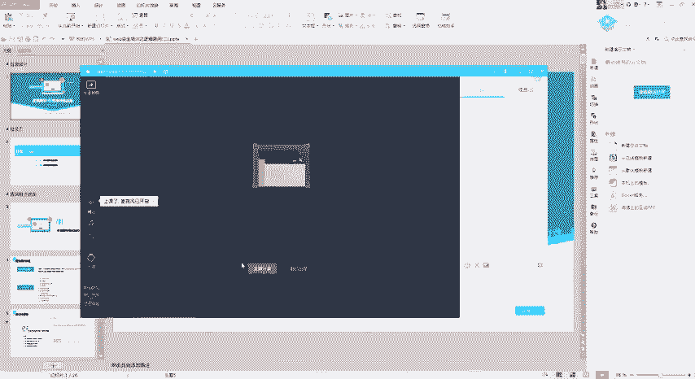
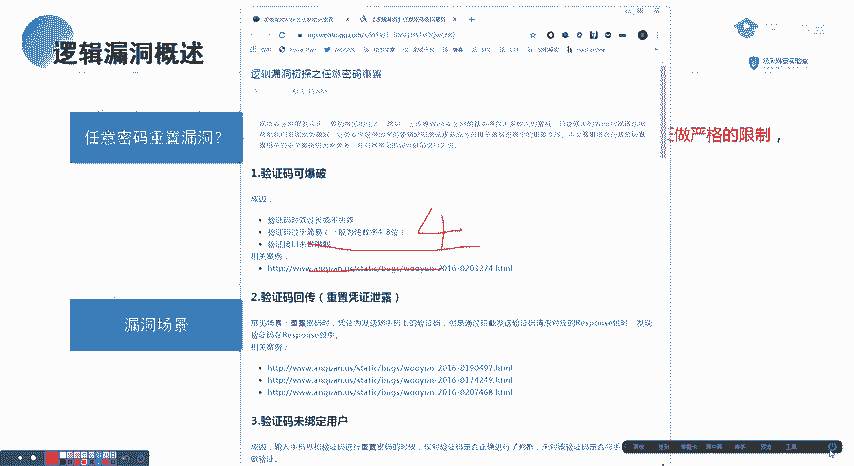
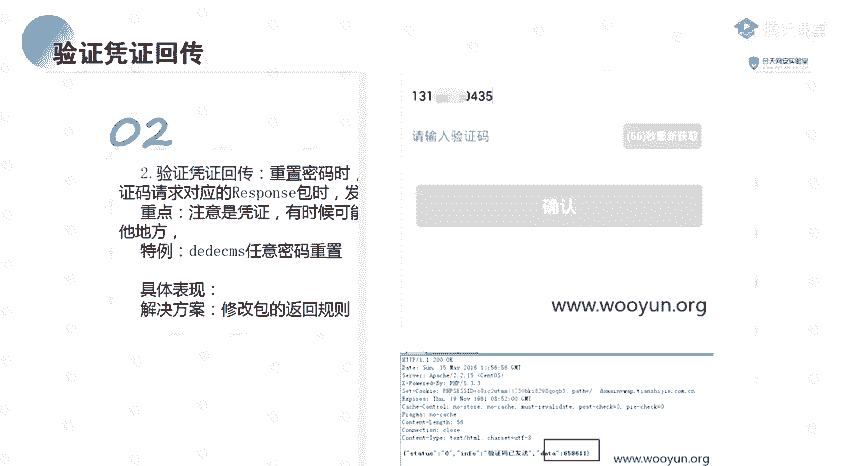
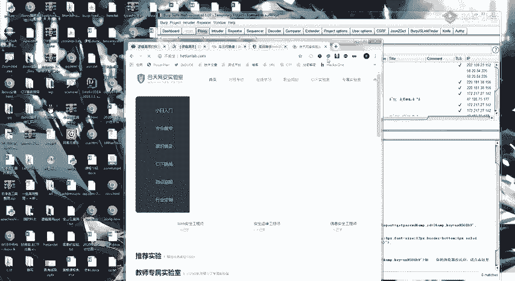
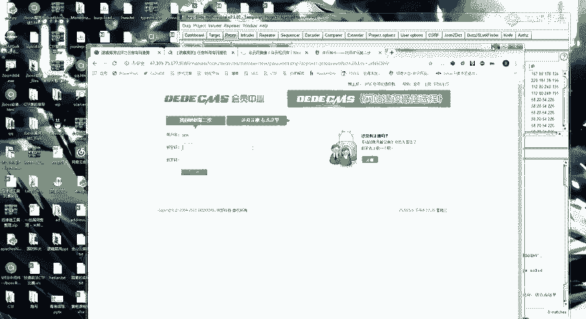
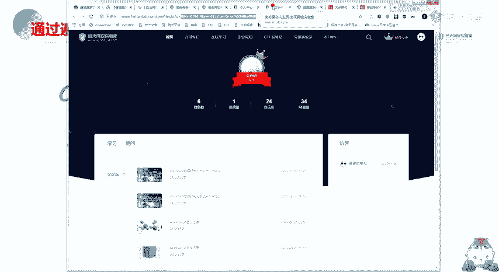
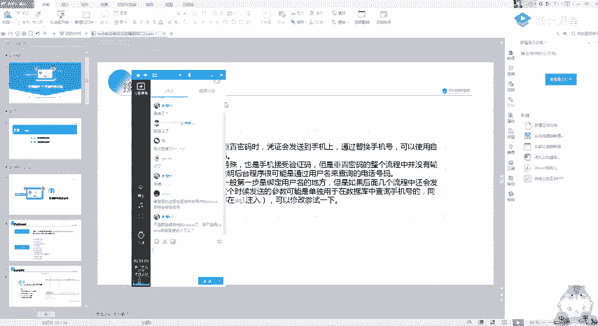

# CTF教程：P66：逻辑漏洞讲解 🔐



在本节课中，我们将要学习CTF中常见的逻辑漏洞，特别是任意密码修改和任意账户登录的原理与场景。逻辑漏洞的核心在于程序员的思维缺陷，而非复杂的技术实现，因此理解思路至关重要。

## 概述

逻辑漏洞是Web安全中常见的一类漏洞，其根源在于程序在处理业务逻辑时存在缺陷，攻击者可以利用这些缺陷绕过正常的验证流程。本节课将重点讲解两类逻辑漏洞：任意密码修改和任意账户登录。我们将通过多个实际场景和案例，帮助你理解其原理和挖掘思路。

---

## 任意密码修改漏洞

上一节我们介绍了逻辑漏洞的基本概念，本节中我们来看看任意密码修改漏洞。这类漏洞的核心原理是：在密码修改流程中，系统没有对修改凭证进行严格限制，导致攻击者可以绕过验证，修改任意用户的密码。



简单来说，就是攻击者可以利用某个密码修改接口，修改其他用户的密码。

以下是任意密码修改漏洞的几种常见场景：


### 1. 验证码可被爆破

此场景出现的原因是验证码位数过短（如4位），且系统未对验证尝试次数和时间进行限制。

*   **核心表现**：验证码为4位数字，有效期内可无限次尝试。
*   **攻击方法**：使用工具自动化尝试所有可能的组合（0000-9999）。
*   **特殊案例**：
    *   6位验证码，但未限制尝试次数且有效期过长（如2小时）。
    *   验证码永不失效，虽然系统提示有效期，但实际长时间内均可使用。

### 2. 验证码/凭证在返回包中回显

此场景中，系统错误地将验证码或其他重置凭证放在了HTTP响应包中返回给用户。

*   **核心表现**：在忘记密码、获取验证码的请求响应中，直接包含验证码或重置令牌（Token）。
*   **攻击方法**：使用抓包工具（如Burp Suite）拦截响应，直接获取凭证。
*   **案例**：某CMS系统在访问用户重置链接 `reset.php?id=1` 时，会在页面源码或响应包中泄露用于重置的完整URL。

### 3. 验证码未与用户绑定

系统只验证了验证码是否正确，但没有校验该验证码是否由当前操作的用户手机号/邮箱接收。



*   **核心表现**：用户A获取的验证码，可以用于重置用户B的密码。
*   **攻击方法**：用自己的账号获取验证码，然后在修改他人密码的环节，填入自己的验证码和他人的账号信息。
*   **公式化描述**：`验证(验证码=正确) == True`，但缺少 `验证(验证码所属账号 == 目标账号)`。


### 4. 前端验证

验证逻辑仅在前端JavaScript中完成，服务器端没有进行二次校验。

*   **核心表现**：验证码的校验代码直接写在网页的JS文件里，提交后服务器信任前端的结果。
*   **攻击方法**：直接分析JS代码找到验证逻辑，或修改本地JS文件/通过浏览器开发者工具禁用JS来绕过。
*   **代码示例**：
    ```javascript
    // 前端验证伪代码
    if (user_input_code == hardcoded_code) {
        submit_form(); // 仅前端通过即提交
    }
    ```

### 5. 修改服务器返回包



这是一种更主动的攻击方式，通过篡改服务器返回的响应包内容来欺骗前端。


*   **核心表现**：在密码修改的多步流程中，拦截服务器返回的“错误”或“状态”响应，将其修改为“成功”状态。
*   **攻击方法**：使用Burp Suite等代理工具拦截响应包，修改其中的状态码或关键信息。
*   **工具操作**：在Burp Suite中，Proxy -> Options 勾选 “Intercept responses based on...”，即可拦截并修改响应。




### 6. 跳过验证步骤

密码重置流程分为多步（如：1.输入账号 -> 2.验证身份 -> 3.设置新密码），但系统未对步骤的连续性进行校验。

*   **核心表现**：攻击者可以直接访问“设置新密码”的页面URL，跳过前面的身份验证步骤。
*   **攻击方法**：
    1.  用自己的账号正常走一遍流程，记录每一步的URL。
    2.  在针对他人账号攻击时，在获取验证码后，不进入下一步，而是直接访问记录下来的“设置新密码”页面URL。

### 7. 重置令牌（Token）可预测

系统生成的重置密码链接中的Token参数存在规律，可被猜测或枚举。

*   **核心表现**：Token基于时间、用户ID等简单规则生成（如递增数字、MD5(时间戳+用户ID)）。
*   **攻击方法**：分析多个已知Token，找出生成规律，从而推算出其他用户的Token。
*   **案例**：Token为 `reset_token=77abcd`，解密后发现是`用户ID+固定偏移值`，通过修改ID即可构造他人的重置链接。

### 8. 凭证可发送至多个接收端

在输入账号（如手机号）时，系统未正确处理格式，导致可以向多个目标发送同一凭证。

*   **核心表现**：在手机号输入框填入 `13800138000,13800138001`，两个手机都收到了相同的验证码。
*   **攻击方法**：利用分隔符（逗号、分号、换行符）尝试注入多个接收地址。

### 9. 接收端参数可被篡改

在验证身份后，修改密码的请求中，用于标识用户的参数（如`user_id`）可以被篡改。

*   **核心表现**：请求包格式为 `user_id=123&new_pass=xxx`，修改`user_id`即可修改相应用户的密码。
*   **攻击方法**：抓取修改密码的请求包，尝试修改其中的用户标识参数。

### 10. 万能验证码

系统存在用于测试或后门的通用验证码。

*   **核心表现**：输入诸如 `000000`、`999999` 等特定代码即可通过任何验证。
*   **注意**：此场景极少见，无需主动测试。

---

## 任意账户登录漏洞

理解了任意密码修改后，我们来看看与之紧密相关的任意账户登录漏洞。其定义是：利用逻辑错误，在不知道目标账号密码的情况下，直接以该用户身份登录系统。

以下是几种常见的攻击场景：

### 1. 验证码回显

与密码重置类似，在登录时，验证码直接返回在响应包中。

*   **攻击方法**：抓取获取登录验证码的响应包，直接获取验证码完成登录。

### 2. 修改返回包登录

拦截登录过程的服务器响应，将“登录失败”的报文修改为“登录成功”的报文。

*   **核心表现**：前端JS根据服务器返回的特定字段（如 `"status":"success"`）判断登录状态。
*   **攻击方法**：抓包修改 `"status":"error"` 为 `"status":"success"`，并可能需伪造用户标识字段（如`user_id`）。
*   **案例**：某站登录失败返回 `{“code”:0}`，成功返回 `{“code”:1, “uid”:1001}`。攻击者拦截失败响应，修改为成功响应结构即可登录UID为1001的账户。

### 3. 修改用户标识参数

登录请求或后续会话中，用于区分用户的参数（如`uid`, `username`）可直接修改。

*   **核心表现**：登录后，页面通过Cookie或URL参数中的`userid=123`来显示用户内容。修改此ID即可查看他人信息。某些登录接口本身就可能存在此缺陷。
*   **攻击方法**：修改Cookie中的`user_id`值，或修改登录请求中的用户标识参数。

### 4. SQL注入万能密码



利用登录框的SQL注入漏洞，构造永真条件绕过密码验证。

*   **核心原理**：登录查询语句类似 `SELECT * FROM users WHERE username='$user' AND password='$pass'`。
*   **攻击方法**：在用户名输入 `admin' OR '1'='1`，密码任意。
*   **最终查询语句**：
    ```sql
    SELECT * FROM users WHERE username='admin' OR '1'='1' AND password='xxx'
    ```
    由于 `'1'='1'` 恒真，此查询可能返回管理员用户记录。

### 5. 默认口令/弱口令

系统或用户使用常见的、未修改的默认密码或简单密码。

*   **常见默认口令**：`admin/admin`, `root/123456`, `test/test`。
*   **常见弱口令**：`123456`, `password`, `admin123`, 与用户名相同。
*   **攻击方法**：针对目标系统（如学校教务系统、设备后台）进行常见口令爆破。

### 6. 社工库撞库

利用从其他平台泄露的密码数据库（社工库），尝试登录目标系统。

*   **核心前提**：用户在多个平台使用相同的账号和密码。
*   **攻击方法**：获取目标的账号（如邮箱），在社工库中查找其历史密码，用这些密码尝试登录目标系统。

### 7. Cookie混淆

通过修改Cookie中存储的用户身份标识来切换账户。

*   **核心表现**：Cookie中包含如 `Login_UserID=1001` 的字段。
*   **攻击方法**：将其修改为 `Login_UserID=1002`，刷新页面后可能即以1002用户身份登录。

---

## 总结

本节课中我们一起学习了CTF中逻辑漏洞的核心部分：**任意密码修改**和**任意账户登录**。

我们深入探讨了多种漏洞场景，从**验证码爆破、回显、未绑定**，到**跳过步骤、Token预测**，再到**修改返回包、参数篡改**等。这些漏洞的本质都是**程序逻辑校验不严谨**。

挖掘逻辑漏洞的关键在于**理解业务流程**和**发散思维**。你需要像攻击者一样思考：“如果我不按正常步骤走会怎样？”、“如果我把这个参数改成别人的会怎样？”。多分析实际案例，多动手在靶场练习，是掌握这类漏洞的最佳途径。



记住，思路远比技术复杂程度重要。保持好奇心，严谨测试，你就能发现更多逻辑缺陷。