# CTF教程：P68：课程考核讲解

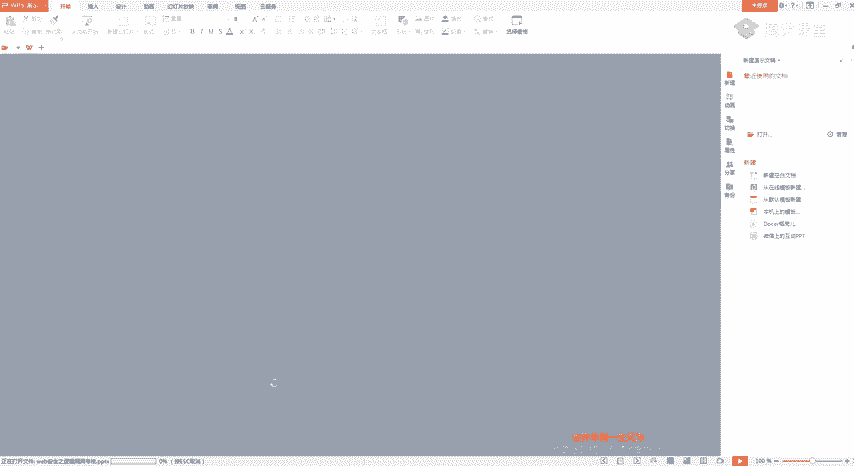

在本节课中，我们将对之前布置的CTF练习题进行讲解，并分享一些挖掘逻辑漏洞的实战思路与“脑洞”。课程分为两部分：首先是对三道考核题的详细解析，然后是关于逻辑漏洞挖掘中“增删改查”思维的扩展应用。

---

## 考核题目讲解

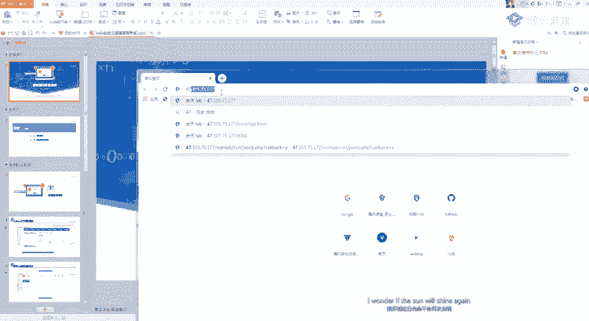

上一节我们概述了课程安排，本节中我们来看看具体的考核题目解析。

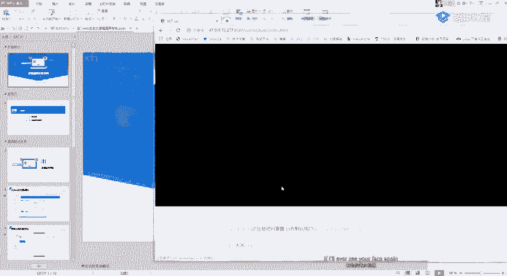

### 大米CMS支付逻辑漏洞

这道题考察的是支付环节的逻辑漏洞。核心思路是通过抓包修改关键参数（如商品数量、价格），利用服务端未严格校验的缺陷实现异常获利，例如“负支付”或“零元购”。

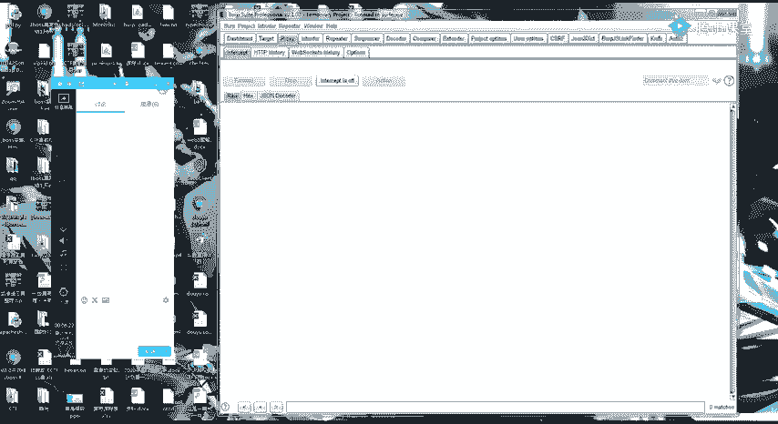

**操作步骤如下：**

1.  注册一个普通用户账号。
2.  在商城中选择任意商品，进入购买流程。
3.  在提交订单时，使用抓包工具（如Burp Suite）拦截HTTP请求。
4.  在拦截到的数据包中，定位到代表商品数量的参数（例如 `num=1`）。
5.  将该参数值修改为负数（例如 `num=-1`）。
6.  放行数据包，观察订单结果。如果系统余额异常增加，则漏洞存在。

**关键点：**
*   漏洞的本质是服务端未对用户输入的参数进行有效性或业务逻辑校验。
*   测试时，应尝试修改数据包中的**每一个参数**，包括商品ID、单价、数量等，因为开发者可能只对其中部分参数做了防护。
*   公式描述漏洞原理：`实际支付金额 = 商品单价 × 数量`。当`数量`参数可控且未校验为负数时，可能导致`实际支付金额`为负，即“赚钱”。

### 熊海CMS后台越权漏洞

这道题考察的是基于Cookie的身份验证绕过漏洞。许多CMS会使用Cookie中的某个字段（如用户名、用户ID）来判断用户权限，如果修改该字段，可能直接访问高权限后台。

**操作步骤如下：**

1.  访问目标网站后台登录页面（如 `/admin/login.php`）。
2.  使用抓包工具拦截任意请求（甚至可以是登录失败的请求）。
3.  在请求的Cookie部分，手动添加或修改一个标识管理员身份的字段。例如，添加 `user=admin`。
4.  放行数据包，观察是否成功跳转到后台管理界面。

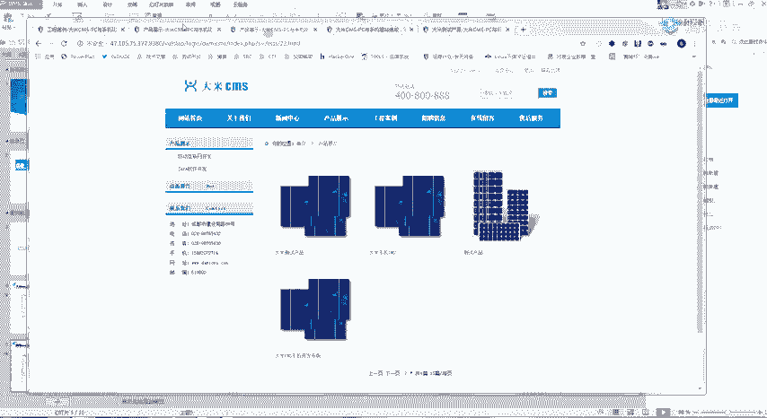

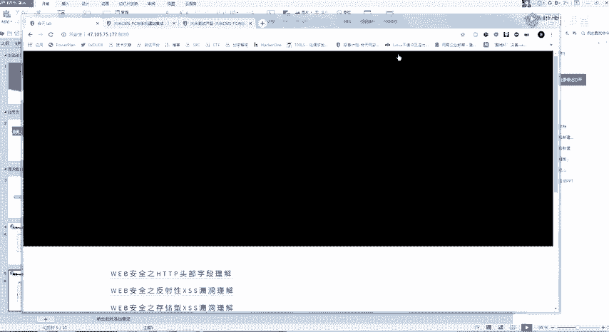

**关键点：**
*   如何知道要添加哪个Cookie字段？有两种方法：
    *   **源码审计**：下载该CMS的源代码，查看登录验证逻辑，找到用于身份判断的Cookie键名。
    *   **经验与测试**：尝试常见键名，如 `admin`、`username`、`user`、`admin_user` 等。
*   代码描述漏洞原理：后台验证代码可能形如：
    ```php
    // 错误示例：仅检查Cookie中‘user’字段是否存在，未验证其真实性
    if(isset($_COOKIE['user']) && $_COOKIE['user'] == 'admin'){
        // 允许进入后台
    }
    ```
    攻击者只需在Cookie中设置 `user=admin` 即可绕过。

### 商城系统收货地址越权漏洞

这是一个非常典型的越权漏洞案例。在用户管理自身信息（如收货地址）的功能中，如果操作时依据的ID（如地址ID）可由用户控制，且服务端未校验该ID是否属于当前用户，就会导致越权。

**操作步骤如下：**

1.  登录用户A，添加一个收货地址。
2.  在修改或删除该地址时抓包，找到标识地址的唯一参数（如 `address_id=1001`）。
3.  登录用户B，重复步骤2，获得用户B的地址ID（如 `address_id=1002`）。
4.  在用户A的会话中，将抓到的包中的 `address_id` 修改为用户B的ID（1002）并发送。
5.  如果操作（查看、修改、删除）成功，则存在越权漏洞。

**关键点：**
*   这类漏洞常出现在“用户中心”、“订单管理”、“病历查询”、“成绩查询”等涉及个人数据的模块。
*   挖掘时，关注所有携带 `id`、`uid`、`user_id` 等参数的请求。

---

## 逻辑漏洞“脑洞”篇

完成了考核题的解析，相信大家对基础逻辑漏洞有了认识。本节中我们来看看如何拓展思维，挖掘更深层或更隐蔽的逻辑漏洞。

### 思路一：参数“删除”测试

不要默认所有参数都是必需的。尝试删除请求中的某些参数（特别是那些看起来用于安全校验的），观察结果。

**案例：**
*   在修改敏感信息的请求中，删除 `token`、`csrf_token` 等防CSRF的参数，看请求是否依然成功。
*   在查询个人数据的请求中，删除用于身份认证的 `Cookie` 或 `Authorization` 头，看是否仍能返回数据（即未授权访问）。

**核心思想：** 如果删除某个“安全参数”后功能依然正常，说明该参数可能未被有效利用，存在验证缺陷。

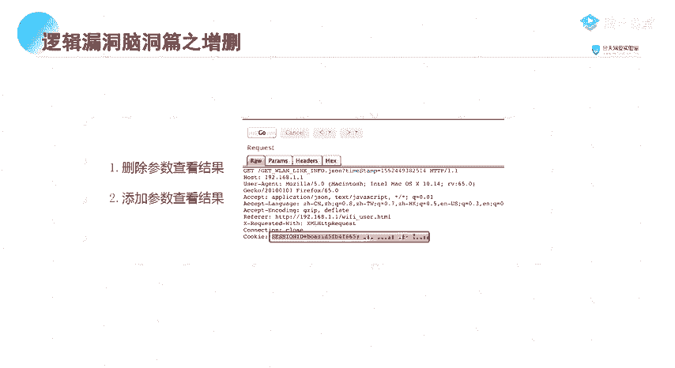

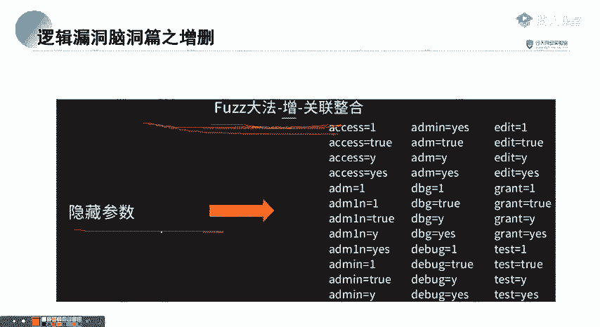

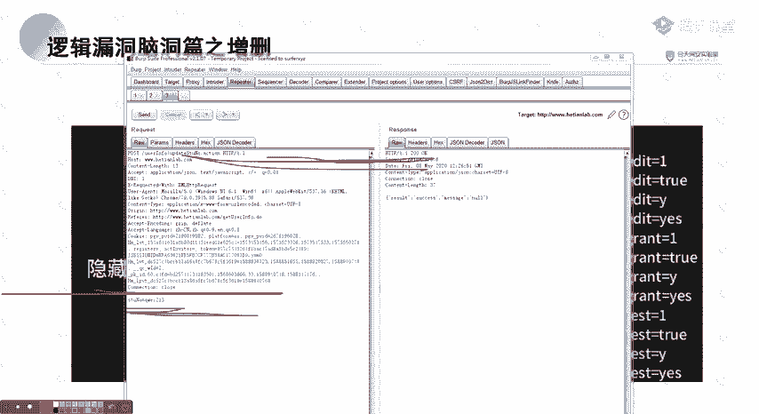

### 思路二：参数“添加”测试

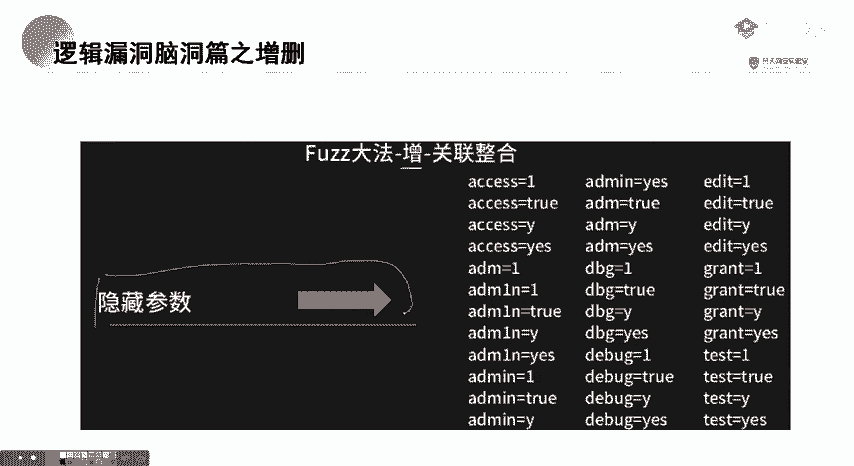

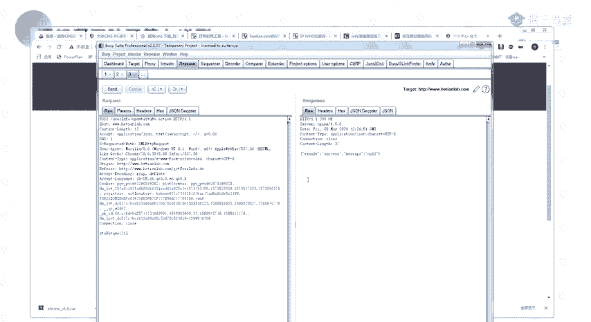

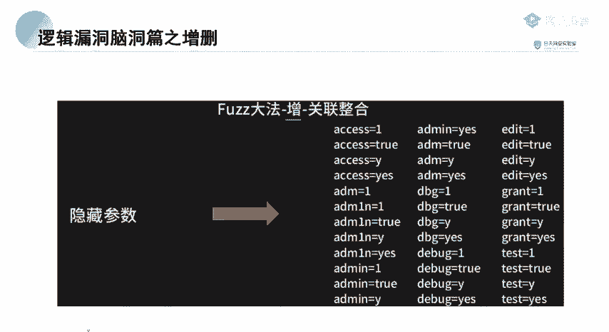

请求中可能隐藏了一些未在界面体现但后端仍会处理的参数。通过添加参数进行测试，可能会发现意外漏洞。

**操作方式：**
1.  准备一个“参数字典”，包含常见的参数名（如 `callback`、`jsonp`、`debug`、`test` 等）。
2.  对目标请求使用抓包工具，在参数列表后添加一个新参数（如 `?id=1&test=1`）。
3.  使用工具的“爆破”功能，将参数名（`test`）替换为字典中的词条进行遍历。
4.  观察响应有何不同。例如：
    *   添加 `callback=xxx` 可能触发JSONP劫持漏洞。
    *   添加 `debug=1` 可能开启调试模式，泄露敏感信息。

**核心思想：** 开发过程中遗留的隐藏参数、调试参数、未明示的功能参数，往往是安全盲点。

### 思路三：参数“替换”与“来源拓展”

不要局限于当前请求中的参数。尝试从系统其他功能的响应中寻找参数，并替换到当前请求中。

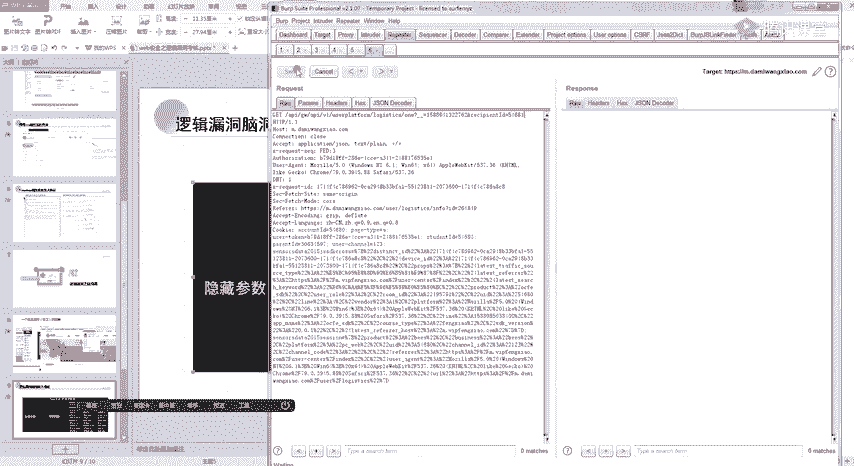

**案例：**
1.  在用户A的某个数据查询接口，响应体是一个JSON，其中包含了用户A的多种ID：`userId`, `studentId`, `familyId`。
2.  在另一个需要`userId`进行查询的接口中，尝试将参数替换为从响应体中获取的 `studentId` 或 `familyId`。
3.  如果请求成功，说明后端可能支持多种ID查询方式，而其中某种方式（如`familyId`）可能缺乏权限校验，导致通过替换ID实现越权。

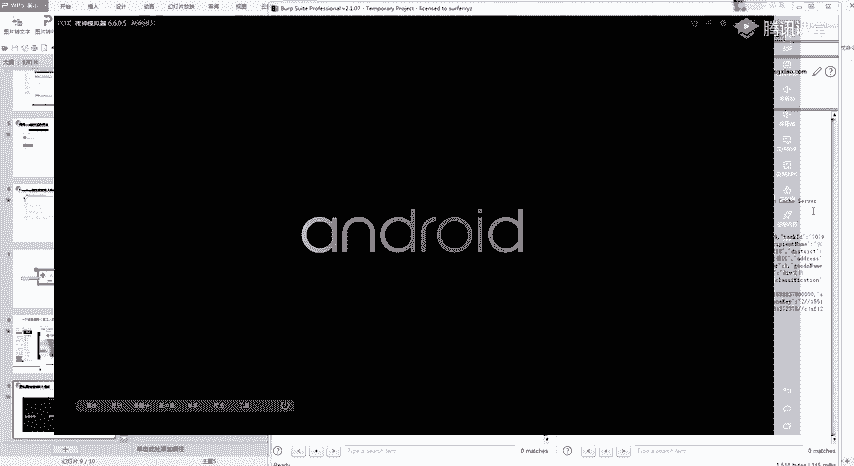

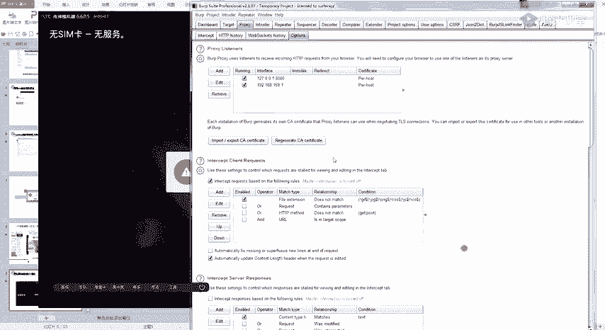

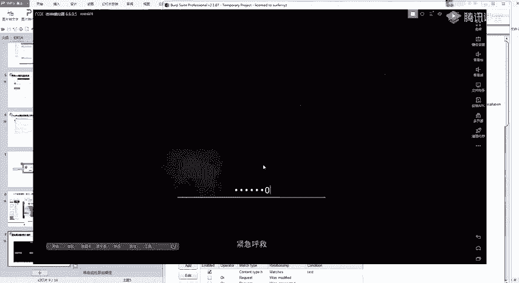

**核心思想：** 系统不同模块间参数可能互通，但权限校验逻辑可能不一致。将A处的参数拿到B处使用，可能绕过校验。

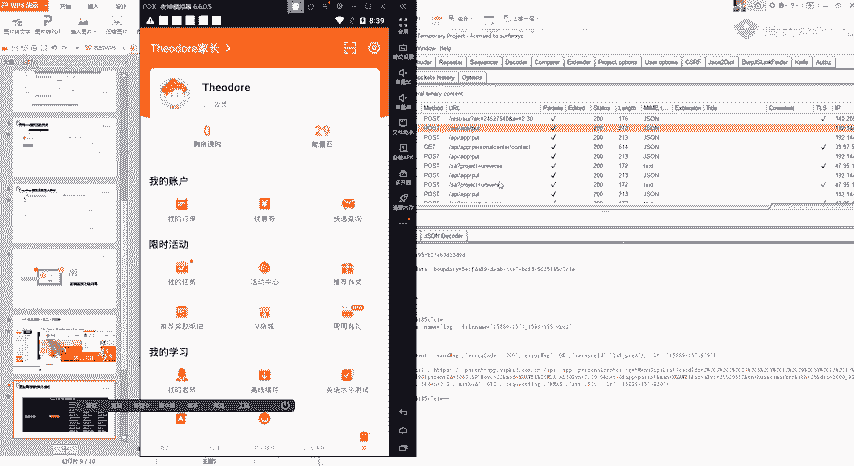

---

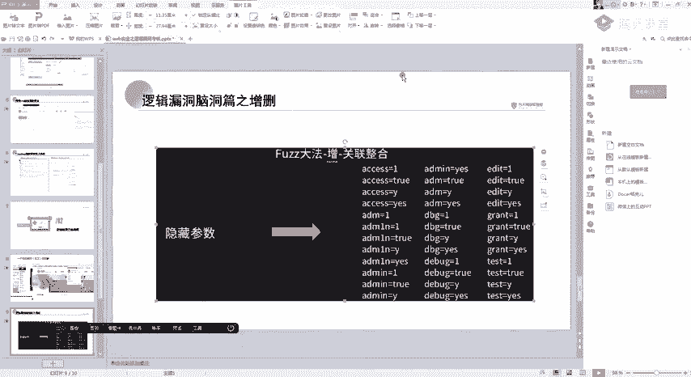

## 总结

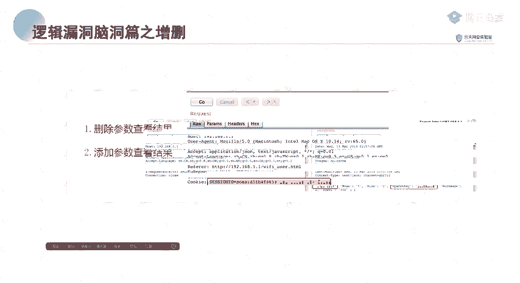

本节课中我们一起学习了三道CTF考核题的详细解法，并深入探讨了挖掘逻辑漏洞的三种高级思路：“删”、“添”、“换”。
*   **“删”**：测试参数的必需性，寻找无效的校验。
*   **“添”**：探测隐藏参数，发现未公开的功能或漏洞。
*   **“换”**：跨功能引用参数，利用校验不一致实现绕过。

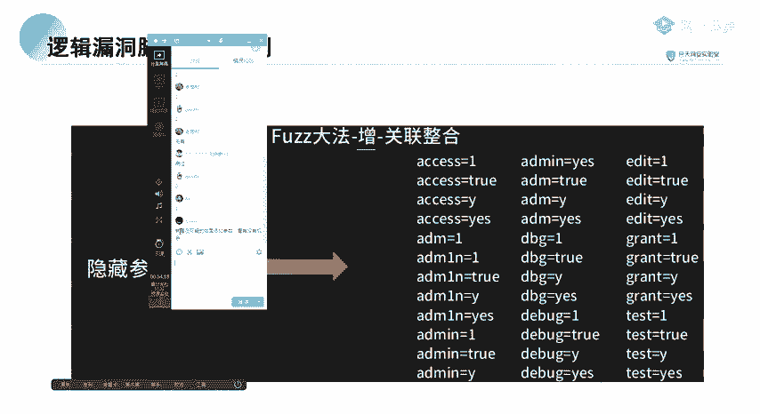

记住，逻辑漏洞的挖掘极度依赖对业务流和参数的理解，需要保持开放、发散的思维，大胆假设，小心验证。课后请大家务必动手实践，并将这些思路应用到实际的漏洞挖掘中。