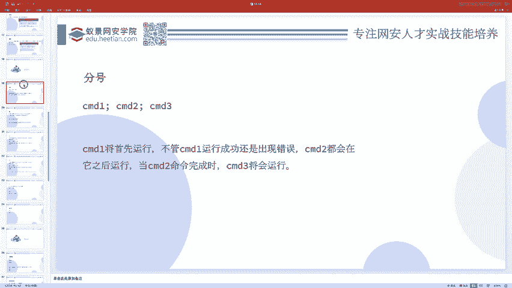
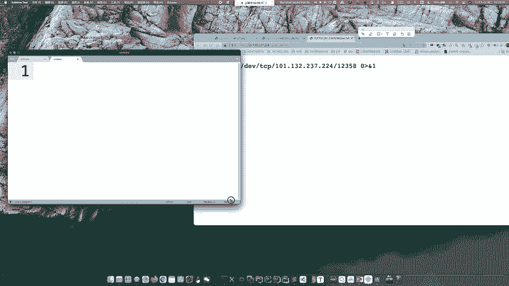
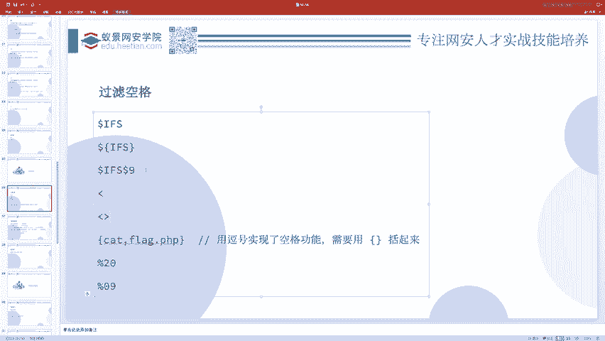
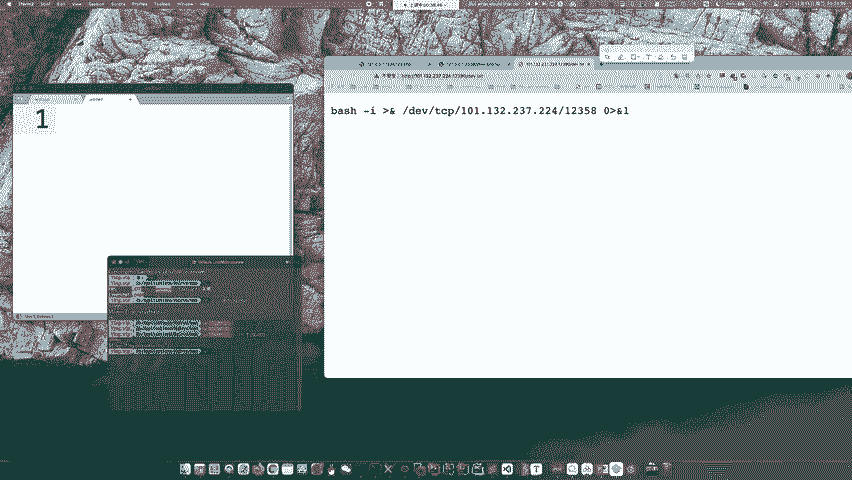
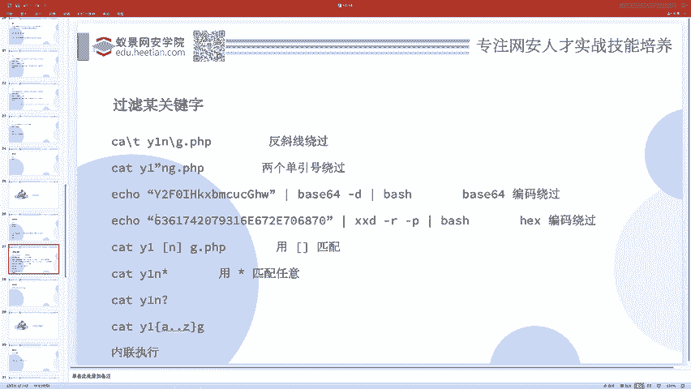
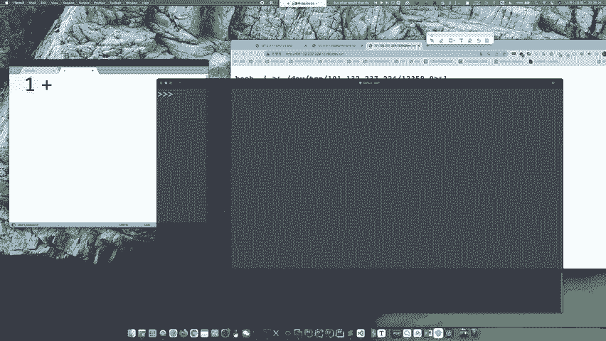
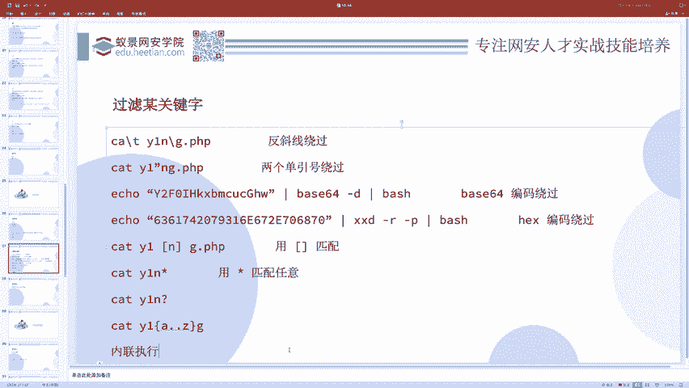
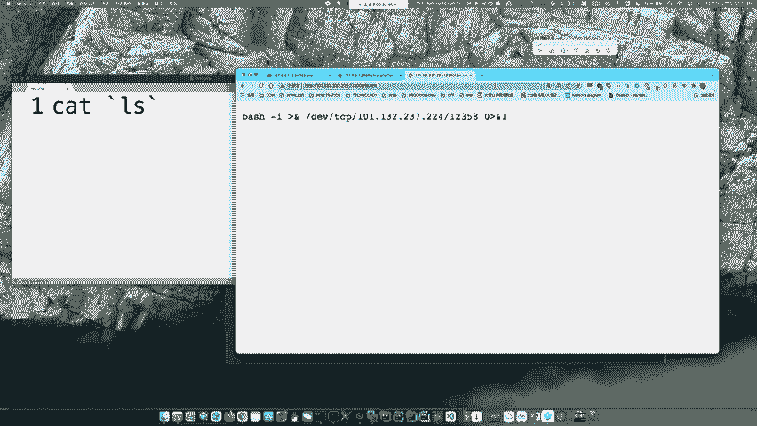
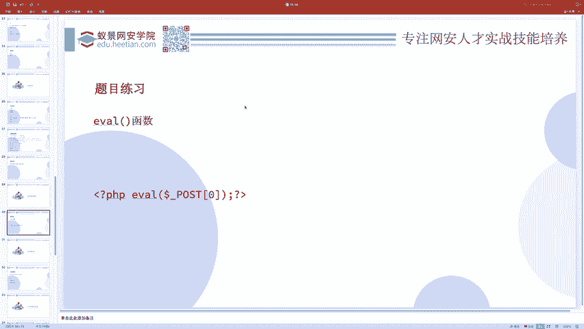

# CTF教程：P7：ctf-web06_Bypass 🛡️







在本节课中，我们将学习CTF Web题目中常见的过滤绕过技术。前面我们介绍的基础命令执行方法相对简单，但在实际比赛中，出题者通常会设置各种过滤规则来增加难度。本节将重点探讨当关键字符（如空格、`cat`、`flag`等）被禁用时，如何巧妙地绕过这些限制，成功执行目标命令。



## 绕过空格过滤

上一节我们介绍了基本的命令执行，本节中我们来看看当空格被过滤时，有哪些替代方案。在Linux Shell中，空格用于分隔命令和参数，但我们可以使用其他字符或技巧来实现相同的功能。

以下是几种常见的绕过空格过滤的方法：

*   **使用`$IFS`变量**：`$IFS`是Shell的内部字段分隔符，默认包含空格、制表符和换行符。我们可以用它来替代空格。但直接使用`cat$IFSflag.php`会出错，因为Shell无法正确解析变量边界。正确的用法是将其用花括号或引号包裹，或与其他字符组合。
    *   `cat${IFS}flag.php`
    *   `cat$IFS$9flag.php` （`$9`通常指向第九个参数，这里用作分隔符）
*   **使用重定向符`<`**：`<`符号可以将文件内容作为标准输入传递给命令，从而绕过对空格的依赖。
    *   `cat<flag.php`
*   **使用制表符（Tab）**：在URL编码中，制表符可以用`%09`表示，有时可以替代空格。
    *   `cat%09flag.php`
*   **使用大括号`{}`**：在某些上下文中，大括号内的命令会依次执行，但这里更常用作通配符扩展的一部分，而非直接替代空格。



## 绕过关键字过滤

除了空格，题目还可能过滤特定的关键字，如`cat`或`flag`。接下来，我们探讨如何绕过这类过滤。

以下是几种绕过关键字过滤的策略：

*   **使用转义符`\`**：在关键字中插入反斜杠`\`可以改变字符串的形态，从而可能绕过简单的字符串匹配过滤。因为`\`本身是转义字符，`c\at`在Shell中执行时仍等同于`cat`。
    *   `c\at fl\ag.php`
*   **利用字符串拼接**：这是非常强大的技巧。我们可以将关键字拆分成多个部分，然后通过拼接重新组合。
    *   **变量拼接**：
        ```bash
        a=fl
        b=ag
        cat $a$b.php
        ```
    *   **Shell特性拼接**：在某些上下文中（如PHP的`system`函数内），直接拼接字符串也可能有效。
        *   `cat fl’‘ag.php` （单引号在拼接时可能被忽略）
*   **使用通配符**：利用Shell的通配符来匹配文件名，避免直接写出`flag`关键字。
    *   `cat fla*` （`*`匹配任意字符）
    *   `cat fla?` （`?`匹配单个字符）
    *   `cat fla[g]` （`[g]`匹配字符`g`）
    *   `cat fla{f..h}` （`{f..h}`会展开为`f g h`，分别尝试`cat flaf`, `cat flag`, `cat flah`）
*   **使用内联执行**：先通过一个命令获取`flag`的文件名，然后将结果嵌入到`cat`命令中。
    *   **反引号**：`` cat `ls | grep fla` ``
    *   **`$()`**：`cat $(ls | grep fla)`
*   **编码绕过**：先将命令进行编码（如Base64、Hex），然后在执行时解码。
    *   **Base64示例**：
        ```bash
        # 编码命令 echo ‘cat flag.php’ | base64
        # 假设得到编码 Y2F0IGZsYWcucGhwCg==
        echo ‘Y2F0IGZsYWcucGhwCg==’ | base64 -d | bash
        ```



## 代码执行漏洞初探

命令执行告一段落，它主要针对系统Shell命令。现在，我们转向代码执行漏洞，这通常发生在Web应用程序中，特别是当程序将用户输入的数据当作代码来执行时。

一个最典型的例子是PHP的`eval()`函数。该函数会将传入的字符串当作PHP代码来执行。如果开发者将用户可控的数据未经处理就传递给`eval()`，就会造成严重的安全漏洞。

例如，著名的“一句话木马”就是利用了这个原理：
```php
<?php @eval($_POST[‘cmd’]); ?>
```
在这段代码中，`$_POST[‘cmd’]`是用户通过HTTP POST请求发送的数据。`eval()`函数会直接执行`cmd`参数中的字符串作为PHP代码。因此，攻击者可以通过构造特定的`cmd`值，实现任意代码执行，从而控制服务器。



理解`eval()`的原理，就能明白为什么一句话木马功能如此强大——因为它本质上是一个为用户输入开放的、无限制的代码执行接口。



## 实战练习与总结

本节课中我们一起学习了CTF Web题目中绕过过滤的多种技巧。为了巩固知识，推荐尝试一道经典题目：**“高血圧CTF 2019” (Ping Ping Ping)**。这道题目综合运用了本节所讲的多种绕过方法，是很好的练习材料。

总结一下，我们主要覆盖了以下核心内容：
1.  **绕过空格过滤**：使用`$IFS`、重定向`<`、制表符`%09`等。
2.  **绕过关键字过滤**：使用转义、字符串拼接、通配符、内联执行和编码等技术。
3.  **代码执行漏洞基础**：以PHP的`eval()`函数为例，理解了用户输入被当作代码执行时产生的严重漏洞。



掌握这些绕过技巧，是解开许多CTF Web题目的关键。请务必动手实践，加深理解。