# CTF教程：P8：无字母数字RCE与create_function

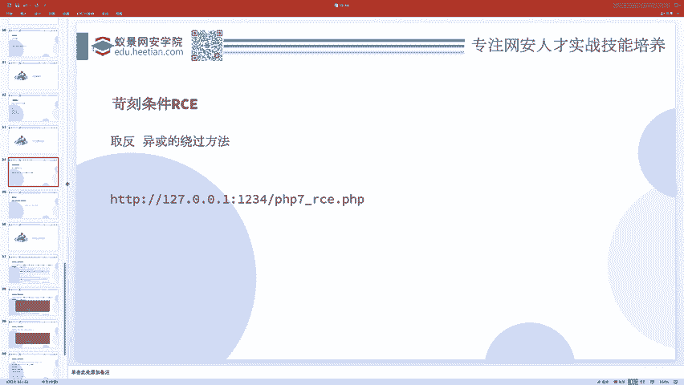

在本节课中，我们将学习两种在CTF Web题目中常见的代码执行技巧：无字母数字的RCE（远程代码执行）绕过，以及`create_function`函数相关的漏洞利用。这些技巧对于解决一些设置了严格过滤的题目至关重要。

## 无字母数字RCE绕过

上一节我们介绍了基础的代码执行，本节中我们来看看当题目过滤了所有字母和数字时，如何构造代码执行。

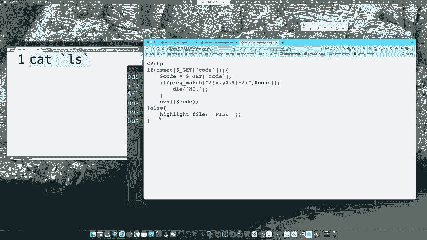

这类题目的典型特征是，用户输入（如`code`参数）被严格过滤，不允许包含任何字母或数字字符。这意味着我们无法直接写入如`system`、`cat`等常规函数名和参数。

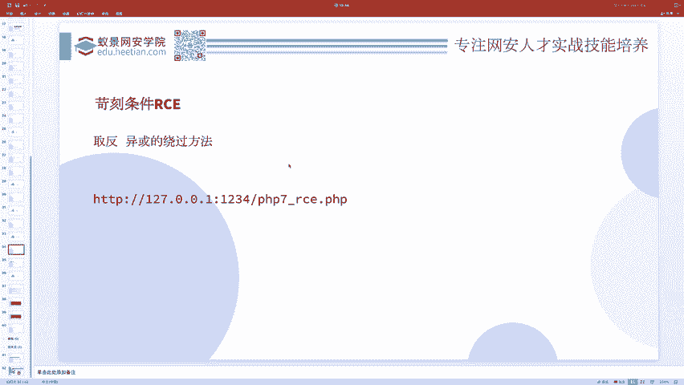

### 核心思路：通过运算生成字符串

PHP中，我们可以通过位运算（如异或、取反）将纯符号组合，运算出我们需要的字母数字字符串。关键在于利用PHP的“动态函数调用”特性：一个字符串变量后加上括号`()`，PHP会尝试调用与该字符串同名的函数。

例如，如果我们能通过运算得到字符串`"phpinfo"`，那么执行`$a="phpinfo"; $a();`就等同于执行了`phpinfo()`函数。

以下是两种常用的生成方法：

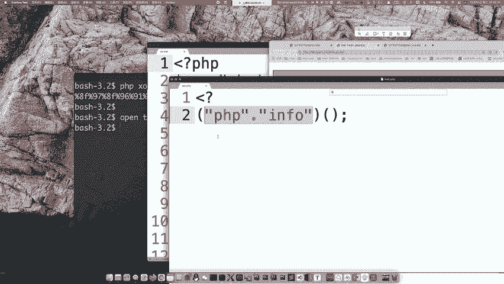

**1. 异或运算生成字符串**

异或运算可以将两个非字母数字的字符组合，产生字母或数字。我们可以预先计算目标字符串的异或表达式。

```php
// 例如，生成字符串 "phpinfo" 的异或表达式可能是：
$_=("%0c%06%0c%04%05%0d%0d" ^ "%7b%7b%7b%7c%7c%7b%7b"); // $_ 的值变为 "phpinfo"
$_(); // 执行 phpinfo()
```

**2. 取反运算生成字符串**

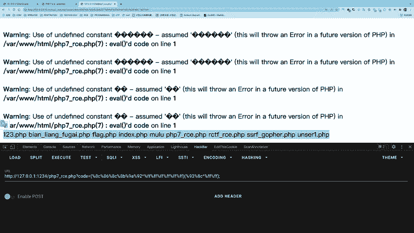

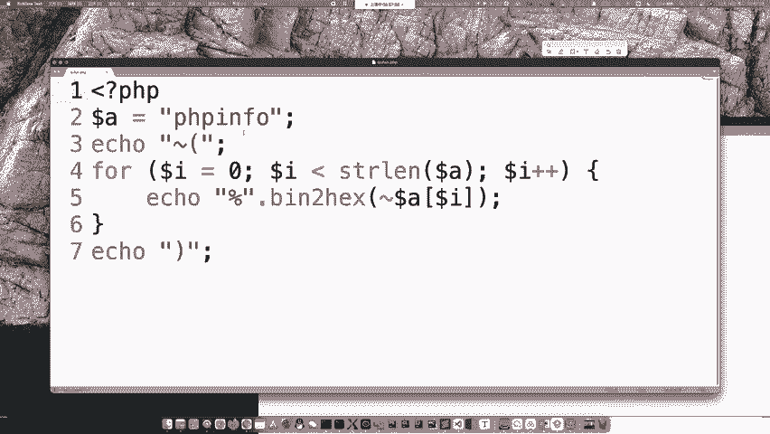

取反运算（`~`）也可以用于生成字符串。对一个字符串取反，得到的是其ASCII码按位取反后的结果。

```php
// 例如，生成字符串 "system"
$_=~(/* 一串经过计算得到的取反后字符 */); // 经过运算，$_ 的值变为 "system"
$_("ls"); // 执行 system("ls")
```

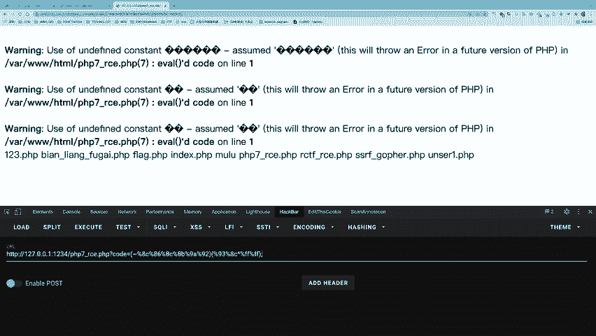

**重要提示**：在实际解题时，需要根据题目允许的符号集来选择合适的运算方法。异或和取反是两种最基础且常见的手段。

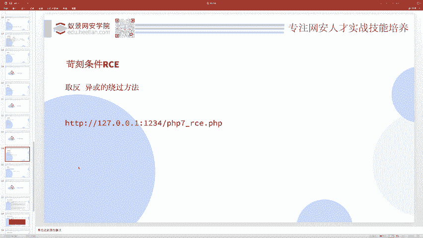

### 一个综合性的例题

接下来我们分析一个设置了多重过滤的例题，其限制条件非常严格：
*   长度不能超过18个字符。
*   不能包含字母、数字和下划线（`\w`）。
*   禁止使用位运算符（`&`, `|`, `^`, `~`）。
*   禁止使用括号 `()`、花括号 `{}`、方括号 `[]`。
*   禁止使用 `$`、`.`、`@` 等符号。

面对如此苛刻的条件，一个经典的Payload是：
```
?code=?><?=`/???/??? /????`?>
```
这个Payload能够成功执行并读取`/flag`文件。让我们来分解它的原理：

1.  `?>`：闭合题目中可能存在的PHP开始标签。
2.  `<?=`：这是PHP的短标签，等价于 `<?php echo ... ?>`，用于输出内容。
3.  **`` `...` ``**：反引号在PHP中执行shell命令。
4.  `/???/??? /????`：这是一个Shell通配符表达式。
    *   `/???/???` 可能匹配到 `/bin/cat`。
    *   `/????` 可能匹配到 `/flag`。
    *   因此，整个命令最终可能执行为 `/bin/cat /flag`。

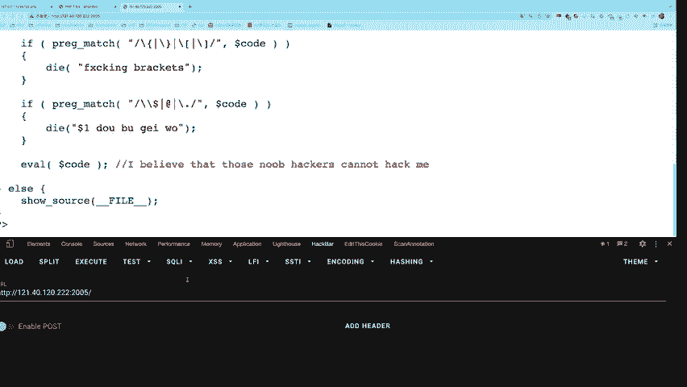


这个Payload巧妙地避开了所有过滤：它没有使用字母数字（依赖通配符），没有使用被禁的符号，长度也很短，并且通过短标签`<?=`实现了命令结果的输出。

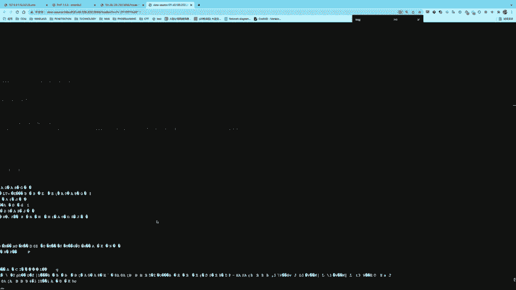

## create_function() 代码注入

最后，我们简要了解一个历史漏洞：`create_function()`的代码注入。

`create_function()`函数用于动态创建一个匿名函数。它接受两个字符串参数：参数列表和函数体代码。

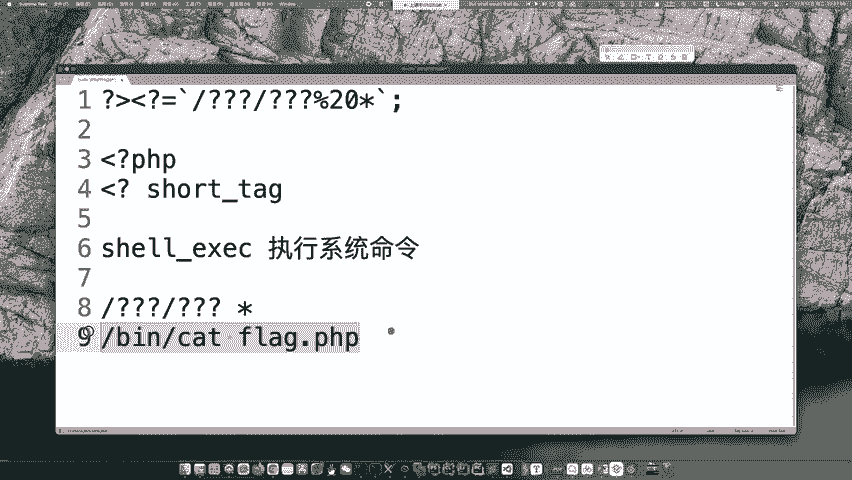

漏洞源于该函数内部使用`eval()`来执行代码。如果用户输入被直接拼接进函数体字符串，攻击者可以通过闭合原有的代码结构来注入任意命令。

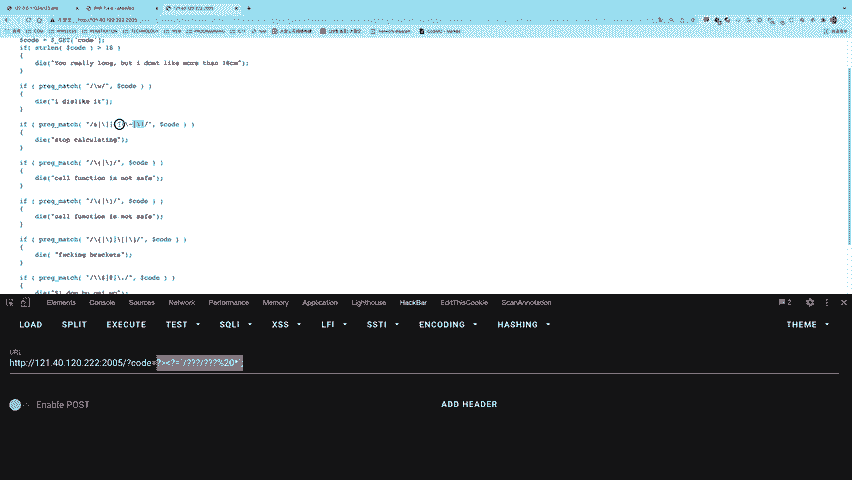

典型的利用方式如下：
```php
// 假设用户可控 $input
$func = create_function('', "echo 'Hello, $input';");
// 如果 $input 为：’;}phpinfo();//
// 则拼接后的代码变为：echo ‘Hello, ’;}phpinfo();//
```
在这个例子中，攻击者输入闭合了原有的`echo`语句和函数体，并添加了`phpinfo();`，最后用`//`注释掉原代码的结束部分。

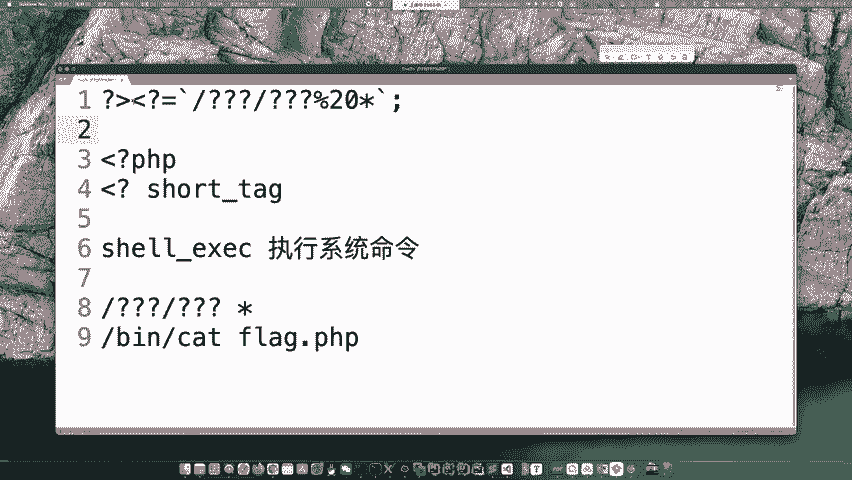

**请注意**：`create_function()`函数在PHP 7.2.0中已被标记为废弃，并在PHP 8.0.0中移除。在现代CTF题目中已不常见，但了解其原理有助于理解代码注入的思维模式。

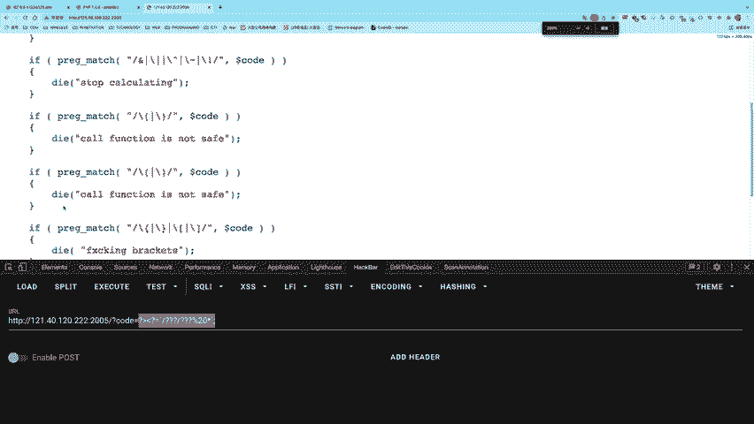

## 课程总结

本节课中我们一起学习了两种高级的代码执行技巧：
1.  **无字母数字RCE**：核心思想是利用PHP的位运算（异或、取反）从纯符号生成所需字符串，再结合动态函数调用执行代码。我们还分析了一道综合过滤题，利用Shell通配符和PHP短标签构造了精巧的Payload。
2.  **create_function()注入**：我们了解了这个历史函数因其内部使用`eval()`而可能产生代码注入漏洞的原理。

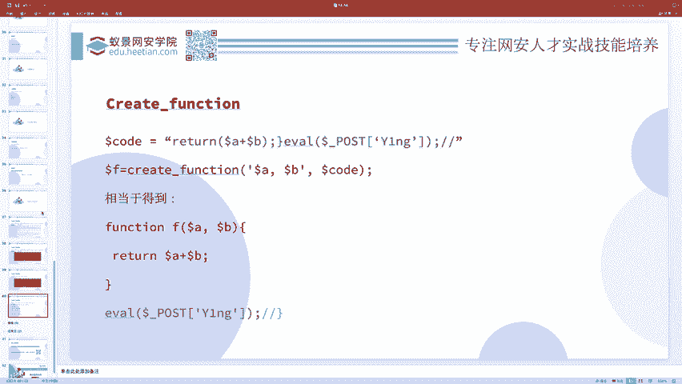

掌握这些方法能帮助你应对CTF Web题目中各种形式的代码执行过滤与限制。