# CTF入门课程：P11：SMB信息泄露实战 🚩

在本节课中，我们将学习如何利用SMB（Server Message Block）协议的信息泄露漏洞，逐步获取目标主机的访问权限，并最终提升至root权限以获取flag值。


## 什么是SMB协议？🔍

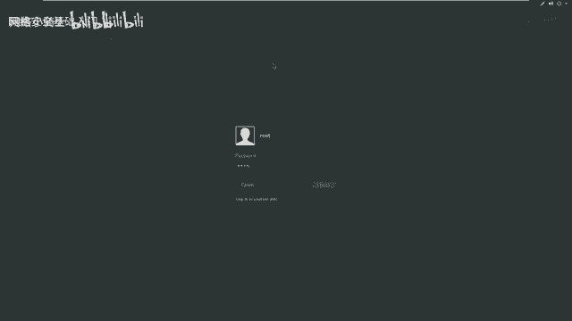

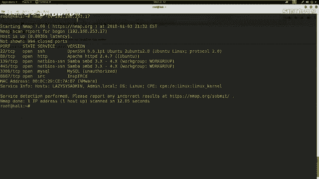

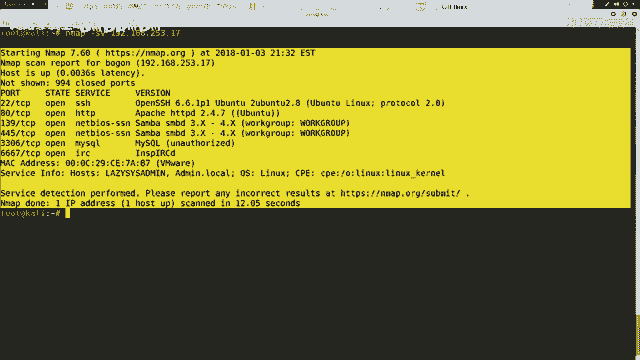

上一节我们介绍了课程目标，本节中我们来看看SMB协议的基础知识。


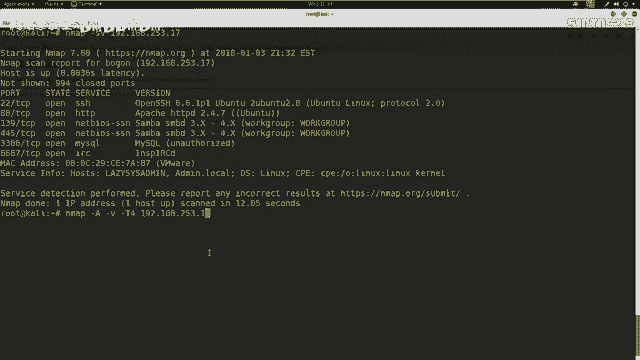

SMB是Server Message Block的缩写。它是一个由微软和英特尔公司在1987年制定的网络通信协议，主要作为微软网络的通信协议。后来Linux系统移植了SMB协议，并将其改名为Samba。

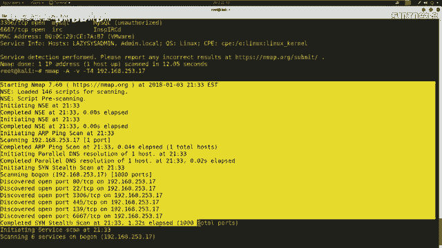

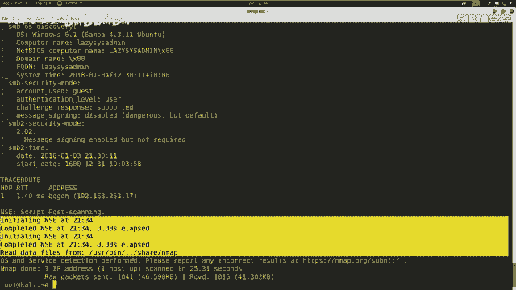

SMB协议基于TCP/IP协议栈，通常使用的端口号是**139**和**445**。该协议用于访问网络上的共享资源，例如文件和打印机。当一台计算机开放SMB服务并设置共享文件夹后，网络上的其他计算机就可以通过该协议连接并访问这些资源。

## 实验环境搭建 🖥️

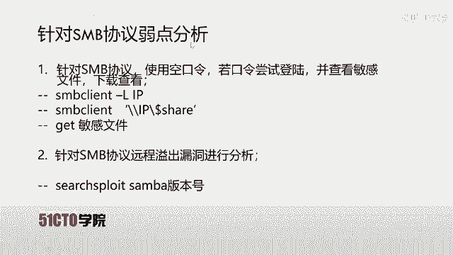

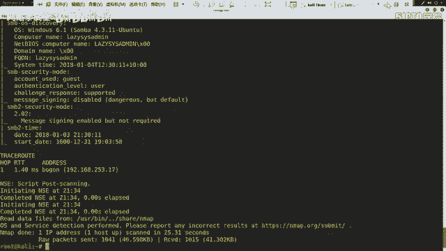

在开始实战之前，我们需要明确实验环境。

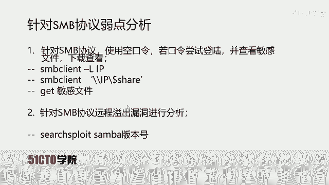

*   **攻击机**：Kali Linux，IP地址为 `192.168.253.12`。
*   **靶机**：一台Linux系统，IP地址为 `192.168.253.17`。

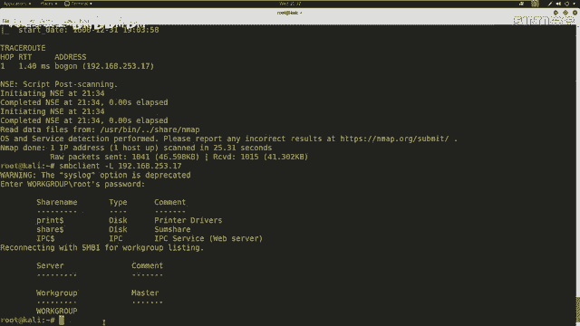

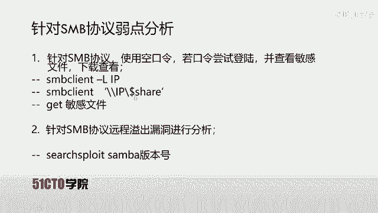

我们的最终目标是获取靶机上存储的flag值。为此，我们需要首先对靶机进行信息收集，寻找可利用的弱点。

## 信息收集与扫描 🕵️

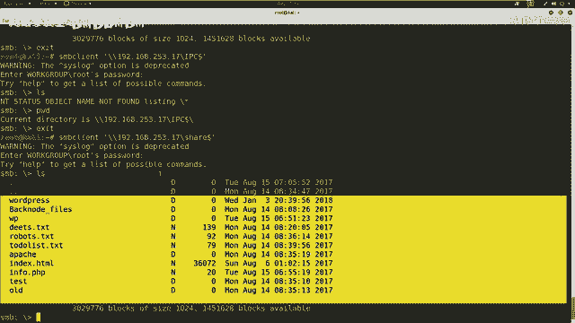

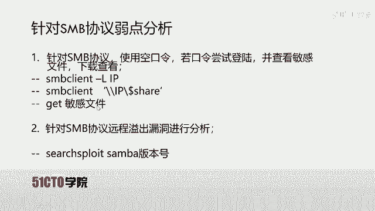

渗透测试的第一步是对目标进行全面的信息探测。我们将使用Nmap工具来扫描靶机，发现其开放的服务和端口。

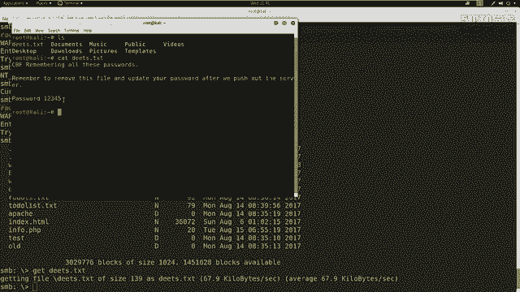

以下是使用Nmap进行服务版本探测的命令：
```bash
nmap -sV 192.168.253.17
```
此命令会发送探测数据包，分析靶机的响应，以确定开放端口上运行的服务及其版本号。

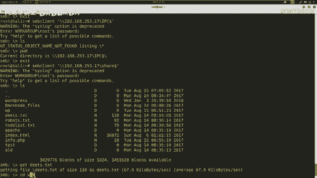

为了获取更详细的信息，我们可以使用更全面的扫描参数：
```bash
nmap -A -v -T4 192.168.253.17
```
参数说明：
*   `-A`：启用操作系统检测、版本检测、脚本扫描和路由追踪。
*   `-v`：显示详细输出。
*   `-T4`：指定扫描速度，T4为较快的速度。

扫描完成后，我们需要仔细分析结果。在本次扫描结果中，我们重点关注到了**139**和**445**端口，它们对应着SMB服务。这表明靶机很可能存在文件共享。

## 利用SMB信息泄露 🔓

发现SMB服务后，我们首先尝试匿名访问（即使用空口令）其共享目录。

以下是列出靶机所有SMB共享目录的命令：
```bash
smbclient -L //192.168.253.17
```
执行后，系统提示输入密码，我们直接按回车使用空密码。结果显示存在三个共享：`print$`（打印机驱动）、`share`（共享文件夹）和`IPC$`（空连接）。

接下来，我们尝试访问这些共享。`print$`和`IPC$`共享访问被拒绝或没有有价值信息。然而，我们可以成功匿名访问`share`共享：

```bash
smbclient //192.168.253.17/share
```
使用空密码进入后，我们使用`ls`命令列出文件，发现一个名为`deets.txt`的文件。我们将其下载到本地进行分析：
```bash
get deets.txt
```
在本地使用`cat deets.txt`查看文件内容，发现了一行疑似密码的信息：`password: 12345`。我们将其记录下来。

继续探索`share`目录，发现一个`wordpress`文件夹。WordPress的配置文件`wp-config.php`中通常包含数据库的连接信息。我们找到并下载该文件：
```bash
get wp-config.php
```
查看该配置文件，我们获得了数据库的用户名（`admin`）和密码。

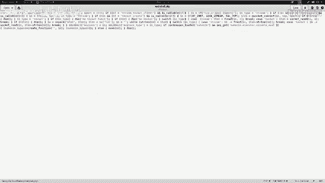

## 权限提升与Flag获取 🏆

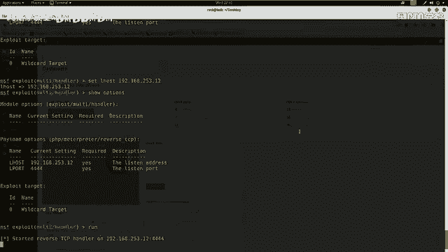

我们尝试用获得的数据库密码连接靶机的MySQL服务（端口3306）和SSH服务（端口22），但均未成功。


于是转换思路，利用获取到的`admin`用户和密码`12345`，尝试登录靶机的Web后台。使用`dirb`工具扫描Web目录，发现了`/wp-admin`路径。访问该路径，成功进入了WordPress后台。

在后台，我们通过编辑主题的`404.php`模板文件，上传了一个用MSFvenom生成的PHP反向Shell代码。同时，在攻击机上使用Metasploit框架启动监听。

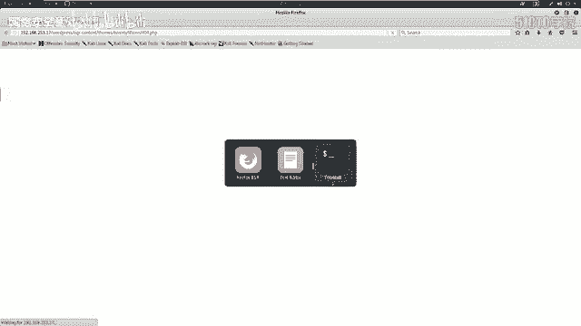

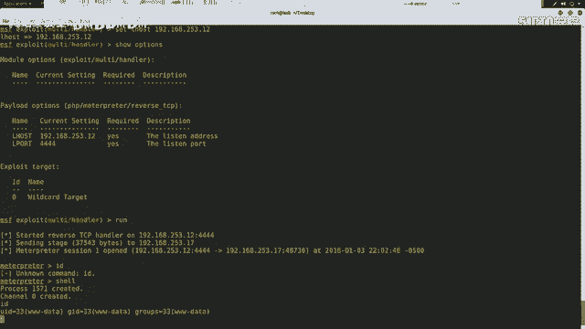

访问包含恶意代码的特定页面后，我们成功在攻击机上获得了来自靶机的一个反向Shell连接，当前用户为`www-data`。

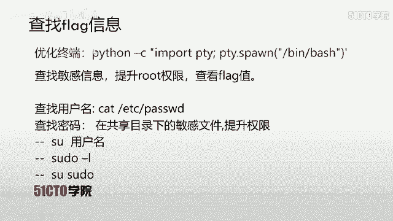

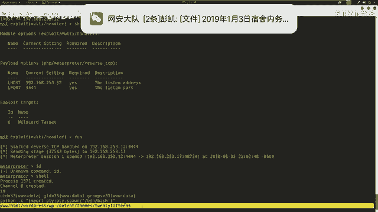

为了获得更好的交互体验，我们优化了Shell：
```bash
python -c ‘import pty; pty.spawn(“/bin/bash”)’
```
现在我们需要提权。首先查看系统用户，发现除了`www-data`，还有一个用户`toogie`。尝试用之前发现的密码`12345`切换至该用户：
```bash
su toogie
```
输入密码`12345`后切换成功。接着，我们尝试利用`sudo`命令提升至root权限：
```bash
sudo su
```
执行后，我们成功获得了root权限。最后，在根目录下寻找并查看flag文件：
```bash
cd /root
ls
cat flag.txt
```
至此，我们成功获取了靶机的flag值。


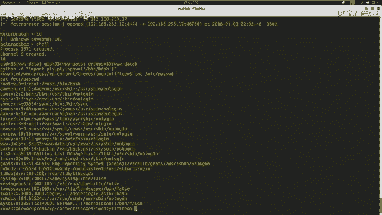

## 总结 📝

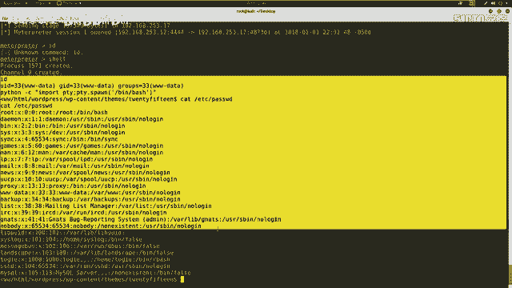

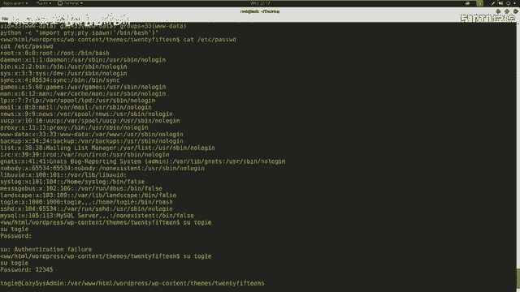

本节课中我们一起学习了针对SMB信息泄露漏洞的完整利用链。

1.  **信息收集**：使用Nmap扫描发现开放的SMB服务（139/445端口）。
2.  **漏洞利用**：利用SMB匿名访问漏洞，获取共享文件中的敏感信息（如密码、配置文件）。
3.  **横向移动**：利用获取的凭据尝试登录其他服务（如Web后台）。
4.  **获取初始权限**：通过Web漏洞（如文件上传）获取一个反向Shell。
5.  **权限提升**：利用找到的密码切换用户，并通过`sudo`提权至root。
6.  **获取Flag**：在root目录下找到并读取flag文件。

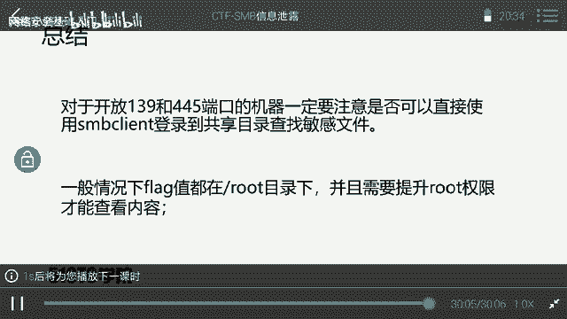

关键要点：对于开放139/445端口的机器，应优先检查SMB共享是否允许匿名访问，并仔细分析获取到的任何文件。同时，flag通常位于高权限目录下，需要设法提升至root权限才能访问。